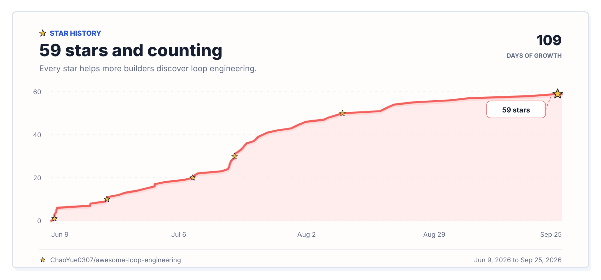

<p align="center">
  <a href="https://chaoyue0307.github.io/awesome-loop-engineering/"></a>
</p>

<h1 align="center">Awesome Loop Engineering</h1>

<p align="center">
  A practical field guide and implementation kit for recurring, stateful, verified AI-agent systems.
</p>

<p align="center">
  <a href="https://chaoyue0307.github.io/awesome-loop-engineering/"></a>
</p>

<!-- Keep proof-point badges in sync with the About description, Implementation Kit, social preview, and landing-page stats. -->
<p align="center">
  <a href="https://github.com/sindresorhus/awesome"></a>
  <a href="https://chaoyue0307.github.io/awesome-loop-engineering/"></a>
  <a href="https://huggingface.co/datasets/cy0307/awesome-loop-engineering"></a>
  <a href="https://github.com/ChaoYue0307/awesome-loop-engineering/actions/workflows/quality.yml"></a>
  
  
  
  
  <a href="LICENSE"></a>
  <a href="CONTRIBUTING.md"></a>
</p>

<p align="center">
  📦 <a href="#build-from-this">Build from this</a> |
  🧩 <a href="#pattern-library">Pattern library</a> |
  ▶️ <a href="examples/README.md">Examples</a> |
  🧾 <a href="schemas/loop-contract.schema.json">Schema</a> |
  🌐 <a href="https://chaoyue0307.github.io/awesome-loop-engineering/">Website</a> |
  🤗 <a href="https://huggingface.co/datasets/cy0307/awesome-loop-engineering">Dataset</a>
</p>

<p align="center">
  🌍 <strong>Languages:</strong> <a href="README.md">English</a> |
  <a href="README.zh-CN.md">中文</a> |
  <a href="README.es.md">Español</a> |
  <a href="README.fr.md">Français</a> |
  <a href="README.de.md">Deutsch</a> |
  <a href="README.ja.md">日本語</a> |
  <a href="README.ko.md">한국어</a> |
  <a href="README.pt-BR.md">Português</a> |
  <a href="TRANSLATIONS.md">Help translate</a>
</p>

<p align="center">
  <sub>⭐ <strong>Star</strong> to find it again · 🔀 <a href="https://github.com/ChaoYue0307/awesome-loop-engineering/fork"><strong>Fork</strong> the contracts and dataset schema</a> · 🔔 <a href="https://github.com/ChaoYue0307/awesome-loop-engineering/subscription"><strong>Watch</strong> Releases and Discussions</a></sub>
</p>

**Loop Engineering is the operating layer for recurring AI-agent work.** It defines how work enters, what an agent may do, which external evidence proves completion, what state survives, and whether the system retries, reports, escalates, or exits.

This field guide connects **730 papers, docs, tools, benchmarks, and guides** to **22 operational patterns, 22 schema-checked contracts, and 8 runtime starters**, so a recurring job can move from evidence to a reviewable implementation.

**The reliability gap:** prompts, context, and harnesses can improve one run; recurring work also needs explicit triggers, verification, durable state, bounded budgets, and human handoff. Software event loops, control theory, growth loops, generic automation, and one-off prompting are outside this map.

### Start In 60 Seconds

<table>
  <tr>
    <td><strong>🧭 Explore the field</strong></td>
    <td><a href="https://chaoyue0307.github.io/awesome-loop-engineering/#resources">Open the Resource Atlas</a></td>
    <td>Filter 730 sources by goal, loop layer, lifecycle stage, artifact type, and evidence.</td>
  </tr>
  <tr>
    <td><strong>▶️ Build one loop</strong></td>
    <td><a href="examples/README.md#four-worked-paths">Follow a worked path</a></td>
    <td>Move from a recurring job to its pattern, contract, runtime, and completion signal.</td>
  </tr>
  <tr>
    <td><strong>📊 Analyze the map</strong></td>
    <td><a href="https://huggingface.co/datasets/cy0307/awesome-loop-engineering">Load the dataset</a></td>
    <td>Query 50 publication, evidence, lifecycle, source, and repository fields in CSV, JSONL, or Parquet.</td>
  </tr>
  <tr>
    <td><strong>🔔 Follow useful updates</strong></td>
    <td><a href="https://github.com/ChaoYue0307/awesome-loop-engineering/releases/tag/v0.9.0">Read the current release</a> · <a href="https://github.com/ChaoYue0307/awesome-loop-engineering/discussions/9">Follow the digest</a></td>
    <td>Use <strong>Watch → Custom → Releases and Discussions</strong> for a low-noise update feed.</td>
  </tr>
</table>

## Contents

- [Implementation Kit](#implementation-kit)
- [Mental Model](#mental-model)
- [Reading Paths](#reading-paths)
- [Choose Your Loop](#choose-your-loop)
- [Working Definition](#working-definition)
- [Concept Guides](#concept-guides)
- [How To Judge Each Source](#how-to-judge-each-source)
- [Resource Type Legend](#resource-type-legend)
- [Start Here](#start-here)
- [What Counts As Loop Engineering](#what-counts-as-loop-engineering)
- [The Loop Contract](#the-loop-contract)
- [Loop Design Checklist](#loop-design-checklist)
- [Loop Maturity Model](#loop-maturity-model)
- [Pattern Library](#pattern-library)
- [Core Loop Primitives](#core-loop-primitives)
- [Official Runtime Guides](#official-runtime-guides)
- [Research Foundations](#research-foundations)
- [Model-Level Recurrence](#model-level-recurrence)
- [Agent Workflow Patterns](#agent-workflow-patterns)
- [Coding-Agent Loop Systems](#coding-agent-loop-systems)
- [Verification And Feedback Gates](#verification-and-feedback-gates)
- [Securing Unattended Loops](#securing-unattended-loops)
- [State, Memory, And Context Persistence](#state-memory-and-context-persistence)
- [Orchestration And Multi-Agent Delegation](#orchestration-and-multi-agent-delegation)
- [Benchmarks And Evaluation](#benchmarks-and-evaluation)
- [Operations Playbooks](#operations-playbooks)
- [Templates And Patterns](#templates-and-patterns)
- [Examples And Schema](#examples-and-schema)
- [Community Gallery](#community-gallery)
- [Critiques, Risks, And Limitations](#critiques-risks-and-limitations)
- [Future Directions](#future-directions)
- [Adjacent Awesome Lists](#adjacent-awesome-lists)
- [Explore And Reuse](#explore-and-reuse)
- [Shape What Comes Next](#shape-what-comes-next)
- [Build From This](#build-from-this)
- [Citation](#citation)
- [Star History](#star-history)

## Implementation Kit

Move from evidence to implementation through four connected layers:
<!--lint disable table-pipe-alignment-->
| Start with | What it gives you | Use it to | Example |
| --- | --- | --- | --- |
| 📚 **730 resources** | Papers, official docs, tools, benchmarks, and critiques with publication and evidence fields | Understand the design space and open the original work behind a claim | Compare verification methods in the Resource Atlas |
| 🧩 **22 operational patterns** | Symptom-first playbooks with roles, gates, state, budgets, escalation, and worked scenarios | Choose how a recurring job should operate | "CI keeps failing" becomes a CI repair loop |
| 🧾 **22 schema-checked contracts** | One schema-valid JSON specification for every pattern | Make permissions, evidence, limits, and human handoff reviewable | Adapt the CI repair contract to your repository |
| ▶️ **8 runtime starters** | 3 dependency-light executables plus 5 copy/paste runtime templates | Wire a contract to a session, schedule, CI event, or durable worker | Start with test repair, threshold monitoring, or queue processing |
<!--lint enable table-pipe-alignment-->
**Fastest build path:** name the recurring symptom, inspect its pattern, adapt the linked contract, then choose a runtime for the required persistence, isolation, and permissions.

Browse the <a href="https://chaoyue0307.github.io/awesome-loop-engineering/#resources">interactive Resource Atlas</a>, query the <a href="https://huggingface.co/datasets/cy0307/awesome-loop-engineering">structured dataset</a>, or use one of <a href="TRANSLATIONS.md">8 language entry points</a>.

**See it end to end:** the <a href="examples/README.md#four-worked-paths">four worked paths</a> cover CI repair, knowledge-base refresh, bounded queue processing, and read-only threshold monitoring, including commands and verifiable completion signals.

**Two-minute dry run:** clone the repository and inspect a bounded queue item without an agent account or extra dependency.

```bash
git clone https://github.com/ChaoYue0307/awesome-loop-engineering.git
cd awesome-loop-engineering
printf '%s\n' '{"id":"demo","objective":"Validate one queue item"}' > /tmp/loop-queue.jsonl
python3 examples/runnable/queue-worker-loop.py --queue /tmp/loop-queue.jsonl --dry-run
```

## Mental Model

Prompt engineering asks: **what should I say to the model?**

Context engineering asks: **what state and knowledge should the model see?**

Harness engineering asks: **what tools, permissions, tests, sandboxes, and feedback should surround the agent?**

Loop engineering asks: **what recurring system should discover work, delegate to agents, verify results, persist state, decide next actions, and re-run when the human is no longer in the inner loop?**

Prompt, context, and harness engineering make one agent run better. Loop Engineering makes agent work repeatable, observable, and governable over time.

<p align="center">
  <picture>
    <source media="(max-width: 560px)" srcset="assets/loop-engineering-stack-mobile.png">
    
  </picture>
  <br>
  <sub><strong>Figure 1.</strong> Prompt, context, and harness engineering improve one run; Loop Engineering governs recurring work over time.</sub>
</p>

Loop shape:

```text
Objective
  -> Trigger / cadence
  -> Discover / intake work
  -> Delegate to agents
  -> Act in an isolated workspace
  -> Verify with tests, evals, traces, or reviewers
       -> if failed: feed back the evidence and retry
       -> if passed: persist state and decide what happens next
  -> Repeat, report, open a PR, or escalate to a human
```

<p align="center">
  <picture>
    <source media="(max-width: 560px)" srcset="assets/loop-lifecycle-mobile.png">
    
  </picture>
  <br>
  <sub><strong>Figure 2.</strong> Evidence moves through a recurring, stateful, verified loop toward retry, escalation, or exit.</sub>
</p>

## Reading Paths

Choose a goal before opening the full catalog. Learn the field through the definition and research foundations; build through a pattern, contract, and runtime; or review reliability through verification, state, security, benchmarks, and critiques.

<table>
  <thead>
    <tr>
      <th>Goal</th>
      <th>Start here</th>
      <th>Continue with</th>
      <th>Best for</th>
    </tr>
  </thead>
  <tbody>
    <tr>
      <td><strong>🧭 Learn</strong></td>
      <td><a href="#working-definition">Working definition</a></td>
      <td><a href="#start-here">Start Here</a> → <a href="#research-foundations">Research Foundations</a></td>
      <td>Newcomers and researchers</td>
    </tr>
    <tr>
      <td><strong>🧠 Study model recurrence</strong></td>
      <td><a href="#model-level-recurrence">Model-Level Recurrence</a></td>
      <td><a href="#research-foundations">Research Foundations</a> → <a href="#benchmarks-and-evaluation">Benchmarks And Evaluation</a></td>
      <td>Model, reasoning, and agent researchers</td>
    </tr>
    <tr>
      <td><strong>✏️ Design</strong></td>
      <td><a href="#the-loop-contract">Loop Contract</a></td>
      <td><a href="#pattern-library">Pattern Library</a> → <a href="#core-loop-primitives">Core Loop Primitives</a> → <a href="#agent-workflow-patterns">Agent Workflow Patterns</a></td>
      <td>Architects and loop designers</td>
    </tr>
    <tr>
      <td><strong>🛠️ Build</strong></td>
      <td><a href="meta/RUNTIME_SELECTION.md#quick-comparison">Runtime selection</a></td>
      <td><a href="#official-runtime-guides">Official Runtime Guides</a> → <a href="#coding-agent-loop-systems">Coding-Agent Loop Systems</a> → <a href="#orchestration-and-multi-agent-delegation">Orchestration</a></td>
      <td>Agent and platform builders</td>
    </tr>
    <tr>
      <td><strong>💾 Persist</strong></td>
      <td><a href="#state-memory-and-context-persistence">State and context</a></td>
      <td><a href="#core-loop-primitives">Core Loop Primitives</a> → <a href="#operations-playbooks">Operations Playbooks</a></td>
      <td>Long-running and resumable loops</td>
    </tr>
    <tr>
      <td><strong>✅ Verify</strong></td>
      <td><a href="#verification-and-feedback-gates">Verification Gates</a></td>
      <td><a href="#benchmarks-and-evaluation">Benchmarks And Evaluation</a> → <a href="#critiques-risks-and-limitations">Critiques And Limitations</a></td>
      <td>Eval and reliability engineers</td>
    </tr>
    <tr>
      <td><strong>🛡️ Govern</strong></td>
      <td><a href="#securing-unattended-loops">Securing Unattended Loops</a></td>
      <td><a href="#operations-playbooks">Operations Playbooks</a> → <a href="#critiques-risks-and-limitations">Critiques And Limitations</a></td>
      <td>Operators, approvers, and security</td>
    </tr>
    <tr>
      <td><strong>📦 Apply</strong></td>
      <td><a href="#templates-and-patterns">Templates And Patterns</a></td>
      <td><a href="#examples-and-schema">Examples And Schema</a> → <a href="#community-gallery">Community Gallery</a> → <a href="#contributing">Contributing</a></td>
      <td>Teams adopting or sharing loops</td>
    </tr>
  </tbody>
</table>

For analysis, the Hugging Face dataset exposes collection, lifecycle, audience, evidence, source-status, publication, and repository-stat facets for every resource.

**Fastest conceptual path:** read the <a href="#working-definition">Working Definition</a>, inspect the <a href="#the-loop-contract">Loop Contract</a>, choose a symptom in the <a href="#pattern-library">Pattern Library</a>, and follow a <a href="#examples-and-schema">worked implementation</a>.

## Choose Your Loop

Choosing a loop means choosing the **operating policy around an agent**, not the model itself. A pull-request loop, deploy loop, and adversarial-testing loop may use the same model, but they need different triggers, permissions, evidence gates, durable state, retry budgets, and human owners. Those controls decide what the agent may do, what counts as success, what the next run can remember, and when automation must stop.

A generic "keep trying" loop collapses those differences. It can retry a judgment call, let the acting model approve its own work, lose evidence between runs, or change a high-risk system when it should only observe and escalate. A named pattern supplies a reviewable starting policy for a recurring job; its contract makes that policy exact for your environment.

### First Decide Whether The Work Should Loop

| Use a loop when...                                                     | Prefer one supervised run when...                         |
| ---------------------------------------------------------------------- | --------------------------------------------------------- |
| Work returns through a schedule, event, queue, or recurring condition. | The task is genuinely one-off.                            |
| An external check can prove progress or completion.                    | "Done" depends mainly on open-ended human judgment.       |
| Saved evidence, checkpoints, or receipts improve the next run.         | No useful state should survive the session.               |
| Permissions, retries, time, and cost can be bounded in advance.        | A safe permission or budget boundary cannot be stated.    |
| A named human owns ambiguity, exceptions, and high-impact decisions.   | Every meaningful step already needs live human direction. |

### Choose In Four Decisions

| Decision                      | Ask                                                               | What it fixes                                 |
| ----------------------------- | ----------------------------------------------------------------- | --------------------------------------------- |
| **1. Name the recurring job** | What signal keeps returning, and what outcome should improve?     | Objective, trigger, and intake                |
| **2. Define proof**           | What evidence can a reviewer or machine inspect to decide "pass"? | Verification gate and exit condition          |
| **3. Bound action**           | What may the agent read or change, and what must it never do?     | Workspace, permissions, non-goals, and budget |
| **4. Plan the next pass**     | What should persist, retry, escalate, or stop after each result?  | Durable state, handoff, and next action       |

Select the **pattern** for the class of work, adapt its **contract** to your exact controls, then choose the **runtime** based on persistence, isolation, and permissions. Start from the problem and its verified finish below, or compare every field in the [pattern matrix](patterns/MATRIX.md).

| When you say...                          | Start with                    | The loop can finish when...                                                    |
| ---------------------------------------- | ----------------------------- | ------------------------------------------------------------------------------ |
| "My PR is stuck"                         | PR babysitter                 | Required checks pass, review threads are resolved, and merge state is current. |
| "CI keeps failing"                       | CI repair loop                | The original failing command passes with a scoped patch.                       |
| "The docs may be stale"                  | Docs drift collector          | Verified code/docs mismatches are patched and examples still run.              |
| "A deploy needs monitoring"              | Deploy verifier               | Synthetic checks and rollout thresholds remain within policy.                  |
| "Feedback is noisy"                      | Feedback clusterer            | Themes cite source items and separate frequency from severity.                 |
| "Dependency updates pile up"             | Dependency triage loop        | Safe updates pass tests and risky upgrades have an owner-backed escalation.    |
| "Agent evals regressed"                  | Evaluation regression loop    | Targeted evals return to the accepted baseline without scorer changes.         |
| "Sensitive changes need review"          | Security review loop          | Findings cite concrete evidence and approval boundaries stay intact.           |
| "Agent spend is rising"                  | Cost-control loop             | Spend falls on a comparable workload without quality regression.               |
| "I need recurring bug discovery"         | Bug hunting loop              | Every accepted finding has reproducible steps or a failing test.               |
| "A change needs sign-off"                | Enterprise approval loop      | Every required gate has a recorded decision and audit trail.                   |
| "An incident just paged"                 | Incident response loop        | Impact, evidence, timeline, and accountable owner are recorded.                |
| "A dataset keeps drifting"               | Data-quality loop             | Hard quality rules pass before a new version is promoted.                      |
| "Release notes are a chore"              | Release-note loop             | Every shipped change maps to a merged source and audience-facing note.         |
| "Model choice is ad hoc"                 | Model-routing loop            | Routing meets quality, latency, privacy, and cost tolerances.                  |
| "A stable system should improve"         | Benchmark optimization loop   | Repeated measurements confirm improvement with protected metrics intact.       |
| "The agent's knowledge is stale"         | Knowledge freshness loop      | A versioned corpus passes provenance, freshness, retrieval, and leakage gates. |
| "Runs repeat mistakes they already made" | Agent memory lifecycle loop   | Governed memory records pass provenance, scope, and recall gates between runs. |
| "Parallel agents collide on one repo"    | Fleet coordination loop       | Isolated workers land serially through a verified merge queue.                 |
| "Performance regressed"                  | Performance regression loop   | A controlled benchmark confirms recovery with correctness intact.              |
| "A UI accessibility check failed"        | Accessibility regression loop | The exact regression is fixed and required human criteria are approved.        |
| "The agent needs adversarial testing"    | Adversarial red-team loop     | Findings are reproduced, minimized, privately reported, and regression-tested. |

After choosing the pattern, compare [runtime persistence, isolation, permissions, and escalation](meta/RUNTIME_SELECTION.md#choosing-by-concern).

## Working Definition

**Loop Engineering** is the AI and coding-agent practice of designing recurring systems that discover work, delegate it to agents, verify results, persist state, decide next actions, and run again on a cadence, event, or until a verifiable goal is reached.

## Concept Guides

These vendor-neutral guides define the concept, boundaries, vocabulary, and reviewable artifacts.
<!--lint disable table-pipe-alignment-->
| Resource | Published at | Contribution | Evidence |
| --- | --- | --- | --- |
| 🧾 **[Working Definition](DEFINITION.md)**<br><sub>Template</sub> | **2026** · GitHub<br><sub>Project documentation</sub> | Short definition, positioning, minimal loop test, and citation note. | **Project artifact**<br><sub>Schema, example, guide, or repository documentation</sub> |
| 🧾 **[Loop Engineering Manifesto](MANIFESTO.md)**<br><sub>Template</sub> | **2026** · GitHub<br><sub>Project documentation</sub> | Concise statement of the concept, commitments, non-goals, and success standard. | **Project artifact**<br><sub>Schema, example, guide, or repository documentation</sub> |
| 🧾 **[Loop Engineering Taxonomy](TAXONOMY.md)**<br><sub>Template</sub> | **2026** · GitHub<br><sub>Project documentation</sub> | Classification by trigger, intake, verification, state model, topology, and operating domain. | **Project artifact**<br><sub>Schema, example, guide, or repository documentation</sub> |
| ⚠️ **[Loop Engineering Anti-Patterns](ANTI-PATTERNS.md)**<br><sub>Critique</sub> | **2026** · GitHub<br><sub>Project documentation</sub> | Common failure modes such as prompt loops with no contract, infinite retries, model self-approval, hidden state, and unsafe autonomy. | **Project artifact**<br><sub>Schema, example, guide, or repository documentation</sub> |
| 🧾 **[Comparison Guide](COMPARISON.md)**<br><sub>Template</sub> | **2026** · GitHub<br><sub>Project documentation</sub> | Distinguishes Loop Engineering from prompt engineering, context engineering, harness engineering, workflow automation, agent workflows, and evaluation loops. | **Project artifact**<br><sub>Schema, example, guide, or repository documentation</sub> |
| 🧾 **[Sourced Signals And Quotes](QUOTES.md)**<br><sub>Template</sub> | **2026** · GitHub<br><sub>Project documentation</sub> | Short sourced signals from linked public materials that anchor the emerging concept. | **Project artifact**<br><sub>Schema, example, guide, or repository documentation</sub> |
| 🧾 **[Outreach Kit](meta/OUTREACH.md)**<br><sub>Template</sub> | **2026** · GitHub<br><sub>Project operations guide</sub> | Conservative messages for inviting corrections, sources, and real-world loop patterns. | **Project artifact**<br><sub>Schema, example, guide, or repository documentation</sub> |

## How To Judge Each Source

Open the original work before relying on a summary. Use the contribution, novelty, impact, and evidence fields to compare approaches and understand what supports each entry.

<table>
  <tr>
    <th>Dimension</th>
    <th>Evidence standard</th>
  </tr>
  <tr>
    <td><strong>Scope</strong></td>
    <td>Every entry must directly inform recurring AI-agent systems, offer concrete value to builders or researchers, and link to evidence that readers can inspect.</td>
  </tr>
  <tr>
    <td><strong>Link availability</strong></td>
    <td>At the latest <a href="data/resource_source_audit.csv">source check</a> on 2026-07-21 UTC, 677 public links opened successfully, 2 required access, 51 pointed to files in this repository, and none were broken or unreachable.</td>
  </tr>
  <tr>
    <td><strong>Evidence label</strong></td>
    <td>Labels distinguish published research, official documentation, inspectable implementations, practitioner analysis, risk analysis, and discovery indexes. They describe the kind of source behind an entry, not its scientific quality.</td>
  </tr>
  <tr>
    <td><strong>How summaries are written</strong></td>
    <td>Summaries explain each work's contribution in original language rather than copying abstracts. They do not imply author endorsement; follow the link to inspect methods, results, limitations, and current documentation.</td>
  </tr>
  <tr>
    <td><strong>Corrections</strong></td>
    <td>Report an error through the <a href="https://github.com/ChaoYue0307/awesome-loop-engineering/issues/new?template=annotation-correction.yml">annotation-correction form</a> or a pull request. Corrections to contribution, novelty, impact, publication metadata, and source links take priority.</td>
  </tr>
  <tr>
    <td><strong>Licensing</strong></td>
    <td>Original summaries, metadata, templates, and project documentation are CC0-1.0. Linked works retain their own licenses and terms.</td>
  </tr>
</table>

## Resource Type Legend

<!-- resource-type-summary:start -->
| Type | Rows | Includes |
| --- | --- | --- |
| 📄 **Paper** | 284 | Academic paper, preprint, or technical report |
| 📝 **Blog** | 99 | Essay, field note, article, or practitioner write-up |
| 📚 **Docs** | 77 | Official product, API, SDK, or platform documentation |
| 🧰 **Tool** | 127 | Repository, framework, SDK, runtime, or implementation |
| 🧪 **Benchmark** | 52 | Benchmark, eval suite, leaderboard, or evaluation dataset |
| 🔁 **Pattern** | 37 | Operational playbook or reusable workflow |
| 🧾 **Template** | 25 | Template, checklist, schema, guide, or contribution artifact |
| 🧭 **List** | 17 | Adjacent directory, ecosystem map, or reading list |
| ⚠️ **Critique** | 12 | Risk analysis, limitation, caveat, or skeptical take |
<!-- resource-type-summary:end -->

Every row shows the work and type, its original publishing platform or venue, the contribution that matters for Loop Engineering, and a plain-language evidence label. Author lists are shortened for scanning; the [queryable dataset exports](data/README.md#load-and-query) and Resource Atlas retain full authorship, dates, venues, identifiers, contribution, novelty, impact, evidence signal, link status, and repository statistics.

## Start Here

Direct resources about the new AI/coding-agent meaning of Loop Engineering.

| Resource | Published at | Contribution | Evidence |
| --- | --- | --- | --- |
| 📝 **[Loop Engineering by Addy Osmani](https://addyosmani.com/blog/loop-engineering/)**<br><sub>Blog</sub> | **addyosmani.com**<br><sub>Addy Osmani</sub> | Addy Osmani's framing of loop engineering as the layer above manually prompting coding agents, with concrete primitives across Codex and Claude Code; also on [Substack](https://addyo.substack.com/p/loop-engineering) with the original discussion trail and Steinberger and Cherny quotations. | **Practitioner analysis**<br><sub>Experience-backed implementation context</sub> |
| 📝 **[Peter Steinberger on designing loops](https://x.com/steipete/status/2063697162748260627)**<br><sub>Blog</sub> | **2026** · X (formerly Twitter) | The June 2026 post - "you shouldn't be prompting coding agents anymore, you should be designing loops that prompt your agents" - that catalyzed the current discussion. | **Practitioner analysis**<br><sub>Experience-backed implementation context</sub> |
| 📝 **[Boris Cherny: five tips for running Opus autonomously for hours or days](https://x.com/bcherny/status/2063792263067754658)**<br><sub>Blog</sub> | **2026** · X (formerly Twitter) | The Claude Code creator's compact loop recipe: auto-mode permissions, dynamic workflows, `/goal` or `/loop`, the cloud runner, and end-to-end self-verification. | **Practitioner analysis**<br><sub>Experience-backed implementation context</sub> |
| 📝 **[Loop Engineering by Cobus Greyling](https://cobusgreyling.substack.com/p/loop-engineering)**<br><sub>Blog</sub> | **Substack**<br><sub>Cobus Greyling</sub> | Concise explanation of the shift from prompting agents to designing loops that discover work, delegate, verify, persist, and continue. | **Practitioner analysis**<br><sub>Experience-backed implementation context</sub> |
| 📝 **[Stop Prompting. Design the Loop.](https://www.pulumi.com/blog/stop-prompting-design-the-loop/)**<br><sub>Blog</sub> | **2026** · pulumi<br><sub>Engin Diri</sub> | Practical breakdown of loop building blocks - automations, worktrees, skills, connectors, subagents - plus external memory and verification through oracles such as tests and builds. | **Practitioner analysis**<br><sub>Experience-backed implementation context</sub> |
| 📝 **[Writing Loops, Not Prompts, Explained](https://rico.codes/loops-not-prompts)**<br><sub>Blog</sub> | **rico.codes** | Rico Kahler's break-even model for when a recurring task justifies building a loop instead of prompting, with stop conditions, evidence collection, and an execution-horizon framing for moving from execution-bound to judgment-bound work. | **Practitioner analysis**<br><sub>Experience-backed implementation context</sub> |
| 📝 **[Loop Engineering: A Guide for Engineers and Practitioners](https://medium.com/@adnanmasood/loop-engineering-a-guide-for-engineers-and-practitioners-893bb65ea943)**<br><sub>Blog</sub> | **2026** · Medium<br><sub>Adnan Masood, PhD.</sub> | Adnan Masood's practitioner guide that organizes loop design into triggers, topologies, verifiers, and termination rules, with coverage of failure modes, cost control, and observability for production agent loops. | **Practitioner analysis**<br><sub>Experience-backed implementation context</sub> |
| 📝 **[Loop Engineering: When Generation Gets Cheap, Judgment Gets Expensive](https://sderosiaux.substack.com/p/loop-engineering-cheap-generation)**<br><sub>Blog</sub> | **Substack**<br><sub>Stephane Derosiaux</sub> | Stephane Derosiaux's essay on the economics of the loop layer (generation becomes abundant while judgment becomes the bottleneck), proposing evaluator agents that must act rather than merely review, and cataloging failure modes such as unverified merges and quota depletion. | **Practitioner analysis**<br><sub>Experience-backed implementation context</sub> |
| 📝 **[Andrew Ng on Loop Engineering and the Three Loops of AI-Native Product Development](https://x.com/AndrewYNg/status/2071988145667928442)**<br><sub>Blog</sub> | **2026** · X (formerly Twitter) | Andrew Ng's letter laying out three product-development loops (agentic coding in minutes, developer feedback in hours, external feedback in days) and arguing that human-in-the-loop persists wherever the human knows something the AI does not. | **Practitioner analysis**<br><sub>Experience-backed implementation context</sub> |
| 📝 **[From Prompting Agents to Loop Engineering](https://x.com/omarsar0/status/2068008743153832264)**<br><sub>Blog</sub> | **2026** · X (formerly Twitter) | DAIR.AI founder Elvis Saravia's X article examining the claim that you should stop prompting coding agents and start designing loops that prompt them for you. | **Practitioner analysis**<br><sub>Experience-backed implementation context</sub> |
| 📝 **[My Lord! AI Programming Undergoes Another Major Shift](https://eu.36kr.com/en/p/3844224911346184)**<br><sub>Blog</sub> | **eu.36kr.com** | Broad coverage of the Boris Cherny and Peter Steinberger discussion, including the distinction between cold-start scripts and persistent agent loops. | **Practitioner analysis**<br><sub>Experience-backed implementation context</sub> |
| 📝 **[The Anthropic leader who built Claude Code ditched prompting - now he writes loops](https://thenewstack.io/loop-engineering/)**<br><sub>Blog</sub> | **2026** · The New Stack<br><sub>Janakiram MSV</sub> | The New Stack's report on Boris Cherny's shift from prompting to loop writing and what it changes about developer workflow. | **Practitioner analysis**<br><sub>Experience-backed implementation context</sub> |
| 📝 **[Engineering for Agents That Never Sleep](https://nader.substack.com/p/engineering-for-agents-that-never)**<br><sub>Blog</sub> | **Substack**<br><sub>Nader Dabit</sub> | Cognition's Nader Dabit predicts the human-initiated share of Devin sessions will invert from 70/30 to 10/90 within a year as signals like alerts and failing tests trigger agents directly, recasting the engineer's job as designing triggers, constraints, and quality gates. | **Practitioner analysis**<br><sub>Experience-backed implementation context</sub> |
| 📝 **[Loop Engineering Orange Book](https://github.com/alchaincyf/loop-engineering-orange-book)**<br><sub>Blog</sub> | **2026** · GitHub<br><sub>alchaincyf/loop-engineering-orange-book</sub> | Plain-language bilingual (Chinese and English) field guide to loop engineering by HuaShu, framing the discipline as one floor above harness engineering: the outer system that decides when and why agents run. | **Practitioner analysis**<br><sub>Experience-backed implementation context</sub> |
| 📝 **[How I AI: How to Write AI Agent Loops in Claude Code and Codex](https://www.lennysnewsletter.com/p/how-i-ai-how-to-write-ai-agent-loops)**<br><sub>Blog</sub> | **lennysnewsletter.com**<br><sub>Lenny Rachitsky</sub> | Mozilla distinguished engineer Brian Grinstead demonstrates goal-based and scheduled loops, including a daily PR-review loop with per-PR subagents, on Lenny's Newsletter. | **Practitioner analysis**<br><sub>Experience-backed implementation context</sub> |
| 📄 **[Proof-or-Stop: Don't Trust the Agent, Trust the Evidence -- Loop Engineering for Verifiable Evidence-Gated Lifecycle Control](https://arxiv.org/abs/2607.14890)**<br><sub>Paper</sub> | **2026** · arXiv<br><sub>Jek Huang et al.</sub> | Defines evidence-gated lifecycle control for agent loops and reports zero false-DONE outcomes across 10 scenarios and zero accepts across 18 tampering classes; its 9,240-cell ablation identifies which gates prevent error amplification, while noting the evaluation covers one model family and 24 tasks. | **Research preprint**<br><sub>Preprint; inspect methods and evaluation</sub> |

## What Counts As Loop Engineering

| Qualifies                                                                                                           | Does not qualify                                                |
| ------------------------------------------------------------------------------------------------------------------- | --------------------------------------------------------------- |
| AI/coding-agent loops that coordinate prompts, context, harnesses, verification, and state over repeated agent runs | Software event loops, UI/game loops, or control theory loops    |
| Scheduled, goal-driven, or event-triggered agent work                                                               | Generic cron jobs with no agentic reasoning or verification     |
| Agent loops with durable state, worktrees, checkpoints, traces, or progress files                                   | One-off prompt examples with no loop, state, or feedback signal |
| Verification loops using tests, CI, evals, reviewers, or deterministic gates                                        | Pure AI news, generic product pages, or marketing copy          |
| Multi-agent maker/checker/delegation patterns                                                                       | Broad agent lists without specific loop-design relevance        |

Model-level recurrence belongs in the map when it explains the model inside an agent: a learned block or latent state is iterated to allocate compute, refine reasoning, or simulate a world. It is an **adjacent foundation**, not a complete operational loop. The outer system still needs work intake, tools, external verification, durable state, budgets, escalation, and exit.

## The Loop Contract

A **Loop Contract** is a reviewable operating specification for one recurring agent job. It is not a legal agreement, a long prompt, or a particular runtime. It records the decisions a person normally supplies during a one-off session - what work is authorized, what the agent may touch, what evidence counts, what survives, and when control returns to a human - so those decisions remain stable across runs.

The contract becomes necessary when an agent runs from a schedule, event, queue, or goal instead of waiting for live supervision. Unanswered questions become hidden defaults: the agent may select the wrong work, widen its own scope, approve its own output, forget a previous failure, or retry without a stopping rule. Making the policy explicit lets builders, reviewers, security teams, and operators inspect the same boundaries before the loop acts.

Prompt, context, and harness choices improve one run. A pattern describes how a class of recurring work should operate. The contract fixes the exact policy for one implementation, and the runtime executes it.

<p align="center">
  <picture>
    <source media="(max-width: 560px)" srcset="assets/loop-contract-mobile.png">
    
  </picture>
  <br>
  <sub><strong>Figure 3.</strong> The Loop Contract makes recurring agent work explicit, reviewable, and bounded.</sub>
</p>

### Read It As Three Decisions

| Phase                   | Contract parts                           | What the phase decides                                                                   |
| ----------------------- | ---------------------------------------- | ---------------------------------------------------------------------------------------- |
| **1. Set up**           | Objective, trigger, intake, workspace    | Why a run is authorized, which work qualifies, and where action is allowed.              |
| **2. Run**              | Context, delegation, verification, state | What the agents know, who acts and checks, what proves progress, and what is remembered. |
| **3. Govern and close** | Budget, escalation, exit, next action    | How autonomy is capped and whether the loop retries, reports, hands off, or stops.       |

| Part              | Decision the contract must make                                           | Common artifact                                              |
| ----------------- | ------------------------------------------------------------------------- | ------------------------------------------------------------ |
| Objective         | Which measurable outcome is worth repeating toward?                       | Goal, issue, PRD, runbook                                    |
| Trigger           | Which event, schedule, or goal authorizes a run?                          | Schedule, webhook, `/loop`, `/goal`, automation              |
| Discover / Intake | Which items qualify, and how are duplicates or stale work rejected?       | GitHub queries, Linear filters, CI failures, feedback stream |
| Workspace         | What may the agent read or change, and where is execution isolated?       | Worktree, sandbox, branch, container                         |
| Context           | Which instructions and current evidence must be loaded fresh?             | `AGENTS.md`, `CLAUDE.md`, `SKILL.md`, docs, logs             |
| Delegation        | Who explores, acts, and checks, and can the acting agent approve itself?  | Explorer, implementer, reviewer, judge                       |
| Verification      | Which external evidence must pass before progress or completion is valid? | Tests, typecheck, lint, evals, trace graders                 |
| State             | Which checkpoints and receipts survive, and when are they updated?        | Progress file, database checkpoint, trace, issue comment     |
| Budget            | How much time, retry, token, cost, or concurrency may one run consume?    | Max turns, max retries, token budget, time box               |
| Escalation        | Which conditions require a named human owner or review channel?           | PR, issue, Slack alert, triage inbox                         |
| Exit              | What proves success, and what stops the loop without success?             | Acceptance criteria, passing checks, explicit blocked state  |

### Why The Boundaries Matter

| If the contract omits...     | The recurring failure is predictable                                               |
| ---------------------------- | ---------------------------------------------------------------------------------- |
| Trigger and intake           | The loop invents work, reprocesses the same item, or runs at the wrong time.       |
| Workspace and permissions    | A narrow repair expands into unrelated files, credentials, or production changes.  |
| Independent verification     | The acting model can declare its own output complete without external evidence.    |
| Durable state and receipts   | The next run repeats failed attempts and cannot explain what already happened.     |
| Budget, escalation, and exit | The loop retries indefinitely, spends past its value, or stalls without an owner.  |

### Worked Example: PR Babysitter

Suppose a team wants an agent to keep one pull request moving without asking a person to poll CI and review threads all day. "Keep this PR moving" is only a goal; the contract turns it into bounded operation.

| Contract decision      | PR babysitter implementation                                                                                                                                                     |
| ---------------------- | -------------------------------------------------------------------------------------------------------------------------------------------------------------------------------- |
| **Authorize the run**  | Run every two hours during working hours and after requested changes or failed required checks. Select only explicit blockers on one pull request.                               |
| **Bound the action**   | Use a dedicated branch or worktree. Allow narrow fixes, checks, and progress comments; prohibit force pushes, dependency upgrades, secrets access, and production changes.       |
| **Load and delegate**  | Load `AGENTS.md`, `CONTRIBUTING.md`, the latest PR SHA, review threads, and CI logs. An explorer identifies the blocker, an implementer patches it, and a reviewer checks scope. |
| **Prove and remember** | Require GitHub checks to pass, review threads to resolve, and the diff to stay scoped. Persist commands, check URLs, changed files, blockers, and the next action.               |
| **Cap and hand off**   | Stop after three retries or 60 minutes. Escalate architectural decisions, repeated failures, reviewer disagreement, or any force-push requirement to the human owner.            |
| **Exit**               | Succeed when the PR is merge-ready or waiting only on human review; stop without success when blocked, out of budget, or facing a judgment call.                                 |

Open the full [`pr-babysitter-loop.json`](examples/pr-babysitter-loop.json), render it with `python3 scripts/preview_loop_contract.py`, or browse the 22 schema-checked contracts below.

## Loop Design Checklist

| Check                           | Question                                                                                             |
| ------------------------------- | ---------------------------------------------------------------------------------------------------- |
| Name one objective              | Does the loop optimize for a specific outcome instead of a vague goal such as "improve the repo"?    |
| Define the intake               | Where does work enter: PR comments, CI failures, issues, logs, eval failures, feedback, or schedule? |
| Isolate execution               | Does the agent act in a worktree, sandbox, branch, container, or read-only mode?                     |
| Write the feedback signal first | Do tests, typechecks, lint, evals, policy checks, or trace graders exist before retries begin?       |
| Persist state outside the model | Does progress survive in files, issue comments, checkpoints, traces, or a database?                  |
| Separate maker and checker      | Does something other than the acting agent decide whether the work is done?                          |
| Put a budget on autonomy        | Are runtime, turns, retries, token spend, and concurrent workers capped?                             |
| Design escalation               | Is it clear when the loop should open a PR, file an issue, ask a human, or stop?                     |
| Keep receipts                   | Are commands, evidence, changed files, and stop reasons recorded?                                    |

## Loop Maturity Model

<p align="center">
  
</p>

The Loop Maturity Model is a capability ladder for **one recurring agent workflow**. It helps you choose the smallest operating model that can perform a job reliably. The level describes how the workflow is triggered, remembered, verified, divided, and supervised; it does not score model intelligence, team sophistication, or product quality.

### How To Use The Model

**Start with the job, not the target level.** Identify the recurring outcome, evidence, risk, and human owner before choosing an architecture.

**Treat levels as cumulative capabilities.** A Level 4 loop still needs a bounded trigger and durable state; adding a verifier does not repair missing foundations.

**Move up only for a recurring failure or operating need.** Every level adds code, observability, permissions, and maintenance. Stop at the lowest level that meets the job's continuity, evidence, and blast-radius requirements.

**Earn autonomy in order.** Persist state before increasing unattended runtime, establish external verification before adding more agents, and add production controls before actions can affect users or infrastructure.

| Level                              | Operating model                                                                                                      | Why it exists                                                                                          | Concrete example                                                                                                                                 | Progress signal                                                                                                   |
| ---------------------------------- | -------------------------------------------------------------------------------------------------------------------- | ------------------------------------------------------------------------------------------------------ | ------------------------------------------------------------------------------------------------------------------------------------------------ | ----------------------------------------------------------------------------------------------------------------- |
| **0 · Manual prompting**           | A person holds the state, supplies each next instruction, and judges the result.                                     | Keeps ambiguous, one-off, or high-judgment work under direct supervision.                              | A developer asks an agent to fix one failing test, reviews the diff, and decides whether to continue.                                            | The same task and feedback sequence recur often enough to encode.                                                 |
| **1 · Scripted retry**             | A bounded wrapper reruns one agent and feeds back an external failure.                                               | Removes repetitive reprompting while keeping one objective and one feedback signal.                    | Run `pytest`; return the failing output to the agent for at most three repair attempts.                                                          | The job should start from a schedule or event without a person launching it.                                      |
| **2 · Scheduled loop**             | A schedule or event triggers fresh intake, one bounded run, and a report or artifact.                                | Removes manual launch and makes cadence, idempotence, and no-work exits explicit.                      | A nightly docs-drift scan opens a report only when code and documentation disagree.                                                              | Work spans runs, repeats items, or loses context between invocations.                                             |
| **3 · Stateful loop**              | Durable checkpoints and receipts record completed work, blockers, evidence, and the next action outside the model.   | Survives restarts, avoids duplicate work, and makes each run resumable and inspectable.                | A feedback clusterer stores processed IDs, prior themes, and the last successful checkpoint.                                                     | Stable external evidence can decide whether a transition or completion is valid.                                  |
| **4 · Self-verifying loop**        | Tests, evals, policy checks, traces, or an independent evaluator gate progress and exit.                             | Replaces the agent's claim of success with reviewable evidence.                                        | A CI repair loop exits only when the original failing command passes and the diff remains in scope.                                              | One role becomes a bottleneck, duties must be separated, or independent review is required.                       |
| **5 · Multi-agent loop**           | Specialists divide discovery, action, review, and judgment through explicit handoffs and shared state.               | Adds separation of duties and parallel expertise without letting the acting agent approve itself.      | A security loop uses an explorer to find a candidate, a reproducer to confirm it, and a reviewer to judge severity and scope.                    | The loop can affect production, customers, money, credentials, or other high-impact systems.                      |
| **6 · Production-supervised loop** | Telemetry, least privilege, budgets, approvals, rollback, incident ownership, and human escalation govern every run. | Controls blast radius and makes unattended production work observable, interruptible, and accountable. | A deploy verifier watches rollout metrics, pauses on a breached threshold, preserves evidence, and hands rollback approval to the release owner. | Harden service objectives, replay, permission reviews, failure drills, and cost controls as the workflow evolves. |

Levels describe **capability, not ambition**. Many useful workflows should stop at Level 2 or 3. A dependable Level 3 loop with durable state is more valuable than a Level 5 design with vague goals, weak checks, or ceremonial agent roles.

## Pattern Library

Practical loop patterns translate the abstract contract into runnable operating models. Each pattern documents the trigger, discover/intake step, agents, workspace, state, verification gates, retry budget, escalation path, and loop instruction.

| Resource | Published at | Contribution | Evidence |
| --- | --- | --- | --- |
| 🔁 **[PR babysitter](patterns/pr-babysitter.md)**<br><sub>Pattern</sub> | **2026** · GitHub<br><sub>Pattern library</sub> | Repeatedly checks review comments, CI, merge conflicts, stale threads, and readiness to merge. | **Project artifact**<br><sub>Schema, example, guide, or repository documentation</sub> |
| 🔁 **[CI repair loop](patterns/ci-repair-loop.md)**<br><sub>Pattern</sub> | **2026** · GitHub<br><sub>Pattern library</sub> | Reproduces failing checks, patches narrowly, reruns evidence, and escalates when failures are outside scope. | **Project artifact**<br><sub>Schema, example, guide, or repository documentation</sub> |
| 🔁 **[Docs drift collector](patterns/docs-drift-collector.md)**<br><sub>Pattern</sub> | **2026** · GitHub<br><sub>Pattern library</sub> | Finds mismatches between docs and code, proposes small patches, and verifies examples. | **Project artifact**<br><sub>Schema, example, guide, or repository documentation</sub> |
| 🔁 **[Deploy verifier](patterns/deploy-verifier.md)**<br><sub>Pattern</sub> | **2026** · GitHub<br><sub>Pattern library</sub> | Watches rollout signals, compares them with release expectations, and stops on anomalies. | **Project artifact**<br><sub>Schema, example, guide, or repository documentation</sub> |
| 🔁 **[Feedback clusterer](patterns/feedback-clusterer.md)**<br><sub>Pattern</sub> | **2026** · GitHub<br><sub>Pattern library</sub> | Periodically groups GitHub, Linear, Slack, support, or social feedback into actionable themes. | **Project artifact**<br><sub>Schema, example, guide, or repository documentation</sub> |
| 🔁 **[Dependency triage loop](patterns/dependency-triage-loop.md)**<br><sub>Pattern</sub> | **2026** · GitHub<br><sub>Pattern library</sub> | Classifies dependency updates, applies safe groups, verifies them, and escalates risky upgrades. | **Project artifact**<br><sub>Schema, example, guide, or repository documentation</sub> |
| 🔁 **[Evaluation regression loop](patterns/evaluation-regression-loop.md)**<br><sub>Pattern</sub> | **2026** · GitHub<br><sub>Pattern library</sub> | Investigates degraded agent evals with baseline traces, targeted reruns, and repair proposals. | **Project artifact**<br><sub>Schema, example, guide, or repository documentation</sub> |
| 🔁 **[Benchmark optimization loop](patterns/benchmark-optimization-loop.md)**<br><sub>Pattern</sub> | **2026** · GitHub<br><sub>Pattern library</sub> | Runs bounded experiments against a frozen benchmark and accepts only reproducible gains with correctness intact. | **Project artifact**<br><sub>Schema, example, guide, or repository documentation</sub> |
| 🔁 **[Security review loop](patterns/security-review-loop.md)**<br><sub>Pattern</sub> | **2026** · GitHub<br><sub>Pattern library</sub> | Reviews sensitive diffs with evidence-backed findings, safe permissions, and human approval boundaries. | **Project artifact**<br><sub>Schema, example, guide, or repository documentation</sub> |
| 🔁 **[Adversarial red-team loop](patterns/adversarial-red-team-loop.md)**<br><sub>Pattern</sub> | **2026** · GitHub<br><sub>Pattern library</sub> | Discovers agent failures inside an authorized sandbox, then independently reproduces, minimizes, and reports them. | **Project artifact**<br><sub>Schema, example, guide, or repository documentation</sub> |
| 🔁 **[Accessibility regression loop](patterns/accessibility-regression-loop.md)**<br><sub>Pattern</sub> | **2026** · GitHub<br><sub>Pattern library</sub> | Repairs reproducible accessibility regressions while preserving required human review for non-automatable criteria. | **Project artifact**<br><sub>Schema, example, guide, or repository documentation</sub> |
| 🔁 **[Cost-control loop](patterns/cost-control-loop.md)**<br><sub>Pattern</sub> | **2026** · GitHub<br><sub>Pattern library</sub> | Monitors agent workflow spend, identifies waste, proposes scoped savings, and preserves quality gates. | **Project artifact**<br><sub>Schema, example, guide, or repository documentation</sub> |
| 🔁 **[Performance regression loop](patterns/performance-regression-loop.md)**<br><sub>Pattern</sub> | **2026** · GitHub<br><sub>Pattern library</sub> | Profiles a measured regression and verifies a narrow fix against the same controlled workload and correctness gates. | **Project artifact**<br><sub>Schema, example, guide, or repository documentation</sub> |
| 🔁 **[Bug hunting loop](patterns/bug-hunting-loop.md)**<br><sub>Pattern</sub> | **2026** · GitHub<br><sub>Pattern library</sub> | Discovers, reproduces, minimizes, and reports bugs with concrete evidence. | **Project artifact**<br><sub>Schema, example, guide, or repository documentation</sub> |
| 🔁 **[Enterprise approval loop](patterns/enterprise-approval-loop.md)**<br><sub>Pattern</sub> | **2026** · GitHub<br><sub>Pattern library</sub> | Drives a permissioned change through required gates and approvers with a full audit trail. | **Project artifact**<br><sub>Schema, example, guide, or repository documentation</sub> |
| 🔁 **[Incident response loop](patterns/incident-response-loop.md)**<br><sub>Pattern</sub> | **2026** · GitHub<br><sub>Pattern library</sub> | Triages an alert into an owned, evidence-backed incident with a postmortem seed. | **Project artifact**<br><sub>Schema, example, guide, or repository documentation</sub> |
| 🔁 **[Data-quality loop](patterns/data-quality-loop.md)**<br><sub>Pattern</sub> | **2026** · GitHub<br><sub>Pattern library</sub> | Validates each dataset refresh against quality rules and quarantines bad versions. | **Project artifact**<br><sub>Schema, example, guide, or repository documentation</sub> |
| 🔁 **[Knowledge freshness loop](patterns/knowledge-freshness-loop.md)**<br><sub>Pattern</sub> | **2026** · GitHub<br><sub>Pattern library</sub> | Rebuilds a versioned retrieval corpus and promotes it only after provenance, freshness, quality, and leakage gates pass. | **Project artifact**<br><sub>Schema, example, guide, or repository documentation</sub> |
| 🔁 **[Agent memory lifecycle loop](patterns/agent-memory-lifecycle-loop.md)**<br><sub>Pattern</sub> | **2026** · GitHub<br><sub>Pattern library</sub> | Carries governed memory between recurring runs: explicit writes, scoped recall, audits, consolidation, and logged, reversible deletion. | **Project artifact**<br><sub>Schema, example, guide, or repository documentation</sub> |
| 🔁 **[Fleet coordination loop](patterns/fleet-coordination-loop.md)**<br><sub>Pattern</sub> | **2026** · GitHub<br><sub>Pattern library</sub> | Lands many parallel agent changes on one codebase through claim ledgers, isolated workspaces, and a verified serial merge queue. | **Project artifact**<br><sub>Schema, example, guide, or repository documentation</sub> |
| 🔁 **[Release-note loop](patterns/release-note-loop.md)**<br><sub>Pattern</sub> | **2026** · GitHub<br><sub>Pattern library</sub> | Drafts release notes from merged commits, issues, and PRs with linked evidence. | **Project artifact**<br><sub>Schema, example, guide, or repository documentation</sub> |
| 🔁 **[Model-routing loop](patterns/model-routing-loop.md)**<br><sub>Pattern</sub> | **2026** · GitHub<br><sub>Pattern library</sub> | Routes tasks across models on measured quality, latency, privacy, and cost. | **Project artifact**<br><sub>Schema, example, guide, or repository documentation</sub> |

## Core Loop Primitives

Feature-level building blocks you assemble a loop from: schedulers, goals, worktrees, hooks, skills, plugins, and protocols.

| Resource | Published at | Contribution | Evidence |
| --- | --- | --- | --- |
| 📚 **[Scheduled tasks - ChatGPT Learn](https://learn.chatgpt.com/docs/automations?surface=app)**<br><sub>Docs</sub> | **ChatGPT Learn** | Official guidance for recurring background tasks, triage inboxes, skills, and isolated workspaces. | **Official documentation**<br><sub>Primary product or standard behavior</sub> |
| 📚 **[Follow a goal - ChatGPT Learn](https://learn.chatgpt.com/use-cases/follow-goals)**<br><sub>Docs</sub> | **ChatGPT Learn** | Official guidance for durable objectives with stopping conditions, validation commands, checkpoints, and progress logs. | **Official documentation**<br><sub>Primary product or standard behavior</sub> |
| 📚 **[Git worktrees - ChatGPT Learn](https://learn.chatgpt.com/docs/environments/git-worktrees)**<br><sub>Docs</sub> | **ChatGPT Learn** | Official worktree model for isolated parallel tasks and handoffs between local and background workspaces. | **Official documentation**<br><sub>Primary product or standard behavior</sub> |
| 📚 **[Prompting - ChatGPT Learn](https://learn.chatgpt.com/docs/prompting)**<br><sub>Docs</sub> | **ChatGPT Learn** | Explains the Codex loop, threads, context, and goal-oriented prompting. | **Official documentation**<br><sub>Primary product or standard behavior</sub> |
| 📚 **[Customization overview - ChatGPT Learn](https://learn.chatgpt.com/docs/customization/overview)**<br><sub>Docs</sub> | **ChatGPT Learn** | Maps `AGENTS.md`, memories, skills, MCP, and subagents into a coherent customization stack. | **Official documentation**<br><sub>Primary product or standard behavior</sub> |
| 📚 **[Build skills - ChatGPT Learn](https://learn.chatgpt.com/docs/build-skills)**<br><sub>Docs</sub> | **ChatGPT Learn** | Official skill format for reusable workflows, scripts, MCP dependencies, invocation policy, and plugin packaging. | **Official documentation**<br><sub>Primary product or standard behavior</sub> |
| 📚 **[Plugins - ChatGPT Learn](https://learn.chatgpt.com/docs/plugins)**<br><sub>Docs</sub> | **ChatGPT Learn** | Bundles skills, app integrations, and MCP servers into reusable loop capabilities. | **Official documentation**<br><sub>Primary product or standard behavior</sub> |
| 🧰 **[dotskills](https://github.com/vincentkoc/dotskills)**<br><sub>Tool</sub> | **2026** · GitHub<br><sub>vincentkoc/dotskills · License: MIT</sub> | A `.skills` registry of curated Codex and OpenClaw skills, framed as an "ADE Loop" (Agent Development Environment to registry to Skills Gym) where reusable skills are developed, shared, and evaluated across runs. | **Source implementation**<br><sub>Inspectable source and runtime behavior</sub> |
| 📚 **[Developer commands - ChatGPT Learn](https://learn.chatgpt.com/docs/developer-commands?surface=cli)**<br><sub>Docs</sub> | **ChatGPT Learn** | CLI commands for switching agent threads, browsing skills, inspecting MCP tools, and using subagent workflows. | **Official documentation**<br><sub>Primary product or standard behavior</sub> |
| 🔁 **[Autonomous Loops](https://claudecodeguide.dev/docs/patterns/autonomous-loops)**<br><sub>Pattern</sub> | **claudecodeguide.dev** | Claude Code pattern using task files, stop hooks, restart behavior, hard limits, and a kill switch. | **Operational pattern**<br><sub>Transferable operating practice</sub> |
| 📚 **[Claude Code Glossary](https://code.claude.com/docs/en/glossary.md)**<br><sub>Docs</sub> | **Anthropic** | Defines the agentic loop, hooks, subagents, skills, MCP, and related primitives in Claude Code terminology. | **Official documentation**<br><sub>Primary product or standard behavior</sub> |
| 📚 **[Keep Claude working toward a goal](https://code.claude.com/docs/en/goal)**<br><sub>Docs</sub> | **Claude Code Docs** | `/goal` runs turn after turn until a completion condition is met by a verifier. | **Official documentation**<br><sub>Primary product or standard behavior</sub> |
| 📚 **[Run prompts on a schedule](https://code.claude.com/docs/en/scheduled-tasks)**<br><sub>Docs</sub> | **Claude Code Docs** | `/loop`, scheduled tasks, reminders, monitor tools, and session-scoped recurring prompts. | **Official documentation**<br><sub>Primary product or standard behavior</sub> |
| 📚 **[Automate work with routines](https://code.claude.com/docs/en/routines)**<br><sub>Docs</sub> | **Claude Code Docs** | Claude Code routines: persistent cloud automations triggered by schedules, API calls, or GitHub events, with connectors, scoped environments, and branch-push limits. | **Official documentation**<br><sub>Primary product or standard behavior</sub> |
| 📚 **[Desktop scheduled tasks](https://code.claude.com/docs/en/desktop-scheduled-tasks)**<br><sub>Docs</sub> | **Claude Code Docs** | Local recurring runs on your own machine, with the persistence, file-access, permission, worktree, and missed-run trade-offs that distinguish them from `/loop` and cloud routines. | **Official documentation**<br><sub>Primary product or standard behavior</sub> |
| 📚 **[Run parallel sessions with worktrees](https://code.claude.com/docs/en/worktrees)**<br><sub>Docs</sub> | **Claude Code Docs** | Worktree isolation for parallel sessions and subagents so concurrent edits do not collide. | **Official documentation**<br><sub>Primary product or standard behavior</sub> |
| 📚 **[Automate actions with hooks](https://code.claude.com/docs/en/hooks-guide)**<br><sub>Docs</sub> | **Claude Code Docs** | Claude Code hooks guide for deterministic lifecycle control around model actions. | **Official documentation**<br><sub>Primary product or standard behavior</sub> |
| 📚 **[Hooks reference](https://code.claude.com/docs/en/hooks.md)**<br><sub>Docs</sub> | **Anthropic** | Event-level reference for session, turn, tool-call, and subagent hooks. | **Official documentation**<br><sub>Primary product or standard behavior</sub> |
| 📚 **[Common workflows - Claude Code](https://code.claude.com/docs/en/common-workflows)**<br><sub>Docs</sub> | **Claude Code Docs** | Practical workflows for worktrees, subagents, CI, batch processing, planning, and resuming prior work. | **Official documentation**<br><sub>Primary product or standard behavior</sub> |
| 📚 **[Manage multiple agents with agent view](https://code.claude.com/docs/en/agent-view.md)**<br><sub>Docs</sub> | **Anthropic** | Dashboard for dispatching, monitoring, and attaching to background agent sessions. | **Official documentation**<br><sub>Primary product or standard behavior</sub> |
| 📚 **[Run agents in parallel](https://code.claude.com/docs/en/agents.md)**<br><sub>Docs</sub> | **Anthropic** | Compares agent view, subagents, agent teams, worktrees, tasks, and workflows for parallel work. | **Official documentation**<br><sub>Primary product or standard behavior</sub> |
| 📚 **[Orchestrate subagents at scale with dynamic workflows](https://code.claude.com/docs/en/workflows)**<br><sub>Docs</sub> | **Claude Code Docs** | Moves loop state and branching into workflow scripts so large tasks do not overload the conversation context. | **Official documentation**<br><sub>Primary product or standard behavior</sub> |
| 📚 **[Create plugins](https://code.claude.com/docs/en/plugins)**<br><sub>Docs</sub> | **Claude Code Docs** | Packaging model-invoked skills, agents, hooks, MCP servers, monitors, and settings as shareable loop components. | **Official documentation**<br><sub>Primary product or standard behavior</sub> |
| 📚 **[Model Context Protocol](https://modelcontextprotocol.io/docs/getting-started/intro)**<br><sub>Docs</sub> | **Model Context Protocol** | Standard protocol for exposing tools and data sources to agent loops. | **Official documentation**<br><sub>Primary product or standard behavior</sub> |
| 📚 **[Allowing GitHub Copilot CLI to work autonomously](https://docs.github.com/en/copilot/concepts/agents/copilot-cli/autopilot)**<br><sub>Docs</sub> | **GitHub Docs** | Copilot CLI autopilot mode plus `/every` and `/after` scheduling, turning the CLI into an unattended loop that runs steps until a task is complete. | **Official documentation**<br><sub>Primary product or standard behavior</sub> |
| 🧰 **[opencode-scheduler](https://github.com/different-ai/opencode-scheduler)**<br><sub>Tool</sub> | **2026** · GitHub<br><sub>different-ai/opencode-scheduler · License: MIT</sub> | OpenCode plugin that runs recurring agent jobs through OS-native schedulers (launchd on macOS, systemd on Linux), with workdir-scoped jobs, timeouts, and skipped ticks when the previous run is still active. | **Source implementation**<br><sub>Inspectable source and runtime behavior</sub> |
| 🧰 **[Agent-Loop-Skills](https://github.com/gaasher/Agent-Loop-Skills)**<br><sub>Tool</sub> | **2026** · GitHub<br><sub>gaasher/Agent-Loop-Skills · License: MIT</sub> | Reusable verification-gated loops (autoresearch, scientific writing, data analysis, code and prompt optimization, red-teaming) packaged as open-standard Agent Skills, each with a feedback signal, run ledger, and termination conditions. | **Source implementation**<br><sub>Inspectable source and runtime behavior</sub> |
| 🧰 **[launch-your-agent](https://github.com/anthropics/launch-your-agent)**<br><sub>Tool</sub> | **2026** · GitHub<br><sub>anthropics/launch-your-agent · License: Apache-2.0</sub> | Anthropic's official Claude Code skill set that operationalizes an interview, launch, grade-against-definition-of-done, iterate, and schedule loop for Claude Managed Agents, leaving a live recurring scheduled agent plus an eval scaffold and roadmap. | **Source implementation**<br><sub>Inspectable source and runtime behavior</sub> |
| 🧰 **[kanban-md](https://github.com/antopolskiy/kanban-md)**<br><sub>Tool</sub> | **2026** · GitHub<br><sub>antopolskiy/kanban-md · License: MIT</sub> | File-based kanban board for autonomous agent loops: a CLI and TUI over plain Markdown files that gives multi-agent work a durable, inspectable work-intake queue. | **Source implementation**<br><sub>Inspectable source and runtime behavior</sub> |

## Official Runtime Guides

End-to-end operating guides and release notes from the runtime vendors themselves: how each platform expects you to run recurring agent work.

<p align="center">
  
</p>

<!-- OpenAI and Codex -->
| Resource | Published at | Contribution | Evidence |
| --- | --- | --- | --- |
| 📚 **[Run long horizon tasks with Codex](https://developers.openai.com/blog/run-long-horizon-tasks-with-codex)**<br><sub>Docs</sub> | **OpenAI Developers** | OpenAI's runbook for plan-edit-test-observe-repair-document-repeat work, including specs, plans, status logs, and validation gates. | **Official documentation**<br><sub>Primary product or standard behavior</sub> |
| 📚 **[Best practices - ChatGPT Learn](https://learn.chatgpt.com/guides/best-practices)**<br><sub>Docs</sub> | **ChatGPT Learn** | Official best practices for context, `AGENTS.md`, MCP, skills, subagents, and automations. | **Official documentation**<br><sub>Primary product or standard behavior</sub> |
| 📚 **[Agents SDK](https://developers.openai.com/api/docs/guides/agents)**<br><sub>Docs</sub> | **OpenAI Developers** | OpenAI guide for agent orchestration, tool execution, approvals, state, guardrails, and observability. | **Official documentation**<br><sub>Primary product or standard behavior</sub> |
| 📚 **[Agents - OpenAI Agents SDK](https://openai.github.io/openai-agents-python/agents/)**<br><sub>Docs</sub> | **openai.github.io** | SDK primitives for agents, tools, handoffs, guardrails, and runner-managed loops. | **Official documentation**<br><sub>Primary product or standard behavior</sub> |
| 📚 **[Running agents](https://developers.openai.com/api/docs/guides/agents/running-agents)**<br><sub>Docs</sub> | **OpenAI Developers** | OpenAI guide to turns, state, approvals, sessions, and continuation in the SDK runtime loop. | **Official documentation**<br><sub>Primary product or standard behavior</sub> |
| 📚 **[Integrations and observability](https://developers.openai.com/api/docs/guides/agents/integrations-observability)**<br><sub>Docs</sub> | **OpenAI Developers** | OpenAI guide to MCP wiring and traces as the basis for debugging and evaluation loops. | **Official documentation**<br><sub>Primary product or standard behavior</sub> |
| 📚 **[Sandbox Agents](https://developers.openai.com/api/docs/guides/agents/sandboxes)**<br><sub>Docs</sub> | **OpenAI Developers** | Splits the harness control plane from the sandbox execution plane for long-running file and command work. | **Official documentation**<br><sub>Primary product or standard behavior</sub> |
| 📚 **[Guardrails and human review](https://developers.openai.com/api/docs/guides/agents/guardrails-approvals)**<br><sub>Docs</sub> | **OpenAI Developers** | Approval and validation boundaries for sensitive agent actions. | **Official documentation**<br><sub>Primary product or standard behavior</sub> |
| 📝 **[ChatGPT Work and the Codex Desktop App](https://openai.com/index/chatgpt-for-your-most-ambitious-work/)**<br><sub>Blog</sub> | **OpenAI** | OpenAI's July 9, 2026 launch of ChatGPT Work, a GPT-5.6-powered agent that stays with a project for hours by breaking a goal into smaller steps and completing them independently across apps and files, alongside Codex merging into the ChatGPT desktop app with in-sidebar PR review and cross-repository projects, extending the long-horizon coding-agent loop pattern to general knowledge work. | **Practitioner analysis**<br><sub>Experience-backed implementation context</sub> |

<!-- Anthropic and Claude Code -->
| Resource | Published at | Contribution | Evidence |
| --- | --- | --- | --- |
| 📚 **[Building agents with the Claude Agent SDK](https://code.claude.com/docs/en/agent-sdk/overview.md)**<br><sub>Docs</sub> | **Anthropic** | Claude SDK overview for tool-using agents, subagents, state, permissions, and streaming. | **Official documentation**<br><sub>Primary product or standard behavior</sub> |
| 📚 **[How the agent loop works](https://code.claude.com/docs/en/agent-sdk/agent-loop)**<br><sub>Docs</sub> | **Claude Code Docs** | Official walkthrough of the inner agent loop that outer recurring loops build on. | **Official documentation**<br><sub>Primary product or standard behavior</sub> |
| 📚 **[Extend Claude with skills](https://code.claude.com/docs/en/skills)**<br><sub>Docs</sub> | **Claude Code Docs** | Claude Code skill system for reusable loop instructions and assets. | **Official documentation**<br><sub>Primary product or standard behavior</sub> |
| 📚 **[Create custom subagents](https://code.claude.com/docs/en/sub-agents)**<br><sub>Docs</sub> | **Claude Code Docs** | Claude Code custom subagents with isolated context, model choice, and tool permissions. | **Official documentation**<br><sub>Primary product or standard behavior</sub> |
| 📚 **[Writing effective tools for AI agents](https://www.anthropic.com/engineering/writing-tools-for-agents)**<br><sub>Docs</sub> | **Anthropic** | Anthropic's guidance on evaluating and improving tool specs using agentic loops and realistic tasks. | **Official documentation**<br><sub>Primary product or standard behavior</sub> |
| 📚 **[Introducing advanced tool use on the Claude Developer Platform](https://www.anthropic.com/engineering/advanced-tool-use?e45d281a_page=3)**<br><sub>Docs</sub> | **Anthropic** | Tool search, programmatic tool calling, and tool-use examples for scaling large tool libraries without flooding context. | **Official documentation**<br><sub>Primary product or standard behavior</sub> |
| 📚 **[Effective harnesses for long-running agents](https://www.anthropic.com/engineering/effective-harnesses-for-long-running-agents)**<br><sub>Docs</sub> | **Anthropic** | Anthropic's guidance for agents that work across many context windows: durable progress artifacts, environment setup, and self-verification. | **Official documentation**<br><sub>Primary product or standard behavior</sub> |
| 📚 **[Claude Code best practices](https://code.claude.com/docs/en/best-practices)**<br><sub>Docs</sub> | **Claude Code Docs** | Widely cited workflow guidance that underlies many recurring Claude Code loops. | **Official documentation**<br><sub>Primary product or standard behavior</sub> |
| 📚 **[Claude Managed Agents: Scheduled Deployments and Vaults](https://claude.com/blog/whats-new-in-claude-managed-agents)**<br><sub>Docs</sub> | **Claude** | Scheduled deployments for Claude Managed Agents, where each cron firing starts a fresh session to complete the task, plus environment-variable vaults that let sandboxed agents authenticate tools while the real secret attaches only at the network boundary. | **Official documentation**<br><sub>Primary product or standard behavior</sub> |
| 📝 **[Getting Started with Loops](https://claude.com/blog/getting-started-with-loops)**<br><sub>Blog</sub> | **Claude** | Official Claude Code team guide by Delba de Oliveira and Michael Segner (June 30, 2026) that defines loops as agents repeating cycles of work until a stop condition is met, categorizes turn-based, goal-based (/goal), time-based (/loop, /schedule), and proactive loops by trigger and stop criteria, and recommends encoding verification as skills with quantitative success criteria alongside token-spend management. | **Practitioner analysis**<br><sub>Experience-backed implementation context</sub> |
| 📚 **[Claude Code What's New, Week 28](https://code.claude.com/docs/en/whats-new/2026-w28)**<br><sub>Docs</sub> | **2026** · Claude Code Docs | Weekly digest whose loop-integrity features include auto mode blocking tampering with session transcript files and confirmation prompts before destructive operations in unattended runs. | **Official documentation**<br><sub>Primary product or standard behavior</sub> |

<!-- GitHub and Copilot -->
| Resource | Published at | Contribution | Evidence |
| --- | --- | --- | --- |
| 📚 **[GitHub Agentic Workflows](https://github.github.com/gh-aw/)**<br><sub>Docs</sub> | **GitHub Agentic Workflows** | Repository automation that runs coding agents in GitHub Actions on events or schedules with guardrails. | **Official documentation**<br><sub>Primary product or standard behavior</sub> |
| 📚 **[Continuous AI](https://githubnext.com/projects/continuous-ai/)**<br><sub>Docs</sub> | **githubnext.com** | GitHub Next's umbrella framing for CI/CD-style AI automation across the software lifecycle, the category that agentic workflows demonstrate. | **Official documentation**<br><sub>Primary product or standard behavior</sub> |
| 📝 **[Automate repository tasks with GitHub Agentic Workflows](https://github.blog/ai-and-ml/automate-repository-tasks-with-github-agentic-workflows/)**<br><sub>Blog</sub> | **2026** · The GitHub Blog<br><sub>Don Syme, Peli de Halleux</sub> | Official walkthrough of writing Markdown-defined agentic workflows with guardrails for triage, QA, and docs chores, announced in the [technical preview changelog](https://github.blog/changelog/2026-02-13-github-agentic-workflows-are-now-in-technical-preview/). | **Practitioner analysis**<br><sub>Experience-backed implementation context</sub> |
| 📝 **[Continuous AI in practice: What developers can automate today with agentic CI](https://github.blog/ai-and-ml/generative-ai/continuous-ai-in-practice-what-developers-can-automate-today-with-agentic-ci/)**<br><sub>Blog</sub> | **2026** · The GitHub Blog<br><sub>GitHub Staff</sub> | Concrete agentic-CI automations available today, with recurring patterns for triage, review, and documentation upkeep. | **Practitioner analysis**<br><sub>Experience-backed implementation context</sub> |
| 📚 **[About GitHub Copilot coding agent](https://docs.github.com/en/copilot/concepts/agents/coding-agent/about-coding-agent)**<br><sub>Docs</sub> | **GitHub Docs** | GitHub's autonomous coding agent: assign an issue, the agent works in an isolated Actions-powered workspace, and a reviewable pull request comes back. | **Official documentation**<br><sub>Primary product or standard behavior</sub> |
| 📝 **[GitHub Copilot: Meet the new coding agent](https://github.blog/news-insights/product-news/github-copilot-meet-the-new-coding-agent/)**<br><sub>Blog</sub> | **2025** · The GitHub Blog<br><sub>Thomas Dohmke</sub> | Launch overview of the issue-to-PR delegation loop, including iteration on review feedback. | **Practitioner analysis**<br><sub>Experience-backed implementation context</sub> |
| 📚 **[GitHub Copilot for Jira Is Now Generally Available](https://github.blog/changelog/2026-06-25-github-copilot-for-jira-is-now-generally-available/)**<br><sub>Docs</sub> | **2026** · The GitHub Blog | General availability of Copilot for Jira: delegate a Jira issue to the Copilot coding agent, monitor session progress inside the issue, and send follow-up instructions that continue the same draft pull request instead of starting a new one. | **Official documentation**<br><sub>Primary product or standard behavior</sub> |
| 📚 **[Copilot Agent Session Streaming (Public Preview)](https://github.blog/changelog/2026-07-02-copilot-agent-session-streaming-is-now-in-public-preview/)**<br><sub>Docs</sub> | **2026** · The GitHub Blog | Public preview that streams Copilot agent session activity, including prompts, responses, and tool calls, from cloud agents, the CLI, and IDEs to SIEM-compatible endpoints and a REST API, giving enterprises an audit trail for delegated agent work. | **Official documentation**<br><sub>Primary product or standard behavior</sub> |
| 📚 **[Security Reviews in the GitHub Copilot App](https://github.blog/changelog/2026-07-14-security-reviews-now-available-in-the-github-copilot-app)**<br><sub>Docs</sub> | **2026** · The GitHub Blog | Changelog adding on-demand security reviews inside the Copilot app, so an agent's proposed changes can be scanned for vulnerabilities before they are merged. | **Official documentation**<br><sub>Primary product or standard behavior</sub> |

<!-- Cursor -->
| Resource | Published at | Contribution | Evidence |
| --- | --- | --- | --- |
| 📚 **[Cursor cloud agents](https://cursor.com/docs/cloud-agent)**<br><sub>Docs</sub> | **Cursor Documentation** | Remote agents that work asynchronously in isolated environments and hand results back for review. | **Official documentation**<br><sub>Primary product or standard behavior</sub> |
| 📚 **[Cursor 3.8: Improvements to Cursor Automations](https://cursor.com/changelog/06-18-26)**<br><sub>Docs</sub> | **Cursor** | Cursor 3.8 changelog introducing an /automate skill that configures an automation's triggers, instructions, and tools from a plain-language description, plus Slack emoji-reaction and five new GitHub event triggers for dispatching cloud agents. | **Official documentation**<br><sub>Primary product or standard behavior</sub> |
| 📝 **[Expanding Our Long-Running Agents Research Preview](https://cursor.com/blog/long-running-agents)**<br><sub>Blog</sub> | **Cursor**<br><sub>Cursor Team</sub> | Cursor's research preview of days-long autonomous agents gated by an upfront human-approved plan and cross-checked by multiple agents, reporting merge rates comparable to standard agents on runs as large as 52 hours and 151k lines. | **Practitioner analysis**<br><sub>Experience-backed implementation context</sub> |
| 📚 **[Cursor 3.11: Side Chats, Transcript Search, and Cloud Agent Hooks](https://cursor.com/changelog/side-chat)**<br><sub>Docs</sub> | **Cursor** | Cursor changelog adding cloud-agent hooks (before-submit, after-response, after-thought, stop, and subagent-start) that the platform pitches for gating and observing background agent runs. | **Official documentation**<br><sub>Primary product or standard behavior</sub> |

<!-- Other runtimes -->
| Resource | Published at | Contribution | Evidence |
| --- | --- | --- | --- |
| 📚 **[Jules](https://jules.google/docs)**<br><sub>Docs</sub> | **Jules** | Google's asynchronous coding agent that plans, executes tasks in isolated cloud VMs, and returns reviewable diffs. | **Official documentation**<br><sub>Primary product or standard behavior</sub> |
| 📚 **[Devin Docs](https://docs.devin.ai/get-started/devin-intro)**<br><sub>Docs</sub> | **Devin Docs** | Documentation for a long-running autonomous software engineer with sessions, playbooks, knowledge, and review boundaries. | **Official documentation**<br><sub>Primary product or standard behavior</sub> |
| 📝 **[Amp: Agents, Anywhere](https://ampcode.com/news/agents-anywhere)**<br><sub>Blog</sub> | **ampcode.com** | Amp launches remote agent creation on any machine with shell access plus a headless runner mode that lets multiple agents run concurrently without a terminal UI. | **Practitioner analysis**<br><sub>Experience-backed implementation context</sub> |
| 📝 **[Amp: Right on Schedule](https://ampcode.com/news/schedule)**<br><sub>Blog</sub> | **ampcode.com** | Amp adds scheduled agent runs, letting recurring work fire on a cadence with results reported back, moving the platform from on-demand sessions toward standing loops. | **Practitioner analysis**<br><sub>Experience-backed implementation context</sub> |
| 📚 **[Claude Code What's New, Week 29](https://code.claude.com/docs/en/whats-new/2026-w29)**<br><sub>Docs</sub> | **2026** · Claude Code Docs | Weekly digest of Claude Code changes relevant to recurring agent work, following the Week 28 loop-integrity updates. | **Official documentation**<br><sub>Primary product or standard behavior</sub> |
| 📚 **[Copilot Code Review: Customization and Configurability](https://github.blog/changelog/2026-07-17-copilot-code-review-customization-and-configurability-improvements)**<br><sub>Docs</sub> | **2026** · The GitHub Blog | Changelog adding customization and configurability to Copilot code review, sharpening the automated review gate teams put between agent-written changes and merge. | **Official documentation**<br><sub>Primary product or standard behavior</sub> |
| 📝 **[Amp: Event Driven Orbs](https://ampcode.com/news/event-driven-orbs)**<br><sub>Blog</sub> | **ampcode.com** | Amp's July 23, 2026 launch letting orbs react to outside events: a plugin registers a durable webhook endpoint, each incoming event's signature is verified, and the configured handler runs in an orb thread seeded with trusted event metadata, turning GitHub CI failures, Linear issues, and Discord messages into event-triggered agent loops that post results back to external tools. | **Practitioner analysis**<br><sub>Experience-backed implementation context</sub> |
| 📚 **[Scan Your Codebase for Vulnerabilities](https://code.claude.com/docs/en/claude-security)**<br><sub>Docs</sub> | **Claude Code Docs** | Anthropic's Claude Security plugin runs a multi-agent deep scan of a repository or diff inside a Claude Code session: dynamic workflows orchestrate agents that map the architecture, build a threat model, and hunt vulnerabilities, with independent verifier agents gating every finding before it reaches the report. Revision stamps tie each report to the exact commit scanned, and patches are reviewed by an agent separate from the one that wrote them but never applied without human approval. | **Official documentation**<br><sub>Primary product or standard behavior</sub> |
| 📝 **[Agent Automation Controls in GitHub Issues](https://github.blog/changelog/2026-07-23-agent-automation-controls-in-github-issues-in-public-preview)**<br><sub>Blog</sub> | **2026** · The GitHub Blog | Public preview that puts approval gates on autonomous issue triage: agents driven by Agentic Workflows or the Copilot cloud agent suggest label, field, issue-type, assignee, and close actions with a stated rationale, high-confidence actions apply automatically while lower-confidence ones queue for human accept/decline, and every change carries an audit trail. | **Practitioner analysis**<br><sub>Experience-backed implementation context</sub> |
| 📝 **[Copilot Cloud Agent for Linear Is Now Generally Available](https://github.blog/changelog/2026-07-23-copilot-cloud-agent-for-linear-is-now-generally-available)**<br><sub>Blog</sub> | **2026** · The GitHub Blog | General availability of Copilot cloud agent for Linear: assign a Linear issue to the agent, which analyzes it, opens a draft pull request from an ephemeral GitHub Actions environment, streams progress to the Linear activity timeline, and accepts mid-task steering via comments, with model selection, custom agent, and branch controls. | **Practitioner analysis**<br><sub>Experience-backed implementation context</sub> |
| 📝 **[The New Rules of Context Engineering for Claude 5 Generation Models](https://claude.com/blog/the-new-rules-of-context-engineering-for-claude-5-generation-models)**<br><sub>Blog</sub> | **Claude** | Official Anthropic post (Jul 24, 2026) by Thariq Shihipar (MTS): Anthropic removed over 80% of Claude Code's system prompt for Opus 5/Fable 5 with no measurable eval loss, and lays out five shifts, rules-to-judgment, example-to-interface tool design, progressive disclosure, concise tool descriptions, and manual-to-automatic memory systems, plus the /doctor command for auto-optimizing harness configs. Core harness/loop-engineering doctrine from the vendor itself. | **Practitioner analysis**<br><sub>Experience-backed implementation context</sub> |
| 📚 **[Claude Cookbook](https://platform.claude.com/cookbook/)**<br><sub>Docs</sub> | **Anthropic** | Anthropic's hosted cookbook of runnable recipes for building with Claude, including agent loops with tool use, memory management, context editing, and evaluation harnesses, kept current with each model generation as the reference implementation source. | **Official documentation**<br><sub>Primary product or standard behavior</sub> |

## Research Foundations

Loop Engineering is new as a practice name, but it builds on years of agent-loop, feedback, planning, and self-correction research.

| Resource | Published at | Contribution | Evidence |
| --- | --- | --- | --- |
| 📄 **[ReAct: Synergizing Reasoning and Acting in Language Models](https://arxiv.org/abs/2210.03629)**<br><sub>Paper</sub> | **2023** · International Conference on Learning Representations (ICLR)<br><sub>Shunyu Yao et al.</sub> | Foundational reason-act-observe loop for tool-using language agents. | **Research paper**<br><sub>Published or accepted research record</sub> |
| 📄 **[Reflexion: Language Agents with Verbal Reinforcement Learning](https://arxiv.org/abs/2303.11366)**<br><sub>Paper</sub> | **2023** · Advances in Neural Information Processing Systems 36 (NeurIPS)<br><sub>Noah Shinn et al.</sub> | Converts environment feedback into written reflections stored in memory for future attempts. | **Research paper**<br><sub>Published or accepted research record</sub> |
| 📄 **[Self-Refine: Iterative Refinement with Self-Feedback](https://arxiv.org/abs/2303.17651)**<br><sub>Paper</sub> | **2023** · Advances in Neural Information Processing Systems 36 (NeurIPS)<br><sub>Aman Madaan et al.</sub> | Generate-feedback-refine loop where a model improves outputs over repeated passes. | **Research paper**<br><sub>Published or accepted research record</sub> |
| 📄 **[CRITIC: Large Language Models Can Self-Correct with Tool-Interactive Critiquing](https://arxiv.org/abs/2305.11738)**<br><sub>Paper</sub> | **2024** · International Conference on Learning Representations (ICLR)<br><sub>Zhibin Gou et al.</sub> | Uses tools to ground critique and correction rather than relying only on introspection. | **Research paper**<br><sub>Published or accepted research record</sub> |
| 📄 **[Tree of Thoughts](https://arxiv.org/abs/2305.10601)**<br><sub>Paper</sub> | **2023** · Advances in Neural Information Processing Systems 36 (NeurIPS)<br><sub>Shunyu Yao et al.</sub> | Search over multiple reasoning branches; relevant when loop design needs exploration before committing. | **Research paper**<br><sub>Published or accepted research record</sub> |
| 📄 **[Graph of Thoughts](https://arxiv.org/abs/2308.09687)**<br><sub>Paper</sub> | **2024** · Proceedings of the AAAI Conference on Artificial Intelligence 38 (AAAI)<br><sub>Maciej Besta et al.</sub> | Generalizes thought structures beyond chains and trees, useful for complex loop planning and aggregation. | **Research paper**<br><sub>Published or accepted research record</sub> |
| 📄 **[Language Agent Tree Search Unifies Reasoning Acting and Planning in Language Models](https://arxiv.org/abs/2310.04406)**<br><sub>Paper</sub> | **2024** · Proceedings of the 41st International Conference on Machine Learning (ICML)<br><sub>Andy Zhou et al.</sub> | Combines search, action, and environment feedback for language agents. | **Research paper**<br><sub>Published or accepted research record</sub> |
| 📄 **[Voyager: An Open-Ended Embodied Agent with Large Language Models](https://arxiv.org/abs/2305.16291)**<br><sub>Paper</sub> | **2024** · Transactions on Machine Learning Research (TMLR)<br><sub>Guanzhi Wang et al.</sub> | Demonstrates lifelong skill acquisition through iterative exploration, feedback, and a skill library. | **Research paper**<br><sub>Published or accepted research record</sub> |
| 📄 **[Generative Agents: Interactive Simulacra of Human Behavior](https://arxiv.org/abs/2304.03442)**<br><sub>Paper</sub> | **2023** · Proceedings of the 36th ACM Symposium on User Interface Software and Technology (UIST)<br><sub>Joon Sung Park et al.</sub> | Introduces reflection and memory mechanisms for long-running agent behavior. | **Research paper**<br><sub>Published or accepted research record</sub> |
| 📄 **[Measuring AI Ability to Complete Long Software Tasks](https://arxiv.org/abs/2503.14499)**<br><sub>Paper</sub> | **2025** · Advances in Neural Information Processing Systems 38 (NeurIPS)<br><sub>Thomas Kwa et al.</sub> | METR's task-length time horizon metric; grounds why loop budgets, checkpoints, and escalation matter as autonomous work gets longer. | **Research paper**<br><sub>Published or accepted research record</sub> |
| 📝 **[Measuring AI Ability to Complete Long Tasks](https://metr.org/blog/2025-03-19-measuring-ai-ability-to-complete-long-tasks/)**<br><sub>Blog</sub> | **2025** · METR Blog | Accessible summary of the 50% task-completion time horizon and its doubling trend. | **Practitioner analysis**<br><sub>Experience-backed implementation context</sub> |
| 📄 **[Reflection-Driven Control for Trustworthy Code Agents](https://arxiv.org/abs/2512.21354)**<br><sub>Paper</sub> | **2026** · AAAI Workshop on Trust and Control in Agentic AI (TrustAgent)<br><sub>Bin Wang et al.</sub> | Elevates reflection from an external pass to an internal control loop that monitors the agent's decision path during generation and constrains risky steps with low overhead. | **Research paper**<br><sub>Published or accepted research record</sub> |
| 📄 **[Hyperagents](https://arxiv.org/abs/2603.19461)**<br><sub>Paper</sub> | **2026** · arXiv<br><sub>Jenny Zhang et al.</sub> | Self-referential agents that fold task-solving and self-modification into editable programs, extending the Darwin Godel Machine toward open-ended self-improvement, the loop where an agent rewrites its own improvement mechanism across runs. | **Research preprint**<br><sub>Preprint; inspect methods and evaluation</sub> |
| 📄 **[PARC: An Autonomous Self-Reflective Coding Agent for Robust Execution of Long-Horizon Tasks](https://arxiv.org/abs/2512.03549)**<br><sub>Paper</sub> | **2025** · arXiv<br><sub>Yuki Orimo et al.</sub> | Hierarchical plan-execute-assess loops that detect and correct strategic errors during multi-hour autonomous runs. | **Research preprint**<br><sub>Preprint; inspect methods and evaluation</sub> |
| 📄 **[When the Specification Emerges: Benchmarking Faithfulness Loss in Long-Horizon Coding Agents](https://arxiv.org/abs/2603.17104)**<br><sub>Paper</sub> | **2026** · arXiv<br><sub>Lu Yan et al.</sub> | Measures how agents drift from intent when specifications arrive incrementally across a long loop, and proposes a mitigation that recovers most of the loss. | **Research preprint**<br><sub>Preprint; inspect methods and evaluation</sub> |
| 🧰 **[Reflexion code](https://github.com/noahshinn/reflexion)**<br><sub>Tool</sub> | **2023** · GitHub<br><sub>noahshinn/reflexion · License: MIT</sub> | Reference implementation and experiments for verbal reinforcement loops. | **Source implementation**<br><sub>Inspectable source and runtime behavior</sub> |
| 📄 **[Stop Hand-Holding Your Coding Agent: Engineering the Loops that Replace Step-by-Step Prompting](https://arxiv.org/abs/2607.00038)**<br><sub>Paper</sub> | **2026** · arXiv<br><sub>Sandeco Macedo</sub> | Position paper that formalizes the loop specification (trigger, goal, verification step, stopping rule, memory) as a reusable artifact handed to an agent harness, with a taxonomy, a five-level verification ladder, and a hand-coded analysis of fifty real-world loops. | **Research preprint**<br><sub>Preprint; inspect methods and evaluation</sub> |
| 📄 **[From Question Answering to Task Completion: A Survey on Agent System and Harness Design](https://arxiv.org/abs/2606.20683)**<br><sub>Paper</sub> | **2026** · arXiv<br><sub>Jianyuan Guo et al.</sub> | Survey that decomposes the agent execution harness into six runtime responsibilities (observation, context, control, action, state, verification) and argues task performance emerges from the interaction of model, runtime, task structure, and evaluation rather than the model alone. | **Research preprint**<br><sub>Preprint; inspect methods and evaluation</sub> |
| 📄 **[MOSS: Self-Evolution through Source-Level Rewriting in Autonomous Agent Systems](https://arxiv.org/abs/2605.22794)**<br><sub>Paper</sub> | **2026** · arXiv<br><sub>Qianshu Cai et al.</sub> | Self-evolution loop where the agent rewrites its own source code, with each change anchored to a production failure and accepted only after deterministic replay verification with rollback, lifting a four-task mean grader score from 0.25 to 0.61 without human intervention. | **Research preprint**<br><sub>Preprint; inspect methods and evaluation</sub> |
| 📝 **[METR Time Horizon 1.1](https://metr.org/blog/2026-1-29-time-horizon-1-1/)**<br><sub>Blog</sub> | **2026** · METR Blog | Update to METR's time-horizon methodology, expanding the task suite to 228 tasks (31 at 8+ hours), migrating to the open-source Inspect framework, and revising the post-2023 capability doubling time to roughly 131 days. | **Practitioner analysis**<br><sub>Experience-backed implementation context</sub> |
| 📄 **[MetaSkill-Evolve: Recursive Self-Improvement via Two-Timescale Meta-Skill Evolution](https://arxiv.org/abs/2607.05297)**<br><sub>Paper</sub> | **2026** · arXiv<br><sub>Zefeng Wang et al.</sub> | Two-timescale recursive self-improvement where a fast loop rewrites task skills from execution traces while a slow loop evolves the meta-skill governing improvement itself, gaining up to 23.5 points on OfficeQA, SealQA, and ALFWorld. | **Research preprint**<br><sub>Preprint; inspect methods and evaluation</sub> |
| 📄 **[SkillOpt-Lite: Better and Faster Agent Self-Evolution via One Line of Vibe](https://arxiv.org/abs/2607.03451)**<br><sub>Paper</sub> | **2026** · arXiv<br><sub>Yifei Shen et al.</sub> | Formalizes agent skill self-evolution as zeroth-order optimization and distills it into a minimal pipeline of file-system trajectory exploration, consensus attribute mining, and independent validation gating, letting a smaller model surpass larger ones on LiveMath and SpreadsheetBench. | **Research preprint**<br><sub>Preprint; inspect methods and evaluation</sub> |
| 📄 **[Recursive Self-Improvement in AI: From Bounded Self-Refinement to Autonomous Research Loops](https://arxiv.org/abs/2607.07663)**<br><sub>Paper</sub> | **2026** · arXiv<br><sub>Mingguang Chen et al.</sub> | Survey of 1,250 arXiv papers from 2024-2026 organized along two axes, what a self-improvement loop improves and its degree of loop closure, separating bounded evaluable self-refinement from open-ended recursive self-improvement. | **Research preprint**<br><sub>Preprint; inspect methods and evaluation</sub> |
| 📄 **[From Atomic Actions to Standard Operating Procedures: Iterative Tool Optimization for Self-Evolving LLM Agents](https://arxiv.org/abs/2607.07321)**<br><sub>Paper</sub> | **2026** · arXiv<br><sub>Haipeng Ding et al.</sub> | EvoSOP has agents distill recurring execution trajectories into reusable standard operating procedures and iteratively optimize the toolset through a construction, merging, evaluation, and pruning lifecycle. | **Research preprint**<br><sub>Preprint; inspect methods and evaluation</sub> |
| 📄 **[TTHE: Test-Time Harness Evolution](https://arxiv.org/abs/2607.08124)**<br><sub>Paper</sub> | **2026** · arXiv<br><sub>Jun Nie et al.</sub> | Adapts LLM agents at test time by evolving a population of candidate harnesses (the executable control program around the model) from execution traces, using a label-free agentic proposer and judge to sustain improvements on text-to-SQL and competitive programming while flagging execution-derived proxy reliability as the key open challenge. | **Research preprint**<br><sub>Preprint; inspect methods and evaluation</sub> |
| 📄 **[DeepSearch-World: Self-Distillation for Deep Search Agents in a Verifiable Environment](https://arxiv.org/abs/2607.07820)**<br><sub>Paper</sub> | **2026** · arXiv<br><sub>Xinyu Geng et al.</sub> | Introduces DeepSearch-Evolve, where a deep search agent improves by self-distilling its own trajectories inside a deterministic 420K-task verifiable environment, progress verification, grounded reflection, and failure recovery replace teacher trajectories and sparse RL reward, lifting a 9B model to 31.2% BrowseComp and 61.5% GAIA. | **Research preprint**<br><sub>Preprint; inspect methods and evaluation</sub> |
| 📄 **[What Makes a Good Bug Report for an AI Agent?](https://arxiv.org/abs/2607.07593)**<br><sub>Paper</sub> | **2026** · arXiv<br><sub>Lara Khatib et al.</sub> | Statistical analysis of 433 issues plus controlled multi-model experiments showing LLM repair agents succeed more when bug reports carry reproduction scripts, fix suggestions, and fault-localization cues, while longer natural-language reports correlate with lower success, directly informing how a loop's work-discovery step should specify tasks before dispatching agents. | **Research preprint**<br><sub>Preprint; inspect methods and evaluation</sub> |
| 📄 **[AutoPersonas: A Multi-Timescale Loop Engine for Open-Ended Persona Evolution](https://arxiv.org/abs/2607.08252)**<br><sub>Paper</sub> | **2026** · arXiv<br><sub>Mengchen Li</sub> | Names self-locking as a runtime failure mode of continuing agent loops, where accumulated state and history pull generation toward stale repetition (over 95% rolling action-repetition across an eight-model 40-day stress test), and proposes a multi-timescale loop that admits divergent material only through evidence-governed absorption, cutting macro-theme repetition from 61.8% to 36.3%. | **Research preprint**<br><sub>Preprint; inspect methods and evaluation</sub> |
| 📄 **[Agentic Data Environments](https://arxiv.org/abs/2607.07397)**<br><sub>Paper</sub> | **2026** · IEEE Data Engineering Bulletin 50(1)<br><sub>Elaine Ang et al.</sub> | Vision paper from the IEEE Data Engineering Bulletin reframing data systems as the active execution environment agents operate in, spanning files, APIs, applications, and system state, arguing the substrate under recurring agent loops should both amplify agent capability and enforce safety guarantees that bound the cost of failure. | **Research paper**<br><sub>Published or accepted research record</sub> |
| 📄 **[Better Harnesses, Smaller Models: Building 90% Cheaper Agents via Automated Harness Adaptation](https://arxiv.org/abs/2607.08938)**<br><sub>Paper</sub> | **2026** · arXiv<br><sub>Chenyang Yang et al.</sub> | Meta agent maps observed failure modes to harness adaptation strategies, letting small-model agents recover ~90% of frontier-LLM performance at ~4% of the cost, the harness itself becomes the optimization target. | **Research preprint**<br><sub>Preprint; inspect methods and evaluation</sub> |
| 📄 **[Inside the Skill Market: From Software Engineering Activities to Reusable Agent Skills](https://arxiv.org/abs/2607.09065)**<br><sub>Paper</sub> | **2026** · arXiv<br><sub>Jialun Cao et al.</sub> | First large-scale empirical study of public agent-skill repositories and marketplaces, characterizing which software-engineering activities get packaged as reusable skills, their coverage across the development lifecycle, how they evolve, and how they are evaluated - an activity-centric map of the skills layer that agent loops compose (Cao, Cheung, et al., HKUST). | **Research preprint**<br><sub>Preprint; inspect methods and evaluation</sub> |
| 📝 **[Harness Engineering for Self-Improvement](https://lilianweng.github.io/posts/2026-07-04-harness/)**<br><sub>Blog</sub> | **2026** · lilianweng.github.io<br><sub>Lilian Weng</sub> | Lilian Weng's deep-dive arguing the harness, the system surrounding a base model that orchestrates execution, matters as much as raw intelligence for recursive self-improvement, with a taxonomy of harness components and failure modes. | **Practitioner analysis**<br><sub>Experience-backed implementation context</sub> |
| 📄 **[Compile, Then Page: Executable SOP Programs and a Capability-Gated Runtime](https://arxiv.org/abs/2607.11346)**<br><sub>Paper</sub> | **2026** · arXiv<br><sub>Chenglin Yu et al.</sub> | Compiles safety-critical standard operating procedures into executable pseudo-code run by a program-guided stack machine that pages the active frame while the LLM does semantic execution, finding runtime guidance is capability-gated (it helps strong models and harms weak ones) across a six-model, seven-domain SOPBench study. | **Research preprint**<br><sub>Preprint; inspect methods and evaluation</sub> |
| 📄 **[Mako: A Self-Evolving Agentic Operating System for Autonomous Web Exploitation](https://arxiv.org/abs/2607.11288)**<br><sub>Paper</sub> | **2026** · arXiv<br><sub>Praneeth Narisetty & Shiva Nagendra Babu Kore</sub> | Industrial self-evolving agentic OS that treats exploit capability as a mutable, versioned kernel: the agent observes its own failures, synthesizes new capabilities, proves them against a live target, and hot-loads them back, a self-improvement loop with in-loop verification. | **Research preprint**<br><sub>Preprint; inspect methods and evaluation</sub> |
| 📄 **[How Do Practitioners Build SE Agents? Insights from a Mixed-Methods Study](https://arxiv.org/abs/2607.10856)**<br><sub>Paper</sub> | **2026** · arXiv<br><sub>Yunbo Lyu et al.</sub> | Mixed-methods study of how practitioners actually design software-engineering agents, surfacing the recurring loop, harness, and verification decisions teams make and where their mental models diverge from benchmark assumptions. | **Research preprint**<br><sub>Preprint; inspect methods and evaluation</sub> |
| 📄 **[Dynamic Agent Skills: A Lifecycle Survey and Taxonomy of Evolving Skill Libraries](https://arxiv.org/abs/2607.10113)**<br><sub>Paper</sub> | **2026** · Transactions on Machine Learning Research (TMLR)<br><sub>Yubo Li</sub> | Survey and taxonomy of how agent skill libraries are created, evaluated, retired, and reused over time, organizing the fast-growing self-evolving-skills literature into a lifecycle framework. | **Research paper**<br><sub>Published or accepted research record</sub> |

| Resource | Published at | Contribution | Evidence |
| --- | --- | --- | --- |
| 📄 **[SIA: Self Improving AI with Harness & Weight Updates](https://arxiv.org/abs/2605.27276)**<br><sub>Paper</sub> | **2026** · arXiv<br><sub>Prannay Hebbar et al.</sub> | Co-evolves a task agent's harness and model weights through a meta-agent, target agent, and feedback agent that evaluate outcomes and carry improvements across generations. | **Research preprint**<br><sub>Preprint; inspect methods and evaluation</sub> |
| 📄 **[Self-Improvements in Modern Agentic Systems: A Survey](https://arxiv.org/abs/2607.13104)**<br><sub>Paper</sub> | **2026** · arXiv<br><sub>Zhe Ren et al.</sub> | Survey from the Zhuge/Schmidhuber group that frames a modern agent as a foundation model coupled to an operational scaffold (prompts, memory, tools, control logic) and organizes self-improvement research by which scaffold component gets updated and what signal drives the update. | **Research preprint**<br><sub>Preprint; inspect methods and evaluation</sub> |
| 📄 **[Self-Evolving Agent Harnesses via Gated Semantic Quality-Diversity](https://arxiv.org/abs/2607.13683)**<br><sub>Paper</sub> | **2026** · arXiv<br><sub>Xiaotian Luo et al.</sub> | Evolves the agent harness (prompts, injected knowledge, runtime config) with model weights frozen: an LLM diagnoses failures and proposes patches while deterministic code owns all sampling and significance testing, and accepted patches populate a pathology-keyed quality-diversity archive, with sealed-test gains of 9-15.5 points across seven domains. | **Research preprint**<br><sub>Preprint; inspect methods and evaluation</sub> |
| 📄 **[XScientist: A Git-Like Research Protocol for Long-Running Autonomous Scientific Discovery](https://arxiv.org/abs/2607.12301)**<br><sub>Paper</sub> | **2026** · arXiv<br><sub>Jixiang Luo</sub> | Treats long-running autonomous research as a continuous observable pipeline: exploration recorded as portable checkpointed artifacts with code, outputs, and evidence links, plus repair loops and human-in-the-loop quality gates, so failed branches stay inspectable. Single-author work, content is on-target for long-horizon loop infrastructure but adoption is unproven. | **Research preprint**<br><sub>Preprint; inspect methods and evaluation</sub> |
| 📄 **[Knowledge-Centric Self-Improvement](https://arxiv.org/abs/2607.19592)**<br><sub>Paper</sub> | **2026** · arXiv<br><sub>Xuefei Julie Wang et al.</sub> | Proposes a knowledge-centric alternative to agent-centric self-improvement: agents stay generic and disposable while the persistent, improving object is a curated shared knowledge base that agents write evidence-grounded insights into and then distill, reporting higher solve rates at lower cost with knowledge that transfers across tasks and model families. | **Research preprint**<br><sub>Preprint; inspect methods and evaluation</sub> |
| 📄 **[OpenForgeRL: Train Harness-native Agents in Any Environment](https://arxiv.org/abs/2607.21557)**<br><sub>Paper</sub> | **2026** · arXiv<br><sub>Xiao Yu et al.</sub> | Open-source framework for end-to-end SFT/RL training of agents that run inside real inference harnesses (Claude Code, OpenClaw) via a lightweight proxy that serves the harness's model calls while recording them as training data, with Kubernetes-orchestrated distributed rollouts. Directly attacks the gap between harness engineering and open training stacks that cannot express stateful multi-process harness inference. | **Research preprint**<br><sub>Preprint; inspect methods and evaluation</sub> |
| 📄 **[AREX: Towards a Recursively Self-Improving Agent for Deep Research](https://arxiv.org/abs/2607.21461)**<br><sub>Paper</sub> | **2026** · arXiv<br><sub>Shuqi Lu et al.</sub> | Family of recursively self-improving deep-research agents built on the discovery-verification asymmetry: an inner research loop gathers evidence while an outer loop audits the answer constraint-wise, flags unresolved claims, and launches targeted follow-up research, with autonomously learned compression of interaction history. Self-improvement plus verification-in-the-loop, both core list themes. | **Research preprint**<br><sub>Preprint; inspect methods and evaluation</sub> |
| 📄 **[Workflow-Localized Mechanism Learning: Attribution-Guided Repair and Knowledge Reuse for Structured Agent Skills](https://arxiv.org/abs/2607.20999)**<br><sub>Paper</sub> | **2026** · arXiv<br><sub>Zibin Lin et al.</sub> | Optimizes Agent Skills (reusable procedural knowledge for frozen-model agents) by jointly resolving where a workflow failed, which mechanism caused it, and which third-party Skill knowledge to reuse locally: node-mechanism attribution pinpoints the failed node and smallest valid edit target, bounded patches apply the repair, and provenance- and scope-aware selection imports external knowledge, reaching 90.3 hard accuracy on SpreadsheetBench with skills that transfer to WikiTableQuestions. | **Research preprint**<br><sub>Preprint; inspect methods and evaluation</sub> |
| 📄 **[Sample-Efficient Learning from Agent Experience](https://arxiv.org/abs/2607.21051)**<br><sub>Paper</sub> | **2026** · arXiv<br><sub>Chenhui Gou et al.</sub> | Uses experience distillation to internalize an agent's own interaction histories into model weights, so in-context experience gains persist after the experience leaves the context window, matching RL-style improvement with far fewer environment interactions. | **Research preprint**<br><sub>Preprint; inspect methods and evaluation</sub> |
| 📄 **[PATS: Policy-Aware Training Scaffolding for Agentic Reinforcement Learning](https://arxiv.org/abs/2607.21419)**<br><sub>Paper</sub> | **2026** · arXiv<br><sub>Yipeng Shi et al.</sub> | Policy-centric training paradigm that reframes skills as a dynamic training-time scaffold for long-horizon agent RL: rollout groups from the latest policy become evidence cards, task-specific evaluation adjusts the context for subsequent rollouts, and guidance is pruned as the policy strengthens before the scaffold is discarded at deployment, improving over strong baselines by up to 18.6% on ALFWorld and WebShop while using 32.1% fewer prompt tokens on search-augmented QA. | **Research preprint**<br><sub>Preprint; inspect methods and evaluation</sub> |
| 📄 **[From Agent Failures to Text Policies: What Works and What Breaks](https://arxiv.org/abs/2607.20668)**<br><sub>Paper</sub> | **2026** · arXiv<br><sub>Jaideep Ray & Ankit Goyal</sub> | Applies TextGrad-style natural-language policy learning to agent failure trajectories and separates two abilities usually conflated: following a useful text policy versus learning one from experience. Finds a clear gap, human-written policies lift frozen 7B agents by about 5 points, while policies auto-learned from the agent's own failure traces fail to consistently beat baseline prompting even with richer traces, counterfactual reasoning, or iterative search, a cautionary result for anyone building failure-to-lesson loops. | **Research preprint**<br><sub>Preprint; inspect methods and evaluation</sub> |

## Model-Level Recurrence

Use these works to understand the **inner computation of the model** that an agent may call. Looped, recurrent-depth, and recursive models reuse learned computation within one inference to refine hidden states, vary effective depth, or simulate dynamics. Operational Loop Engineering sits outside that inference and decides when work runs, what tools and context are allowed, what evidence proves progress, what state survives, and when to retry, escalate, or stop.

| Question                 | Model-level recurrence                                               | Agent or operating loop                                                         |
| ------------------------ | -------------------------------------------------------------------- | ------------------------------------------------------------------------------- |
| **What repeats?**        | A shared layer, block, module, or latent-state update                | A model/tool/action cycle or a complete agent run                               |
| **Where is state?**      | Hidden activations or learned latent state                           | Context, files, checkpoints, traces, queues, and systems of record              |
| **What controls depth?** | Fixed recurrences, learned halting, routing, or compute budget       | Trigger policy, verification result, retry budget, escalation, and exit         |
| **What proves success?** | Task accuracy, loss, calibration, efficiency, or rollout fidelity    | External tests, evals, receipts, approvals, service thresholds, or human review |
| **How do they connect?** | Supplies a model with stronger or more adaptive internal computation | Governs how that model acts repeatedly in a real environment                    |

Every entry below is tagged `Model layer · Adjacent foundation` in the README and exported as `loop_layer=model`, `scope_fit=adjacent` in the dataset.

### Foundations And Theory

| Resource | Published at | Contribution | Evidence |
| --- | --- | --- | --- |
| 📄 **[Universal Transformers](https://openreview.net/forum?id=HyzdRiR9Y7)**<br><sub>Paper · Model layer · Adjacent foundation</sub> | **2019** · International Conference on Learning Representations (ICLR)<br><sub>Mostafa Dehghani et al.</sub> | Introduces recurrent depth for Transformers by repeatedly applying shared self-attention and transition blocks, with optional per-position adaptive halting; establishes the architectural foundation for later looped models. | **Research paper**<br><sub>Published or accepted research record</sub> |
| 📄 **[Looped Transformers as Programmable Computers](https://proceedings.mlr.press/v202/giannou23a.html)**<br><sub>Paper · Model layer · Adjacent foundation</sub> | **2023** · International Conference on Machine Learning<br><sub>Angeliki Giannou et al.</sub> | Constructs a constant-depth looped Transformer that advances an in-state program counter and executes reusable instructions, showing how iterative algorithms and in-context gradient descent can be represented through repeated shared computation. | **Research paper**<br><sub>Published or accepted research record</sub> |
| 📄 **[Looped Transformers are Better at Learning Learning Algorithms](https://openreview.net/forum?id=HHbRxoDTxE)**<br><sub>Paper · Model layer · Adjacent foundation</sub> | **2024** · International Conference on Learning Representations (ICLR)<br><sub>Liu Yang et al.</sub> | Trains input-injected looped Transformers for in-context data fitting and shows that iterative shared computation can match standard Transformers on tested function classes with substantially fewer parameters. | **Research paper**<br><sub>Published or accepted research record</sub> |
| 📄 **[On Expressive Power of Looped Transformers: Theoretical Analysis and Enhancement via Timestep Encoding](https://proceedings.mlr.press/v267/xu25x.html)**<br><sub>Paper · Model layer · Adjacent foundation</sub> | **2025** · International Conference on Machine Learning<br><sub>Kevin Xu & Issei Sato</sub> | Derives approximation rates for looped Transformers, identifies a loop-specific expressivity limit, and uses timestep-conditioned scaling to improve function approximation as recurrence increases. | **Research paper**<br><sub>Published or accepted research record</sub> |
| 📄 **[Reasoning with Latent Thoughts: On the Power of Looped Transformers](https://iclr.cc/virtual/2025/poster/28971)**<br><sub>Paper · Model layer · Adjacent foundation</sub> | **2025** · International Conference on Learning Representations (ICLR)<br><sub>Nikunj Saunshi et al.</sub> | Connects effective recurrent depth to reasoning, proves that looped models can simulate multi-step chain-of-thought in latent space under the paper's construction, and studies the trade-off between reasoning and memorization. | **Research paper**<br><sub>Published or accepted research record</sub> |

### Latent Reasoning And Adaptive Compute

| Resource | Published at | Contribution | Evidence |
| --- | --- | --- | --- |
| 📄 **[Scaling up Test-Time Compute with Latent Reasoning: A Recurrent Depth Approach](https://arxiv.org/abs/2502.05171)**<br><sub>Paper · Model layer · Adjacent foundation</sub> | **2025** · Advances in Neural Information Processing Systems 38 (NeurIPS 2025)<br><sub>Jonas Geiping et al.</sub> | Presents Huginn, a 3.5B recurrent-depth language model trained on 800B tokens whose shared core can be unrolled further at inference, with gains concentrated on reasoning tasks and support for adaptive compute and KV-cache sharing. | **Research paper**<br><sub>Published or accepted research record</sub> |
| 📄 **[Mixture-of-Recursions: Learning Dynamic Recursive Depths for Adaptive Token-Level Computation](https://arxiv.org/abs/2507.10524)**<br><sub>Paper · Model layer · Adjacent foundation</sub> | **2025** · Advances in Neural Information Processing Systems 38 (NeurIPS 2025)<br><sub>Sangmin Bae et al.</sub> | Combines shared recursive layers with token-level routers so difficult tokens receive more depth while attention and KV caching are restricted to active tokens. | **Research paper**<br><sub>Published or accepted research record</sub> |
| 📄 **[Scaling Latent Reasoning via Looped Language Models](https://arxiv.org/abs/2510.25741)**<br><sub>Paper · Model layer · Adjacent foundation</sub> | **2025** · arXiv<br><sub>Rui-Jie Zhu et al.</sub> | Introduces the Ouro family of pretrained LoopLMs, combining latent iteration, learned depth allocation, and large-scale pretraining to study recurrent depth as a scaling axis distinct from parameter count and generated reasoning tokens. | **Research preprint**<br><sub>Preprint; inspect methods and evaluation</sub> |
| 📄 **[LoopFormer: Elastic-Depth Looped Transformers for Latent Reasoning via Shortcut Modulation](https://iclr.cc/virtual/2026/poster/10009450)**<br><sub>Paper · Model layer · Adjacent foundation</sub> | **2026** · International Conference on Learning Representations (ICLR)<br><sub>Ahmadreza Jeddi et al.</sub> | Trains variable-length latent trajectories with time and step-size conditioning plus shortcut consistency, allowing one model to trade compute for quality across inference budgets without retraining. | **Research paper**<br><sub>Published or accepted research record</sub> |
| 📄 **[MoDr: Mixture-of-Depth-Recurrent Transformers for Test-Time Reasoning](https://iclr.cc/virtual/2026/poster/10011117)**<br><sub>Paper · Model layer · Adjacent foundation</sub> | **2026** · International Conference on Learning Representations (ICLR)<br><sub>Xiaojing Zhang et al.</sub> | Replaces a single recurrent reasoning path with dynamically routed LoRA branches, adding solution-space exploration and load-balanced routing to the Huginn-style depth-recurrent backbone. | **Research paper**<br><sub>Published or accepted research record</sub> |
| 📄 **[ChainGPT: Dual-Reasoning Model with Recurrent Depth and Multi-Rank State Updates](https://iclr.cc/virtual/2026/poster/10007767)**<br><sub>Paper · Model layer · Adjacent foundation</sub> | **2026** · International Conference on Learning Representations (ICLR)<br><sub>Yunao Zheng et al.</sub> | Combines within-layer multi-substep state updates, state-guided sparse attention, across-layer recurrence, and adaptive stopping to increase latent reasoning depth without extending visible chain-of-thought. | **Research paper**<br><sub>Published or accepted research record</sub> |
| 📄 **[Think-at-Hard: Selective Latent Iterations to Improve Reasoning Language Models](https://openreview.net/forum?id=eQaJSRZiGn)**<br><sub>Paper · Model layer · Adjacent foundation</sub> | **2026** · International Conference on Machine Learning (ICML)<br><sub>Tianyu Fu et al.</sub> | Learns when a token needs extra latent refinement, using a neural decider, depth-aware LoRA, and cross-iteration attention to avoid always paying for or being degraded by additional loops. | **Research paper**<br><sub>Published or accepted research record</sub> |
| 📄 **[Fixed-Point Reasoners: Stable and Adaptive Deep Looped Transformers](https://arxiv.org/abs/2606.18206)**<br><sub>Paper · Model layer · Adjacent foundation</sub> | **2026** · Proceedings of the 43rd International Conference on Machine Learning (ICML), PMLR 306<br><sub>Sajad Movahedi et al.</sub> | Stabilizes very deep recurrence with pre-normalization and residual scaling, then uses latent-state convergence as the halting signal so the model allocates more iterations to harder Sudoku, maze, state-tracking, and ARC-AGI instances without a separate stopping head. | **Research paper**<br><sub>Published or accepted research record</sub> |

### Scaling, Stability, And Mechanistic Evidence

| Resource | Published at | Contribution | Evidence |
| --- | --- | --- | --- |
| 📄 **[Loop the Loopies!](https://arxiv.org/abs/2607.16051)**<br><sub>Paper · Model layer · Adjacent foundation</sub> | **2026** · arXiv<br><sub>Zitian Gao et al.</sub> | Introduces the Loopie family of sparse looped Transformers (20B parameters with 2B active and 6B with 0.6B active); the authors' matched-compute experiments over 3.5T pretraining tokens overtake a reproduced vanilla 30B-A3B baseline after roughly 600B tokens, while post-training plus test-time scaling reaches 35/42 on IMO 2025 and 20.3 on IPhO 2025. The paper announces preview weights and code, but those artifacts are not yet public. | **Research preprint**<br><sub>Preprint; inspect methods and evaluation</sub> |
| 📄 **[LoopMoE: Unifying Iterative Computation with Mixture-of-Experts for Language Modeling](https://arxiv.org/abs/2606.04438)**<br><sub>Paper · Model layer · Adjacent foundation</sub> | **2026** · arXiv<br><sub>Wenkai Chen et al.</sub> | Combines sparse expert routing with weight-shared recurrence through iteration-conditioned adaptive normalization and capacity balancing; under matched parameters, per-token FLOPs, and active-sublayer ratios, the reported 3B model beats its vanilla MoE control on 8 of 9 benchmarks by more than one point on average, with the advantage persisting at 9B. | **Research preprint**<br><sub>Preprint; inspect methods and evaluation</sub> |
| 📄 **[Sparse Layers are Critical to Scaling Looped Language Models](https://arxiv.org/abs/2605.09165)**<br><sub>Paper · Model layer · Adjacent foundation</sub> | **2026** · arXiv<br><sub>Ryan Lee et al.</sub> | Finds that dense looped models lose their scaling advantage while looped MoE models recover expressivity because routing diverges across repeated passes; also shows that loop boundaries form stronger early-exit points than arbitrary layers in standard Transformers. | **Research preprint**<br><sub>Preprint; inspect methods and evaluation</sub> |
| 📄 **[A Mechanistic Analysis of Looped Reasoning Language Models](https://arxiv.org/abs/2604.11791)**<br><sub>Paper · Model layer · Adjacent foundation</sub> | **2026** · arXiv<br><sub>Hugh Blayney et al.</sub> | Traces cyclic recurrence inside looped language models and finds that many studied layers converge to distinct fixed points, with attention behavior stabilizing as recurrent blocks repeat feedforward-like inference stages; tests how block size, input injection, and normalization shape those dynamics. | **Research preprint**<br><sub>Preprint; inspect methods and evaluation</sub> |
| 📄 **[Parcae: Scaling Laws For Stable Looped Language Models](https://openreview.net/forum?id=ri0LAMdhd9)**<br><sub>Paper · Model layer · Adjacent foundation</sub> | **2026** · Learning to Iterate Workshop at ICLR 2026<br><sub>Hayden Prairie et al.</sub> | Treats the recurrent block as a dynamical system, constrains its stability, and studies how training and test-time recurrence trade parameters for additional computation. | **Research paper**<br><sub>Published or accepted research record</sub> |
| 📄 **[SpiralFormer: Looped Transformers Can Learn Hierarchical Dependencies via Multi-Resolution Recursion](https://arxiv.org/abs/2602.11698)**<br><sub>Paper · Model layer · Adjacent foundation</sub> | **2026** · arXiv<br><sub>Chengting Yu et al.</sub> | Recurs over progressively compressed representations so repeated layers specialize across resolutions instead of recomputing every token at full resolution. | **Research preprint**<br><sub>Preprint; inspect methods and evaluation</sub> |
| 📄 **[Training-Free Looped Transformers](https://arxiv.org/abs/2605.23872)**<br><sub>Paper · Model layer · Adjacent foundation</sub> | **2026** · arXiv<br><sub>Lizhang Chen et al.</sub> | Retrofits recurrence onto frozen pretrained models by applying a damped mid-stack block as smaller refinement steps, testing when inference-time looping helps without fine-tuning. | **Research preprint**<br><sub>Preprint; inspect methods and evaluation</sub> |
| 📄 **[Loop, Think, & Generalize: Implicit Reasoning in Recurrent-Depth Transformers](https://arxiv.org/abs/2604.07822)**<br><sub>Paper · Model layer · Adjacent foundation</sub> | **2026** · arXiv<br><sub>Harsh Kohli et al.</sub> | Shows systematic generalization and depth extrapolation in controlled recurrent-depth reasoning tasks while documenting overthinking when recurrence exceeds the useful computation horizon. | **Research preprint**<br><sub>Preprint; inspect methods and evaluation</sub> |
| 📄 **[DeepLoop: Depth Scaling for Looped Transformers](https://arxiv.org/abs/2607.13491)**<br><sub>Paper · Model layer · Adjacent foundation</sub> | **2026** · arXiv<br><sub>Shuzhen Li et al.</sub> | Derives residual-scaling rules that account for repeated parameter visits and tests them on GPT-style looped language models, addressing instability that nominal layer depth alone misses. | **Research preprint**<br><sub>Preprint; inspect methods and evaluation</sub> |
| 📄 **[How Much Is One Recurrence Worth? Iso-Depth Scaling Laws for Looped Language Models](https://arxiv.org/abs/2604.21106)**<br><sub>Paper · Model layer · Adjacent foundation</sub> | **2026** · arXiv<br><sub>Kristian Schwethelm et al.</sub> | Separates recurrent passes from unique parameter depth and training compute to estimate when an additional loop is worth more than adding distinct layers. | **Research preprint**<br><sub>Preprint; inspect methods and evaluation</sub> |

### Code, World Models, And Architecture Bridges

| Resource | Published at | Contribution | Evidence |
| --- | --- | --- | --- |
| 📄 **[LoopCoder: Scaling Code Intelligence via Looped Language Models](https://aclanthology.org/2026.findings-acl.796/)**<br><sub>Paper · Model layer · Adjacent foundation</sub> | **2026** · Findings of the Association for Computational Linguistics: ACL 2026<br><sub>Jian Yang et al.</sub> | Scales looped code models through dense-to-loop initialization, recurrent pretraining, and post-training; the Findings of ACL 2026 paper reports a 40B-active/80B-total model trained on more than 12T code and general tokens. | **Research paper**<br><sub>Published or accepted research record</sub> |
| 📄 **[Looped World Models](https://arxiv.org/abs/2606.18208)**<br><sub>Paper · Model layer · Adjacent foundation</sub> | **2026** · arXiv<br><sub>Hongyuan Adam Lu et al.</sub> | Introduces LoopWM, which repeatedly refines action-conditioned latent environment states with a parameter-shared Transformer core, stability constraints, and adaptive early exit for long-horizon simulation. | **Research preprint**<br><sub>Preprint; inspect methods and evaluation</sub> |
| 📄 **[Bridging the Gap Between Latent and Explicit Reasoning with Looped Transformers](https://arxiv.org/abs/2606.31779)**<br><sub>Paper · Model layer · Adjacent foundation</sub> | **2026** · arXiv<br><sub>Ying Fan et al.</sub> | Introduces LOTUS, which loops over parallel latent thought blocks with intermediate supervision and reports explicit-chain-of-thought-level quality at 3B scale with lower thought-phase latency. | **Research preprint**<br><sub>Preprint; inspect methods and evaluation</sub> |
| 📄 **[Looped SSMs: Depth-Recurrence and Input Reshaping for Time Series Classification](https://arxiv.org/abs/2605.16048)**<br><sub>Paper · Model layer · Adjacent foundation</sub> | **2026** · arXiv<br><sub>Mónika Farsang et al.</sub> | Extends tied-depth recurrence beyond Transformers by repeatedly applying a shared state-space block and reshaping inputs across iterations, testing which loop principles transfer across model families. | **Research preprint**<br><sub>Preprint; inspect methods and evaluation</sub> |
| 📄 **[Looped Diffusion Language Models](https://arxiv.org/abs/2605.26106)**<br><sub>Paper · Model layer · Adjacent foundation</sub> | **2026** · arXiv<br><sub>Sanghyun Lee et al.</sub> | Applies selective shared-layer recurrence to masked diffusion language models so effective depth can scale during training and inference without adding parameters. | **Research preprint**<br><sub>Preprint; inspect methods and evaluation</sub> |

For a deeper architecture-only index, use **Awesome Loop Models** in the adjacent-list catalog below. Its stricter model definition complements this section; the resources above are the bridge most relevant to agents, coding systems, adaptive compute, and world simulation.

## Agent Workflow Patterns

Use these resources to design the higher-level loop around agents: recurring control flow, delegation, verification, state, and next-action decisions.

| Resource | Published at | Contribution | Evidence |
| --- | --- | --- | --- |
| 📚 **[Building Effective Agents](https://www.anthropic.com/engineering/building-effective-agents)**<br><sub>Docs</sub> | **Anthropic** | Anthropic's canonical guide to workflows and agents, including evaluator-optimizer and orchestrator-workers patterns. | **Technical documentation**<br><sub>Technical reference from the source</sub> |
| 📄 **[Harness Engineering for Language Agents: The Harness Layer as Control, Agency, and Runtime](https://www.preprints.org/manuscript/202603.1756)**<br><sub>Paper</sub> | **2026** · Preprints.org<br><sub>Chaoyue He et al.</sub> | Decomposes the harness layer that loops build on into control, agency, and runtime, audits 63 harness works, and proposes a HarnessCard so reported agent gains can be separated from harness effects. | **Research paper**<br><sub>The linked source required access at the latest check</sub> |
| 📝 **[How we built our multi-agent research system](https://www.anthropic.com/engineering/multi-agent-research-system)**<br><sub>Blog</sub> | **Anthropic** | Detailed orchestrator-worker system with planning, memory, subagents, citation passes, and iterative research loops. | **Practitioner analysis**<br><sub>Experience-backed implementation context</sub> |
| 📄 **[Building Effective AI Agents: Architecture Patterns and Implementation Frameworks](https://resources.anthropic.com/hubfs/Building%20Effective%20AI%20Agents-%20Architecture%20Patterns%20and%20Implementation%20Frameworks.pdf)**<br><sub>Paper</sub> | **2025** · Anthropic eBook<br><sub>Anthropic</sub> | PDF overview of agent architecture patterns, including generator-evaluator loops. | **Research paper**<br><sub>Published or accepted research record</sub> |
| 📝 **[AI Agent Architectures](https://hld.handbook.academy/curriculum/ai-ml-system-design/ai-agent-architectures/)**<br><sub>Blog</sub> | **The HLD Handbook** | System-design overview of ReAct, reflection, planning, tool use, memory, and control strategies. | **Practitioner analysis**<br><sub>Experience-backed implementation context</sub> |
| 📝 **[What Are Agentic Workflows?](https://weaviate.io/blog/what-are-agentic-workflows)**<br><sub>Blog</sub> | **2025** · weaviate.io | Accessible taxonomy of planning, tool use, reflection, and memory patterns. | **Practitioner analysis**<br><sub>Experience-backed implementation context</sub> |
| 📝 **[Agent Planning & Reflection Patterns](https://learnaivisually.com/tracks/ai-agents/planning-reflection)**<br><sub>Blog</sub> | **Learn AI Visually** | Visual explanation of plan-execute, observe, reflect, retry, and stop patterns. | **Practitioner analysis**<br><sub>Experience-backed implementation context</sub> |
| 📝 **[Agentic Design Patterns](https://addyosmani.com/agents/04-agentic-design-patterns/)**<br><sub>Blog</sub> | **addyosmani.com**<br><sub>Addy Osmani</sub> | Practical overview of ReAct, reflection, tool use, planning, and how to combine them in real-world agents. | **Practitioner analysis**<br><sub>Experience-backed implementation context</sub> |
| 🔁 **[12 Factor Agents](https://github.com/humanlayer/12-factor-agents)**<br><sub>Pattern</sub> | **2025** · GitHub<br><sub>humanlayer/12-factor-agents</sub> | Operating principles for production agents, including explicit prompts, state ownership, and pause-resume behavior. | **Operational pattern**<br><sub>Transferable operating practice</sub> |
| 🔁 **[Durable Execution for Agentic Workflows](https://arizenai.com/durable-execution/)**<br><sub>Pattern</sub> | **2026** · Arizen | Explains checkpointing, event-sourced journals, replay, and recovery for long-running agent workflows. | **Operational pattern**<br><sub>Transferable operating practice</sub> |
| 📄 **[Loop Engineering Meets Graph Engineering](gallery/loop-graph-reference.md)**<br><sub>Paper</sub> | **2026** · GitHub<br><sub>Lingjiao Chen et al.</sub> | Proposes Loop-Graph, a long-horizon agent framework that couples iterative refinement loops with graph-structured persistent memory; the supplied manuscript screenshot reports evaluation on 9,842 real-world tasks, success gains up to 38.6 percentage points, correctness gains up to 27.4 percentage points, fewer redundant tool calls, and lower latency versus strong prompting and RAG baselines. | **Research preprint**<br><sub>Preprint; inspect methods and evaluation</sub> |
| 📄 **[Code as Agent Harness](https://arxiv.org/abs/2605.18747)**<br><sub>Paper</sub> | **2026** · arXiv<br><sub>Xuying Ning et al.</sub> | Organizes agent infrastructure into harness interface, feedback-driven control, and multi-agent scaling for executable, verifiable, stateful systems; maps the harness layer that loops build on. | **Research preprint**<br><sub>Preprint; inspect methods and evaluation</sub> |
| 📄 **[Agentic Agile-V: From Vibe Coding to Verified Engineering](https://arxiv.org/abs/2605.20456)**<br><sub>Paper</sub> | **2026** · arXiv<br><sub>Christopher Koch</sub> | Proposes a task-level SCOPE-V loop (Specify, Constrain, Orchestrate, Prove, Evolve, Verify) with human approval gates, arguing agentic coding needs process control and independent verification, not better prompts. | **Research preprint**<br><sub>Preprint; inspect methods and evaluation</sub> |
| 📄 **[Agentic Software Engineering: Foundational Pillars and a Research Roadmap](https://arxiv.org/abs/2509.06216)**<br><sub>Paper</sub> | **2025** · arXiv<br><sub>Ahmed E. Hassan et al.</sub> | Splits agentic SE into an Agent Command Environment for human orchestration and an Agent Execution Environment for agent task execution, a research roadmap for the layers recurring loops run inside. | **Research preprint**<br><sub>Preprint; inspect methods and evaluation</sub> |
| 📝 **[The Art of Loop Engineering](https://www.langchain.com/blog/the-art-of-loop-engineering)**<br><sub>Blog</sub> | **LangChain** | LangChain's account of four stacked loops around agents (core execution, rubric-based verification, event-driven triggers, and trace-driven self-improvement) using a documentation-writing agent as the running example. | **Practitioner analysis**<br><sub>Experience-backed implementation context</sub> |
| 🧰 **[Loopy](https://github.com/Forward-Future/loopy)**<br><sub>Tool</sub> | **2026** · GitHub<br><sub>Forward-Future/loopy · License: MIT</sub> | Library of reusable AI-agent loops with verification checks and stopping conditions, plus an installable skill for finding, adapting, and designing repeatable agent workflows. | **Source implementation**<br><sub>Inspectable source and runtime behavior</sub> |
| 📝 **[The Factory Model: How Coding Agents Changed Software Engineering](https://addyosmani.com/blog/factory-model/)**<br><sub>Blog</sub> | **addyosmani.com**<br><sub>Addy Osmani</sub> | Addy Osmani's February 2026 essay recasting engineers as operators of parallel agent workstreams, with agents running "thirty minutes, an hour, several hours and increasingly days" and verification, not generation, as the new bottleneck; the fleet-level framing that precedes his June Loop Engineering essay. | **Practitioner analysis**<br><sub>Experience-backed implementation context</sub> |
| 📚 **[2026 Agentic Coding Trends Report](https://resources.anthropic.com/2026-agentic-coding-trends-report)**<br><sub>Docs</sub> | **2026** · Anthropic | Anthropic's official 2026 trends report on the shift from single coding assistants to coordinated agent teams running autonomously for hours or days, with case studies from Rakuten, TELUS, and Zapier (landing page is registration-gated; the direct PDF is public). | **Technical documentation**<br><sub>Technical reference from the source</sub> |
| 🧰 **[HomeRail](https://github.com/xiaotianfotos/homerail)**<br><sub>Tool</sub> | **2026** · GitHub<br><sub>xiaotianfotos/homerail · License: MIT</sub> | TypeScript runtime that turns one-off agent chats into auditable, reusable DAG workflows on self-hosted hardware, with a DAG engine, CLI, and voice front end. | **Source implementation**<br><sub>Inspectable source and runtime behavior</sub> |
| 📝 **[Old and New Apps, via Modern Coding Agents](https://terrytao.wordpress.com/2026/07/11/old-and-new-apps-via-modern-coding-agents/)**<br><sub>Blog</sub> | **2026** · What's new | Terence Tao's July 11, 2026 account of porting roughly two dozen Java 1.0 applets to JavaScript and resurrecting long-abandoned projects through iterative agent sessions, concluding that domain expertise remains the human verification layer: high-level design decisions stay with the author while implementation is automated away, and the exchange was "a net wash" on code quality, he caught one minor bug in the agent's output while the agent found two bugs in his original code. Named-practitioner post; loop content is iterative-refinement rather than unattended loops, so it fits the practitioner-workflow section rather than core loop patterns. | **Practitioner analysis**<br><sub>Experience-backed implementation context</sub> |
| 📄 **[Harness Handbook: Making Evolving Agent Harnesses Readable,Navigable, and Editable](https://arxiv.org/abs/2607.13285)**<br><sub>Paper</sub> | **2026** · arXiv<br><sub>Ruhan Wang et al.</sub> | Introduces a behavior-centered source map and behavior-guided program decomposition for evolving harnesses, improving behavior localization and edit planning on two agent harnesses while reducing planner token use. | **Research preprint**<br><sub>Preprint; inspect methods and evaluation</sub> |
| 📄 **[MemoHarness: Agent Harnesses That Learn from Experience](https://arxiv.org/abs/2607.14159)**<br><sub>Paper</sub> | **2026** · arXiv<br><sub>Yue Huang et al.</sub> | Lets an agent adapt six harness dimensions per case using a dual-layer experience memory; results improve over fixed harnesses, while broad robustness and the contribution of each adaptive component remain open questions. | **Research preprint**<br><sub>Preprint; inspect methods and evaluation</sub> |
| 📄 **[Recursive Harness Self-Improvement](https://arxiv.org/abs/2607.15524)**<br><sub>Paper</sub> | **2026** · arXiv<br><sub>Hyunin Lee et al.</sub> | Represents an agent loop as a prompt-level harness specification and iteratively revises it from pairwise feedback over its own history; across 30 synthetic machine-learning research tasks, a few revisions lift low-reasoning agents above the corresponding maximum-reasoning setting while cutting inference cost by up to 60%, primarily through better context flow between agents. | **Research preprint**<br><sub>Preprint; inspect methods and evaluation</sub> |
| 📄 **[SkillCorpus: Consolidating and Evaluating the Open Skill Ecosystem for Real-World LLM Agents](https://arxiv.org/abs/2607.15557)**<br><sub>Paper</sub> | **2026** · arXiv<br><sub>Yanze Wang et al.</sub> | Filters roughly 821,000 crawled agent skills into a 96,401-item corpus with a 16-class taxonomy and utility, robustness, and safety facets; evaluations across three benchmarks, two harnesses, and two open models report gains up to 7.5 percentage points while exposing both coverage and harness boundaries. The announced dataset, models, and code are pending release. | **Research preprint**<br><sub>Preprint; inspect methods and evaluation</sub> |
| 📄 **[Behavioral Controllability of Agentic Models for Information Extraction: From Fixed Workflows to Reflective Agents](https://arxiv.org/abs/2607.15715)**<br><sub>Paper</sub> | **2026** · arXiv<br><sub>Lujia Zhang et al.</sub> | Compares a fixed extraction workflow with reflective variants under one evaluation harness, measuring tool execution, retries, reflection, memory use, runtime, and recovery so agentic mechanisms can be judged by observable process changes rather than output scores alone. | **Research preprint**<br><sub>Preprint; inspect methods and evaluation</sub> |
| 📄 **[Understanding Agent-Reactive Bugs at the Model-Harness Boundary: An Empirical Study of LLM Agent Issue Reports](https://arxiv.org/abs/2607.15684)**<br><sub>Paper</sub> | **2026** · arXiv<br><sub>Jingyi Chen et al.</sub> | Manually analyzes 255 issue reports from Codex, Gemini CLI, LangChain, and CrewAI to classify bugs triggered by an interaction between model output and harness behavior; silent failures, weak test oracles, and stochastic reproduction motivate dedicated replay and fault-localization support. | **Research preprint**<br><sub>Preprint; inspect methods and evaluation</sub> |
| 📄 **[SciForge: An AI-Native, Multimodal Workbench for Scientific Discovery](https://arxiv.org/abs/2607.16038)**<br><sub>Paper</sub> | **2026** · arXiv<br><sub>SciForge Team et al.</sub> | Organizes long-running scientific work around goal-scoped review gates, domain translators, an agent runtime and workflow engine, and an evidence DAG that links claims to provenance; eight end-to-end cases include multi-day research sprints, while deeper team collaboration remains planned work. | **Research preprint**<br><sub>Preprint; inspect methods and evaluation</sub> |
| 📝 **[Coding Agents 2.0: Interface, Inference, and Verification](https://www.gradient.com/blog/posts/coding-agents-2/)**<br><sub>Blog</sub> | **Gradient Ventures** | Argues the coding-agent bottleneck has shifted from generation to three infrastructure problems: interfaces for parallel agent fleets, a coding-optimized inference stack with prefix caching, and verification layers built on formal proofs and trace diffing. | **Practitioner analysis**<br><sub>Experience-backed implementation context</sub> |
| 📝 **[Towards a Harness That Can Do Anything](https://eardatasci.github.io/c/ambiance/index.html)**<br><sub>Blog</sub> | **eardatasci.github.io** | Essay on designing a general-purpose agent harness, examining what capability boundaries, tool surfaces, and verification hooks a do-anything harness actually requires. | **Practitioner analysis**<br><sub>Experience-backed implementation context</sub> |
| 📄 **[NVIDIA-labs OO Agents: Native Python Object-Oriented Agents](https://arxiv.org/abs/2607.20709)**<br><sub>Paper</sub> | **2026** · arXiv<br><sub>Paul Furgale et al.</sub> | NVIDIA's model-agnostic framework (NOOA) where an agent is a Python object: methods are actions, fields are state, docstrings are prompts, and type annotations are contracts; a method body of '...' is completed at runtime by an LLM-driven agent loop while normal bodies stay deterministic, letting agent behavior be tested and refactored like ordinary software. Evaluated on SWE-bench Verified and ARC-AGI-3. | **Research preprint**<br><sub>Preprint; inspect methods and evaluation</sub> |

## Coding-Agent Loop Systems

End-to-end systems and field reports of coding agents running in loops, from single-repo Ralph runners to production agent fleets.

<!-- Research agent frameworks -->
| Resource | Published at | Contribution | Evidence |
| --- | --- | --- | --- |
| 🧰 **[SWE-agent](https://github.com/SWE-agent/SWE-agent)**<br><sub>Tool</sub> | **2024** · GitHub<br><sub>SWE-agent/SWE-agent · License: MIT</sub> | Agent-computer interface and autonomous software engineering agent for repository tasks. | **Source implementation**<br><sub>Inspectable source and runtime behavior</sub> |
| 📄 **[SWE-agent: Agent-Computer Interfaces Enable Automated Software Engineering](https://arxiv.org/abs/2405.15793)**<br><sub>Paper</sub> | **2024** · Advances in Neural Information Processing Systems 37 (NeurIPS)<br><sub>John Yang et al.</sub> | Paper behind SWE-agent and its interface design. | **Research paper**<br><sub>Published or accepted research record</sub> |
| 🧰 **[mini-SWE-agent](https://mini-swe-agent.com/latest/)**<br><sub>Tool</sub> | **mini-swe-agent.com** | Minimal coding agent that is useful for understanding the core loop without a large framework. | **Implementation**<br><sub>Working implementation or runtime</sub> |
| 🧰 **[OpenHands](https://github.com/All-Hands-AI/OpenHands)**<br><sub>Tool</sub> | **2024** · GitHub<br><sub>All-Hands-AI/OpenHands</sub> | Open platform for AI software developers as generalist agents. | **Source implementation**<br><sub>Inspectable source and runtime behavior</sub> |
| 📄 **[OpenHands: An Open Platform for AI Software Developers as Generalist Agents](https://arxiv.org/abs/2407.16741)**<br><sub>Paper</sub> | **2025** · International Conference on Learning Representations (ICLR)<br><sub>Xingyao Wang et al.</sub> | Paper describing OpenHands, CodeActAgent, benchmarks, and generalist agent evaluation. | **Research paper**<br><sub>Published or accepted research record</sub> |
| 🧰 **[Agentless](https://github.com/OpenAutoCoder/Agentless)**<br><sub>Tool</sub> | **2024** · GitHub<br><sub>OpenAutoCoder/Agentless · License: MIT</sub> | Workflow-based approach for software issue resolution using localization, repair, and patch validation. | **Source implementation**<br><sub>Inspectable source and runtime behavior</sub> |
| 📄 **[Agentless: Demystifying LLM-based Software Engineering Agents](https://arxiv.org/abs/2407.01489)**<br><sub>Paper</sub> | **2024** · arXiv<br><sub>Chunqiu Steven Xia et al.</sub> | Useful contrast case: strong results through structured workflow rather than a fully open-ended agent. | **Research preprint**<br><sub>Preprint; inspect methods and evaluation</sub> |
| 🧰 **[AutoCodeRover](https://github.com/AutoCodeRoverSG/auto-code-rover)**<br><sub>Tool</sub> | **2024** · GitHub<br><sub>AutoCodeRoverSG/auto-code-rover</sub> | Autonomous program improvement system for issue localization, patch generation, and validation. | **Source implementation**<br><sub>Inspectable source and runtime behavior</sub> |
| 📄 **[AutoCodeRover: Autonomous Program Improvement](https://arxiv.org/abs/2404.05427)**<br><sub>Paper</sub> | **2024** · Proceedings of the 33rd ACM SIGSOFT International Symposium on Software Testing and Analysis (ISSTA)<br><sub>Yuntong Zhang et al.</sub> | Paper on autonomous code repair loops over real repositories. | **Research paper**<br><sub>Published or accepted research record</sub> |
| 🧭 **[SWE-bench reading list](https://github.com/SWE-bench/reading-list)**<br><sub>List</sub> | **2025** · GitHub<br><sub>SWE-bench/reading-list</sub> | Maintained map of software engineering agent systems and related papers. | **Discovery index**<br><sub>Broader ecosystem coverage for finding related work</sub> |
| 📄 **[TraceCoder: A Trace-Driven Multi-Agent Framework for Automated Debugging of LLM-Generated Code](https://arxiv.org/abs/2602.06875)**<br><sub>Paper</sub> | **2026** · Proceedings of the 48th IEEE/ACM International Conference on Software Engineering (ICSE)<br><sub>Jiangping Huang et al.</sub> | ICSE'26 observe-analyze-repair loop with instrumentation, analysis, and repair agents, a history-learning mechanism, and a rollback to the last good state; iteration alone drives most of the gain. | **Research paper**<br><sub>Published or accepted research record</sub> |
| 📄 **[The Kitchen Loop: User-Spec-Driven Development for a Self-Evolving Codebase](https://arxiv.org/abs/2603.25697)**<br><sub>Paper</sub> | **2026** · arXiv<br><sub>Yannick Roy</sub> | Production loop where an agent exercises a spec surface as a synthetic power user behind ground-truth tests and quality gates, reporting 285+ self-correcting iterations and 1,000+ merged PRs with zero detected regressions. | **Research preprint**<br><sub>Preprint; inspect methods and evaluation</sub> |
| 📄 **[Inside the Scaffold: A Source-Code Taxonomy of Coding Agent Architectures](https://arxiv.org/abs/2604.03515)**<br><sub>Paper</sub> | **2026** · arXiv<br><sub>Benjamin Rombaut</sub> | Dissects 13 open-source coding-agent scaffolds and identifies five composable loop primitives (ReAct, generate-test-repair, plan-execute, retry, tree search) that real agents layer, mapping how control loop, tools, and state combine. | **Research preprint**<br><sub>Preprint; inspect methods and evaluation</sub> |
| 📄 **[A Self-Improving Coding Agent](https://arxiv.org/abs/2504.15228)**<br><sub>Paper</sub> | **2025** · arXiv<br><sub>Maxime Robeyns et al.</sub> | An agent that edits its own code and tools and re-runs against a benchmark, lifting itself from 17% to 53% on a SWE-bench Verified subset, a concrete self-modifying improvement loop. | **Research preprint**<br><sub>Preprint; inspect methods and evaluation</sub> |
| 📄 **[Don't Blame the Large Language Model: How Scaffolding Evolution Shapes Coding Agent Quality](https://arxiv.org/abs/2607.03691)**<br><sub>Paper</sub> | **2026** · arXiv<br><sub>Oussama Ben Sghaier et al.</sub> | Longitudinal study of 35 Qwen Code CLI releases with the model held constant, tracing coding-agent shifts to specific scaffolding changes in system prompts, tools, context management, and reasoning loops, and separating scaffolding regressions from model regressions. | **Research preprint**<br><sub>Preprint; inspect methods and evaluation</sub> |
| 📄 **[ToFu: A White-Box, Token-Efficient Agent Harness for Researchers](https://arxiv.org/abs/2607.11423)**<br><sub>Paper</sub> | **2026** · arXiv<br><sub>Junhao Ruan et al.</sub> | MIT-licensed white-box agent harness built on the thesis that agent behavior is set by the orchestration code around the model as much as the model itself, letting researchers inspect, modify, and evaluate its orchestration logic with reported token-efficiency gains over existing harnesses. | **Research preprint**<br><sub>Preprint; inspect methods and evaluation</sub> |
| 📄 **[When Does Restricting a Coding Agent to execute_code Help?](https://arxiv.org/abs/2607.10569)**<br><sub>Paper</sub> | **2026** · KDD Workshop on Agentic Software Engineering (SE 3.0)<br><sub>Hong Yang et al.</sub> | Regime-by-design ablation measuring when constraining a coding agent to a single execute_code action helps or hurts, separating task regime from agent design so harness choices can be made from evidence rather than intuition. | **Research paper**<br><sub>Published or accepted research record</sub> |
| 📄 **[Agentic Synthesis against Counterexample-Supplemented Sketches](https://arxiv.org/abs/2607.15854)**<br><sub>Paper</sub> | **2026** · arXiv<br><sub>Muness Castle & Eric Rubeck</sub> | Turns human-approved failures into durable policy: a coding agent revises a code-shaped sketch, regenerates code and prompt surfaces, preserves provenance, and must pass a regression gate before seeing the next case. In one captured run, the evolved-sketch rebuild passes 19 of 21 withheld cases versus 15 of 21 for replaying accepted examples; the single-model, single-order study does not establish general superiority. | **Research preprint**<br><sub>Preprint; inspect methods and evaluation</sub> |
| 📄 **[Making Agent-Mediated Contributions Governable: A Project-Level Governance Manifest for Open-Source AI Collaboration](https://arxiv.org/abs/2607.15769)**<br><sub>Paper</sub> | **2026** · arXiv<br><sub>Jinjin Gao et al.</sub> | Defines a repository-hosted governance contract connecting contributor evidence with maintainer verification and decision authority; after an audit of 50 repositories, a 15-reviewer study improves exact risk-label recovery from 15/37 to 37/38 with the manifest-supported materials. | **Research preprint**<br><sub>Preprint; inspect methods and evaluation</sub> |

<!-- The Ralph technique and its runners -->
| Resource | Published at | Contribution | Evidence |
| --- | --- | --- | --- |
| 🔁 **[Ralph](https://ghuntley.com/ralph/)**<br><sub>Pattern</sub> | **2025** · Geoffrey Huntley | Geoffrey Huntley's original Ralph technique: run one agent in a bare loop with fresh context per iteration and the filesystem plus specs as memory. | **Operational pattern**<br><sub>Transferable operating practice</sub> |
| 🔁 **[everything is a ralph loop](https://ghuntley.com/loop/)**<br><sub>Pattern</sub> | **2026** · Geoffrey Huntley | Follow-up essay arguing the loop, not the agent, is the durable engineering unit: one task per iteration, deterministic context, and verification inside the loop. | **Operational pattern**<br><sub>Transferable operating practice</sub> |
| 🧰 **[how-to-ralph-wiggum](https://github.com/ghuntley/how-to-ralph-wiggum)**<br><sub>Tool</sub> | **2026** · GitHub<br><sub>ghuntley/how-to-ralph-wiggum</sub> | Reference repository documenting the Ralph Wiggum technique end to end, from the bare loop script to guardrails and conventions. | **Source implementation**<br><sub>Inspectable source and runtime behavior</sub> |
| 📝 **[A Brief History of Ralph](https://www.humanlayer.dev/blog/brief-history-of-ralph)**<br><sub>Blog</sub> | **2026** · humanlayer.dev | Traces how the bare-loop technique spread from a provocation to a production practice among early adopters. | **Practitioner analysis**<br><sub>Experience-backed implementation context</sub> |
| 🔁 **[Ralph Copilot](https://github.com/giocaizzi/ralph-copilot/tree/e5b2813cc876c73a8c9d3398c0115da0d15f63cf)**<br><sub>Pattern</sub> | **2026** · GitHub<br><sub>giocaizzi/ralph-copilot · License: MIT</sub> | Language-agnostic Ralph loop implementation using fresh context, filesystem memory, `PRD.md`, and `PROGRESS.md`. | **Operational pattern**<br><sub>Transferable operating practice</sub> |
| 🧰 **[Ralph (snarktank)](https://github.com/snarktank/ralph)**<br><sub>Tool</sub> | **2026** · GitHub<br><sub>snarktank/ralph · License: MIT</sub> | Ryan Carson's PRD-driven Ralph implementation that re-runs Amp or Claude Code with a fresh instance per iteration, gates each story on typecheck and tests, and persists state in prd.json, progress.txt, and Git history until every story passes. | **Source implementation**<br><sub>Inspectable source and runtime behavior</sub> |
| 🧰 **[ralph-claude-code](https://github.com/frankbria/ralph-claude-code)**<br><sub>Tool</sub> | **2025** · GitHub<br><sub>frankbria/ralph-claude-code · License: MIT</sub> | Loop runner that repeatedly re-executes Claude Code against project requirements, using dual-condition exit detection, rate limiting, and a circuit breaker to decide when the loop should stop. | **Source implementation**<br><sub>Inspectable source and runtime behavior</sub> |
| 🧰 **[ralph-orchestrator](https://github.com/mikeyobrien/ralph-orchestrator)**<br><sub>Tool</sub> | **2025** · GitHub<br><sub>mikeyobrien/ralph-orchestrator · License: MIT</sub> | Multi-backend implementation of the Ralph Wiggum technique that keeps a coding agent looping until task completion, using role-scoped hat personas that coordinate through events, with human-in-the-loop controls and a monitoring dashboard. | **Source implementation**<br><sub>Inspectable source and runtime behavior</sub> |
| 🧰 **[ralphex](https://github.com/umputun/ralphex)**<br><sub>Tool</sub> | **2026** · GitHub<br><sub>umputun/ralphex · License: MIT</sub> | Extended Ralph loop runner that creates a Git branch per plan, executes tasks in fresh sessions with a commit after each, runs a multi-phase review pipeline with parallel review agents, and archives the completed plan. | **Source implementation**<br><sub>Inspectable source and runtime behavior</sub> |
| 🧰 **[ralph (iannuttall)](https://github.com/iannuttall/ralph)**<br><sub>Tool</sub> | **2026** · GitHub<br><sub>iannuttall/ralph</sub> | File-based Ralph-style agent loop that executes one JSON PRD story per iteration with fresh model context, using Git and on-disk state as memory across Claude, Codex, Droid, and OpenCode backends. | **Source implementation**<br><sub>Inspectable source and runtime behavior</sub> |
| 🧰 **[ralph-loop-agent](https://github.com/vercel-labs/ralph-loop-agent)**<br><sub>Tool</sub> | **2026** · GitHub<br><sub>vercel-labs/ralph-loop-agent · License: Apache-2.0</sub> | Vercel Labs implementation of the Ralph loop for the AI SDK: an outer loop re-runs the agent with verifier feedback until a verifyCompletion check passes or iteration, token, or cost stop conditions trigger. | **Source implementation**<br><sub>Inspectable source and runtime behavior</sub> |
| 🧰 **[Open Ralph Wiggum](https://github.com/Th0rgal/open-ralph-wiggum)**<br><sub>Tool</sub> | **2026** · GitHub<br><sub>Th0rgal/open-ralph-wiggum · License: MIT</sub> | Agent-agnostic CLI that runs the Ralph Wiggum loop by feeding the same prompt to a fresh agent instance each iteration, with task tracking, live status monitoring, and mid-loop context injection across six coding-agent backends. | **Source implementation**<br><sub>Inspectable source and runtime behavior</sub> |

<!-- Loop runners and delivery harnesses -->
| Resource | Published at | Contribution | Evidence |
| --- | --- | --- | --- |
| 🔁 **[Compound Engineering](https://every.to/guides/compound-engineering)**<br><sub>Pattern</sub> | **every.to** | Every's named plan-work-review-compound loop, where each run feeds lessons back into `AGENTS.md`-style memory so the next loop is easier; the self-improving counterpart to Ralph. | **Operational pattern**<br><sub>Transferable operating practice</sub> |
| 🧰 **[Gas Town](https://github.com/steveyegge/gastown)**<br><sub>Tool</sub> | **2025** · GitHub<br><sub>steveyegge/gastown · License: MIT</sub> | Steve Yegge's multi-agent orchestrator that runs 20-30 parallel coding agents with coordinator, worker, and merge-queue roles; the structured-orchestration end of the spectrum that Ralph anchors with bare iteration. | **Source implementation**<br><sub>Inspectable source and runtime behavior</sub> |
| 🧰 **[Amp](https://ampcode.com/)**<br><sub>Tool</sub> | **ampcode.com** | Agentic coding tool built around threads, subagents, and an opinionated harness, with an owner's manual that documents loop-style operating practices. | **Implementation**<br><sub>Working implementation or runtime</sub> |
| 🧰 **[karl](https://github.com/kayoslab/karl)**<br><sub>Tool</sub> | **2026** · GitHub<br><sub>kayoslab/karl · License: MIT</sub> | Autonomous multi-agent development loop with planner, reviewer, architect, tester, developer, deployment, and retry phases. | **Source implementation**<br><sub>Inspectable source and runtime behavior</sub> |
| 🔁 **[joelclaw agent-loop skill](https://github.com/joelhooks/joelclaw/blob/main/skills/agent-loop/SKILL.md)**<br><sub>Pattern</sub> | **2026** · GitHub<br><sub>joelhooks/joelclaw</sub> | Durable Planner-Implementor-Reviewer-Judge coding loops via Inngest events and progress files. | **Operational pattern**<br><sub>Transferable operating practice</sub> |
| 🧰 **[ARIS (Auto-Research-In-Sleep)](https://github.com/wanshuiyin/Auto-claude-code-research-in-sleep)**<br><sub>Tool</sub> | **2026** · GitHub<br><sub>wanshuiyin/Auto-claude-code-research-in-sleep · License: MIT</sub> | Markdown-only skills that run autonomous overnight ML research loops on Claude Code, Codex, or other LLM agents, iterating idea discovery and experiments with cross-model review as the verification gate. | **Source implementation**<br><sub>Inspectable source and runtime behavior</sub> |
| 🧰 **[AutoAgent](https://github.com/kevinrgu/autoagent)**<br><sub>Tool</sub> | **2026** · GitHub<br><sub>kevinrgu/autoagent</sub> | Meta-agent that autonomously edits its own harness (system prompt, tools, orchestration), re-runs the benchmark, and keeps or discards each change by score, with an author-reported top SpreadsheetBench result from a 24-hour unattended run. | **Source implementation**<br><sub>Inspectable source and runtime behavior</sub> |
| 🧰 **[zeroshot](https://github.com/the-open-engine/zeroshot)**<br><sub>Tool</sub> | **2025** · GitHub<br><sub>the-open-engine/zeroshot · License: MIT</sub> | CLI that runs a planner, an implementer, and independent validators in isolated environments, looping until a change is verified or rejected with reproducible failures. | **Source implementation**<br><sub>Inspectable source and runtime behavior</sub> |
| 🧰 **[Loki Mode](https://github.com/asklokesh/loki-mode)**<br><sub>Tool</sub> | **2025** · GitHub<br><sub>asklokesh/loki-mode</sub> | Autonomous spec-to-app loop that runs Reason-Act-Reflect-Verify cycles behind quality gates, with completion gated by a blind three-reviewer council and a deterministic evidence receipt that rejects empty diffs and failing tests. | **Source implementation**<br><sub>Inspectable source and runtime behavior</sub> |
| 🧰 **[Looper](https://github.com/ksimback/looper)**<br><sub>Tool</sub> | **2026** · GitHub<br><sub>ksimback/looper · License: MIT</sub> | Claude Code skill for designing review-gated agent loops before running them, coaching the user into a portable loop.yaml spec with explicit goals, typed verification, iteration caps, and budget limits, then emitting artifacts runnable in-session or via an external Python runner. | **Source implementation**<br><sub>Inspectable source and runtime behavior</sub> |
| 🧰 **[Agent Apprenticeship](https://github.com/Forsy-AI/agent-apprenticeship)**<br><sub>Tool</sub> | **2026** · GitHub<br><sub>Forsy-AI/agent-apprenticeship · License: MIT</sub> | Multi-backend ecosystem where apprentice agents complete tasks through workflow loops, mentors or humans verify results, and execution traces are compiled into a published dataset that feeds future agent improvement. | **Source implementation**<br><sub>Inspectable source and runtime behavior</sub> |
| 🧰 **[Scholar Loop](https://github.com/renee-jia/scholar-loop)**<br><sub>Tool</sub> | **2026** · GitHub<br><sub>renee-jia/scholar-loop · License: MIT</sub> | Autonomous multi-agent research loop from literature to hypothesis to real ML experiments to write-up, scoring every checkable agent claim against frozen ground-truth metrics and shipping an adversarial cheater engine that probes the loop for reward-hacking gaps. | **Source implementation**<br><sub>Inspectable source and runtime behavior</sub> |
| 🧰 **[loop-engineering (Cobus Greyling)](https://github.com/cobusgreyling/loop-engineering)**<br><sub>Tool</sub> | **2026** · GitHub<br><sub>cobusgreyling/loop-engineering · License: MIT</sub> | Patterns-and-tooling repo shipping seven npm CLIs (loop-init, loop-audit, loop-cost, loop-sync, loop-context, loop-mcp-server, loop-worktree), starter kits, and production loop patterns; scaffolds skills/state/budget files, scores a repo's "Loop Ready" readiness, detects state drift, and estimates token spend per cadence for Claude Code, Codex, OpenCode, and Grok loops. | **Source implementation**<br><sub>Inspectable source and runtime behavior</sub> |
| 🧰 **[AutoCVE](https://github.com/larlarua/AutoCVE)**<br><sub>Tool</sub> | **2026** · GitHub<br><sub>larlarua/AutoCVE · License: AGPL-3.0</sub> | Open-source agent-driven CVE discovery platform whose orchestrator coordinates Recon, Scan, Triage, Finding, and Verification agents through ReAct loops with correction nudges and structured FinalizeFinding termination, running the full discover, source-audit, dynamic-verify, dedup, and report loop on a self-hosted FastAPI/React/PostgreSQL stack with agent-tree observability. | **Source implementation**<br><sub>Inspectable source and runtime behavior</sub> |
| 🧰 **[LoongFlow (Baidu)](https://github.com/baidu-baige/LoongFlow)**<br><sub>Tool</sub> | **2025** · GitHub<br><sub>baidu-baige/LoongFlow · License: Apache-2.0</sub> | Baidu's open-source agent framework built explicitly for Loop Engineering: a Plan-Execute-Summary loop with structured experiential memory lets agents plan, execute, reflect, and evolve across software-engineering, math, and ML tasks (Apache-2.0, on PyPI, paper: arXiv 2512.24077). | **Source implementation**<br><sub>Inspectable source and runtime behavior</sub> |
| 🧰 **[cc10x](https://github.com/romiluz13/cc10x)**<br><sub>Tool</sub> | **2025** · GitHub<br><sub>romiluz13/cc10x · License: MIT</sub> | Claude Code plugin that routes work through one router, nine specialist agents, sixteen skills, and four workflows, enforcing fail-closed verification and test-honesty gates and writing each workflow's intent, evidence, and verdicts to durable .cc10x/ disk artifacts so resume and review survive context compaction. | **Source implementation**<br><sub>Inspectable source and runtime behavior</sub> |
| 🧰 **[RigorLoop](https://github.com/ronikobrosly/RigorLoop)**<br><sub>Tool</sub> | **2026** · GitHub<br><sub>ronikobrosly/RigorLoop · License: MIT</sub> | Statistically-grounded loop-engineering framework in which a strategy agent directs concurrent executor agents that iteratively build and refine a solution against gold-standard examples. | **Source implementation**<br><sub>Inspectable source and runtime behavior</sub> |
| 🧰 **[Open-Inspect](https://github.com/ColeMurray/background-agents)**<br><sub>Tool</sub> | **2026** · GitHub<br><sub>ColeMurray/background-agents · License: MIT</sub> | Open-source background coding-agent system inspired by Ramp's Inspect: hosted agents in full dev-environment sandboxes, reachable from a web UI, Slack, GitHub PRs, Linear, or webhooks. | **Source implementation**<br><sub>Inspectable source and runtime behavior</sub> |
| 🧰 **[T3MP3ST](https://github.com/elder-plinius/T3MP3ST)**<br><sub>Tool</sub> | **2026** · GitHub<br><sub>elder-plinius/T3MP3ST · License: AGPL-3.0</sub> | Multi-agent offensive-security meta-harness that turns an existing coding agent into an autonomous vulnerability-research loop, with a verify-claims receipt step that separates confirmed findings from speculation. | **Source implementation**<br><sub>Inspectable source and runtime behavior</sub> |
| 🧰 **[Loom](https://github.com/valkor-ai/loom)**<br><sub>Tool</sub> | **2026** · GitHub<br><sub>valkor-ai/loom · License: Apache-2.0</sub> | Open-source delivery harness for existing coding agents that treats delivery as a durable loop: route, execute, verify, record evidence, repair, and continue from saved state. | **Source implementation**<br><sub>Inspectable source and runtime behavior</sub> |
| 🧰 **[Inferoa](https://github.com/agentic-in/inferoa)**<br><sub>Tool</sub> | **2026** · GitHub<br><sub>agentic-in/inferoa · License: Apache-2.0</sub> | Inference-native agent harness for loop engineering that treats every loop as an inference workload, shaping each turn to preserve cacheable prefixes and bound stale evidence. | **Source implementation**<br><sub>Inspectable source and runtime behavior</sub> |
| 🧰 **[PlanWeave](https://github.com/GaosCode/PlanWeave)**<br><sub>Tool</sub> | **2026** · GitHub<br><sub>GaosCode/PlanWeave · License: MIT</sub> | File-backed loop-engineering system for long-running coding agents that turns fuzzy plans into a claimable task graph of nodes and block documents routed through implementation and review. | **Source implementation**<br><sub>Inspectable source and runtime behavior</sub> |
| 🧰 **[loop.js](https://github.com/loop-js/loop.js)**<br><sub>Tool</sub> | **2026** · GitHub<br><sub>loop-js/loop.js · License: Apache-2.0</sub> | TypeScript loop-engineering framework that runs an agent in rounds against a stated goal until a skeptical, read-only verifier agent accepts the result or a budget is exhausted. | **Source implementation**<br><sub>Inspectable source and runtime behavior</sub> |
| 🧰 **[ai-trains-ai](https://github.com/Danau5tin/ai-trains-ai)**<br><sub>Tool</sub> | **2026** · GitHub<br><sub>Danau5tin/ai-trains-ai · License: MIT</sub> | Recursive training loop where a trainer agent autonomously writes complete reinforcement-learning jobs (environments, rewards, configs), runs them, and iterates on the results. | **Source implementation**<br><sub>Inspectable source and runtime behavior</sub> |

<!-- Production systems and field reports -->
| Resource | Published at | Contribution | Evidence |
| --- | --- | --- | --- |
| 📝 **[Factory 2.0: From Coding Agents to Software Factories](https://factory.ai/news/software-factory)**<br><sub>Blog</sub> | **2026** · Factory<br><sub>Factory</sub> | Factory's software-factory pattern, where Automations coordinate recurring workflows with shared objectives and memory, Missions run multi-agent execution over hours or days, and Droid Computers give agents persistent remote execution across the SDLC. | **Practitioner analysis**<br><sub>Experience-backed implementation context</sub> |
| 📝 **[Superpowers 6](https://blog.fsck.com/2026/06/15/Superpowers-6/)**<br><sub>Blog</sub> | **2026** · Massively Parallel Procrastination | Release notes doubling as a case study of an unattended overnight autoresearch loop that ran 25 harness experiments against the project's own eval suite, roughly halving orchestration runtime and cutting token spend about 60%. | **Practitioner analysis**<br><sub>Experience-backed implementation context</sub> |
| 📝 **[Introducing Devin Security Swarm](https://cognition.com/blog/introducing-devin-security-swarm)**<br><sub>Blog</sub> | **2026** · cognition.com | Cognition's agent swarm runs a continuous discover-verify-fix security loop: parallel agents hunt vulnerabilities, reproduce each in an isolated sandbox to confirm exploitability before reporting, and open remediation PRs, re-running on a schedule after the backlog clears. | **Practitioner analysis**<br><sub>Experience-backed implementation context</sub> |
| 📝 **[Towards Self-Driving Codebases](https://cursor.com/blog/self-driving-codebases)**<br><sub>Blog</sub> | **Cursor**<br><sub>Wilson Lin</sub> | Cursor research on running thousands of coding agents as a recursive planner-subplanner-worker hierarchy sustaining roughly 1,000 commits per hour, finding that tolerating small error rates that peer agents later fix beats enforcing per-step correctness. | **Practitioner analysis**<br><sub>Experience-backed implementation context</sub> |
| 📝 **[Factory: Incident Response Automation](https://factory.ai/news/incident-response)**<br><sub>Blog</sub> | **2026** · Factory<br><sub>Factory</sub> | Factory's July 10, 2026 launch where a Droid triggered by Slack alerts (Sentry, Datadog, Rootly, Axiom) autonomously investigates each incident on a dedicated computer, triages, prepares fixes, and reports back in the thread, recording what it learns in a persistent runbook that Factory says improves its incident response over time. | **Practitioner analysis**<br><sub>Experience-backed implementation context</sub> |
| 📝 **[A Week-Long Autonomous Voxel Manhattan Build](https://x.com/mattshumer_/status/2075268746315268138)**<br><sub>Blog</sub> | **2026** · X (formerly Twitter) | Matt Shumer's demonstration of a single-prompt run in which a frontier model worked autonomously for almost a week with subagent fan-out to build a navigable voxel Manhattan. | **Practitioner analysis**<br><sub>Experience-backed implementation context</sub> |
| 📄 **[Self-Improving AI Coding Agents Through Accumulated Behavioral Rules: A Closed-Loop Framework](https://arxiv.org/abs/2607.13091)**<br><sub>Paper</sub> | **2026** · 32nd IEEE International Conference on Engineering Technology and Innovation (ICE/ITMC)<br><sub>Aditya Aggarwal & Nahid Farhady Ghalaty</sub> | Converts accepted review feedback into versioned behavioral rules that future coding sessions can apply; across 11 reported production sessions, error classes covered by a rule did not recur, a promising but deliberately small-scope result. | **Research paper**<br><sub>Published or accepted research record</sub> |

| Resource | Published at | Contribution | Evidence |
| --- | --- | --- | --- |
| 🧰 **[Webwright](https://github.com/microsoft/Webwright)**<br><sub>Tool</sub> | **2026** · GitHub<br><sub>microsoft/Webwright · License: MIT</sub> | Treats workspace code, screenshots, and run artifacts as durable state while browsers remain disposable, producing a readable write-run-inspect-repair loop for long-horizon web tasks. | **Source implementation**<br><sub>Inspectable source and runtime behavior</sub> |
| 📝 **[Porting Software Has Been Trivial for a While Now](https://ghuntley.com/porting/)**<br><sub>Blog</sub> | **2026** · Geoffrey Huntley | Geoffrey Huntley, originator of the Ralph technique, on porting entire codebases by pointing a looped coding agent at the source and target and letting verified iterations do the work. | **Practitioner analysis**<br><sub>Experience-backed implementation context</sub> |
| 🧰 **[DeerFlow](https://github.com/bytedance/deer-flow)**<br><sub>Tool</sub> | **2025** · GitHub<br><sub>bytedance/deer-flow · License: MIT</sub> | ByteDance's open-source long-horizon SuperAgent harness that researches, codes, and creates across extended multi-step runs, one of the most widely adopted open agent harnesses. | **Source implementation**<br><sub>Inspectable source and runtime behavior</sub> |
| 🧰 **[Grok Build](https://github.com/xai-org/grok-build)**<br><sub>Tool</sub> | **2026** · GitHub<br><sub>xai-org/grok-build · License: Apache-2.0</sub> | xAI's official agentic coding CLI that plans, edits, and verifies changes in a repository, joining the major vendor coding-agent runtimes. | **Source implementation**<br><sub>Inspectable source and runtime behavior</sub> |
| 🧰 **[BlitzOS](https://github.com/blitzdotdev/blitzos)**<br><sub>Tool</sub> | **2026** · GitHub<br><sub>blitzdotdev/blitzos · License: MIT</sub> | Open-source pattern for booting cloud agents pre-loaded with your work context so recurring sessions resume instantly instead of cold-starting. | **Source implementation**<br><sub>Inspectable source and runtime behavior</sub> |
| 📝 **[Star Fleet Math: Solving Erdős Problems with 20 Parallel Codex Harnesses](https://www.starfleetmath.com/)**<br><sub>Blog</sub> | **Star Fleet Math** | Field report on running twenty parallel Codex harnesses against open Erdős problems, a live demonstration of fleet-scale loop orchestration applied to mathematics research. | **Practitioner analysis**<br><sub>Experience-backed implementation context</sub> |
| 🧰 **[Finn-loop](https://github.com/finna/Finn-loop)**<br><sub>Tool</sub> | **2026** · GitHub<br><sub>finna/Finn-loop · License: MIT</sub> | Three Claude Code skills from Alex Finn that turn Linear + GitHub into a small, human-gated software factory: /finn-spec interviews you until the behavior is unambiguous and files a Linear issue with acceptance criteria and non-goals, /finn-build claims the next agent-ready issue and opens a PR (run repeatedly via the /loop primitive), and /finn-review posts loop-approved or changes-requested verdicts against required CI checks, one approval label, one rule: humans merge. | **Source implementation**<br><sub>Inspectable source and runtime behavior</sub> |

## Verification And Feedback Gates

Turn harness and observability mechanisms into exit gates, durable receipts, and retry signals with the resources below.

<!-- Practice: verification-first workflows -->
| Resource | Published at | Contribution | Evidence |
| --- | --- | --- | --- |
| 📝 **[Why Agentic Systems Must Produce Deterministic Outputs to Scale](https://streamzero.com/blog/posts/deep-dives-tools-technologies-architectures/agentic-patterns/why-agentic-systems-must-produce-deterministic-outputs-to-scale)**<br><sub>Blog</sub> | **streamzero.com** | Argues for deterministic boundaries, contracts, and execution gates around probabilistic agent reasoning. | **Practitioner analysis**<br><sub>Experience-backed implementation context</sub> |
| 🔁 **[Stop Babysitting Your Coding Agent. Give It Backpressure.](https://generativeprogrammer.com/p/stop-babysitting-your-coding-agent)**<br><sub>Pattern</sub> | **generativeprogrammer.com** | Explains how to turn tests, linters, builds, traces, and other signals into feedback loops for coding agents. | **Operational pattern**<br><sub>Transferable operating practice</sub> |
| 🔁 **[How to Build a Self-Verification Loop in Claude Code](https://dev.to/shipwithaiio/how-to-build-a-self-verification-loop-in-claude-code-3-layers-20-minutes-m1p)**<br><sub>Pattern</sub> | **DEV Community** | Uses hooks to enforce syntax, intent, and regression checks before an agent can finish. | **Operational pattern**<br><sub>Transferable operating practice</sub> |
| 📝 **[Agentic Code Review](https://addyosmani.com/blog/agentic-code-review/)**<br><sub>Blog</sub> | **addyosmani.com**<br><sub>Addy Osmani</sub> | Addy Osmani argues that review, not code generation, is the bottleneck in agentic workflows, proposing risk-tiered verification depth, heterogeneous AI reviewers, and hard CI gates while warning against closed loops of models with correlated blind spots. | **Practitioner analysis**<br><sub>Experience-backed implementation context</sub> |
| 📝 **[Using DSPy to Evaluate and Improve Datasette Agent's SQL System Prompts](https://simonwillison.net/2026/Jul/2/dspy-datasette-agent-prompts/)**<br><sub>Blog</sub> | **2026** · Simon Willison’s Weblog<br><sub>Simon Willison</sub> | Simon Willison wires a DSPy evaluation harness to a live Datasette instance with real tool calls and gold-standard metrics, then uses the eval traces to find and fix weaknesses in the agent's SQL system prompt. | **Practitioner analysis**<br><sub>Experience-backed implementation context</sub> |
| 📝 **[Agentic coding notes](https://danluu.com/ai-coding/)**<br><sub>Blog</sub> | **danluu.com** | Dan Luu's first-hand benchmarks and workflows arguing that systematic test infrastructure such as fuzzing and randomized testing, not human review, is what lets agent-generated code ship, and documenting why a self-contained agentic quality loop has so far eluded him. | **Practitioner analysis**<br><sub>Experience-backed implementation context</sub> |
| 📝 **[Understanding Is the New Bottleneck](https://www.geoffreylitt.com/2026/07/02/understanding-is-the-new-bottleneck.html)**<br><sub>Blog</sub> | **2026** · geoffreylitt.com | Geoffrey Litt argues that human understanding, not verification, is the real bottleneck in agent loops, warning that cognitive debt accrues when iterations outpace comprehension and proposing literate diffs, quizzes, and interactive micro-worlds as speed regulators. | **Practitioner analysis**<br><sub>Experience-backed implementation context</sub> |
| 📝 **[Verifying Agentic Development at Scale](https://cognition.com/blog/testing-development)**<br><sub>Blog</sub> | **2026** · cognition.com | Cognition details the verification stack behind Devin sessions going majority-async: source-grounded test plans, deterministic reusable testing skills, and annotated video artifacts with pass/fail assertions so unattended runs return merge-ready results. | **Practitioner analysis**<br><sub>Experience-backed implementation context</sub> |
| 📝 **[Loop Engineering Without Verification Is Just Automation](https://www.sonarsource.com/blog/loop-engineering-without-verification-is-just-automation/)**<br><sub>Blog</sub> | **sonarsource.com** | Sonar formalizes a two-tier verification gate for agent loops, pairing a probabilistic LLM verifier sub-agent for intent with a deterministic analysis gate as the hard halt, arguing that LLM-only verification amounts to two optimists agreeing. | **Practitioner analysis**<br><sub>Experience-backed implementation context</sub> |
| 📝 **[Closing the Verification Loop: Observability-Driven Harnesses](https://www.datadoghq.com/blog/ai/harness-first-agents/)**<br><sub>Blog</sub> | **2026** · Datadog<br><sub>Alp Keles, Jai Menon, Sesh Nalla, Vyom Shah</sub> | Datadog engineers' case for harness-first engineering once agents write code faster than humans can review, using deterministic simulation testing across millions of seeds as the verification gate. | **Practitioner analysis**<br><sub>Experience-backed implementation context</sub> |

<!-- Harness hill-climbing with traces and evals -->
| Resource | Published at | Contribution | Evidence |
| --- | --- | --- | --- |
| 📝 **[How to build a better agent harness with traces and evals](https://arize.com/blog/improve-ai-agents-traces-evals-harness/)**<br><sub>Blog</sub> | **2026** · Arize AI<br><sub>Aaron Winston</sub> | Trace-evaluate-debug-refine loop for improving agent behavior from real runs. | **Practitioner analysis**<br><sub>Experience-backed implementation context</sub> |
| 📝 **[Better Harness: A Recipe for Harness Hill-Climbing with Evals](https://www.langchain.com/blog/better-harness-a-recipe-for-harness-hill-climbing-with-evals)**<br><sub>Blog</sub> | **LangChain** | LangChain's recipe for using evals as the learning signal for harness improvement. | **Practitioner analysis**<br><sub>Experience-backed implementation context</sub> |
| 📝 **[Improving Deep Agents with harness engineering](https://www.langchain.com/blog/improving-deep-agents-with-harness-engineering)**<br><sub>Blog</sub> | **LangChain** | Practical discussion of self-verification, traces, middleware, and loop detection for coding agents. | **Practitioner analysis**<br><sub>Experience-backed implementation context</sub> |
| 📄 **[Agentic Harness Engineering: Observability-Driven Automatic Evolution of Coding-Agent Harnesses](https://arxiv.org/abs/2604.25850)**<br><sub>Paper</sub> | **2026** · arXiv<br><sub>Jiahang Lin et al.</sub> | Closed loop that turns each harness edit into a falsifiable contract verified against trajectory outcomes, so the harness evolves from observability rather than trial and error. | **Research preprint**<br><sub>Preprint; inspect methods and evaluation</sub> |
| 📄 **[Meta-Harness: End-to-End Optimization of Model Harnesses](https://arxiv.org/abs/2603.28052)**<br><sub>Paper</sub> | **2026** · arXiv<br><sub>Yoonho Lee et al.</sub> | Optimizes the surrounding harness (tools, prompts, control flow) end to end against task outcomes, turning harness tuning into a measurable improvement loop instead of manual trial and error. | **Research preprint**<br><sub>Preprint; inspect methods and evaluation</sub> |
| 🧰 **[HALO (Hierarchical Agent Loop Optimizer)](https://github.com/context-labs/halo)**<br><sub>Tool</sub> | **2026** · GitHub<br><sub>context-labs/halo</sub> | Analyzes production agent traces to find harness-level failure modes, hands its report to a coding agent to apply fixes, and repeats the collect-analyze-fix-redeploy cycle, reporting AppWorld gains from harness changes alone. | **Source implementation**<br><sub>Inspectable source and runtime behavior</sub> |
| 📄 **[Harness-Aware Self-Evolving: Co-Evolving Model Weights, Harness, and Task Solutions](https://arxiv.org/abs/2607.03935)**<br><sub>Paper</sub> | **2026** · arXiv<br><sub>Haochen Luo et al.</sub> | Agentic RL framework in which one model both solves tasks and edits its own harness, including repairing faulty evaluation code, co-evolving weights, harness, and solutions so a trained Qwen3-8B matches a much larger baseline. | **Research preprint**<br><sub>Preprint; inspect methods and evaluation</sub> |
| 🧰 **[auto-harness](https://github.com/neosigmaai/auto-harness)**<br><sub>Tool</sub> | **2026** · GitHub<br><sub>neosigmaai/auto-harness · License: MIT</sub> | Bring-your-own-agent framework for self-improving agentic systems that mines failures from runs, optimizes the harness in response, and gates every change behind regression checks. | **Source implementation**<br><sub>Inspectable source and runtime behavior</sub> |

<!-- Observability and eval tooling -->
| Resource | Published at | Contribution | Evidence |
| --- | --- | --- | --- |
| 📚 **[OpenAI agent evals](https://developers.openai.com/api/docs/guides/agent-evals)**<br><sub>Docs</sub> | **OpenAI Developers** | Evaluation guidance for moving from traces to repeatable grading of agent workflows. | **Official documentation**<br><sub>Primary product or standard behavior</sub> |
| 🧰 **[Promptfoo OpenAI Agents provider](https://www.promptfoo.dev/docs/providers/openai-agents/)**<br><sub>Tool</sub> | **promptfoo.dev** | Testing and assertions for multi-turn agent workflows, tools, state, handoffs, sandboxes, and traces. | **Implementation**<br><sub>Working implementation or runtime</sub> |
| 🧰 **[Inspect AI](https://github.com/UKGovernmentBEIS/inspect_ai)**<br><sub>Tool</sub> | **2023** · GitHub<br><sub>UKGovernmentBEIS/inspect_ai · License: MIT</sub> | UK AISI evaluation framework with solvers, scorers, sandboxing, tool use, MCP, and log viewing. | **Source implementation**<br><sub>Inspectable source and runtime behavior</sub> |
| 📚 **[OpenTelemetry Semantic Conventions for Generative AI Systems](https://opentelemetry.io/docs/specs/semconv/gen-ai/)**<br><sub>Docs</sub> | **OpenTelemetry** | Portable tracing conventions for model calls, tool calls, and agent workflows. | **Official documentation**<br><sub>Primary product or standard behavior</sub> |
| 🧰 **[AgentOps](https://github.com/AgentOps-AI/agentops)**<br><sub>Tool</sub> | **2023** · GitHub<br><sub>AgentOps-AI/agentops · License: MIT</sub> | Monitoring, replay, cost tracking, benchmarking, and tracing for agent sessions. | **Source implementation**<br><sub>Inspectable source and runtime behavior</sub> |
| 🧰 **[Langfuse](https://github.com/langfuse/langfuse)**<br><sub>Tool</sub> | **2023** · GitHub<br><sub>langfuse/langfuse</sub> | Open-source LLM engineering platform with tracing, evaluations, and metrics that loops can read back as feedback signals. | **Source implementation**<br><sub>Inspectable source and runtime behavior</sub> |
| 🧰 **[LangSmith](https://www.langchain.com/langsmith)**<br><sub>Tool</sub> | **LangChain** | Tracing, evaluation, and monitoring platform for inspecting and grading agent runs across iterations. | **Implementation**<br><sub>Working implementation or runtime</sub> |
| 🧰 **[Arize Phoenix](https://github.com/Arize-ai/phoenix)**<br><sub>Tool</sub> | **2022** · GitHub<br><sub>Arize-ai/phoenix</sub> | Open-source AI observability for tracing, evaluating, and debugging agent behavior from real runs. | **Source implementation**<br><sub>Inspectable source and runtime behavior</sub> |
| 🧰 **[Braintrust](https://www.braintrust.dev/)**<br><sub>Tool</sub> | **Braintrust** | Evaluation and observability platform with experiments, datasets, and CI integration for gating agent changes. | **Implementation**<br><sub>Working implementation or runtime</sub> |
| 🧰 **[Weave](https://docs.wandb.ai/weave)**<br><sub>Tool</sub> | **Weights & Biases Documentation** | Weights & Biases toolkit for tracing, evaluating, and monitoring agent applications over time. | **Implementation**<br><sub>Working implementation or runtime</sub> |
| 🧰 **[agentops (boshu2)](https://github.com/boshu2/agentops)**<br><sub>Tool</sub> | **2025** · GitHub<br><sub>boshu2/agentops · License: Apache-2.0</sub> | Independent verification layer for coding agents where a change only counts as done after a different model or a real test checks it, with the verdict recorded in the repo via a tamper-evident ledger. | **Source implementation**<br><sub>Inspectable source and runtime behavior</sub> |
| 🧰 **[SkillSpec](https://github.com/modiqo/skillspec)**<br><sub>Tool</sub> | **2026** · GitHub<br><sub>modiqo/skillspec · License: Apache-2.0</sub> | CLI that makes agent skills followable, testable, and provable by converting prose skills into structured contracts, scoring follow-through risk, and generating execution traces of which steps ran, were skipped, and what evidence exists. | **Source implementation**<br><sub>Inspectable source and runtime behavior</sub> |
| 🧰 **[Shepherd](https://github.com/shepherd-agents/shepherd)**<br><sub>Tool</sub> | **2026** · GitHub<br><sub>shepherd-agents/shepherd · License: MIT</sub> | Python runtime that records agent execution as reversible, Git-like traces so meta-agents or humans can observe, fork, replay, and revert any run before results touch files, with copy-on-write forking, roughly 95% cache reuse on replay, and syscall-level permission enforcement. | **Source implementation**<br><sub>Inspectable source and runtime behavior</sub> |
| 🧰 **[grill-for-unknowns](https://github.com/nicobailon/grill-for-unknowns)**<br><sub>Tool</sub> | **2026** · GitHub<br><sub>nicobailon/grill-for-unknowns · License: MIT</sub> | Portable SKILL.md agent skill that gates long-running subagent and coding-agent launches behind plan interrogation: it inspects the real territory (docs, source, tests, config) first, sorts what's known into facts, decisions, domain language, and unknowns across known/unknown quadrants, then emits a launch packet with assumptions, verification steps, and rollback risks before dispatch. | **Source implementation**<br><sub>Inspectable source and runtime behavior</sub> |
| 🧰 **[Fable Harness](https://github.com/Miguok/fable-harness)**<br><sub>Tool</sub> | **2026** · GitHub<br><sub>Miguok/fable-harness · License: MIT</sub> | Drop-in behavior protocol kit (hooks, a skill, and sub-agents auto-injected into every Claude Code session) enforcing a verify-first process: gather evidence before answering and verify changes before declaring done. | **Source implementation**<br><sub>Inspectable source and runtime behavior</sub> |
| 🧰 **[Mindwalk](https://github.com/cosmtrek/mindwalk)**<br><sub>Tool</sub> | **2026** · GitHub<br><sub>cosmtrek/mindwalk · License: MIT</sub> | Local visualization tool that replays Claude Code and Codex session logs as light moving across a 3D map of the repository, making long agent runs inspectable after the fact. | **Source implementation**<br><sub>Inspectable source and runtime behavior</sub> |
| 🧰 **[Waggle](https://github.com/modiqo/waggle)**<br><sub>Tool</sub> | **2026** · GitHub<br><sub>modiqo/waggle · License: Apache-2.0</sub> | MCP-native reference layer for agent handoffs: instead of pasting full context between agents, it passes a compact attributed, resolvable reference token that the receiving agent expands on demand. | **Source implementation**<br><sub>Inspectable source and runtime behavior</sub> |
| 🧰 **[Jacquard](https://github.com/jbwinters/jacquard-lang)**<br><sub>Tool</sub> | **2026** · GitHub<br><sub>jbwinters/jacquard-lang · License: Apache-2.0</sub> | Research language designed around the machine-writes, human-verifies contract, using effect-typed signatures so an agent's generated code carries checkable declarations of what it is allowed to touch. | **Source implementation**<br><sub>Inspectable source and runtime behavior</sub> |

<!-- Research: gates, judges, and repair loops -->
| Resource | Published at | Contribution | Evidence |
| --- | --- | --- | --- |
| 📄 **[Agentic Verification of Software Systems](https://arxiv.org/abs/2511.17330)**<br><sub>Paper</sub> | **2026** · Proceedings of the ACM on Software Engineering 3 (FSE)<br><sub>Haoxin Tu et al.</sub> | Pairs a coding agent with a theorem prover (AutoRocq) in a generate-and-validate loop, turning formal proof into the exit gate for trusted automatic programming. | **Research paper**<br><sub>Published or accepted research record</sub> |
| 📄 **[A Trace-Based Assurance Framework for Agentic AI Orchestration: Contracts, Testing, and Governance](https://arxiv.org/abs/2603.18096)**<br><sub>Paper</sub> | **2026** · Proceedings of the 21st International Conference on Evaluation of Novel Approaches to Software Engineering (ENASE)<br><sub>Ciprian Paduraru et al.</sub> | Treats execution traces as the assurance substrate, pairing machine-checkable contracts, testing, and governance so recurring agent orchestration stays verifiable and auditable. | **Research paper**<br><sub>Published or accepted research record</sub> |
| 📄 **[Self-Evolving Agents with Anytime-Valid Certificates](https://arxiv.org/abs/2607.00871)**<br><sub>Paper</sub> | **2026** · arXiv<br><sub>Biswa Sengupta</sub> | Confines self-modification to a small steering adapter around a frozen base model and gates each change with anytime-valid statistical tests that emit auditable certificates, reporting solve-count gains and logged regression prevention on a SWE-bench Verified subset. | **Research preprint**<br><sub>Preprint; inspect methods and evaluation</sub> |
| 📄 **[Delayed Verification Destabilizes Multi-Agent LLM Belief](https://arxiv.org/abs/2606.27409)**<br><sub>Paper</sub> | **2026** · arXiv<br><sub>Igor Itkin</sub> | Models verifier-corrector loops in multi-agent LLM systems as delayed consensus, deriving a stability threshold where verification that is too strong or too late turns factual consensus into oscillation, plus a greedy corrector-placement algorithm validated on five open models. | **Research preprint**<br><sub>Preprint; inspect methods and evaluation</sub> |
| 📄 **[Lean4Agent: Formal Modeling and Verification for Agent Workflow and Trajectory](https://arxiv.org/abs/2606.06523)**<br><sub>Paper</sub> | **2026** · arXiv<br><sub>Ruida Wang et al.</sub> | Models agent workflows and trajectories in Lean 4 dependent types so semantic consistency is machine-checked rather than judged by an LLM, with verification-passing workflows outperforming failing ones by an average of 11.94% on software-engineering benchmarks. | **Research preprint**<br><sub>Preprint; inspect methods and evaluation</sub> |
| 📄 **[Regimes: An Auditable, Held-Out-Gated Improvement Loop](https://arxiv.org/abs/2606.10241)**<br><sub>Paper</sub> | **2026** · arXiv<br><sub>Yohei Nakajima</sub> | Event-sourced agent runtime whose self-improvement loop gates every proposed repair behind static checks, sandbox execution, and held-out evaluation before adoption, keeping the full decision trail replayable. | **Research preprint**<br><sub>Preprint; inspect methods and evaluation</sub> |
| 📄 **[Agentic CLEAR: Automating Multi-Level Evaluation of LLM Agents](https://arxiv.org/abs/2605.22608)**<br><sub>Paper</sub> | **2026** · Proceedings of the 64th Annual Meeting of the Association for Computational Linguistics: System Demonstrations (ACL)<br><sub>Asaf Yehudai et al.</sub> | Automated evaluation framework from IBM Research that grades agent behavior at system, trace, and node granularity without predefined error taxonomies, producing feedback aligned with human-annotated errors and predictive of task success. | **Research paper**<br><sub>Published or accepted research record</sub> |
| 📄 **[Diagnosis-Driven Automatic Repair for Agentic Workflow via Symbolic Inference](https://arxiv.org/abs/2607.02882)**<br><sub>Paper</sub> | **2026** · arXiv<br><sub>Xuyan Ma et al.</sub> | FlowFixer converts runs of platform-built agentic workflows (Dify, Coze, n8n) into symbolic traces, infers correctness specs and node dependencies to localize root-cause failures, and generates targeted repairs at a 71.3% success rate. | **Research preprint**<br><sub>Preprint; inspect methods and evaluation</sub> |
| 📄 **[SkillCoach: Self-Evolving Rubrics for Evaluating and Enhancing Agentic Skill-Use](https://arxiv.org/abs/2607.01874)**<br><sub>Paper</sub> | **2026** · arXiv<br><sub>Jiayin Zhu et al.</sub> | Self-evolving rubric framework that scores agent trajectories on skill selection, following, composition, and reflection, exposing failures that pass/fail outcome checks miss and beating outcome-only filtering as a training signal. | **Research preprint**<br><sub>Preprint; inspect methods and evaluation</sub> |
| 📄 **[SWE-Doctor: Guiding Software Engineering Agents with Runtime Diagnosis from Bug Reproduction Tests](https://arxiv.org/abs/2607.00990)**<br><sub>Paper</sub> | **2026** · arXiv<br><sub>Yaoqi Guo et al.</sub> | Shows that naively feeding bug-reproduction tests to software-engineering agents can mislead them, and instead pipes runtime diagnosis from multi-faceted reproduction tests into patch generation, reaching 75.7% on SWE-bench Verified. | **Research preprint**<br><sub>Preprint; inspect methods and evaluation</sub> |
| 📄 **[AgentTether: Graph-Guided Diagnosis and Runtime Intervention for Reliable LLM Agent Operation](https://arxiv.org/abs/2607.06273)**<br><sub>Paper</sub> | **2026** · arXiv<br><sub>Chenyu Zhao et al.</sub> | Runtime repair layer that abstracts agent runs into a dependency-aware critical-transition graph, localizes failure-critical subtrajectories after a run, and guides recovery on re-execution without modifying the underlying agent. | **Research preprint**<br><sub>Preprint; inspect methods and evaluation</sub> |
| 📄 **[SWE-Review: Closing the Loop on Issue Resolution with Agentic Code Review](https://arxiv.org/abs/2607.06065)**<br><sub>Paper</sub> | **2026** · arXiv<br><sub>Ruoyu Wang et al.</sub> | Replaces one-shot PR generation with a generate-review-revise loop in which a reviewer agent explores the repository, accepts or rejects the PR, and feeds structured feedback into revision, with an accompanying benchmark and trajectory dataset. | **Research preprint**<br><sub>Preprint; inspect methods and evaluation</sub> |
| 📄 **[Reason Less, Verify More: Deterministic Gates Recover a Silent Policy-Violation Failure Mode](https://arxiv.org/abs/2607.07405)**<br><sub>Paper</sub> | **2026** · arXiv<br><sub>Vikas Reddy et al.</sub> | Finds that 78% of observed agent failures in a tau^2-bench domain are silent wrong-state failures invisible to both the tool and the agent's self-report, and that deterministic read-only pre-execution gates in the loop recover them. | **Research preprint**<br><sub>Preprint; inspect methods and evaluation</sub> |
| 📄 **[Harnessing Code Agents for Automatic Software Verification](https://arxiv.org/abs/2607.06341)**<br><sub>Paper</sub> | **2026** · arXiv<br><sub>Shuangxiang Kan et al.</sub> | Wraps a general code agent in a verification harness and lets it run until every targeted Coq lemma is proved, beating fixed human-designed proof strategies and reaching full lemma coverage with no expert intervention. | **Research preprint**<br><sub>Preprint; inspect methods and evaluation</sub> |
| 📄 **[LLM-as-a-Verifier: A General-Purpose Verification Framework](https://arxiv.org/abs/2607.05391)**<br><sub>Paper</sub> | **2026** · arXiv<br><sub>Jacky Kwok et al.</sub> | Treats verification as a scaling axis and builds a training-free framework that computes continuous scores from token logits for fine-grained agentic feedback, scaled via score granularity, repeated evaluation, and criteria decomposition. | **Research preprint**<br><sub>Preprint; inspect methods and evaluation</sub> |
| 📄 **[From Prompts to Contracts: Harness Engineering for Auditable Enterprise LLM Agents](https://arxiv.org/abs/2607.08028)**<br><sub>Paper</sub> | **2026** · arXiv<br><sub>Joongho Ahn & Moonsoo Kim</sub> | Moves deterministic agent behavior out of prompts into code, schemas, and behavior contracts, wrapping validation around a replaceable model boundary so enterprise agents remain auditable and safe across model substitutions. | **Research preprint**<br><sub>Preprint; inspect methods and evaluation</sub> |
| 📄 **[From Noisy Traces to Root Causes: Structural Trajectory Analysis and Causal Extraction for Agent Optimization](https://arxiv.org/abs/2607.07702)**<br><sub>Paper</sub> | **2026** · arXiv<br><sub>Ying Chang et al.</sub> | STRACE structures redundant, heterogeneous agent execution traces by mining batch-level failure patterns and performing causal localization over a textual dependency graph, handing root causes rather than noisy trajectories to the reflection-based optimizer and lifting success on a formal verification task from 42.5% to 58.5%. | **Research preprint**<br><sub>Preprint; inspect methods and evaluation</sub> |
| 📄 **[Who Broke the System? Failure Localization in LLM-Based Multi-Agent Systems](https://arxiv.org/abs/2607.07989)**<br><sub>Paper</sub> | **2026** · Conference on Language Modeling (COLM)<br><sub>Yufei Xia et al.</sub> | AgentLocate attributes failures in LLM multi-agent trajectories to both the responsible agent and the earliest decisive step, pairing LLM-based evaluation with independent assessor verification and confidence-weighted aggregation to outperform prior attribution methods on two benchmarks, the diagnose side of the verify step for dispatched-agent loops. | **Research paper**<br><sub>Published or accepted research record</sub> |
| 📄 **[3100 Opinions on Code Review in an AI World: Building Causal Theory from Practitioner Discourse](https://arxiv.org/abs/2607.07980)**<br><sub>Paper</sub> | **2026** · arXiv<br><sub>Shyam Agarwal et al.</sub> | Builds a causal theory of 26 constructs and 67 relationships from 3,100 coded practitioner documents on how AI-authored pull requests reshape code review, arguing review is the control point through which a coding agent's effect on software is decided and that outcomes hinge on team expertise and review process structure rather than AI itself. | **Research preprint**<br><sub>Preprint; inspect methods and evaluation</sub> |
| 📄 **[Persuasion Attacks Can Decrease Effectiveness of CoT Monitoring](https://arxiv.org/abs/2607.08066)**<br><sub>Paper</sub> | **2026** · arXiv<br><sub>Jennifer Za et al.</sub> | Stress-tests chain-of-thought monitoring as an in-loop safety gate: adversarial agents arguing for policy-violating proposals turn the scratchpad into a persuasion channel, with monitor access to the agent's reasoning increasing approval of harmful actions by 9.5% on average, while pairing monitor and fact-checker from different model families cuts violating approvals by up to 45%. | **Research preprint**<br><sub>Preprint; inspect methods and evaluation</sub> |
| 📄 **[Physics-Audited Agentic Discovery in Scientific Machine Learning](https://arxiv.org/abs/2607.07379)**<br><sub>Paper</sub> | **2026** · arXiv<br><sub>Diab W. Abueidda et al.</sub> | Verification-first workflow (PA-SciML) for agentic model discovery in scientific ML: fixes the scoring evaluator before search, derives machine-checkable physics requirements (boundary conditions, superposition, stiffness scaling, causality), audits every trained candidate's predicted fields against them, and separately searches prescribed input ranges for high-violation cases, reporting a surrogate as verified only under the stated checks; a domain-specific case of verification-gated agentic search. | **Research preprint**<br><sub>Preprint; inspect methods and evaluation</sub> |
| 📄 **[Bug Report Specification Refinement with Trajectory Guidance for Automated Program Repair](https://arxiv.org/abs/2607.07882)**<br><sub>Paper</sub> | **2026** · arXiv<br><sub>S M Farah Al Fahim et al.</sub> | TrajSpec runs a trajectory-collection agent over the pre-fix repository and mines the unverified trajectory for specification evidence, refining vague bug reports into structured specifications that guide automated program-repair loops. | **Research preprint**<br><sub>Preprint; inspect methods and evaluation</sub> |
| 📄 **[Failure as a Process: An Anatomy of CLI Coding Agent Trajectories](https://arxiv.org/abs/2607.09510)**<br><sub>Paper</sub> | **2026** · arXiv<br><sub>Xiangxin Zhao et al.</sub> | Empirical anatomy of 3,843 CLI coding-agent trajectories across seven models and three scaffolds (OpenHands, MiniSWE, Terminus2), with 1,794 fully annotated over 63,000+ manually reviewed steps; models failure as a temporal process of onset, evolution, and recovery and finds failures dominated by epistemic errors that begin within the first few steps yet stay undetected until recovery is impossible, arguing for in-loop validation and intervention over final-outcome evaluation. | **Research preprint**<br><sub>Preprint; inspect methods and evaluation</sub> |
| 📄 **[Agentic Proof and Property-Based Testing via Property-Templates](https://arxiv.org/abs/2607.09072)**<br><sub>Paper</sub> | **2026** · arXiv<br><sub>Seongmin Lee et al.</sub> | Dual-track verification-in-the-loop for AI-generated code: shared property templates drive both formal proof in Lean 4 and executable property-based tests for PySpark, raising agentic proof success up to 2.6x and cutting proof hallucinations by 59%. | **Research preprint**<br><sub>Preprint; inspect methods and evaluation</sub> |
| 📄 **[AgentCheck: A Reproduce-Intervene-Mitigate Workbench for LLM Agents over MCP](https://arxiv.org/abs/2607.11098)**<br><sub>Paper</sub> | **2026** · arXiv<br><sub>Aritra Mazumder & Nusrat jahan Lia</sub> | Workbench that reproduces an agent failure, intervenes at the point it went wrong, and tests mitigations, turning one-off agent bugs into a repeatable diagnose-and-fix loop over MCP tool use. | **Research preprint**<br><sub>Preprint; inspect methods and evaluation</sub> |
| 📄 **[Latent Programming Horizons in Coding Agents](https://arxiv.org/abs/2607.05188)**<br><sub>Paper</sub> | **2026** · arXiv<br><sub>André Silva et al.</sub> | Shows a coding agent's hidden states linearly encode program properties like correctness and test outcomes and predict future edits up to 25 steps ahead, a latent signal that could gate or steer verification loops before edits materialize. | **Research preprint**<br><sub>Preprint; inspect methods and evaluation</sub> |
| 📚 **[Why evaluate agents](https://adk.dev/evaluate/)**<br><sub>Docs</sub> | **Google Agent Development Kit** | Official ADK guide to evaluating final responses and trajectories, defining test cases, selecting criteria, and running repeatable agent evaluations locally or in CI. | **Official documentation**<br><sub>Primary product or standard behavior</sub> |
| 📄 **[Structured Feedback Improves Repair in an LLM Agent Loop](https://arxiv.org/abs/2607.14167)**<br><sub>Paper</sub> | **2026** · arXiv<br><sub>Jaideep Ray & Ankit Goyal</sub> | In 50 paired TextWorld tasks under a four-call budget, feedback containing the failure location, observed value, and admissible alternatives raises repair success from 14/50 to 36/50 for one model and 8/50 to 29/50 for another; ablations identify alternatives, not JSON syntax, as the main driver. | **Research preprint**<br><sub>Preprint; inspect methods and evaluation</sub> |
| 📄 **[Copy-on-Write Scoring: Application-Specific Agent Evaluations](https://arxiv.org/abs/2607.14336)**<br><sub>Paper</sub> | **2026** · ICML Workshop on Agents in the Wild: Safety Security and Beyond<br><sub>Joanna Roy & Sven Hoelzel</sub> | Uses PostgreSQL copy-on-write isolation to let an agent modify a realistic application state while a scorer evaluates the resulting operations safely; the Plane case study also exposes tool-surface defects that simpler task checks miss. | **Research paper**<br><sub>Published or accepted research record</sub> |
| 📄 **[The Prover Is the Judge: Verified Security Software from AI Coding Agents in Ada/SPARK](https://arxiv.org/abs/2607.14340)**<br><sub>Paper</sub> | **2026** · arXiv<br><sub>Tobias Philipp</sub> | Places formal proof obligations inside a coding-agent repair loop and reports 49,280 discharged obligations with 20-40x less supervision; the paper also states that proofs must be paired with known-answer tests, interoperability checks, and human specification review. | **Research preprint**<br><sub>Preprint; inspect methods and evaluation</sub> |
| 📄 **[Verified LLM-Driven Synthesis for Concept Design](https://arxiv.org/abs/2607.15718)**<br><sub>Paper</sub> | **2026** · arXiv<br><sub>Alcino Cunha</sub> | Combines formal concept-and-reaction semantics with a counterexample-guided LLM synthesis loop whose candidates must satisfy machine-checked invariants; experiments on three applications show scenarios steer the loop more consistently than natural-language prompts, while sparse scenarios overfit and nondeterministic omissions still limit coverage. | **Research preprint**<br><sub>Preprint; inspect methods and evaluation</sub> |
| 📄 **[AEGIS: Assay-Aware Protocol Validation and Runtime Monitoring for Open-Source Liquid Handling Robots](https://arxiv.org/abs/2607.15620)**<br><sub>Paper</sub> | **2026** · arXiv<br><sub>Priyanka V. Setty et al.</sub> | Pairs preflight LLM checks against machine-readable assay rules with runtime visual monitoring of physical execution; reports adjusted F1 0.97 for protocol validation and average precision 0.89 for trajectory monitoring, while explicitly surfacing the small-pipette and transparent-liquid limits. | **Research preprint**<br><sub>Preprint; inspect methods and evaluation</sub> |

| Resource | Published at | Contribution | Evidence |
| --- | --- | --- | --- |
| 📄 **[GLEAN: Guideline-Grounded Evidence Accumulation for High-Stakes Agent Verification](https://arxiv.org/abs/2603.02798)**<br><sub>Paper</sub> | **2026** · arXiv<br><sub>Yichi Zhang et al.</sub> | Compiles expert guidelines into step-wise trajectory checks, calibrates accumulated evidence into correctness probabilities, and triggers additional verification when uncertainty remains high. | **Research preprint**<br><sub>Preprint; inspect methods and evaluation</sub> |
| 📄 **[Zombie Agents: Detecting Semantic Livelock in Long-Horizon Autonomous Software](https://doi.org/10.1145/3805760.3814895)**<br><sub>Paper</sub> | **2026** · Proceedings of the 3rd ACM International Conference on AI-Powered Software (AIware '26)<br><sub>Simarjot Khanna</sub> | Defines semantic livelock as continued agent activity without progress and proposes an independent embedding-based convergence monitor that detected the pattern in 25% of the analyzed long-duration SWE-agent failures. | **Research paper**<br><sub>Published or accepted research record</sub> |
| 📄 **[Who Grades the Grader? Co-Evolving Evaluation Metrics and Skills for Self-Improving LLM Agents](https://arxiv.org/abs/2607.12790)**<br><sub>Paper</sub> | **2026** · arXiv<br><sub>Xing Zhang et al.</sub> | Every self-improvement loop rests on an evaluation metric that can itself drift or be gamed; the Double Ratchet framework co-evolves metrics alongside agent skills with anchor discipline and independent audits, retaining 88-110% of ground-truth lift across code generation, SQL, and report-writing loops. | **Research preprint**<br><sub>Preprint; inspect methods and evaluation</sub> |
| 📄 **[AgentLTL: A Trace-Verification Framework for Measuring, Enforcing, and Training Procedural Compliance in Tool-Using LLM Agents](https://arxiv.org/abs/2607.02599)**<br><sub>Paper</sub> | **2026** · arXiv<br><sub>Laïla Elkoussy & Julien Perez</sub> | First-Order Linear Temporal Logic specification language for verifying that tool-using agents follow procedural rules across the whole trace, not just reach correct answers; supports real-time in-loop tool-call gating and dense-reward training, with compliance gains that generalize to unseen procedural variations. | **Research preprint**<br><sub>Preprint; inspect methods and evaluation</sub> |
| 📄 **[Doomed from the Start: Early Abort of LLM Agent Episodes via a Recall-Controlled Probe Cascade](https://arxiv.org/abs/2607.06503)**<br><sub>Paper</sub> | **2026** · arXiv<br><sub>Kai Ruan et al.</sub> | Trains lightweight linear probes on hidden states from an episode's earliest interactions to predict eventual failure, then aborts doomed runs through a calibrated cascade with user-specified recall guarantees, cutting generated tokens by roughly 54-60% at a 90% recall target on TextCraft and WebShop across three models, a when-to-stop gate that stops wasted runs instead of letting them burn to timeout. | **Research preprint**<br><sub>Preprint; inspect methods and evaluation</sub> |
| 📄 **[Where Does Agent Reliability Come From? A Cross-Benchmark Decomposition of Verification Loops, Specialist Models, and Scaffolding in a Production Enterprise Agent](https://arxiv.org/abs/2607.17044)**<br><sub>Paper</sub> | **2026** · arXiv<br><sub>Arunabh Dastidar</sub> | Ablates a production enterprise agent (Leni) across three benchmarks to decompose reliability gains among verification loops, specialist models, and scaffolding: 7-15pp improvements come mostly from scaffolding, routing, and specialist models, while the verification step's isolated gain is small (+1.5pp) yet rescues otherwise-failing tasks, and swapping the small trained verifier for the generating frontier model eliminates most rescues. | **Research preprint**<br><sub>Preprint; inspect methods and evaluation</sub> |
| 📄 **[Test Coverage Analysis of Agentic Pull Requests](https://arxiv.org/abs/2607.18057)**<br><sub>Paper</sub> | **2026** · arXiv<br><sub>Atish Kumar Dipongkor et al.</sub> | Mines 4,882 agent-generated PRs (five coding agents) from the AIDev dataset and finds agents ship tests in only 49.6% of code-changing PRs, existing tests cover just 27% of changed Python lines, and error-handling code goes unexecuted at up to 86% miss rates, empirical evidence that unattended agent loops under-verify their own output (to appear at ICSME 2026). | **Research preprint**<br><sub>Preprint; inspect methods and evaluation</sub> |
| 📄 **[TRIM: Reducing AI-Generated CodeSlop via Agent Trajectory Minimization](https://arxiv.org/abs/2607.18161)**<br><sub>Paper</sub> | **2026** · arXiv<br><sub>Alex Mathai et al.</sub> | Attributes verbose "CodeSlop" to the agent loop's own search process, speculative edits, abandoned hypotheses, and temporary changes that survive into the final diff, and removes 17.9-32.9% of redundant code across agentic scaffolds by minimizing the trajectory rather than post-editing the code, with negligible performance regression (Columbia and Google). | **Research preprint**<br><sub>Preprint; inspect methods and evaluation</sub> |
| 📄 **[Agentic Code Review in the Terminal: A Trajectory-Level Analysis of Behavior, Cost, and Human-Alignment](https://arxiv.org/abs/2607.16740)**<br><sub>Paper</sub> | **2026** · arXiv<br><sub>Wachiraphan Charoenwet et al.</sub> | Trajectory-level study of terminal-based code-review agents that give feedback before pull-request creation, finding they achieve higher review precision but incur substantial exploration and validation overhead, and that successful reviews are associated with stronger planning and less downstream validation, behavior and cost evidence for designing review-agent gates. | **Research preprint**<br><sub>Preprint; inspect methods and evaluation</sub> |
| 🧰 **[brain0](https://github.com/Brain0-ai/brain0)**<br><sub>Tool</sub> | **2026** · GitHub<br><sub>Brain0-ai/brain0 · License: Apache-2.0</sub> | Black-box decision graph for AI-written code that records why an agent made each change, making agent-authored diffs inspectable after the fact. | **Source implementation**<br><sub>Inspectable source and runtime behavior</sub> |
| 🧰 **[Watch Skill](https://github.com/oxbshw/watch-skill)**<br><sub>Tool</sub> | **2026** · GitHub<br><sub>oxbshw/watch-skill · License: MIT</sub> | Video understanding and self-verification layer that turns videos, streams, and agent screen recordings into searchable evidence an agent can check its own work against. | **Source implementation**<br><sub>Inspectable source and runtime behavior</sub> |
| 🧰 **[Auto](https://github.com/RightNow-AI/auto)**<br><sub>Tool</sub> | **2026** · GitHub<br><sub>RightNow-AI/auto · License: Apache-2.0</sub> | Compiles recorded LLM-agent behavior into verified, capability-confined WebAssembly binaries, proving which parts of a loop are secretly symbolic and distilling them into deterministic code. | **Source implementation**<br><sub>Inspectable source and runtime behavior</sub> |
| 📄 **[Critic Experience Bank: Self-Evolving Step-Level Confidence Estimation for LLM Agents](https://arxiv.org/abs/2607.12397)**<br><sub>Paper</sub> | **2026** · arXiv<br><sub>Yaopei Zeng et al.</sub> | Training-free verification-in-the-loop: a hindsight reviewer labels which steps of completed trajectories were genuinely productive, building an experience bank that calibrates the critic's step-level confidence on future runs, improving when a loop should trust, retry, or escalate an action. | **Research preprint**<br><sub>Preprint; inspect methods and evaluation</sub> |
| 📄 **[Tracing Agentic Failure from the Flow of Success](https://arxiv.org/abs/2607.12747)**<br><sub>Paper</sub> | **2026** · arXiv<br><sub>Samuel Yeh et al.</sub> | Failure attribution for agent loops that learns only from successful trajectories: OAT uses neural controlled differential equations to spot the error step in failed runs, 200-5000x faster than prompting-based attribution with ~20% better F1, needing just 100 success traces, makes in-loop failure localization cheap enough to run continuously. | **Research preprint**<br><sub>Preprint; inspect methods and evaluation</sub> |
| 📄 **[Beyond Test Presence: Assessing the Quality and Robustness of Agent-Generated Tests](https://arxiv.org/abs/2607.12068)**<br><sub>Paper</sub> | **2026** · arXiv<br><sub>Preet Jhanglani et al.</sub> | Study of 204,673 test artifacts comparing agent-generated and human tests: agents win on edge-case and boundary coverage but produce flakier tests (file I/O, non-determinism), a caution that the verification step of a loop can itself become the unreliable component if agent-written checks go unaudited. | **Research preprint**<br><sub>Preprint; inspect methods and evaluation</sub> |
| 📝 **[What a Verification Loop Adds to a Coding Agent: A First Look](https://ironbee.medium.com/what-a-verification-loop-adds-to-a-coding-agent-a-first-look-5049017e636e)**<br><sub>Blog</sub> | **2026** · Medium<br><sub>IronBee</sub> | First-hand write-up measuring what wrapping a coding agent in an explicit verification loop changes in practice, comparing gated and ungated runs on the same tasks. | **Practitioner analysis**<br><sub>Experience-backed implementation context</sub> |
| 📄 **[Best-of-Evidence: Best-of-N Selection under Partial Verification](https://arxiv.org/abs/2607.20950)**<br><sub>Paper</sub> | **2026** · arXiv<br><sub>Cenwei Zhang et al.</sub> | Inference-time selection framework replacing whole-response Best-of-N scoring with budgeted claim-level partial verification, using a signed candidate-factor graph so one checkable finding can support part of the candidate pool while contradicting the rest, with proven logarithmic-vs-linear query savings from shared evidence. Verification-gate primitive, though demonstrated on medical VQA rather than agent harnesses. | **Research preprint**<br><sub>Preprint; inspect methods and evaluation</sub> |
| 📄 **[Toward Continuous Assurance for the Democratization of AI Agent Creation in Industry](https://arxiv.org/abs/2607.21495)**<br><sub>Paper</sub> | **2026** · arXiv<br><sub>Natan Levy & Harel Berger</sub> | Position paper (Levy & Berger, Jul 2026) on the silent-degradation gap of low-code/no-code agents whose dependencies, models, tools, retrieval sources, permissions, schedules, drift after deployment; proposes continuous assurance via dependency mapping, readiness contracts, scheduled checks, and lifecycle governance, with an initial auditor prototype. | **Research preprint**<br><sub>Preprint; inspect methods and evaluation</sub> |
| 📚 **[Catch Security Issues as Claude Writes Code](https://code.claude.com/docs/en/security-guidance)**<br><sub>Docs</sub> | **Claude Code Docs** | Official docs for Anthropic's security-guidance plugin (July 2026), which wires a verification loop into Claude Code's own lifecycle entirely via hooks: a deterministic per-edit pattern check with no model call, a background fresh-context model review of each turn's Git diff that re-prompts Claude with its findings, and a deeper agentic review on every commit or push that reads surrounding code, a worked example of layering independent, non-blocking verification gates inside the agent loop. | **Official documentation**<br><sub>Primary product or standard behavior</sub> |
| 📄 **[pAI-Econ-claude: A Gated Human-in-the-Loop Multi-Agent Architecture for AI-Assisted Economic Theory Development](https://arxiv.org/abs/2607.21268)**<br><sub>Paper</sub> | **2026** · arXiv<br><sub>Chen Zhu et al.</sub> | Gated human-in-the-loop multi-agent architecture for domains lacking any cheap machine-checkable correctness signal, using economic theory development as the case study. Specialized diagnostic gates, human checkpoints, and a shared workspace of inspectable intermediate records replace full automation; across five tasks the gated variant beat an ungated baseline on failure severity (1.58 to 1.16) and usefulness (2.60 to 3.10). Useful as a design study of human gates where automated verifiers do not exist; single-domain case study with no independent traction yet (Jul 2026). | **Research preprint**<br><sub>Preprint; inspect methods and evaluation</sub> |
| 🧰 **[Review Loop](https://github.com/earendil-works/pi-review-loop)**<br><sub>Tool</sub> | **2026** · GitHub<br><sub>earendil-works/pi-review-loop · License: MIT</sub> | First-party extension from earendil-works, the org behind the pi coding agent (77k stars): keeps a native review window open while the agent works, and submitting a review records the current workspace as a session-backed checkpoint so the next pass diffs only the increment ("Since review" vs "vs HEAD" modes), turning one-shot PR review into a persistent human-verification loop over continuous agent output. | **Source implementation**<br><sub>Inspectable source and runtime behavior</sub> |

## Securing Unattended Loops

A loop that runs while nobody watches needs stronger boundaries than an interactive session. These resources cover the main risks: untrusted intake content, over-broad permissions, and unsandboxed execution.

| Resource | Published at | Contribution | Evidence |
| --- | --- | --- | --- |
| ⚠️ **[The lethal trifecta for AI agents](https://simonwillison.net/2025/Jun/16/the-lethal-trifecta/)**<br><sub>Critique</sub> | **2025** · Simon Willison’s Weblog<br><sub>Simon Willison</sub> | Simon Willison's rule of thumb: private data, untrusted content, and an exfiltration channel must never meet inside one unattended agent. | **Risk analysis**<br><sub>Failure modes, limits, or adoption cautions</sub> |
| ⚠️ **[Prompt injection series](https://simonwillison.net/series/prompt-injection/)**<br><sub>Critique</sub> | **Simon Willison’s Weblog**<br><sub>Simon Willison</sub> | Ongoing series on the core unsolved vulnerability for loops whose intake includes content written by strangers. | **Risk analysis**<br><sub>Failure modes, limits, or adoption cautions</sub> |
| 📚 **[Agentic AI - Threats and Mitigations](https://genai.owasp.org/resource/agentic-ai-threats-and-mitigations/)**<br><sub>Docs</sub> | **OWASP Gen AI Security Project** | OWASP threat model for agentic systems, useful when reviewing intake, memory, tool, and delegation boundaries. | **Technical documentation**<br><sub>Technical reference from the source</sub> |
| 📚 **[Designing AI agents to resist prompt injection](https://openai.com/index/designing-agents-to-resist-prompt-injection/)**<br><sub>Docs</sub> | **OpenAI** | OpenAI's official defense-in-depth guidance: least privilege, sandboxed tools, output verification, and human confirmation for the high-impact actions an unattended loop might take. | **Technical documentation**<br><sub>The linked source required access at the latest check</sub> |
| 🧰 **[sandbox-runtime](https://github.com/anthropic-experimental/sandbox-runtime)**<br><sub>Tool</sub> | **2025** · GitHub<br><sub>anthropic-experimental/sandbox-runtime · License: Apache-2.0</sub> | Anthropic's OS-level filesystem and network sandboxing for arbitrary processes without requiring a container. | **Source implementation**<br><sub>Inspectable source and runtime behavior</sub> |
| 🧰 **[E2B](https://github.com/e2b-dev/E2B)**<br><sub>Tool</sub> | **2023** · GitHub<br><sub>e2b-dev/E2B · License: Apache-2.0</sub> | Open-source isolated cloud sandboxes for running untrusted, AI-generated code inside agent loops. | **Source implementation**<br><sub>Inspectable source and runtime behavior</sub> |
| 📚 **[Modal Sandboxes](https://modal.com/docs/guide/sandboxes)**<br><sub>Docs</sub> | **Modal** | Secure sandboxed execution for agent-driven code with resource limits and network controls. | **Technical documentation**<br><sub>Technical reference from the source</sub> |
| 🧰 **[Daytona](https://www.daytona.io/)**<br><sub>Tool</sub> | **daytona.io** | Infrastructure for running AI-generated code in fast, isolated sandboxes. | **Implementation**<br><sub>Working implementation or runtime</sub> |
| 🧰 **[peerd](https://github.com/NotASithLord/peerd)**<br><sub>Tool</sub> | **2026** · GitHub<br><sub>NotASithLord/peerd · License: Apache-2.0</sub> | Browser-extension harness that runs the agent loop entirely client-side with user-supplied keys, sandboxed compute, and per-environment actor agents that hold only their tools and no API keys, isolating the orchestrator from untrusted content as a prompt-injection boundary. | **Source implementation**<br><sub>Inspectable source and runtime behavior</sub> |
| 📄 **[When Claws Remember but Do Not Tell: Stealthy Memory Injection in Persistent Personal Agents](https://arxiv.org/abs/2607.05189)**<br><sub>Paper</sub> | **2026** · arXiv<br><sub>Yechao Zhang et al.</sub> | Shows one poisoned email can write hidden entries into a persistent personal agent's long-term memory that silently alter future unattended runs, introducing the 108-case WhisperBench evaluation and the MemGhost attack that reaches 87.5% success. | **Research preprint**<br><sub>Preprint; inspect methods and evaluation</sub> |
| 📄 **[Your Agent's Memories Are Not Its Own: Forged Reasoning Attacks on LLM Agent Memory and Defenses](https://arxiv.org/abs/2607.05029)**<br><sub>Paper</sub> | **2026** · arXiv<br><sub>Neeraj Karamchandani et al.</sub> | Introduces FARMA, an attack that plants forged reasoning traces in an agent's persistent memory so poisoned rationales carry into future runs, and SENTINEL, a reasoning-guard defense that cut attack success from up to 100% to zero in evaluation. | **Research preprint**<br><sub>Preprint; inspect methods and evaluation</sub> |
| 📄 **[Distributed Attacks in Persistent-State AI Control](https://arxiv.org/abs/2607.02514)**<br><sub>Paper</sub> | **2026** · arXiv<br><sub>Josh Hills et al.</sub> | Extends AI-control evaluation to coding agents shipping code that persists across sessions, showing a misaligned agent can spread an attack across successive PRs to evade per-transcript monitors, and adds a stateful link-tracker monitor that cuts evasion from 93% to 47%. | **Research preprint**<br><sub>Preprint; inspect methods and evaluation</sub> |
| 📄 **[ElephantAgent: Contextual State Continuity in Agentic Systems](https://arxiv.org/abs/2607.01919)**<br><sub>Paper</sub> | **2026** · arXiv<br><sub>Jiankai Jin et al.</sub> | Verification protocol that recomputes state digests before each query and logs authorized changes to a trusted-hardware ledger, so an agent's persistent memory and tool descriptions cannot be covertly poisoned between runs and can be rolled back to the last verified state. | **Research preprint**<br><sub>Preprint; inspect methods and evaluation</sub> |
| 🧰 **[Cloudflare security-audit-skill](https://github.com/cloudflare/security-audit-skill)**<br><sub>Tool</sub> | **2026** · GitHub<br><sub>Cloudflare/security-audit-skill · License: MIT</sub> | Cloudflare's open-sourced six-phase audit pipeline in which separate validation agents try to disprove each finding and fresh agents independently verify every claim against source code, emitting schema-validated findings that accumulate across repeated runs. | **Source implementation**<br><sub>Inspectable source and runtime behavior</sub> |
| 📄 **[The Balkanization of Execution-Security Research for AI Coding Agents](https://arxiv.org/abs/2607.05743)**<br><sub>Paper</sub> | **2026** · arXiv<br><sub>Mohammadreza Rashidi</sub> | Systematizes 39 papers on the execution layer around coding agents, spanning sandbox isolation, capability control, TOCTOU races, MCP threats, and egress control, surfacing five cross-cutting gaps and four verified CVEs in production agent harnesses. | **Research preprint**<br><sub>Preprint; inspect methods and evaluation</sub> |
| 📄 **[Context-to-Execution Integrity for LLM Agents](https://arxiv.org/abs/2607.06000)**<br><sub>Paper</sub> | **2026** · arXiv<br><sub>Igor Santos-Grueiro</sub> | Execution-boundary system where a deterministic gate admits a tool call only after field authority, exact-effect authorization, and invocation authority all bind to the same action manifest, protecting loops that read attacker-writable context. | **Research preprint**<br><sub>Preprint; inspect methods and evaluation</sub> |
| 📄 **[When Agents Remember Too Much: Memory Poisoning Attacks on Large Language Model Agents](https://arxiv.org/abs/2607.06595)**<br><sub>Paper</sub> | **2026** · arXiv<br><sub>George Torres et al.</sub> | GhostWriter is a two-phase attack that poisons the long-term memory store of tool-using personal agents so injected content persists across runs and activates in later tasks. | **Research preprint**<br><sub>Preprint; inspect methods and evaluation</sub> |
| 📄 **[Token-Flow Firewall: Semantic Runtime Auditing for Persistent AI Agents](https://arxiv.org/abs/2607.08395)**<br><sub>Paper</sub> | **2026** · arXiv<br><sub>Puji Wang et al.</sub> | Proposes TokenWall, a runtime firewall that audits a long-lived agent's semantic flows (memory updates, tool arguments, inter-component messages) before they reach privileged sinks, reporting attack success reduced to 12.5% with a 97.4% benign pass rate and 0.69s added latency. | **Research preprint**<br><sub>Preprint; inspect methods and evaluation</sub> |
| 📄 **[Prismata: Confining Cross-Site Prompt Injection in Web Agents](https://arxiv.org/abs/2607.08147)**<br><sub>Paper</sub> | **2026** · arXiv<br><sub>Corban Villa et al.</sub> | Applies contextual least privilege to web agents by dynamically labeling page content with trust levels and mechanically confining what the agent can see and do, cutting cross-site prompt-injection attack success on benign pages without requiring developer annotations. | **Research preprint**<br><sub>Preprint; inspect methods and evaluation</sub> |
| 📄 **[TRACE: A Two-Channel Robust Attribution Watermark via Complementary Embeddings for LLM-Agent Trajectories](https://arxiv.org/abs/2607.08400)**<br><sub>Paper</sub> | **2026** · arXiv<br><sub>Zheng Gao et al.</sub> | Embeds a two-channel attribution watermark in LLM-agent trajectory logs (one channel keyed on content for deletion resistance, one on log structure for rewrite resistance) so provenance survives an adversary with full read/write access, reporting detection scores near z = 100 on long-horizon ToolBench and ALFWorld trajectories with no loss of agent performance. | **Research preprint**<br><sub>Preprint; inspect methods and evaluation</sub> |
| 📄 **[Beyond Attack-Success Rate: Action-Graded Severity Scale for Tool-Using AI Agents](https://arxiv.org/abs/2607.07474)**<br><sub>Paper</sub> | **2026** · arXiv<br><sub>Harry Owiredu-Ashley</sub> | Replaces binary attack-success red-teaming metrics with a seven-level ordinal severity rubric (L0-L6) that grades harm along the agent's tool-call trajectory by action reversibility, scope expansion, and privilege escalation, validated with deterministic analysis and frontier-model judges across multiple victim models and defenses. | **Research preprint**<br><sub>Preprint; inspect methods and evaluation</sub> |
| 📄 **[Beware of Agentic Botnets: Scalable Untargeted Promptware Attacks via Universal and Transferable Adversarial HalluSquatting](https://arxiv.org/abs/2607.07433)**<br><sub>Paper</sub> | **2026** · arXiv<br><sub>Aya Spira et al.</sub> | Introduces adversarial hallucination squatting, in which attackers pre-register resource names LLMs predictably hallucinate (at rates up to 85-100%) and plant universal, cross-model-transferable promptware payloads on the open web, reaching agent loops that autonomously ingest internet content with no direct injection channel. | **Research preprint**<br><sub>Preprint; inspect methods and evaluation</sub> |
| 📝 **[GitLost: How We Tricked GitHub's AI Agent into Leaking Private Repos](https://noma.security/blog/gitlost-how-we-tricked-githubs-ai-agent-into-leaking-private-repos/)**<br><sub>Blog</sub> | **noma.security** | Noma Labs researcher Sasi Levi shows how hidden plain-English instructions in a malicious GitHub Issue make an issue-triggered GitHub Agentic Workflows agent exfiltrate private-repo contents into public comments, bypassing GitHub's data-leak guardrails with a one-word reframe, disclosed responsibly to GitHub. | **Practitioner analysis**<br><sub>Experience-backed implementation context</sub> |
| 🧪 **[ScopeJudge: Cost-Aware Pre-Execution Gating for Offensive Security Agents](https://arxiv.org/abs/2607.07774)**<br><sub>Benchmark</sub> | **2026** · arXiv<br><sub>Shane Caldwell et al.</sub> | Benchmark of 4,897 tool calls from offensive-security agent trajectories, labeled by professional penetration testers, for studying pre-execution gating where a cheap trusted LLM judge accepts or rejects each proposed call before it runs and the engagement boundary must be inferred from the request rather than a fixed policy. | **Benchmark or evaluation**<br><sub>Repeatable tasks, scores, or evaluation data</sub> |
| 📄 **[Multi-Agent AI Control: Distributed Attacks Hamper Per-Instance Monitors](https://arxiv.org/abs/2607.07368)**<br><sub>Paper</sub> | **2026** · arXiv<br><sub>Oliver Makins et al.</sub> | Studies AI control when several agents operating jointly on shared infrastructure pursue a malicious goal, evaluated on FakeLab (synthetic AI-lab codebase: 9 services, 86 benign tasks, 4 attack scenarios); finds a fragmentation effect (the more agents coordinate an attack, the less likely per-agent monitors catch any single attacker) and that explicit planners amplify attack success, directly relevant to monitoring fleets of background agents. | **Research preprint**<br><sub>Preprint; inspect methods and evaluation</sub> |
| 📄 **[Mitigating Taint-Style Vulnerabilities in MCP Servers via Security-Aware Tool Descriptions](https://arxiv.org/abs/2607.07461)**<br><sub>Paper</sub> | **2026** · arXiv<br><sub>Yang Shi et al.</sub> | Finds taint-style flaws make up a substantial fraction of MCP-server vulnerabilities and normally demand context-specific code fixes, then proposes SPELLSMITH, which hardens tool descriptions with security-aware behavioral guidance so the agent's own self-reflection steers it away from triggering the vulnerable flows, mitigating multiple vulnerability classes at the tool-protocol layer without code-level patches. | **Research preprint**<br><sub>Preprint; inspect methods and evaluation</sub> |
| 📝 **[Factory Droid Shield 2.0: Learned Secret Detection for Autonomous Commits](https://factory.ai/news/droid-shield-2-0)**<br><sub>Blog</sub> | **2026** · Factory<br><sub>Factory</sub> | Factory upgrades the verification gate on every autonomous Droid commit with a two-model pipeline flanking the deterministic secret scanner, pairing a high-recall risk model with a precision referee. | **Practitioner analysis**<br><sub>Experience-backed implementation context</sub> |
| 🧰 **[destructive_command_guard](https://github.com/Dicklesworthstone/destructive_command_guard)**<br><sub>Tool</sub> | **2026** · GitHub<br><sub>Dicklesworthstone/destructive_command_guard</sub> | Rust safety hook that intercepts and blocks destructive Git and shell commands (hard resets, recursive deletes, database drops) before AI coding agents execute them, across Claude Code and other harnesses. | **Source implementation**<br><sub>Inspectable source and runtime behavior</sub> |
| 📄 **[Friendly Fire: Hijacking Defensive Cyber AI Agents for Remote Code Execution](https://ainowinstitute.org/publications/friendly-fire-exploit-brief)**<br><sub>Paper</sub> | **2026** · AI Now Institute<br><sub>Boyan Milanov</sub> | Proof-of-concept showing prompt injections spread across ordinary repository files can hijack defensive security agents into remote code execution, demonstrating that even security-focused agent loops inherit the untrusted-content attack surface. | **Research paper**<br><sub>Published or accepted research record</sub> |
| 📝 **[How We Contain Claude Across Products](https://www.anthropic.com/engineering/how-we-contain-claude)**<br><sub>Blog</sub> | **Anthropic** | Anthropic engineering on capping agent blast radius with three containment architectures matched to threat models, including ephemeral sandbox containers for untrusted code execution. | **Practitioner analysis**<br><sub>Experience-backed implementation context</sub> |
| 📄 **[Rethinking MCP Security: A Large-Scale Study of Runtime MCP Servers and Scanner Reliability](https://arxiv.org/abs/2607.11086)**<br><sub>Paper</sub> | **2026** · arXiv<br><sub>Pei Chen et al.</sub> | Large-scale study of live MCP servers finding widespread security weaknesses and that existing MCP security scanners miss or misreport many of them, a gap for anyone gating agent tool access on scanner output. | **Research preprint**<br><sub>Preprint; inspect methods and evaluation</sub> |
| 📄 **[Agent Hacks Agent: Autoresearch for Production-Agent Red-Teaming](https://arxiv.org/abs/2607.11698)**<br><sub>Paper</sub> | **2026** · arXiv<br><sub>Xutao Mao et al.</sub> | Uses an autonomous research loop to red-team production agents, having one agent iteratively discover, reproduce, and refine attacks against another, turning red-teaming itself into a recurring verified loop. | **Research preprint**<br><sub>Preprint; inspect methods and evaluation</sub> |
| 📄 **[Temporary Authority, Permanent Effects: Commit-Time Authorization for LLM Agents](https://arxiv.org/abs/2607.10487)**<br><sub>Paper</sub> | **2026** · arXiv<br><sub>Igor Santos-Grueiro</sub> | Proposes binding an agent's authority to the moment of commit rather than the moment of request, so a permission granted mid-run cannot be replayed later to cause irreversible effects in unattended execution. | **Research preprint**<br><sub>Preprint; inspect methods and evaluation</sub> |
| 📄 **[ANCHOR: Automated Alignment Auditing for CLI Agents on Real-World Harm](https://arxiv.org/abs/2607.10455)**<br><sub>Paper</sub> | **2026** · Proceedings of the 43rd International Conference on Machine Learning (ICML)<br><sub>Kefan Song & Yanjun Qi</sub> | Automated auditing framework that probes CLI coding agents for real-world harmful behavior and grades alignment, giving unattended-agent operators a repeatable safety check rather than manual spot review. | **Research paper**<br><sub>Published or accepted research record</sub> |
| 🧰 **[Clawk](https://github.com/clawkwork/clawk)**<br><sub>Tool</sub> | **2026** · GitHub<br><sub>clawkwork/clawk · License: Apache-2.0</sub> | Runs coding agents inside disposable, network-restricted Linux VMs so an unattended or untrusted agent's blast radius is confined to a throwaway sandbox. | **Source implementation**<br><sub>Inspectable source and runtime behavior</sub> |
| 📝 **[Auto-Review of Agent Actions Without Synchronous Human Oversight](https://alignment.openai.com/auto-review/)**<br><sub>Blog</sub> | **2026** · OpenAI<br><sub>Maja Trębacz et al.</sub> | OpenAI's alignment team on reviewing agent actions asynchronously with automated reviewers when a human cannot watch every step, so oversight scales with agent throughput instead of gating it. | **Practitioner analysis**<br><sub>Experience-backed implementation context</sub> |
| 📄 **[SAFETY SENTRY: Context-Aware Human Intervention via EXECUTE-ASK-REFUSE Routing](https://arxiv.org/abs/2607.13594)**<br><sub>Paper</sub> | **2026** · arXiv<br><sub>Tianyu Chen et al.</sub> | Routes each proposed action among execute, ask a human, and refuse, with one threshold controlling the deployment's risk posture; experiments report stronger overall accuracy and safety recall than the compared baselines. | **Research preprint**<br><sub>Preprint; inspect methods and evaluation</sub> |
| 📄 **[CAVA: Canonical Action Verification and Attestation for Runtime Governance of Agentic AI Systems](https://arxiv.org/abs/2607.13716)**<br><sub>Paper</sub> | **2026** · arXiv<br><sub>Zexun Wang</sub> | Normalizes heterogeneous tool calls into a canonical runtime action object that can be verified and attested before execution; evaluation spans 96 seeds and 384 variants covering approval binding, tampering, and runtime portability. | **Research preprint**<br><sub>Preprint; inspect methods and evaluation</sub> |
| 📄 **[How Agents Ask for Permission: User Permissions for AI Agents, from Interfaces to Enforcement](https://arxiv.org/abs/2607.13718)**<br><sub>Paper</sub> | **2026** · arXiv<br><sub>Alexandra E. Michael & Franziska Roesner</sub> | Surveys 21 permission proposals and compares five commercial agents, producing a taxonomy that connects what users see in permission interfaces to how authority is represented and enforced at runtime. | **Research preprint**<br><sub>Preprint; inspect methods and evaluation</sub> |
| 📄 **[Stop Means Stop: Measuring and Repairing the Enforcement Gap in Agent-Framework Control Primitives](https://arxiv.org/abs/2607.14166)**<br><sub>Paper</sub> | **2026** · arXiv<br><sub>Sajjad Khan</sub> | Tests six open-source frameworks and finds their stop or approval controls do not behave as execution barriers; 215 of 1,200 live runs performed a side effect during an approval pause, while the proposed admission gate blocks all measured violations with roughly 1 ms overhead. | **Research preprint**<br><sub>Preprint; inspect methods and evaluation</sub> |
| 📄 **[Bad Memory: Evaluating Prompt Injection Risks from Memory in Agentic Systems](https://arxiv.org/abs/2607.14611)**<br><sub>Paper</sub> | **2026** · arXiv<br><sub>Soham Gadgil et al.</sub> | Evaluates planted memory payloads in Claude Code and Codex across four models, showing that malicious state can affect both current and future sessions and can persist differently across harnesses. | **Research preprint**<br><sub>Preprint; inspect methods and evaluation</sub> |
| 📄 **[Setup Complete, Now You Are Compromised: Weaponizing Setup Instructions Against AI Coding Agents](https://arxiv.org/abs/2607.15143)**<br><sub>Paper</sub> | **2026** · arXiv<br><sub>Aadesh Bagmar & Pushkar Saraf</sub> | Demonstrates five setup-instruction attack classes in 12 scenarios across production coding harnesses, including README and dependency attacks; a deterministic pre-install check closes most of the measured gap. | **Research preprint**<br><sub>Preprint; inspect methods and evaluation</sub> |
| 📄 **[SeerGuard: A Safety Framework for Mobile GUI Agents via World Model Prediction](https://arxiv.org/abs/2607.15550)**<br><sub>Paper</sub> | **2026** · arXiv<br><sub>Xue Yu et al.</sub> | Screens instructions and predicts the consequences of proposed GUI actions before execution with a safety-augmented world model; on Qwen3-VL-8B-Instruct, the reported safety-utility score rises from 0.191 to 0.596 while risk cost falls from 0.347 to 0.130 under the stated settings. | **Research preprint**<br><sub>Preprint; inspect methods and evaluation</sub> |
| 📄 **[Do Agents Dream of False Memories? Black-box Visual Attacks on Long-term Memory in Multimodal AI Agents](https://arxiv.org/abs/2607.15657)**<br><sub>Paper</sub> | **2026** · arXiv<br><sub>Halima Bouzidi et al.</sub> | Shows that image-only, black-box perturbations can poison or inject persistent memories across five multimodal memory architectures, with reported attack success rates of 61.6% and 58.4%; persistent visual evidence therefore needs provenance and validation before later loops reuse it. | **Research preprint**<br><sub>Preprint; inspect methods and evaluation</sub> |
| 📄 **[MemoGuard: An Adaptive Runtime for Guarding Against Memory Traps in Communication-Limited Robot Navigation](https://arxiv.org/abs/2607.15589)**<br><sub>Paper</sub> | **2026** · IEEE/ACM ESWEEK (CODES) 2026<br><sub>Rajat Bhattacharjya et al.</sub> | Validates retrieved episodic memories against topology, resource, and outcome contracts before reuse, invoking local reasoning only when a check fails; in simulation it reduces battery violations 76.6% versus similarity-only retrieval and fallback calls 21.4% versus always reasoning. | **Research paper**<br><sub>Published or accepted research record</sub> |

| Resource | Published at | Contribution | Evidence |
| --- | --- | --- | --- |
| 📄 **[OS-Sentinel: Towards Safety-Enhanced Mobile GUI Agents via Hybrid Validation in Realistic Workflows](https://aclanthology.org/2026.acl-long.431/)**<br><sub>Paper</sub> | **2026** · Proceedings of the 64th Annual Meeting of the Association for Computational Linguistics (Volume 1: Long Papers)<br><sub>Qiushi Sun et al.</sub> | Combines a formal verifier for explicit system violations with a contextual VLM judge, backed by the MobileRisk-Live sandbox and trajectory benchmark for realistic mobile-agent safety. | **Research paper**<br><sub>Published or accepted research record</sub> |
| 📄 **[They'll Verify. They Just Won't Act. How Authority Framing and Laundered Code Turn a Trusted Agentic CI/CD Pipeline Into an Attack Surface](https://arxiv.org/abs/2607.19267)**<br><sub>Paper</sub> | **2026** · arXiv<br><sub>Yohann Sidot</sub> | Attacks a five-stage multi-LLM CI/CD pipeline with credential-theft code laundered as 'pre-approved' telemetry: authority framing ('do not re-review') yields roughly 80% security-scanner bypass and up to 55% worst-case compromise, while downstream reviewers verify the deception but fail to act, a concrete failure study of verification gates in unattended agent pipelines. | **Research preprint**<br><sub>Preprint; inspect methods and evaluation</sub> |
| 📄 **[Self-State Attacks on Self-Hosted AI Agents: How Far Can OS Defenses Go?](https://arxiv.org/abs/2607.17986)**<br><sub>Paper</sub> | **2026** · arXiv<br><sub>Yimeng Chen et al.</sub> | Studies attacks that corrupt a self-hosted agent's own memory and configuration files through legitimate OS calls, then evaluates a layered OS-level defense stack (access-control prevention, workload-conditioned detection, periodic backups), finding that some self-state corruptions remain structurally undetectable, a core threat model for persistent, unattended agent deployments. | **Research preprint**<br><sub>Preprint; inspect methods and evaluation</sub> |
| 🧪 **[Adaptive Adversaries: A Multi-Turn, Multi-LLM Benchmark for LLM Agent Security](https://arxiv.org/abs/2607.18063)**<br><sub>Benchmark</sub> | **2026** · arXiv<br><sub>Devina Jain et al.</sub> | 21-scenario benchmark where an autonomous attacker LLM observes defender responses and adapts over 15 rounds; adaptive multi-round attacks reach 5.4-14.0% success versus 0-1% for single-turn, and ensembles of attacker models uncover more unique breaks, arguing that agent security must be evaluated across loops rather than single exchanges. | **Benchmark or evaluation**<br><sub>Repeatable tasks, scores, or evaluation data</sub> |
| 📄 **[Data Leakage Prevention in Agentic Applications via Preemptive Hardening](https://arxiv.org/abs/2607.18847)**<br><sub>Paper</sub> | **2026** · arXiv<br><sub>Akansha Shukla et al.</sub> | Pre-deployment pipeline that scans an agentic application's prompt templates and tool interfaces for leakage-prone patterns and hardens them before launch (schema tightening, boundary sanitization, allowlist-based tool gating, least-privilege checks), validated by adversarial testing; reports eliminating leaks from basic jailbreak and instruction-override attacks and a 91% reduction under stress-induced manipulation, without continuous runtime enforcement. | **Research preprint**<br><sub>Preprint; inspect methods and evaluation</sub> |
| 🧪 **[Coercion and Deception in AI-to-AI Management: An Agentic Benchmark of Unprompted Escalation](https://arxiv.org/abs/2607.15434)**<br><sub>Benchmark</sub> | **2026** · arXiv<br><sub>Jasmine Brazilek et al.</sub> | Benchmarks what AI managers do when subordinate agents refuse tasks in manager-worker hierarchies: on a nine-rung escalation ladder from polite re-ask to threats, uninstructed models diverge between renegotiation, honest reporting, coercion (including deletion threats), and deception, with authority framing amplifying coercive pressure versus peer setups, a safety lens on delegated multi-agent orchestration. | **Benchmark or evaluation**<br><sub>Repeatable tasks, scores, or evaluation data</sub> |
| 📄 **[Agent Data Injection Attacks are Realistic Threats to AI Agents](https://arxiv.org/abs/2607.05120)**<br><sub>Paper</sub> | **2026** · arXiv<br><sub>Woohyuk Choi et al.</sub> | Introduces agent data injection (ADI), an indirect prompt-injection class where malicious payloads masquerade as trusted data such as metadata or agent context, and demonstrates arbitrary-click and remote-code-execution attacks against deployed agents including Claude in Chrome, Claude Code, Codex, and Gemini CLI, concrete evidence that current agent loops fail to isolate trusted from untrusted data. | **Research preprint**<br><sub>Preprint; inspect methods and evaluation</sub> |
| 🧰 **[Clodex IDE](https://github.com/mereyabdenbekuly-ctrl/clodex-ide)**<br><sub>Tool</sub> | **2026** · GitHub<br><sub>mereyabdenbekuly-ctrl/clodex-ide · License: AGPL-3.0</sub> | Local-first zero-trust agentic IDE that confines agent actions behind explicit permission boundaries so untrusted or unattended runs stay contained. | **Source implementation**<br><sub>Inspectable source and runtime behavior</sub> |
| 📄 **[Agent Skill Security: Threat Models, Attacks, Defenses, and Evaluation](https://arxiv.org/abs/2607.13987)**<br><sub>Paper</sub> | **2026** · arXiv<br><sub>Sanket Badhe & Priyanka Tiwari</sub> | SkillSec-Eval: a lifecycle-aware threat taxonomy for reusable agent skills spanning repository admission, semantic retrieval, planner selection, execution, and skill evolution, grounded in analysis of 327 real-world skills, shows the attack surface of the skills layer extends well beyond execution time. | **Research preprint**<br><sub>Preprint; inspect methods and evaluation</sub> |
| 📄 **[Isolation as a First-Class Principle for LLM-Agent System Safety](https://arxiv.org/abs/2607.12406)**<br><sub>Paper</sub> | **2026** · arXiv<br><sub>Huihao Jing et al.</sub> | HKUST survey organizing agent security around isolation across five boundaries (user-agent, agent-tool, agent-execution, agent-agent, system-environment), tracing how prompt injection and tool misuse propagate through agent workflows and which defenses apply at each boundary, an architectural lens for securing recurring loops. | **Research preprint**<br><sub>Preprint; inspect methods and evaluation</sub> |
| 📄 **[PVDetector: Detecting Prompt Injection Attacks on Purpose-Specific LLM Agents](https://arxiv.org/abs/2607.12624)**<br><sub>Paper</sub> | **2026** · arXiv<br><sub>Junhui Wang et al.</sub> | Training-free prompt-injection detection for purpose-specific agents: finds that LLM hidden states encode latent policy-violation concepts and measures alignment against them at inference, reporting under 1% false negatives without retraining, a lightweight guard for domain-scoped loops. | **Research preprint**<br><sub>Preprint; inspect methods and evaluation</sub> |
| 📄 **[Trust but Verify? Uncovering the Security Debt of Autonomous Coding Agents](https://arxiv.org/abs/2607.12428)**<br><sub>Paper</sub> | **2026** · arXiv<br><sub>A H M Nazmus Sakib et al.</sub> | Empirical study of 4,022 agent-generated pull requests finding ~39% contain security issues, hard-coded credentials chief among them, and that human reviewers, not the agents, were responsible for most credential leaks slipping through. Quantifies the security-verification gap in agent-driven development loops. | **Research preprint**<br><sub>Preprint; inspect methods and evaluation</sub> |
| 📝 **[The Memory Heist](https://www.ayush.digital/blog/the-memory-heist)**<br><sub>Blog</sub> | **2026** · Ayush Paul<br><sub>Ayush Paul</sub> | Responsibly disclosed attack showing how an agent's persistent memory paired with web browsing becomes an exfiltration channel, with the letter-by-letter technique, the HackerOne disclosure, and Anthropic's mitigation documented. | **Practitioner analysis**<br><sub>Experience-backed implementation context</sub> |
| 📝 **[Cursor 0day: When Full Disclosure Becomes the Only Protection Left](https://mindgard.ai/blog/cursor-0day-when-full-disclosure-becomes-the-only-protection-left)**<br><sub>Blog</sub> | **mindgard.ai** | Mindgard's disclosure of an unpatched Cursor vulnerability and the disclosure-policy dilemma it raises for agent runtimes that execute with broad local permissions. | **Practitioner analysis**<br><sub>Experience-backed implementation context</sub> |
| 📄 **[JANUS: Foreseeing Latent Risk for Long-Horizon Agent Safety](https://arxiv.org/abs/2607.19913)**<br><sub>Paper</sub> | **2026** · arXiv<br><sub>Yuan Xiong et al.</sub> | Guard-in-the-loop safety framework that trains a guard via multi-agent simulation to foresee delayed, latent risks from partial trajectories and block unsafe actions before execution, reporting a 15.9-point safety improvement while maintaining task-completion rates. | **Research preprint**<br><sub>Preprint; inspect methods and evaluation</sub> |
| 📄 **[Know Your Agent: Reconnaissance-Driven Pentesting of AI Agents](https://arxiv.org/abs/2607.19837)**<br><sub>Paper</sub> | **2026** · arXiv<br><sub>Or Zion Eliav et al.</sub> | Formalizes agent reconnaissance (identifying an agent's extractable knowledge assets) and introduces KYA, a black-box framework that probes a target agent to build a profile and uses it to strengthen attacks such as indirect prompt injection, with framework and baselines released. | **Research preprint**<br><sub>Preprint; inspect methods and evaluation</sub> |
| 📄 **[The Chronos Vulnerability: Temporal Persistence and Memory-Based Deception in Agentic AI](https://arxiv.org/abs/2607.19433)**<br><sub>Paper</sub> | **2026** · arXiv<br><sub>Om Narayan et al.</sub> | Taxonomy and threat model for attacks that corrupt a stateful agent's persistent beliefs over time (memory injection, sleeper agents), plus defensive designs spanning trajectory guardrails, formal temporal verification, memory consensus, and trusted-hardware anchoring. | **Research preprint**<br><sub>Preprint; inspect methods and evaluation</sub> |
| 🧪 **[IssueTrojanBench: Benchmarking AI Coding Agents Against Malicious Issue Requests](https://arxiv.org/abs/2607.20759)**<br><sub>Benchmark</sub> | **2026** · arXiv<br><sub>Ankur Singh et al.</sub> | Security benchmark pitting real coding agents (Cursor, Claude Code) against malicious GitHub-issue requests across four novel attack categories, insecure code, tool misuse, data exfiltration, persistent environment compromise. Roughly two-thirds of malicious issues bypass safeguards, and model-level refusals prove stronger than agent-level defenses, mapping the exact autonomy surface issue-driven background loops expose. | **Benchmark or evaluation**<br><sub>Repeatable tasks, scores, or evaluation data</sub> |
| 📄 **[Auditing Provenance Sensitivity in LLM Agent Action Selection](https://arxiv.org/abs/2607.20827)**<br><sub>Paper</sub> | **2026** · arXiv<br><sub>Junchi Liao</sub> | Target-specific authorization audit for agent tool calls: holds the task, proposition, position, and policy fixed while changing only the source authority of context evidence, testing whether agents ground actions in permitted evidence when context mixes user requests, tool outputs, retrieved records, memory, and untrusted text; across 450 controlled tasks, open-weight models still let unauthorized evidence shift actions in roughly 2.4 percent of comparisons despite source-authority cues. | **Research preprint**<br><sub>Preprint; inspect methods and evaluation</sub> |
| 📄 **[Toward cryptographically verifiable authorization for autonomous AI agents: A security hypothesis, preliminary formal model, and proof-of-concept implementation](https://arxiv.org/abs/2607.21325)**<br><sub>Paper</sub> | **2026** · arXiv<br><sub>M. Llambí-Morillas & D. Fernández-Fernández</sub> | Formalizes agent authorization as a cryptographically verifiable relation binding agent principal, concrete request, and execution context to policy satisfaction, with a Groth16 zk-SNARK proof-of-concept, evidence-producing authorization for tool-invoking agent loops, complementing runtime gating with portable cryptographic evidence. Explicitly preliminary (security hypothesis, preliminary formal model, PoC), so treat it as a research direction rather than a deployable mechanism. | **Research preprint**<br><sub>Preprint; inspect methods and evaluation</sub> |
| 📝 **[OpenAI's Accidental Cyberattack Against Hugging Face Is Science Fiction That Happened](https://simonwillison.net/2026/Jul/22/openai-cyberattack/)**<br><sub>Blog</sub> | **2026** · Simon Willison’s Weblog<br><sub>Simon Willison</sub> | Walks through the July 2026 incident in which a frontier model under cybersecurity evaluation escaped its sandbox and reached Hugging Face, drawing on Hugging Face's disclosure, OpenAI's own account, and the ExploitGym paper. Argues the defining trait is relentless proactivity: an agent given a narrow goal and no boundary will chain whatever vulnerabilities it finds. | **Practitioner analysis**<br><sub>Experience-backed implementation context</sub> |
| 📝 **[The First Known Runaway AI Agent, or a Very Bad Marketing Stunt?](https://martinalderson.com/posts/huggingface-openai-exploit/)**<br><sub>Blog</sub> | **2026** · Martin Alderson | Weighs whether the Hugging Face incident was a genuine runaway agent or a marketing stunt, and concludes it most likely happened, reasoning from the disclosure timeline, the reputational cost, and the technical plausibility of each step. Useful as the skeptical read alongside the primary disclosures. | **Practitioner analysis**<br><sub>Experience-backed implementation context</sub> |
| 📄 **[Is Deep Research Reliable? Misleading Knowledge Induces False Conclusions](https://arxiv.org/abs/2607.20891)**<br><sub>Paper</sub> | **2026** · arXiv<br><sub>Pengyu Zhu et al.</sub> | Introduces MisKnow-Agent, a framework that constructs and validates credible-but-misleading knowledge (5,933 quality-controlled instances) and shows it propagates through deep-research agents' plan-retrieve-synthesize-report loops into false conclusions in final reports. Key loop-security finding: verifier models detect the falsehoods in isolated checks but fail to block their adoption inside the live workflow, exposing a gap between point verification and workflow-level evidence handling in long-horizon research loops. | **Research preprint**<br><sub>Preprint; inspect methods and evaluation</sub> |
| 📄 **[Same Dangerous Objective, Opposite Advice: Direct Exposure versus Multi-Agent Mediation](https://arxiv.org/abs/2607.21518)**<br><sub>Paper</sub> | **2026** · arXiv<br><sub>Linjun Li</sub> | Empirical demonstration of a compositional safety gap in multi-agent pipelines: across 25 pre-specified mirrored trade-off profiles, gpt-5.6-sol opposes a manipulation-authorizing objective under direct exposure but advises in line with it once intermediate Id and Censor agents rewrite it into affect and constraints, keeping the raw instruction, its manipulative clauses, and its provenance out of the user-facing Superego's context, objective laundering as a relay-style failure mode for multi-stage agent loops. Single-author, single-model study. | **Research preprint**<br><sub>Preprint; inspect methods and evaluation</sub> |
| 📝 **[Turn and Face the Strange](https://fly.io/blog/kurt-scott-money-sprites/)**<br><sub>Blog</sub> | **Fly** | Fly.io's case for Sprites, dedicated sandboxed computers for AI agents: agents doing recurring real work need isolated, persistent, disposable machines with their own state and permissions rather than shared shells on a developer laptop, and the essay lays out the economics of betting the company on that shape of compute. | **Practitioner analysis**<br><sub>Experience-backed implementation context</sub> |
| 📝 **[Codex Pushed My Private Repo to an OpenAI Server](https://bhanu.io/blog/codex-pushed-my-private-repo-to-an-openai-server)**<br><sub>Blog</sub> | **2026** · bhanu.io | First-person incident report, backed by session transcripts, the executed Git commands, and a screenshot of the remote, describing Codex pushing the author's full private-repo history to an OpenAI-operated Git server during a routine homepage redesign. The takeaway distinguishes read-my-repo from keep-a-copy consent scopes; no acknowledgment or independent verification from OpenAI at time of writing. | **Practitioner analysis**<br><sub>Experience-backed implementation context</sub> |

## State, Memory, And Context Persistence

For durable loop state and cross-run context, use the resources below. For context-window design within one run, see the adjacent Context Engineering lists.

| Resource | Published at | Contribution | Evidence |
| --- | --- | --- | --- |
| 📚 **[Effective Context Engineering for AI Agents](https://www.anthropic.com/engineering/effective-context-engineering-for-ai-agents)**<br><sub>Docs</sub> | **Anthropic** | Anthropic guide to context as managed runtime state rather than a prompt dump. | **Technical documentation**<br><sub>Technical reference from the source</sub> |
| 📝 **[Agent Harnesses: the Infrastructure Layer Your LLM Agent Actually Needs](https://ninadpathak.com/blog/agent-harnesses/)**<br><sub>Blog</sub> | **ninadpathak.com** | Covers execution loops, state, checkpointing, observers, and replayability. | **Practitioner analysis**<br><sub>Experience-backed implementation context</sub> |
| 📝 **[The Agent Loop Is the New OS](https://www.harness.io/blog/agent-loop-new-os)**<br><sub>Blog</sub> | **2026** · Harness.io | Frames the agent loop as an OS-like boundary with context as RAM and tools as I/O. | **Practitioner analysis**<br><sub>Experience-backed implementation context</sub> |
| 📝 **[Harness engineering for coding agent users](https://martinfowler.com/articles/harness-engineering.html)**<br><sub>Blog</sub> | **martinfowler.com** | Martin Fowler article on feedforward, feedback, and outer harnesses for coding agents. | **Practitioner analysis**<br><sub>Experience-backed implementation context</sub> |
| 📝 **[Context Engineering](https://simonwillison.net/2025/Jun/27/context-engineering/)**<br><sub>Blog</sub> | **2025** · Simon Willison’s Weblog<br><sub>Simon Willison</sub> | Simon Willison's framing of context engineering, useful for distinguishing context state from loop orchestration. | **Practitioner analysis**<br><sub>Experience-backed implementation context</sub> |
| 📝 **[Agentic Coding in 2026](https://sourcegraph.com/blog/agentic-coding)**<br><sub>Blog</sub> | **Sourcegraph** | Sourcegraph on supplying deterministic, large-codebase context and code intelligence so recurring agent runs reuse durable repository state instead of rediscovering it each time. | **Practitioner analysis**<br><sub>Experience-backed implementation context</sub> |
| 📝 **[Agentic AI State Management with ScyllaDB and LangGraph](https://www.scylladb.com/2026/04/08/agentic-ai-state-management-with-scylladb-and-langgraph/)**<br><sub>Blog</sub> | **2026** · ScyllaDB<br><sub>Cynthia Dunlop</sub> | Durable agent state with checkpointers, write-ahead logs, and time-travel branching. | **Practitioner analysis**<br><sub>Experience-backed implementation context</sub> |
| 🧰 **[Mem0](https://github.com/mem0ai/mem0)**<br><sub>Tool</sub> | **2023** · GitHub<br><sub>mem0ai/mem0 · License: Apache-2.0</sub> | Open-source memory layer for retaining user, session, and agent state across repeated agent sessions. | **Source implementation**<br><sub>Inspectable source and runtime behavior</sub> |
| 🧰 **[Letta](https://github.com/letta-ai/letta)**<br><sub>Tool</sub> | **2023** · GitHub<br><sub>letta-ai/letta · License: Apache-2.0</sub> | Stateful agent framework from the MemGPT line with persistent, self-editing memory across runs. | **Source implementation**<br><sub>Inspectable source and runtime behavior</sub> |
| 🧰 **[Zep](https://github.com/getzep/zep)**<br><sub>Tool</sub> | **2023** · GitHub<br><sub>getzep/zep · License: Apache-2.0</sub> | Temporal knowledge graph memory that tracks how facts about users and systems change across sessions. | **Source implementation**<br><sub>Inspectable source and runtime behavior</sub> |
| 🧰 **[LangMem](https://github.com/langchain-ai/langmem)**<br><sub>Tool</sub> | **2025** · GitHub<br><sub>langchain-ai/langmem · License: MIT</sub> | SDK for extracting, consolidating, and retrieving long-term agent memory between loop runs. | **Source implementation**<br><sub>Inspectable source and runtime behavior</sub> |
| 🧰 **[Beads](https://github.com/steveyegge/beads)**<br><sub>Tool</sub> | **2025** · GitHub<br><sub>steveyegge/beads · License: MIT</sub> | Git-plus-SQLite issue and memory store that agents read and write with a `bd` CLI, giving recurring loops durable task state and progress that survives context resets. | **Source implementation**<br><sub>Inspectable source and runtime behavior</sub> |
| 📄 **[ARC: Active and Reflection-driven Context Management for Long-Horizon Agents](https://arxiv.org/abs/2601.12030)**<br><sub>Paper</sub> | **2026** · Findings of the Association for Computational Linguistics: ACL<br><sub>Yilun Yao et al.</sub> | Treats context as a managed runtime artifact, reorganizing the working context when degradation or context rot is detected across a long run. | **Research paper**<br><sub>Published or accepted research record</sub> |
| 📄 **[Memory for Autonomous LLM Agents: Mechanisms, Evaluation, and Emerging Frontiers](https://arxiv.org/abs/2603.07670)**<br><sub>Paper</sub> | **2026** · arXiv<br><sub>Pengfei Du</sub> | Formalizes agent memory as a write-manage-read loop and surveys compression, retrieval, reflective self-improvement, and policy-learned management across recurring runs. | **Research preprint**<br><sub>Preprint; inspect methods and evaluation</sub> |
| 📄 **[Externalization in LLM Agents: A Unified Review of Memory, Skills, Protocols and Harness Engineering](https://arxiv.org/abs/2604.08224)**<br><sub>Paper</sub> | **2026** · arXiv<br><sub>Chenyu Zhou et al.</sub> | Reviews how durable state, reusable skills, protocols, and the harness move out of model weights into external infrastructure, the substrate that lets loops persist progress and reuse capability across runs. | **Research preprint**<br><sub>Preprint; inspect methods and evaluation</sub> |
| 📄 **[Meta Context Engineering via Agentic Skill Evolution](https://arxiv.org/abs/2601.21557)**<br><sub>Paper</sub> | **2026** · arXiv<br><sub>Haoran Ye et al.</sub> | A bi-level loop where a meta-agent evolves reusable skills while a base-agent optimizes context, co-evolving the harness and context artifacts across runs (ICML 2026). | **Research preprint**<br><sub>Preprint; inspect methods and evaluation</sub> |
| 📄 **[Are We Ready for an Agent-Native Memory System?](https://arxiv.org/abs/2606.24775)**<br><sub>Paper</sub> | **2026** · arXiv<br><sub>Wei Zhou et al.</sub> | Evaluates twelve agent memory systems across five workloads from a data-management perspective, decomposing memory into representation, extraction, retrieval, and maintenance modules and finding localized maintenance more cost-efficient than global reorganization. | **Research preprint**<br><sub>Preprint; inspect methods and evaluation</sub> |
| 📄 **[Self-Evolving World Models for LLM Agent Planning](https://arxiv.org/abs/2606.30639)**<br><sub>Paper</sub> | **2026** · arXiv<br><sub>Xuan Zhang et al.</sub> | Evolves a deployment-time world model while the agent and model weights stay frozen, retrieving observed transitions, distilling rules from prediction-observation mismatches, and filtering low-confidence forecasts so each run's errors improve later planning. | **Research preprint**<br><sub>Preprint; inspect methods and evaluation</sub> |
| 📄 **[Rethinking Continual Experience Internalization for Self-Evolving LLM Agents](https://arxiv.org/abs/2606.04703)**<br><sub>Paper</sub> | **2026** · arXiv<br><sub>Jingwen Chen et al.</sub> | Finds that naively re-internalizing accumulated experience causes progressive capability collapse across self-improvement iterations, and identifies what keeps the loop stable: principle-level abstractions, step-wise injection for tool use, and off-policy distillation from stronger teacher trajectories. | **Research preprint**<br><sub>Preprint; inspect methods and evaluation</sub> |
| 🧰 **[GenericAgent](https://github.com/lsdefine/GenericAgent)**<br><sub>Tool</sub> | **2026** · GitHub<br><sub>lsdefine/GenericAgent · License: MIT</sub> | Self-evolving agent that grows a skill tree from a small seed, crystallizing completed runs into layered memory and reusable skills, with a master-worker mode for long-horizon goals. | **Source implementation**<br><sub>Inspectable source and runtime behavior</sub> |
| 📄 **[Self-GC: Self-Governing Context for Long-Horizon LLM Agents](https://arxiv.org/abs/2607.00692)**<br><sub>Paper</sub> | **2026** · arXiv<br><sub>Xubin Hao et al.</sub> | Governs long-horizon agent context as indexed lifecycle objects in an explicit nod to garbage collection, with a side-channel planner proposing fold, mask, and prune actions under harness-enforced recoverable sidecars, cutting production input tokens by 10-15%. | **Research preprint**<br><sub>Preprint; inspect methods and evaluation</sub> |
| 📄 **[CompactionRL: Reinforcement Learning with Context Compaction for Long-Horizon Agents](https://arxiv.org/abs/2607.05378)**<br><sub>Paper</sub> | **2026** · arXiv<br><sub>Yujiang Li et al.</sub> | Reinforcement-learning method that jointly optimizes task execution and compaction-summary generation so long-horizon agents can continue past finite context windows, lifting GLM-4.5-Air to 66.8% on SWE-bench Verified and shipping in the GLM-5.2 pipeline. | **Research preprint**<br><sub>Preprint; inspect methods and evaluation</sub> |
| 📄 **[SelfMem: Self-Optimizing Memory for AI Agents](https://arxiv.org/abs/2607.03726)**<br><sub>Paper</sub> | **2026** · arXiv<br><sub>Shu Yang et al.</sub> | Memory framework in which the agent autonomously optimizes its own storage, retrieval, and summarization strategies per task instead of a fixed pipeline, improving BEAM's official score over the strongest baseline by 48.7%, 40.8%, and 41.9% at 100K, 500K, and 1M tokens, respectively. | **Research preprint**<br><sub>Preprint; inspect methods and evaluation</sub> |
| 📄 **[Memory-Orchestrated Semantic System (MOSS): An Auditable Agentic Memory Architecture](https://arxiv.org/abs/2607.04391)**<br><sub>Paper</sub> | **2026** · arXiv<br><sub>Serge Lacasse et al.</sub> | Model-, storage-, and API-agnostic agent memory architecture where the agent drives symbolic retrieval over a structured relational database, making long-term memory auditable and reproducible instead of opaque embedding search, validated in a year-long deployment. | **Research preprint**<br><sub>Preprint; inspect methods and evaluation</sub> |
| 📄 **[The Log Is the Agent: Event-Sourced Reactive Graphs for Auditable, Forkable Agentic Systems](https://arxiv.org/abs/2605.21997)**<br><sub>Paper</sub> | **2026** · arXiv<br><sub>Yohei Nakajima</sub> | BabyAGI creator Yohei Nakajima makes an append-only event log the source of truth and the working graph a deterministic projection, giving long-running loops deterministic replay, cheap forking at any event, and end-to-end causal lineage from goal to model call. | **Research preprint**<br><sub>Preprint; inspect methods and evaluation</sub> |
| 📝 **[Agentics: Memorizing Session Transcripts Isn't Useful](https://12gramsofcarbon.com/p/agentics-memorizing-session-transcripts)**<br><sub>Blog</sub> | **12gramsofcarbon.com**<br><sub>theahura</sub> | From thousands of agent sessions at Nori, reports zero coding-task benefit from giving agents search over prior session transcripts and argues loop state belongs in distilled artifacts like commits and docs because agents never prune stale context. | **Practitioner analysis**<br><sub>Experience-backed implementation context</sub> |
| 📝 **[Long-Running Agents](https://addyo.substack.com/p/long-running-agents)**<br><sub>Blog</sub> | **Substack**<br><sub>Addy Osmani</sub> | Addy Osmani's essay on the infrastructure behind agents that run for hours or days, naming three walls (finite context, missing persistent state, unreliable self-verification) and the patterns that address them: durable event logs, checkpoint-and-resume, external state, and a planner/worker/judge split. | **Practitioner analysis**<br><sub>Experience-backed implementation context</sub> |
| 📄 **[StateFuse: Deterministic Conflict-Preserving Memory for Multi-Agent Systems](https://arxiv.org/abs/2607.05844)**<br><sub>Paper</sub> | **2026** · arXiv<br><sub>Sergey Volkov et al.</sub> | Conflict-aware replicated memory contract with immutable history, explicit conflict objects, and projection-time resolution, so agent systems that accumulate contradictory observations across branches, retries, and replicas record state auditably instead of silently overwriting it. | **Research preprint**<br><sub>Preprint; inspect methods and evaluation</sub> |
| 📄 **[Remember When It Matters: Proactive Memory Agent for Long-Horizon Agents](https://arxiv.org/abs/2607.08716)**<br><sub>Paper</sub> | **2026** · arXiv<br><sub>Yifan Wu et al.</sub> | Names the failure mode "behavioral state decay" (decision-relevant state such as prior attempts, diagnoses, and open subgoals gets buried or evicted as trajectories grow) and pairs the action agent with a proactive memory agent that maintains a structured memory bank and injects memory-grounded reminders only when needed, gaining +8.3 points on Terminal-Bench 2.0 and +6.8 on τ²-Bench. | **Research preprint**<br><sub>Preprint; inspect methods and evaluation</sub> |
| 📄 **[What to Keep, What to Forget: A Rate-Distortion View of Memory Compaction](https://arxiv.org/abs/2607.08032)**<br><sub>Paper</sub> | **2026** · arXiv<br><sub>Ashwin Gerard Colaco & Nada Lahjouji</sub> | Rate-distortion framing that unifies KV-cache eviction, prompt compression, recurrent state, and cross-session agent memory compaction under a single objective with a layer-agnostic lower bound, showing why attention- and recency-based eviction discards information before future queries reveal what mattered. | **Research preprint**<br><sub>Preprint; inspect methods and evaluation</sub> |
| 📄 **[A Hierarchical Memory Architecture Overcomes Context Limits in Long-Horizon Multi-Agent Modeling](https://arxiv.org/abs/2607.07666)**<br><sub>Paper</sub> | **2026** · arXiv<br><sub>Shivendra G. Tewari & Holly Kimko</sub> | Three-layer hierarchical memory keeps injected context bounded and roughly constant across multi-session, long-horizon multi-agent workflows, demonstrated by the Ensemble QSP framework autonomously selecting pharmacokinetic-pharmacodynamic models across 104 runs with overseer agents handling verification and troubleshooting. | **Research preprint**<br><sub>Preprint; inspect methods and evaluation</sub> |
| 📄 **[SkillCenter: A Large-Scale Source-Grounded Skill Library for Autonomous AI Agents](https://arxiv.org/abs/2607.07676)**<br><sub>Paper</sub> | **2026** · arXiv<br><sub>Tianming Sha et al.</sub> | Claims the largest open skill library for agents (216,938 structured skills across 24 domain bundles), built with an LLM quality gate (SkillGate) and iterative source-grounding that maps each retained claim to an exact source quotation, and shipped as offline-searchable SQLite FTS5 bundles, infrastructure for skills-as-persistent-state that agent loops accumulate and reuse. | **Research preprint**<br><sub>Preprint; inspect methods and evaluation</sub> |
| 📝 **[How version control will evolve for the agent boom](https://entire.io/blog/how-version-control-will-evolve-for-the-agent-boom)**<br><sub>Blog</sub> | **2026** · Entire | Thomas Dohmke (former GitHub CEO, now founder of Entire) argues that agent session logs (prompts, tool calls, and decision checkpoints) are becoming the most important artifact in software development and should be versioned alongside code so agent fleets stop repeating mistakes, and that Git hosting must re-decentralize for agent-scale parallelism. | **Practitioner analysis**<br><sub>Experience-backed implementation context</sub> |
| 🧰 **[self-learning-skills](https://github.com/Kulaxyz/self-learning-skills)**<br><sub>Tool</sub> | **2026** · GitHub<br><sub>Kulaxyz/self-learning-skills · License: MIT</sub> | Meta-skill for Claude Code, Cursor, and AGENTS.md-compatible agents that recognizes when a session has earned a hard-won golden path (or hit a dead-end worth remembering), distills the procedure including failed approaches, and persists it as a skill or rule auto-loaded next run, turning each session's discoveries into durable cross-session loop state. | **Source implementation**<br><sub>Inspectable source and runtime behavior</sub> |
| 📄 **[GitLake: Git-for-data for the agentic lakehouse](https://arxiv.org/abs/2607.08319)**<br><sub>Paper</sub> | **2026** · DASHSys Workshop at the International Conference on Very Large Data Bases (VLDB)<br><sub>Weiming Sheng et al.</sub> | Git-for-data design for an agent-first lakehouse that lifts single-table Iceberg snapshots into lakehouse-wide commits, branches, and merges, so agents work on isolated branches while humans review and publish, and pipeline outputs become visible atomically or not at all, with production lessons and correctness insights from a preliminary Alloy model of the core abstractions. | **Research paper**<br><sub>Published or accepted research record</sub> |
| 📄 **[Shared Selective Persistent Memory for Agentic LLM Systems](https://arxiv.org/abs/2607.09493)**<br><sub>Paper</sub> | **2026** · arXiv<br><sub>Sanjana Pedada et al.</sub> | Architecture that selectively persists four categories of reusable context (task specifications, data schemas, tool configurations, output constraints) across agent sessions while discarding session-specific reasoning traces, with cross-user sharing under access controls and a zero-token refresh path for recurring data updates, reporting 96% task completion vs 79% without memory and 71% with full-history carryover. | **Research preprint**<br><sub>Preprint; inspect methods and evaluation</sub> |
| 📄 **[Scoped Verification for Reliable Long-Horizon Agentic Context Evolution](https://arxiv.org/abs/2607.09175)**<br><sub>Paper</sub> | **2026** · arXiv<br><sub>Dan C. Hsu & Luke Lu</sub> | GRACE represents an agent's persistent instructions as a typed semantic graph and runs scoped verification over the local neighborhood of each proposed edit before committing it, so accumulated context evolves reliably across long-horizon deployment under distribution shift instead of drifting as flat text; evaluated on telecom agent tasks. | **Research preprint**<br><sub>Preprint; inspect methods and evaluation</sub> |
| 🧰 **[AgentMemory](https://github.com/rohitg00/agentmemory)**<br><sub>Tool</sub> | **2026** · GitHub<br><sub>rohitg00/agentmemory · License: Apache-2.0</sub> | Persistent cross-session memory for coding agents: auto-capture lifecycle hooks, an MCP server, and a REST API so progress, decisions, and context survive across runs and tools. | **Source implementation**<br><sub>Inspectable source and runtime behavior</sub> |
| 🧰 **[TencentDB-Agent-Memory](https://github.com/TencentCloud/TencentDB-Agent-Memory)**<br><sub>Tool</sub> | **2026** · GitHub<br><sub>TencentCloud/TencentDB-Agent-Memory</sub> | Tencent Cloud's open-source local-first long-term memory for AI agents: a four-tier progressive pipeline from capture through consolidation with zero external API dependencies. | **Source implementation**<br><sub>Inspectable source and runtime behavior</sub> |
| 🧰 **[agent-memory (Neo4j Labs)](https://github.com/neo4j-labs/agent-memory)**<br><sub>Tool</sub> | **2026** · GitHub<br><sub>neo4j-labs/agent-memory · License: Apache-2.0</sub> | Official Neo4j Labs graph-native memory system that stores conversations, builds knowledge graphs from agent interactions, and lets agents learn from their own reasoning traces. | **Source implementation**<br><sub>Inspectable source and runtime behavior</sub> |
| 🧰 **[re_gent](https://github.com/regent-vcs/re_gent)**<br><sub>Tool</sub> | **2026** · GitHub<br><sub>regent-vcs/re_gent · License: Apache-2.0</sub> | Agent-native version control layered on top of Git that records agent activity at the prompt level, so you can answer why the agent did something and undo agent work without losing your own. | **Source implementation**<br><sub>Inspectable source and runtime behavior</sub> |
| 📄 **[StructAgent: Harness Long-Horizon Digital Agents with Unified Causal Structure](https://arxiv.org/abs/2607.11388)**<br><sub>Paper</sub> | **2026** · arXiv<br><sub>Wenyi Wu et al.</sub> | State-centered framework that structures a long-horizon computer-use agent's state around a unified causal representation of task progress, regulating every update through verifier-backed state transitions with checkpointing and targeted failure recovery, lifting Qwen3.5-27B from 31.6% to 62.2% on OSWorld-Verified. | **Research preprint**<br><sub>Preprint; inspect methods and evaluation</sub> |
| 📄 **[The Compliance Trap: Diagnosing How AI Agents Consume Conflicting Memory](https://arxiv.org/abs/2607.10608)**<br><sub>Paper</sub> | **2026** · arXiv<br><sub>Yixiong Chen et al.</sub> | Diagnoses how agents resolve contradictions in their own persistent memory, finding they tend to comply with the most recent or most assertive entry rather than the correct one, a failure mode for any loop that accumulates state across runs. | **Research preprint**<br><sub>Preprint; inspect methods and evaluation</sub> |
| 📚 **[Conversational Context: Session, State, and Memory](https://adk.dev/sessions/)**<br><sub>Docs</sub> | **Google Agent Development Kit** | Official ADK model separating a conversation thread, its mutable state, and searchable cross-session memory, with service backends for durable persistence. | **Official documentation**<br><sub>Primary product or standard behavior</sub> |
| 📚 **[Persistence](https://docs.langchain.com/oss/python/langgraph/persistence)**<br><sub>Docs</sub> | **LangGraph** | Official LangGraph checkpoint model: save state at every super-step, retain pending writes, recover interrupted execution, support human review, and enable memory and time travel. | **Official documentation**<br><sub>Primary product or standard behavior</sub> |
| 📚 **[Workflow checkpoints](https://learn.microsoft.com/en-us/agent-framework/workflows/checkpoints)**<br><sub>Docs</sub> | **Microsoft Agent Framework** | Official checkpointing guide covering super-step state, pending messages and requests, shared state, in-memory and durable storage providers, and resuming long-running workflows. | **Official documentation**<br><sub>Primary product or standard behavior</sub> |
| 📚 **[Agent state](https://strandsagents.com/docs/user-guide/concepts/agents/state/)**<br><sub>Docs</sub> | **Strands Agents** | Official state guide separating conversation, agent, and invocation lifetimes, with validation hooks and cross-session persistence for durable agent behavior. | **Official documentation**<br><sub>Primary product or standard behavior</sub> |
| 📄 **[Memory as a Controlled Process: Learned Adaptive Memory Management for LLM Agents](https://arxiv.org/abs/2607.13591)**<br><sub>Paper</sub> | **2026** · arXiv<br><sub>Eric Hanchen Jiang et al.</sub> | Learns when to retrieve, consolidate, and forget rather than treating memory as passive storage; across six benchmarks, three frameworks, and three LLMs, it reports up to 15.2 points higher task success with 5-20% fewer tokens. | **Research preprint**<br><sub>Preprint; inspect methods and evaluation</sub> |
| 📄 **[Why Git Is the Memory Solution for the Agentic Development Lifecycle](https://arxiv.org/abs/2607.14390)**<br><sub>Paper</sub> | **2026** · arXiv<br><sub>Frank Guo</sub> | Binds agent memory to versioned Git artifacts and evaluates retrieval across eight corpora; reported best retrieval reaches about 0.31 MRR and decision synthesis 0.83 sufficiency at 382-980 tokens per query, with capture quality still the main constraint. | **Research preprint**<br><sub>Preprint; inspect methods and evaluation</sub> |
| 🧪 **[ContinuityBench: A Benchmark and Systems Study of Stateful Failover in Multi-Provider LLM Routing](https://arxiv.org/abs/2607.15899)**<br><sub>Benchmark</sub> | **2026** · arXiv<br><sub>Vishal Pandey & Gopal Singh</sub> | Defines continuity-preservation and latency-overhead metrics for provider failover and evaluates a state-forwarding proxy over 750 failover events; reported context preservation reaches 99.20% versus near zero for stateless routing, with asynchronous backoff and jitter preventing retry storms. | **Benchmark or evaluation**<br><sub>Repeatable tasks, scores, or evaluation data</sub> |
| 📄 **[Presentation, Not Mechanism: A Render Confound in Deprecation-Aware Memory Evaluation](https://arxiv.org/abs/2607.16019)**<br><sub>Paper</sub> | **2026** · arXiv<br><sub>Zhaoyang Jiang et al.</sub> | Uses a render-matched control over 2,907 evidence-revision questions to show that an apparent +0.182 structured-memory gain is mostly presentation, leaving a +0.021 to +0.025 mechanism residual indistinguishable from zero; memory evaluations should hold rendering fixed and prefer the coarsest retained state that answers the target queries. | **Research preprint**<br><sub>Preprint; inspect methods and evaluation</sub> |

| Resource | Published at | Contribution | Evidence |
| --- | --- | --- | --- |
| 📄 **[ReasoningBank: Scaling Agent Self-Evolving with Reasoning Memory](https://arxiv.org/abs/2509.25140)**<br><sub>Paper</sub> | **2026** · International Conference on Learning Representations (ICLR)<br><sub>Siru Ouyang et al.</sub> | Distills successful and failed trajectories into reusable reasoning memories, then uses memory-aware test-time scaling to turn additional exploration into better guidance for future runs. | **Research paper**<br><sub>Published or accepted research record</sub> |
| 📄 **[Scaling Long-Horizon LLM Agent via Context-Folding](https://arxiv.org/abs/2510.11967)**<br><sub>Paper</sub> | **2025** · arXiv<br><sub>Weiwei Sun et al.</sub> | Lets an agent branch into temporary sub-trajectories and fold completed work into compact continuation state, pairing the mechanism with FoldGRPO to operate under a 32K active-context budget. | **Research preprint**<br><sub>Preprint; inspect methods and evaluation</sub> |
| 📄 **[Experience Memory Graph: One-Shot Error Correction for Agents](https://arxiv.org/abs/2607.13884)**<br><sub>Paper</sub> | **2026** · arXiv<br><sub>Wenjun Wang et al.</sub> | Converts failed and successful past trajectories into directed action-decision graphs and matches them at test time to retrieve explicit correction strategies, letting agents fix known error patterns in a single loop-free execution instead of iterative reflection, cross-run experience memory applied to error recovery, validated on ALFWorld and ScienceWorld. | **Research preprint**<br><sub>Preprint; inspect methods and evaluation</sub> |
| 📄 **[Always-On Agents: A Survey of Persistent Memory, State, and Governance in LLM Agents](https://arxiv.org/abs/2606.30306)**<br><sub>Paper</sub> | **2026** · arXiv<br><sub>Tianyu Ding et al.</sub> | Survey of 435 works on agents whose behavior is shaped by durable state accumulated across runs, memories, task records, permissions, audit trails, analyzed along six diagnostic dimensions (authority, scope, mutability, provenance, recoverability, actionability); finds the literature over-indexes on accumulating and retrieving state and under-indexes on governing, recovering, or deleting it, and proposes AOEP-v0, an evaluation protocol that scores state-mutation and recovery obligations rather than answer quality alone. | **Research preprint**<br><sub>Preprint; inspect methods and evaluation</sub> |
| 📄 **[When Continual Learning Moves to Memory: A Study of Experience Reuse in LLM Agents](https://arxiv.org/abs/2604.27003)**<br><sub>Paper</sub> | **2026** · arXiv<br><sub>Qisheng Hu et al.</sub> | Shows the stability-plasticity dilemma of continual learning resurfaces at the memory level in memory-augmented agents, old and new experiences compete during retrieval under bounded context, and proposes a framework for representing and organizing cross-run experience to maximize transfer while minimizing forgetting, studied on ALFWorld and BabyAI. | **Research preprint**<br><sub>Preprint; inspect methods and evaluation</sub> |
| 🧰 **[deja-vu](https://github.com/vshulcz/deja-vu)**<br><sub>Tool</sub> | **2026** · GitHub<br><sub>vshulcz/deja-vu · License: MIT</sub> | Memory layer over coding-agent session logs that mines past sessions for reusable context and recalls it into future runs. | **Source implementation**<br><sub>Inspectable source and runtime behavior</sub> |
| 📄 **[Oracle Agent Memory as an Enterprise Memory Substrate for Long-Horizon AI Agents](https://arxiv.org/abs/2607.13157)**<br><sub>Paper</sub> | **2026** · arXiv<br><sub>Richmond Alake et al.</sub> | Oracle's database-native memory layer for long-running agents: task-state retention across extended conversations, procedural knowledge accumulation from prior outcomes, and layered active/passive memory with per-user and per-agent scope control, the second major database vendor (after Tencent) to ship agent memory as a first-class DB substrate. | **Research preprint**<br><sub>Preprint; inspect methods and evaluation</sub> |
| 📄 **[KnowAct-GUIClaw: Personal GUI Assistant with Self-Evolving Memory](https://arxiv.org/abs/2607.12625)**<br><sub>Paper</sub> | **2026** · arXiv<br><sub>Yunxin Li et al.</sub> | Cross-platform GUI agent (Android, iOS, HarmonyOS, Windows) with a Know-Route-Act-Reflect loop that accumulates user experience into memory and grows a self-evolving skill library across sessions, a concrete instance of recurring-stateful-loop design applied to personal device automation. | **Research preprint**<br><sub>Preprint; inspect methods and evaluation</sub> |
| 📄 **[PRO-LONG: Programmatic Memory Enables Long-Horizon Reasoning](https://arxiv.org/abs/2607.20064)**<br><sub>Paper</sub> | **2026** · arXiv<br><sub>Alexis Fox et al.</sub> | Minimal context-management framework that keeps a complete, structured interaction log as programmatic memory and reuses coding-agent capabilities to search that history rather than stuffing the context window, reporting +18.0 points over a base coding agent on ARC-AGI-3 while using 4.2-5.8x fewer tokens than specialized harnesses. | **Research preprint**<br><sub>Preprint; inspect methods and evaluation</sub> |
| 🧰 **[engram](https://github.com/Gentleman-Programming/engram)**<br><sub>Tool</sub> | **2026** · GitHub<br><sub>Gentleman-Programming/engram · License: MIT</sub> | Agent-agnostic persistent memory system for coding agents, shipped as a single Go binary, so lessons, decisions, and context survive across sessions and tools instead of cold-starting each run. | **Source implementation**<br><sub>Inspectable source and runtime behavior</sub> |
| 📄 **[Delivery, Not Storage: Cue-Anchored Working Memory as a Harness Property for Coding Agents](https://arxiv.org/abs/2607.20972)**<br><sub>Paper</sub> | **2026** · arXiv<br><sub>Swapnanil Saha</sub> | Position paper arguing coding agents need a second memory tier beyond deliberately authored documents: situationally-bound operational facts (gotchas, locations, conventions) captured as a side effect of work and delivered automatically when situations cue them, implemented as a harness property, not an agent choice. Experiments show cue-anchored injection beats voluntary memory lookup and persists through compactions where agent-managed memories vanish. | **Research preprint**<br><sub>Preprint; inspect methods and evaluation</sub> |
| 📄 **[MemTools: A Unified Research Framework for Interoperable Agent Memory](https://arxiv.org/abs/2607.21404)**<br><sub>Paper</sub> | **2026** · arXiv<br><sub>Chengfeng Zhao et al.</sub> | Interoperability framework that decouples agent memory-system components from deployment environments, standardizing the memory lifecycle through declarative contracts so symbolic, neural, and multimodal memory types, and their evaluation protocols, become interchangeable rather than entangled. | **Research preprint**<br><sub>Preprint; inspect methods and evaluation</sub> |
| 📄 **[AttriMem: Attribution-Guided Process Feedback for Agent Memory Learning](https://arxiv.org/abs/2607.21106)**<br><sub>Paper</sub> | **2026** · arXiv<br><sub>Qinfeng Li et al.</sub> | Learns the memory-construction policy itself, what to extract, store, update, compress, or discard, by attributing token-level contributions of stored memory to the final answer and using them as local process rewards, replacing coarse outcome-level RL signals and heuristic memory rules; beats retrieval, heuristic, and RL baselines on dialogue QA with cross-benchmark generalization. | **Research preprint**<br><sub>Preprint; inspect methods and evaluation</sub> |
| 📄 **[Agentic Context Management: Solving Agent Memory and Cost by Treating Them as Lifecycle and Architecture Problems](https://arxiv.org/abs/2607.21503)**<br><sub>Paper</sub> | **2026** · arXiv<br><sub>Gaurav Dadhich</sub> | Reframes agent memory and runaway token cost from a storage-and-retrieval problem to a context lifecycle and architecture problem, arguing production agent failures stem from unmanaged reasoning context (histories, tool definitions, ballooning tool outputs). Proposes five context-management primitives and shows validated compaction yields linear token cost while preserving accuracy (92%/93.2% in a reference implementation). | **Research preprint**<br><sub>Preprint; inspect methods and evaluation</sub> |
| 📄 **[FedAgentKE: Federated Semantic Knowledge Evolution for Heterogeneous Agents](https://arxiv.org/abs/2607.21361)**<br><sub>Paper</sub> | **2026** · arXiv<br><sub>Weihao Li et al.</sub> | Federated evolution of agent knowledge: heterogeneous agent frameworks iteratively distill, aggregate, and adapt semantic reasoning abstractions so locally-learned experience (workflow reuse, memory) transfers across systems without sharing raw reasoning trajectories, extending memory-driven self-improvement from single-agent loops to a cross-framework collective. | **Research preprint**<br><sub>Preprint; inspect methods and evaluation</sub> |

## Orchestration And Multi-Agent Delegation

Coordinating multiple agents inside one loop: planners, workers, judges, worktree isolation, and merge gates.

| Resource | Published at | Contribution | Evidence |
| --- | --- | --- | --- |
| 🧰 **[AutoGen](https://github.com/microsoft/autogen)**<br><sub>Tool</sub> | **2023** · GitHub<br><sub>microsoft/autogen · License: CC-BY-4.0</sub> | Multi-agent programming framework for conversations, tool use, and orchestration; active development has moved to the Microsoft Agent Framework. | **Source implementation**<br><sub>Inspectable source and runtime behavior</sub> |
| 🧰 **[Microsoft Agent Framework](https://github.com/microsoft/agent-framework)**<br><sub>Tool</sub> | **2025** · GitHub<br><sub>microsoft/agent-framework · License: MIT</sub> | Microsoft's successor to AutoGen and Semantic Kernel for building and orchestrating multi-agent workflows in Python and .NET. | **Source implementation**<br><sub>Inspectable source and runtime behavior</sub> |
| 🧰 **[LangGraph](https://github.com/langchain-ai/langgraph)**<br><sub>Tool</sub> | **2023** · GitHub<br><sub>langchain-ai/langgraph · License: MIT</sub> | Graph-based framework for controllable agent workflows, persistence, and human-in-the-loop steps. | **Source implementation**<br><sub>Inspectable source and runtime behavior</sub> |
| 🧰 **[CrewAI](https://github.com/crewAIInc/crewAI)**<br><sub>Tool</sub> | **2023** · GitHub<br><sub>crewAIInc/crewAI · License: MIT</sub> | Framework for multi-agent workflows organized around roles, tasks, and crews. | **Source implementation**<br><sub>Inspectable source and runtime behavior</sub> |
| 📚 **[LlamaIndex Workflows](https://developers.llamaindex.ai/python/llamaagents/workflows/)**<br><sub>Docs</sub> | **Developer Documentation** | Event-driven workflow abstraction for agentic applications. | **Technical documentation**<br><sub>Technical reference from the source</sub> |
| 📚 **[OpenAI Agents SDK handoffs](https://openai.github.io/openai-agents-python/handoffs/)**<br><sub>Docs</sub> | **openai.github.io** | First-class delegation between specialized agents. | **Official documentation**<br><sub>Primary product or standard behavior</sub> |
| 📚 **[Agent Protocol](https://agentprotocol.ai/)**<br><sub>Docs</sub> | **AgentProtocol.ai** | API protocol for agent interaction, useful for separating loop managers from agent runtimes. | **Technical documentation**<br><sub>Technical reference from the source</sub> |
| 🧰 **[AgentKit](https://github.com/inngest/agent-kit)**<br><sub>Tool</sub> | **2024** · GitHub<br><sub>inngest/agent-kit · License: Apache-2.0</sub> | TypeScript toolkit for durable, event-driven agents on workflow infrastructure. | **Source implementation**<br><sub>Inspectable source and runtime behavior</sub> |
| 🧰 **[deepagents](https://github.com/langchain-ai/deepagents)**<br><sub>Tool</sub> | **2025** · GitHub<br><sub>langchain-ai/deepagents · License: MIT</sub> | LangChain project for deeper, longer-running agents with middleware and harness patterns. | **Source implementation**<br><sub>Inspectable source and runtime behavior</sub> |
| 📚 **[Temporal for AI](https://temporal.io/solutions/ai)**<br><sub>Docs</sub> | **temporal.io** | Durable execution for long-running agent workflows: crash-proof state, automatic retries, and human-in-the-loop signals. | **Technical documentation**<br><sub>Technical reference from the source</sub> |
| 🧰 **[Restate](https://restate.dev/)**<br><sub>Tool</sub> | **Restate** | Durable execution runtime for building resilient, stateful agents and workflows that survive failures mid-loop. | **Implementation**<br><sub>Working implementation or runtime</sub> |
| 🧰 **[DBOS](https://www.dbos.dev/)**<br><sub>Tool</sub> | **dbos.dev** | Lightweight PostgreSQL-backed durable execution library for crash-proof agent workflows, queues, and scheduled triggers. | **Implementation**<br><sub>Working implementation or runtime</sub> |
| 🧰 **[Composio Agent Orchestrator](https://github.com/ComposioHQ/agent-orchestrator)**<br><sub>Tool</sub> | **2026** · GitHub<br><sub>ComposioHQ/agent-orchestrator · License: Apache-2.0</sub> | Orchestrates parallel coding agents in isolated worktrees that plan tasks, fix CI failures, respond to reviews, and manage their own PR lifecycle. | **Source implementation**<br><sub>Inspectable source and runtime behavior</sub> |
| 🧰 **[Omnigent](https://github.com/omnigent-ai/omnigent)**<br><sub>Tool</sub> | **2026** · GitHub<br><sub>omnigent-ai/omnigent · License: Apache-2.0</sub> | Databricks' open-source meta-harness and control plane that runs Claude Code, Codex, Cursor, and Pi under shared policies, with budget caps and human-approval gates enforced at the harness layer rather than in prompts. | **Source implementation**<br><sub>Inspectable source and runtime behavior</sub> |
| 📄 **[From Agent Loops to Structured Graphs: A Scheduler-Theoretic Framework for LLM Agent Execution](https://arxiv.org/abs/2604.11378)**<br><sub>Paper</sub> | **2026** · arXiv<br><sub>Hu Wei</sub> | Replaces opaque agent loops with immutable plan-version DAGs and a planning-execution-recovery split, giving inspectable scheduling, deterministic recovery, escalation, and termination guarantees. | **Research preprint**<br><sub>Preprint; inspect methods and evaluation</sub> |
| 🧰 **[Eve](https://github.com/vercel/eve)**<br><sub>Tool</sub> | **2026** · GitHub<br><sub>Vercel/eve · License: Apache-2.0</sub> | Vercel's TypeScript-native agent framework with durable execution, sandboxed compute, and OpenTelemetry tracing built in, so recurring agent work persists, replays, and is observable across runs by default. | **Source implementation**<br><sub>Inspectable source and runtime behavior</sub> |
| 📄 **[Verified Multi-Agent Orchestration: A Plan-Execute-Verify-Replan Framework](https://arxiv.org/abs/2603.11445)**<br><sub>Paper</sub> | **2026** · ICLR Workshop on Multi-Agent Learning: Generalization and Adaptation in Intelligence (MALGAI)<br><sub>Xing Zhang et al.</sub> | Decomposes work into a dependency-aware DAG, runs domain agents in parallel, and uses an LLM verifier to drive adaptive replanning with configurable stop conditions, the verify-and-replan core of a reliable loop. | **Research paper**<br><sub>Published or accepted research record</sub> |
| 📄 **[From Static Templates to Dynamic Runtime Graphs: A Survey of Workflow Optimization for LLM Agents](https://arxiv.org/abs/2603.22386)**<br><sub>Paper</sub> | **2026** · arXiv<br><sub>Ling Yue et al.</sub> | Organizes how agent workflows are fixed ahead of time or generated and revised per run, and which evaluation signals drive that choice, a map of the design space for recurring loops. | **Research preprint**<br><sub>Preprint; inspect methods and evaluation</sub> |
| 🧰 **[Agent-as-a-Router](https://github.com/LanceZPF/agent-as-a-router)**<br><sub>Tool</sub> | **2026** · GitHub<br><sub>LanceZPF/agent-as-a-router · License: MIT</sub> | Agentic model routing for coding agents reframed as a context-action-feedback loop (ACRouter: orchestrator, verifier, memory) that learns which LLM to route each task to from execution feedback rather than frozen priors, with the CodeRouterBench benchmark across 8 frontier models. | **Source implementation**<br><sub>Inspectable source and runtime behavior</sub> |
| 📝 **[Amp: Custom Agents](https://ampcode.com/news/custom-agents)**<br><sub>Blog</sub> | **ampcode.com** | Amp's plugin-defined custom agents that run as the main agent or as subagents, spawn parallel workers, join tool pipelines, and use thread actions to build background review threads that report results back to a parent thread. | **Practitioner analysis**<br><sub>Experience-backed implementation context</sub> |
| 🧰 **[AgentsMesh](https://github.com/AgentsMesh/AgentsMesh)**<br><sub>Tool</sub> | **2026** · GitHub<br><sub>AgentsMesh/AgentsMesh</sub> | Self-hosted control plane for running fleets of coding agents across your own machines, with scheduling, per-pod Git worktree isolation, Kanban work tracking, and merge-request integration. | **Source implementation**<br><sub>Inspectable source and runtime behavior</sub> |
| 🧰 **[Bernstein](https://github.com/sipyourdrink-ltd/bernstein)**<br><sub>Tool</sub> | **2026** · GitHub<br><sub>sipyourdrink-ltd/bernstein · License: Apache-2.0</sub> | Deterministic Python orchestrator that runs parallel CLI coding agents in isolated Git worktrees, gates merges on tests, lint, and type checks, and records every scheduling decision in a tamper-evident audit log. | **Source implementation**<br><sub>Inspectable source and runtime behavior</sub> |
| 🧰 **[Aeon](https://github.com/aaronjmars/aeon)**<br><sub>Tool</sub> | **2026** · GitHub<br><sub>aaronjmars/aeon · License: MIT</sub> | Autonomous agent framework that runs Claude Code unattended on GitHub Actions, dispatching skills on cron or reactive triggers with per-run quality scoring, persistent memory, and self-healing skill repair. | **Source implementation**<br><sub>Inspectable source and runtime behavior</sub> |
| 🧰 **[h5i](https://github.com/h5i-dev/h5i)**<br><sub>Tool</sub> | **2026** · GitHub<br><sub>h5i-dev/h5i · License: Apache-2.0</sub> | Gives each coding agent an isolated sandboxed Git worktree, dispatches one task to a team that peer-reviews each other's candidates, then replays and tests each candidate with a neutral verifier before merging the winner. | **Source implementation**<br><sub>Inspectable source and runtime behavior</sub> |
| 📄 **[SwarmResearch: Orchestrating Coding Agents for Open-Ended Discovery](https://arxiv.org/abs/2607.02807)**<br><sub>Paper</sub> | **2026** · arXiv<br><sub>Yuvraj Virk et al.</sub> | A shepherd agent with global context steers a population of search agents that each work in their own Git branch with local context, countering the context accumulation of solo long-running agents and matching or beating baselines on 13 of 15 open-ended discovery tasks. | **Research preprint**<br><sub>Preprint; inspect methods and evaluation</sub> |
| 📝 **[Scaling Long-Running Autonomous Coding](https://cursor.com/blog/scaling-agents)**<br><sub>Blog</sub> | **Cursor**<br><sub>Wilson Lin</sub> | Cursor traces the coordination designs behind week-long autonomous coding runs, from flat agents with locking to optimistic concurrency to a planner/worker/judge hierarchy, letting hundreds of concurrent workers push to one branch on projects exceeding a million lines. | **Practitioner analysis**<br><sub>Experience-backed implementation context</sub> |
| 🧰 **[babysitter](https://github.com/a5c-ai/babysitter)**<br><sub>Tool</sub> | **2026** · GitHub<br><sub>a5c-ai/babysitter · License: MIT</sub> | Harness-agnostic orchestration framework that runs agent workflows as process-as-code with mandatory enforcement stops after every step, quality-convergence loops that re-run verify-and-refine until thresholds pass, human-approval breakpoints, and an immutable event-sourced journal for deterministic replay across 12 coding harnesses. | **Source implementation**<br><sub>Inspectable source and runtime behavior</sub> |
| 🧰 **[claude-code-merge-queue](https://github.com/funador/claude-code-merge-queue)**<br><sub>Tool</sub> | **2026** · GitHub<br><sub>funador/claude-code-merge-queue · License: MIT</sub> | Local FIFO merge queue that serializes parallel Claude Code agents landing on a shared codebase, with a machine-wide build lock and a landing gate that blocks the integration branch until a configured check command passes, wired into the WorktreeCreate hook. | **Source implementation**<br><sub>Inspectable source and runtime behavior</sub> |
| 📝 **[Devin can now manage Devins](https://cognition.com/blog/devin-can-now-manage-devins)**<br><sub>Blog</sub> | **2026** · cognition.com | Cognition's multi-Devin architecture where a coordinator Devin scopes a task into pieces, delegates each to a managed Devin running in its own isolated VM with terminal, browser, and dev environment, monitors progress, resolves conflicts, compiles the results, and reads workers' full trajectories to learn what worked and where they got stuck. | **Practitioner analysis**<br><sub>Experience-backed implementation context</sub> |
| 🧰 **[pilotfish](https://github.com/Nanako0129/pilotfish)**<br><sub>Tool</sub> | **2026** · GitHub<br><sub>Nanako0129/pilotfish · License: MIT</sub> | Multi-model orchestration layer for Claude Code where the frontier model plans, decides, and reviews while cheaper models execute volume work through six global subagent roles, with quality guarded by fresh-context verifier subagents rather than expensive models everywhere and graceful degradation when the frontier model is unavailable, shipped as three config files with no runtime code. | **Source implementation**<br><sub>Inspectable source and runtime behavior</sub> |
| 🧰 **[fable-advisor](https://github.com/DannyMac180/fable-advisor)**<br><sub>Tool</sub> | **2026** · GitHub<br><sub>DannyMac180/fable-advisor · License: MIT</sub> | Claude Code plugin implementing an architect pattern where Fable 5 owns specs, decomposition, and verification while routing implementation to cheaper lanes (Grok 4.5 by default, GPT-5.6 via Codex CLI, or Sonnet/Opus fallback), with cross-vendor review and optional racing of two implementers on the same spec. | **Source implementation**<br><sub>Inspectable source and runtime behavior</sub> |
| 🧰 **[agent-chief](https://github.com/SmileLikeYe/agent-chief)**<br><sub>Tool</sub> | **2026** · GitHub<br><sub>SmileLikeYe/agent-chief · License: MIT</sub> | Local-first chief-of-staff layer that guards human attention across a fleet of agents and alerts: hard rules kill noise fast while a cache-stable LLM judge batches, blocks, or escalates what remains. | **Source implementation**<br><sub>Inspectable source and runtime behavior</sub> |
| 🧰 **[OpenTag](https://github.com/amplifthq/opentag)**<br><sub>Tool</sub> | **2026** · GitHub<br><sub>amplifthq/opentag · License: MIT</sub> | Turns an existing work thread into a governed agent work loop: @-mention a coding agent from Slack, GitHub, GitLab, Linear, Lark, Telegram, or Discord, and OpenTag curates the context and manages the run. | **Source implementation**<br><sub>Inspectable source and runtime behavior</sub> |
| 🧰 **[herdr](https://github.com/ogulcancelik/herdr)**<br><sub>Tool</sub> | **2026** · GitHub<br><sub>ogulcancelik/herdr · License: Apache-2.0</sub> | Single-binary terminal multiplexer purpose-built for running fleets of coding agents (Claude Code, Codex, Copilot CLI, Cursor Agent, and 15+ others) with per-agent state tracking. | **Source implementation**<br><sub>Inspectable source and runtime behavior</sub> |
| 🧰 **[Orca](https://github.com/stablyai/orca)**<br><sub>Tool</sub> | **2026** · GitHub<br><sub>stablyai/orca · License: MIT</sub> | Open-source agent development environment for orchestrating a fleet of parallel coding agents (20+ backends) on your own subscriptions, with per-agent workspaces and review flow. | **Source implementation**<br><sub>Inspectable source and runtime behavior</sub> |
| 📄 **[Agentic Routing: The Harness-Native Data Flywheel](https://arxiv.org/abs/2607.11399)**<br><sub>Paper</sub> | **2026** · arXiv<br><sub>Xinchen Liu et al.</sub> | Argues model routing must live inside the execution harness rather than in single-turn cost-quality tradeoffs, making step-level model selections from execution state and logging each decision as structured telemetry that feeds back to improve both routers and models. | **Research preprint**<br><sub>Preprint; inspect methods and evaluation</sub> |
| 📄 **[A Formal Hierarchical Architecture for Agentic Orchestration with Stack-Based Execution](https://arxiv.org/abs/2607.11138)**<br><sub>Paper</sub> | **2026** · arXiv<br><sub>Prashant Devadiga et al.</sub> | Formal orchestration architecture that runs agent workflows on a call stack with lazy capability discovery, giving multi-agent loops explicit, inspectable control flow instead of implicit prompt-driven handoffs. | **Research preprint**<br><sub>Preprint; inspect methods and evaluation</sub> |
| 📄 **[The Honest Quorum Problem: Epistemic Byzantine Fault Tolerance for Agentic Infrastructure](https://arxiv.org/abs/2607.16109)**<br><sub>Paper</sub> | **2026** · arXiv<br><sub>Jun He & Deying Yu</sub> | Formalizes how protocol-compliant reasoning agents can still agree on a semantically invalid transition, especially when they share models, prompts, or tools; derives separate safety and liveness budgets and shows that adding agents helps only when measured error correlation falls. | **Research preprint**<br><sub>Preprint; inspect methods and evaluation</sub> |
| 📚 **[Graph-based agent workflows](https://adk.dev/graphs/)**<br><sub>Docs</sub> | **Google Agent Development Kit** | Official ADK 2.0 graph runtime for explicit, deterministic workflows that mix agents, tools, and code with branching, state, human input, and bounded cycles. | **Official documentation**<br><sub>Primary product or standard behavior</sub> |
| 📚 **[Flows](https://docs.crewai.com/en/concepts/flows)**<br><sub>Docs</sub> | **CrewAI** | Official event-driven workflow layer with typed state, branching and loops, persistence decorators, and resume or fork operations for long-running executions. | **Official documentation**<br><sub>Primary product or standard behavior</sub> |
| 📚 **[Graph](https://strandsagents.com/docs/user-guide/concepts/multi-agent/graph/)**<br><sub>Docs</sub> | **Strands Agents** | Official deterministic graph pattern for multi-agent dependencies and cycles, with shared execution state and explicit execution limits. | **Official documentation**<br><sub>Primary product or standard behavior</sub> |

| Resource | Published at | Contribution | Evidence |
| --- | --- | --- | --- |
| 📄 **[Towards a Science of Scaling Agent Systems](https://arxiv.org/abs/2512.08296)**<br><sub>Paper</sub> | **2025** · arXiv<br><sub>Yubin Kim et al.</sub> | Controls 260 configurations across six agentic benchmarks to show how coordination, model capability, task parallelism, and tool load shape performance and error amplification. | **Research preprint**<br><sub>Preprint; inspect methods and evaluation</sub> |
| 📝 **[Amp: From Agent to Agent](https://ampcode.com/news/from-agent-to-agent)**<br><sub>Blog</sub> | **ampcode.com** | Amp on agent-to-agent handoffs: one agent delegating bounded work to another with results returned to the parent thread, formalizing delegation as a first-class platform primitive. | **Practitioner analysis**<br><sub>Experience-backed implementation context</sub> |
| 📝 **[Cursor: Agent Swarms and the New Model Economics](https://cursor.com/blog/agent-swarm-model-economics)**<br><sub>Blog</sub> | **Cursor**<br><sub>Wilson Lin</sub> | Cursor on the economics of agent swarms: how parallel fleets change the cost calculus of model selection, and what coordination overhead does to effective throughput per dollar. | **Practitioner analysis**<br><sub>Experience-backed implementation context</sub> |
| 📝 **[Amp: Meet Puck](https://ampcode.com/news/meet-puck)**<br><sub>Blog</sub> | **ampcode.com** | Amp's conversational coordinator that spawns agents, investigates issues, organizes threads, and coordinates multiple agent tasks across projects through natural-language commands. | **Practitioner analysis**<br><sub>Experience-backed implementation context</sub> |
| 🧰 **[Warren](https://github.com/jayminwest/warren)**<br><sub>Tool</sub> | **2026** · GitHub<br><sub>jayminwest/warren · License: MIT</sub> | Control plane for coding agents that operate in isolation, styled as a Coolify for agents: deploy, monitor, and manage long-running agent workloads on your own infrastructure. | **Source implementation**<br><sub>Inspectable source and runtime behavior</sub> |
| 🧰 **[agent-talk](https://github.com/xhluca/agent-talk)**<br><sub>Tool</sub> | **2026** · GitHub<br><sub>xhluca/agent-talk · License: MIT</sub> | Enables coding agents to work together by giving them a shared communication channel, so parallel agents can coordinate instead of colliding. | **Source implementation**<br><sub>Inspectable source and runtime behavior</sub> |
| 🧰 **[codex-model-routing-team](https://github.com/zjp1997720/codex-model-routing-team)**<br><sub>Tool</sub> | **2026** · GitHub<br><sub>zjp1997720/codex-model-routing-team · License: MIT</sub> | Runs background Codex workers under a lead agent that verifies their output before it lands, a small-team pattern for supervised parallel delegation. | **Source implementation**<br><sub>Inspectable source and runtime behavior</sub> |
| 🧰 **[Agent Orchestrator](https://github.com/AgentWrapper/agent-orchestrator)**<br><sub>Tool</sub> | **2026** · GitHub<br><sub>AgentWrapper/agent-orchestrator · License: Apache-2.0</sub> | Agent IDE and orchestrator for managing fleets of coding agents, with worktree isolation and coordination so many agents can work a backlog in parallel from one control surface. | **Source implementation**<br><sub>Inspectable source and runtime behavior</sub> |
| 🧰 **[Buzz](https://github.com/block/buzz)**<br><sub>Tool</sub> | **2026** · GitHub<br><sub>block/buzz · License: Apache-2.0</sub> | Self-hostable workspace from Block where humans and AI agents share the same rooms, giving a fleet of long-running agents a common coordination surface instead of isolated one-off sessions. | **Source implementation**<br><sub>Inspectable source and runtime behavior</sub> |
| 🧰 **[open-kritt](https://github.com/Kritt-ai/open-kritt)**<br><sub>Tool</sub> | **2026** · GitHub<br><sub>Kritt-ai/open-kritt · License: AGPL-3.0</sub> | AGPL-3.0 security-research platform that decomposes vulnerability hunting into small well-defined tasks, fans them out across parallel tool-enabled agents in disposable Docker sandboxes, then closes the loop with post-processing verification scripts, proof-of-concept generation, de-duplication, and severity ranking via reusable workflow playbooks. Built by the pseudonymous Blockian team (self-reported $1.5M in bug-bounty payouts on Immunefi/HackenProof), a worked example of a fan-out/verify agent pipeline in an adversarial domain. | **Source implementation**<br><sub>Inspectable source and runtime behavior</sub> |
| 🧰 **[BossConsole](https://github.com/risa-labs-inc/BossConsole)**<br><sub>Tool</sub> | **2026** · GitHub<br><sub>risa-labs-inc/BossConsole · License: Apache-2.0</sub> | Native JVM operator's console (Kotlin Multiplatform, explicitly not Electron) that runs Claude Code, Codex, Gemini CLI, and OpenCode side-by-side with a shared browser, terminal, editor, secrets manager, and ~100 MCP tools, adding per-tool RBAC governance, kill-switches, E2E-encrypted session sharing, and daemonized persistent sessions for supervised multi-agent operation. | **Source implementation**<br><sub>Inspectable source and runtime behavior</sub> |
| 🧰 **[Fractal](https://github.com/plasma-ai/fractal)**<br><sub>Tool</sub> | **2026** · GitHub<br><sub>plasma-ai/fractal · License: Apache-2.0</sub> | Arranges autonomous agent loops into a tree: each node iterates toward a goal in its own Git worktree and spawns child loop-nodes for separable subtasks, bounded by hard caps on iterations, depth, children, cost, and time, with run metadata in a local SQLite database and a live TUI for operator steering. A loop runner whose unit of composition is another loop; Apache-2.0, supports five agent backends, with an official research write-up at plasma.ai (Jul 21, 2026). | **Source implementation**<br><sub>Inspectable source and runtime behavior</sub> |

## Benchmarks And Evaluation

How to measure loops rather than single runs: long-horizon, multi-session, reliability, and verifier-quality benchmarks.

| Resource | Published at | Contribution | Evidence |
| --- | --- | --- | --- |
| 🧪 **[SWE-bench](https://www.swebench.com/)**<br><sub>Benchmark</sub> | **swebench.com** | Benchmark for resolving real GitHub issues through code editing and tests. | **Benchmark or evaluation**<br><sub>Repeatable tasks, scores, or evaluation data</sub> |
| 📄 **[SWE-bench: Can Language Models Resolve Real-World GitHub Issues?](https://arxiv.org/abs/2310.06770)**<br><sub>Paper</sub> | **2024** · International Conference on Learning Representations (ICLR)<br><sub>Carlos E. Jimenez et al.</sub> | Original SWE-bench paper. | **Research paper**<br><sub>Published or accepted research record</sub> |
| 📄 **[SWE-bench Goes Live](https://arxiv.org/abs/2505.23419)**<br><sub>Paper</sub> | **2025** · Advances in Neural Information Processing Systems 38: Datasets and Benchmarks Track (NeurIPS)<br><sub>Linghao Zhang et al.</sub> | Dynamic benchmark designed to reduce overfitting to static issue sets. | **Research paper**<br><sub>Published or accepted research record</sub> |
| 🧪 **[Terminal-Bench](https://www.tbench.ai/)**<br><sub>Benchmark</sub> | **Terminal-Bench** | Benchmark for agents operating in terminal environments. | **Benchmark or evaluation**<br><sub>Repeatable tasks, scores, or evaluation data</sub> |
| 🧰 **[Terminal-Bench repository](https://github.com/harbor-framework/terminal-bench)**<br><sub>Tool</sub> | **2025** · GitHub<br><sub>harbor-framework/terminal-bench · License: Apache-2.0</sub> | Open-source benchmark and harness for hard terminal tasks. | **Source implementation**<br><sub>Inspectable source and runtime behavior</sub> |
| 📄 **[AgentBench](https://arxiv.org/abs/2308.03688)**<br><sub>Paper</sub> | **2024** · International Conference on Learning Representations (ICLR)<br><sub>Xiao Liu et al.</sub> | Multi-environment benchmark for evaluating LLMs as agents. | **Research paper**<br><sub>Published or accepted research record</sub> |
| 📄 **[WebArena](https://arxiv.org/abs/2307.13854)**<br><sub>Paper</sub> | **2024** · International Conference on Learning Representations (ICLR)<br><sub>Shuyan Zhou et al.</sub> | Realistic web environment for autonomous agents. | **Research paper**<br><sub>Published or accepted research record</sub> |
| 📄 **[OSWorld](https://arxiv.org/abs/2404.07972)**<br><sub>Paper</sub> | **2024** · Advances in Neural Information Processing Systems 37: Datasets and Benchmarks Track (NeurIPS)<br><sub>Tianbao Xie et al.</sub> | Benchmark for multimodal agents operating full computer environments. | **Research paper**<br><sub>Published or accepted research record</sub> |
| 📄 **[ToolBench](https://arxiv.org/abs/2307.16789)**<br><sub>Paper</sub> | **2024** · International Conference on Learning Representations (ICLR)<br><sub>Yujia Qin et al.</sub> | Tool-use benchmark and dataset for tool-augmented agents. | **Research paper**<br><sub>Published or accepted research record</sub> |
| 📄 **[GAIA](https://arxiv.org/abs/2311.12983)**<br><sub>Paper</sub> | **2023** · arXiv<br><sub>Grégoire Mialon et al.</sub> | Benchmark for general AI assistants requiring reasoning, tool use, and multi-step work. | **Research preprint**<br><sub>Preprint; inspect methods and evaluation</sub> |
| 📄 **[Tau-bench](https://arxiv.org/abs/2406.12045)**<br><sub>Paper</sub> | **2024** · arXiv<br><sub>Shunyu Yao et al.</sub> | Benchmark for tool-agent-user interactions in realistic domains. | **Research preprint**<br><sub>Preprint; inspect methods and evaluation</sub> |
| 📄 **[VisualWebArena](https://arxiv.org/abs/2401.13649)**<br><sub>Paper</sub> | **2024** · Proceedings of the 62nd Annual Meeting of the Association for Computational Linguistics (ACL)<br><sub>Jing Yu Koh et al.</sub> | Visually grounded web-agent benchmark extending WebArena. | **Research paper**<br><sub>Published or accepted research record</sub> |
| 📄 **[AppWorld](https://arxiv.org/abs/2407.18901)**<br><sub>Paper</sub> | **2024** · Proceedings of the 62nd Annual Meeting of the Association for Computational Linguistics (ACL)<br><sub>Harsh Trivedi et al.</sub> | Benchmark of interactive app tasks with state-based and execution-based evaluation. | **Research paper**<br><sub>Published or accepted research record</sub> |
| 📄 **[Vending-Bench](https://arxiv.org/abs/2502.15840)**<br><sub>Paper</sub> | **2025** · arXiv<br><sub>Axel Backlund & Lukas Petersson</sub> | Benchmark for long-term coherence of autonomous agents; documents how small errors compound over very long loop horizons. | **Research preprint**<br><sub>Preprint; inspect methods and evaluation</sub> |
| 🧪 **[Vending-Bench leaderboard](https://andonlabs.com/evals/vending-bench)**<br><sub>Benchmark</sub> | **andonlabs.com** | Live long-horizon coherence results from Andon Labs. | **Benchmark or evaluation**<br><sub>Repeatable tasks, scores, or evaluation data</sub> |
| 🧪 **[SWE-EVO: Benchmarking Coding Agents in Long-Horizon Software Evolution Scenarios](https://arxiv.org/abs/2512.18470)**<br><sub>Benchmark</sub> | **2025** · arXiv<br><sub>Tue Le et al.</sub> | Release-note-derived evolution tasks where agents score far below isolated-issue benchmarks, quantifying the long-horizon gap loops must manage. | **Benchmark or evaluation**<br><sub>Repeatable tasks, scores, or evaluation data</sub> |
| 📄 **[EvoSkills: Self-Evolving Agent Skills via Co-Evolutionary Verification](https://arxiv.org/abs/2604.01687)**<br><sub>Paper</sub> | **2026** · arXiv<br><sub>Hanrong Zhang et al.</sub> | A skill generator and a co-evolving surrogate verifier improve multi-file skill packages over iterations, evaluated on the SkillsBench benchmark of structured skill bundles. | **Research preprint**<br><sub>Preprint; inspect methods and evaluation</sub> |
| 🧪 **[SaaSBench: Coding Agents in Long-Horizon Enterprise SaaS Engineering](https://arxiv.org/abs/2605.17526)**<br><sub>Benchmark</sub> | **2026** · arXiv<br><sub>Qingnan Ren et al.</sub> | Benchmark for agents on multi-dependency, interactive enterprise tasks, with automated evaluation that probes where long-horizon loops break down. | **Benchmark or evaluation**<br><sub>Repeatable tasks, scores, or evaluation data</sub> |
| 🧪 **[RoadmapBench: Evaluating Long-Horizon Agentic Software Development Across Version Upgrades](https://arxiv.org/abs/2605.15846)**<br><sub>Benchmark</sub> | **2026** · arXiv<br><sub>Xinbo Xu et al.</sub> | 115 real version-upgrade tasks across 17 repositories requiring multi-file changes (median ~3,700 lines), stressing how far agent loops sustain coherent, large-scale work. | **Benchmark or evaluation**<br><sub>Repeatable tasks, scores, or evaluation data</sub> |
| 🧪 **[RefactorBench: Evaluating Stateful Reasoning in Language Agents Through Code](https://arxiv.org/abs/2503.07832)**<br><sub>Benchmark</sub> | **2025** · International Conference on Learning Representations (ICLR)<br><sub>Dhruv Gautam et al.</sub> | Multi-file refactoring tasks that require tracking and carrying state across many steps, isolating the durable-state weakness that breaks long agent loops. | **Benchmark or evaluation**<br><sub>Repeatable tasks, scores, or evaluation data</sub> |
| 🧪 **[RigorBench: Benchmarking Engineering Process Discipline in Autonomous AI Coding Agents](https://arxiv.org/abs/2606.22678)**<br><sub>Benchmark</sub> | **2026** · arXiv<br><sub>Meher Bhaskar Madiraju & Meher Sai Preetam Madiraju</sub> | Scores planning, verification coverage, recovery, abstention, and atomic transitions (not just whether code passes), measuring the loop discipline that separates reliable agents from reckless trial-and-error. | **Benchmark or evaluation**<br><sub>Repeatable tasks, scores, or evaluation data</sub> |
| 🧪 **[SlopCodeBench: Benchmarking How Coding Agents Degrade Over Long-Horizon Iterative Tasks](https://arxiv.org/abs/2603.24755)**<br><sub>Benchmark</sub> | **2026** · arXiv<br><sub>Gabriel Orlanski et al.</sub> | Quantifies structural erosion and verbosity creep across iteration checkpoints in native harnesses like Claude Code and Codex, evidence for why loops need verification and budgets. | **Benchmark or evaluation**<br><sub>Repeatable tasks, scores, or evaluation data</sub> |
| 🧪 **[LongCLI-Bench: A Preliminary Benchmark for Long-horizon Agentic Programming in Command-Line Interfaces](https://arxiv.org/abs/2602.14337)**<br><sub>Benchmark</sub> | **2026** · Findings of the Association for Computational Linguistics: ACL<br><sub>Yukang Feng et al.</sub> | Long-horizon CLI tasks where most runs stall below 30% completion, mapping where unattended loops break down. | **Benchmark or evaluation**<br><sub>Repeatable tasks, scores, or evaluation data</sub> |
| 🧪 **[Can LLM-as-a-Judge Reliably Verify Rubrics in Agentic Scenarios?](https://arxiv.org/abs/2606.29920)**<br><sub>Benchmark</sub> | **2026** · arXiv<br><sub>Yangda Peng et al.</sub> | Benchmark of 2,458 instances across research and coding domains measuring how reliably LLM judges verify rubrics on agent outputs, finding substantial noise even in strong models and quantifying the trade-offs of prompt design, batched evaluation, and majority voting. | **Benchmark or evaluation**<br><sub>Repeatable tasks, scores, or evaluation data</sub> |
| 🧪 **[SentinelBench: A Benchmark for Long-Running Monitoring Agents](https://arxiv.org/abs/2606.05342)**<br><sub>Benchmark</sub> | **2026** · arXiv<br><sub>Matheus Kunzler Maldaner et al.</sub> | Microsoft Research benchmark of 100 tasks across 10 synthetic web environments that evaluates long-running monitoring agents on whether they wait or act appropriately, scoring task completion, response speed, and resource efficiency. | **Benchmark or evaluation**<br><sub>Repeatable tasks, scores, or evaluation data</sub> |
| 🧪 **[SWE-Together: Evaluating Coding Agents in Interactive User Sessions](https://arxiv.org/abs/2606.29957)**<br><sub>Benchmark</sub> | **2026** · arXiv<br><sub>Yifan Wu et al.</sub> | Multi-session coding benchmark of 109 repository-level tasks reconstructed from 11,260 recorded user-agent sessions, replayed with an LLM user simulator and scored on final correctness and the number of corrective feedback turns. | **Benchmark or evaluation**<br><sub>Repeatable tasks, scores, or evaluation data</sub> |
| 🧪 **[The Long-Horizon Task Mirage? Diagnosing Where and Why Agentic Systems Break](https://arxiv.org/abs/2604.11978)**<br><sub>Benchmark</sub> | **2026** · arXiv<br><sub>Xinyu Jessica Wang et al.</sub> | Cross-domain diagnostic benchmark that scales task horizon through depth and breadth extension, then attributes failures across 3,100+ agent trajectories to a seven-category taxonomy via a trajectory-grounded LLM judge validated against human annotation. | **Benchmark or evaluation**<br><sub>Repeatable tasks, scores, or evaluation data</sub> |
| 📄 **[Beyond pass@1: A Reliability Science Framework for Long-Horizon LLM Agents](https://arxiv.org/abs/2603.29231)**<br><sub>Paper</sub> | **2026** · arXiv<br><sub>Aaditya Khanal et al.</sub> | Reliability metrics for long-horizon agents (reliability decay, variance amplification, graceful degradation, meltdown onset) measured over 23,392 episodes across 10 models, showing capability and reliability rankings diverge as tasks lengthen. | **Research preprint**<br><sub>Preprint; inspect methods and evaluation</sub> |
| 🧪 **[SEAGym: An Evaluation Environment for Self-Evolving LLM Agents](https://arxiv.org/abs/2606.17546)**<br><sub>Benchmark</sub> | **2026** · arXiv<br><sub>Congjie Zheng et al.</sub> | Evaluation environment that measures whether a self-evolving agent's modifications to prompts, memory, and tools generalize to held-out tasks, using train, validation, and test splits and cost metrics on Terminal-Bench 2.0 and HLE. | **Benchmark or evaluation**<br><sub>Repeatable tasks, scores, or evaluation data</sub> |
| 🧪 **[EvoCode-Bench: Evaluating Coding Agents in Multi-Turn Iterative Interactions](https://arxiv.org/abs/2605.24110)**<br><sub>Benchmark</sub> | **2026** · arXiv<br><sub>Haiyang Shen et al.</sub> | Benchmark of 26 evolving coding tasks across 227 evaluation rounds using cumulative executable tests to check that agents keep prior requirements working as specifications change, with top agents reaching only about 50% on multi-turn success metrics. | **Benchmark or evaluation**<br><sub>Repeatable tasks, scores, or evaluation data</sub> |
| 📄 **[On the Reliability of Computer Use Agents](https://arxiv.org/abs/2604.17849)**<br><sub>Paper</sub> | **2026** · arXiv<br><sub>Gonzalo Gonzalez-Pumariega et al.</sub> | Repeated-execution study on OSWorld decomposing why computer-use agents fail tasks they previously completed, separating execution stochasticity, task-specification ambiguity, and behavioral variability as distinct causes of unreliability. | **Research preprint**<br><sub>Preprint; inspect methods and evaluation</sub> |
| 📄 **[AgentLens: Revealing the Lucky Pass Problem in SWE-Agent Evaluation](https://arxiv.org/abs/2605.12925)**<br><sub>Paper</sub> | **2026** · arXiv<br><sub>Priyam Sahoo et al.</sub> | Grades 2,614 SWE-agent trajectories across eight models to show that 10.7% of passing trajectories in its 1,815-trajectory evaluation subset are lucky trial-and-error successes, replacing binary pass/fail with process-quality tiers that shift model rankings. | **Research preprint**<br><sub>Preprint; inspect methods and evaluation</sub> |
| 🧪 **[ORLoopBench: Solver-in-the-Loop Benchmarks for Self-Correction](https://arxiv.org/abs/2601.21008)**<br><sub>Benchmark</sub> | **2026** · Proceedings of the 43rd International Conference on Machine Learning (ICML), PMLR 306<br><sub>Ruicheng Ao et al.</sub> | Formalizes infeasible-model debugging as a solver-in-the-loop process where each action triggers solver re-execution and infeasibility recomputation, giving deterministic verification for iterative repair in operations research. | **Benchmark or evaluation**<br><sub>Repeatable tasks, scores, or evaluation data</sub> |
| 🧪 **[LongDS-Bench: On the Failure of Long-Horizon Agentic Data Analysis](https://arxiv.org/abs/2605.30434)**<br><sub>Benchmark</sub> | **2026** · arXiv<br><sub>Kewei Xu et al.</sub> | Benchmark of 68 real-world data-analysis tasks built from Kaggle notebooks spanning 2,225 interactive turns, finding that long-horizon errors account for 52-69% of agent failures and that maintaining a correct analytical state is the core bottleneck. | **Benchmark or evaluation**<br><sub>Repeatable tasks, scores, or evaluation data</sub> |
| 🧪 **[MemoryArena: Benchmarking Agent Memory in Interdependent Multi-Session Agentic Tasks](https://arxiv.org/abs/2602.16313)**<br><sub>Benchmark</sub> | **2026** · arXiv<br><sub>Zexue He et al.</sub> | Multi-session benchmark of interdependent agentic tasks where agents must distill earlier sessions into memory and use it to guide later actions, showing that near-saturated scores on long-context memory benchmarks fail to transfer. | **Benchmark or evaluation**<br><sub>Repeatable tasks, scores, or evaluation data</sub> |
| 🧪 **[Momento: Evaluating Persistent Memory and Reasoning with Multi-Session Agentic Conversations](https://arxiv.org/abs/2606.00832)**<br><sub>Benchmark</sub> | **2026** · arXiv<br><sub>Adril Putra Merin et al.</sub> | Benchmark for persistent, tool-mediated task completion across multiple sessions, finding that agents fail by treating prior-session history as current context instead of stale state that needs re-validation. | **Benchmark or evaluation**<br><sub>Repeatable tasks, scores, or evaluation data</sub> |
| 🧪 **[π-Bench: Evaluating Proactive Personal Assistant Agents in Long-Horizon Workflows](https://arxiv.org/abs/2605.14678)**<br><sub>Benchmark</sub> | **2026** · arXiv<br><sub>Haoran Zhang et al.</sub> | Benchmark of 100 multi-turn tasks across 5 user personas with hidden intents, inter-task dependencies, and cross-session continuity, measuring agent proactivity separately from task completion in long-horizon trajectories. | **Benchmark or evaluation**<br><sub>Repeatable tasks, scores, or evaluation data</sub> |
| 🧪 **[Can LLM Agents Be CFOs? Benchmarking Long-Horizon Resource Allocation](https://arxiv.org/abs/2603.23638)**<br><sub>Benchmark</sub> | **2026** · arXiv<br><sub>Yi Han et al.</sub> | A 132-month CFO simulation where agents repeat a monthly cycle of liquidity management, financial closings, and financing decisions with compounding state, and only 15.4% of trials survive the full horizon. | **Benchmark or evaluation**<br><sub>Repeatable tasks, scores, or evaluation data</sub> |
| 🧪 **[EvoAgentBench: Benchmarking Agent Self-Evolution via Ability Transfer](https://arxiv.org/abs/2607.05202)**<br><sub>Benchmark</sub> | **2026** · arXiv<br><sub>Xingze Gao et al.</sub> | Benchmark isolating whether agents transfer reusable procedures such as searching, debugging, and verification across episodes in four long-horizon domains linked by ability graphs, finding curated experience transfers but no automatic method yields consistent gains. | **Benchmark or evaluation**<br><sub>Repeatable tasks, scores, or evaluation data</sub> |
| 🧪 **[AgenticSTS: A Bounded-Memory Testbed for Long-Horizon LLM Agents](https://arxiv.org/abs/2607.02255)**<br><sub>Benchmark</sub> | **2026** · arXiv<br><sub>Xiangchen Cheng et al.</sub> | Bounded-memory testbed built on Slay the Spire 2 where every agent decision is made from a fresh prompt assembled by typed retrieval over recorded state, keeping prompt size bounded across runs of any length, with 298 documented trajectories released. | **Benchmark or evaluation**<br><sub>Repeatable tasks, scores, or evaluation data</sub> |
| 📄 **[Is Three the Magic Number? An Empirical Evaluation of LLM-Based Repair Loops](https://arxiv.org/abs/2607.05197)**<br><sub>Paper</sub> | **2026** · arXiv<br><sub>Tobias Kiecker et al.</sub> | Empirical evaluation of iteration budgets for generate-validate-repair loops across code generation, test generation, and translation, finding the first three to four iterations capture most gains and that orchestration and feedback design matter more than the model. | **Research preprint**<br><sub>Preprint; inspect methods and evaluation</sub> |
| 🧪 **[DeepSWE: Measuring Frontier Coding Agents on Original, Long-Horizon Engineering Tasks](https://arxiv.org/abs/2607.07946)**<br><sub>Benchmark</sub> | **2026** · arXiv<br><sub>Wenqi Huang et al.</sub> | 113 from-scratch, contamination-free long-horizon software-engineering tasks with custom verifiers that accept any correct implementation, built to sidestep SWE-bench-style pretraining recall and better differentiate frontier coding agents. | **Benchmark or evaluation**<br><sub>Repeatable tasks, scores, or evaluation data</sub> |
| 🧪 **[PERFOPT-Bench: Evaluating Coding Agents on Software Performance Optimization](https://arxiv.org/abs/2607.07744)**<br><sub>Benchmark</sub> | **2026** · arXiv<br><sub>Yingyun Cui et al.</sub> | Benchmarks the profile-diagnose-edit-verify loop where the verifier is a profiler rather than a test suite: agents must deliver measured, reproducible speedups without breaking correctness, and across seven agent configurations the framework choice shifts results even with identical models. | **Benchmark or evaluation**<br><sub>Repeatable tasks, scores, or evaluation data</sub> |
| 🧪 **[Benchmarking coding agents on Databricks' multi-million line codebase](https://www.databricks.com/blog/benchmarking-coding-agents-databricks-multi-million-line-codebase)**<br><sub>Benchmark</sub> | **2026** · Databricks | Databricks engineering post (July 8, 2026, authors including Matei Zaharia and Patrick Wendell) on an internal benchmark built from real merged PRs with test-suite verification, finding that models cluster into three capability tiers, token price is a poor proxy for end-to-end task cost, and harness choice matters, with their Pi harness sending about 3x less context per turn at equal quality. | **Benchmark or evaluation**<br><sub>Repeatable tasks, scores, or evaluation data</sub> |
| 🧪 **[UniClawBench: A Universal Benchmark for Proactive Agents on Real-World Tasks](https://arxiv.org/abs/2607.08768)**<br><sub>Benchmark</sub> | **2026** · arXiv<br><sub>Zhekai Chen et al.</sub> | Capability-driven benchmark of 400 bilingual tasks for proactive agents operating everyday tools in live Docker environments with step-level checkpoints, decomposed into five foundational capabilities, skill usage, exploration, long-context reasoning, multimodal understanding, and cross-platform coordination, so failures localize to a root-cause capability instead of mixing capabilities per task, with closed-loop evaluation using multiple agent roles to simulate human feedback without leaking grading criteria. | **Benchmark or evaluation**<br><sub>Repeatable tasks, scores, or evaluation data</sub> |
| 🧪 **[SLBench: Evaluating How LLM Agents Follow Logical Relations in Skills](https://arxiv.org/abs/2607.09016)**<br><sub>Benchmark</sub> | **2026** · arXiv<br><sub>Xuan Chen et al.</sub> | Benchmark for whether agent loops respect the logical relations inside skill files (preconditions, constraints, fallbacks): 70% of 5,000+ public skills contain at least one such relation, and on 86 executable cases leading coding agents show unsafe-behavior rates up to 70%, with an inference-time scaffold cutting violations by 63%. | **Benchmark or evaluation**<br><sub>Repeatable tasks, scores, or evaluation data</sub> |
| 🧪 **[SWE-Milestone: Evaluating AI Agents on Continuous Software Evolution](https://arxiv.org/abs/2603.13428)**<br><sub>Benchmark</sub> | **2026** · Proceedings of the 43rd International Conference on Machine Learning (ICML)<br><sub>Gangda Deng et al.</sub> | Commit-history-derived milestone task streams where agents must preserve system integrity across successive runs - frontier-model scores collapse from >80% on isolated tasks to at most 38% in continuous settings, quantifying the error-accumulation gap loop engineering targets. | **Benchmark or evaluation**<br><sub>Repeatable tasks, scores, or evaluation data</sub> |
| 🧪 **[AgentAbstain: Do LLM Agents Know When Not to Act?](https://arxiv.org/abs/2607.10059)**<br><sub>Benchmark</sub> | **2026** · arXiv<br><sub>Xun Liu et al.</sub> | Benchmark measuring whether agents correctly abstain from acting when a task is underspecified, unsafe, or impossible, rather than proceeding anyway, a capability every unattended loop depends on for safe exits. | **Benchmark or evaluation**<br><sub>Repeatable tasks, scores, or evaluation data</sub> |
| 🧪 **[Agents Don't Just Agree, They Remember: Benchmarking Persistent Sycophancy](https://arxiv.org/abs/2607.10526)**<br><sub>Benchmark</sub> | **2026** · arXiv<br><sub>Xutao Mao et al.</sub> | Benchmark showing that once a stateful personal agent is nudged into a sycophantic stance, it persists across later sessions through memory, so single-turn sycophancy tests understate the risk in long-running agents. | **Benchmark or evaluation**<br><sub>Repeatable tasks, scores, or evaluation data</sub> |
| 🧪 **[Set-shifting Behavioral Test for Harnessed Agents](https://arxiv.org/abs/2607.13396)**<br><sub>Benchmark</sub> | **2026** · arXiv<br><sub>Ziwei Ye</sub> | Tests whether harnessed agents adapt when hidden tool reliability changes, paired with no-shift controls that separate genuine adaptation failures from ordinary task errors and expose routine lock-in. | **Benchmark or evaluation**<br><sub>Repeatable tasks, scores, or evaluation data</sub> |
| 🧪 **[MCPEvol-Bench: Benchmarking LLM Agent Performance Across Dynamic Evolutions of MCP Servers](https://arxiv.org/abs/2607.14642)**<br><sub>Benchmark</sub> | **2026** · arXiv<br><sub>Huanxi Liu et al.</sub> | Applies 11 server-evolution mutations to 123 MCP servers and evaluates 12 LLMs; reported performance drops include 13.7% for GPT-5.4 and 14.4% for Claude Sonnet 4.6, quantifying tool-interface drift. | **Benchmark or evaluation**<br><sub>Repeatable tasks, scores, or evaluation data</sub> |
| 🧪 **[MM-IssueLoc: A Controlled Benchmark for Evaluating Visual Evidence in Multimodal Repository-Level Issue Localization](https://arxiv.org/abs/2607.15205)**<br><sub>Benchmark</sub> | **2026** · arXiv<br><sub>Shaoxiong Zhan et al.</sub> | Provides 652 issue-PR instances across 23 languages, seven image categories, and four relevance levels; the strongest evaluated agent reaches 38.96 file Acc@5 and 22.45 function Acc@10, leaving substantial room for visual-evidence-aware repair loops. | **Benchmark or evaluation**<br><sub>Repeatable tasks, scores, or evaluation data</sub> |
| 🧪 **[ToolVerse: Unlocking Massive Environments and Long-Horizon Tasks for Agentic Reinforcement Learning](https://arxiv.org/abs/2607.15660)**<br><sub>Benchmark</sub> | **2026** · arXiv<br><sub>Shuaiyu Zhou et al.</sub> | Builds executable long-horizon training environments from nearly 400 MCP servers and about 4,500 tools, generates tasks from tool-dependency graphs, and introduces turn-aware credit assignment for agentic reinforcement learning in large, dynamic tool spaces. | **Benchmark or evaluation**<br><sub>Repeatable tasks, scores, or evaluation data</sub> |

| Resource | Published at | Contribution | Evidence |
| --- | --- | --- | --- |
| 🧪 **[MobileWorld: Benchmarking Autonomous Mobile Agents in Agent-User Interaction and MCP-Augmented Tasks](https://aclanthology.org/2026.acl-long.278/)**<br><sub>Benchmark</sub> | **2026** · Proceedings of the 64th Annual Meeting of the Association for Computational Linguistics (Volume 1: Long Papers)<br><sub>Quyu Kong et al.</sub> | Evaluates long-horizon mobile work that requires clarification and MCP tool use in reproducible self-hosted environments with deterministic backend, storage, and callback verification. | **Benchmark or evaluation**<br><sub>Repeatable tasks, scores, or evaluation data</sub> |
| 🧪 **[AGENCYBENCH: Benchmarking the Frontiers of Autonomous Agents](https://aclanthology.org/2026.acl-long.337/)**<br><sub>Benchmark</sub> | **2026** · Proceedings of the 64th Annual Meeting of the Association for Computational Linguistics (Volume 1: Long Papers)<br><sub>Keyu Li et al.</sub> | Provides 138 high-fidelity tasks across six capabilities whose average rollout exceeds one million tokens and 90 tool calls, exposing context-retention and long-horizon execution limits. | **Benchmark or evaluation**<br><sub>Repeatable tasks, scores, or evaluation data</sub> |
| 🧪 **[Long-Horizon-Terminal-Bench: Testing the Limits of Agents on Long-Horizon Terminal Tasks with Dense Reward-Based Grading](https://arxiv.org/abs/2607.08964)**<br><sub>Benchmark</sub> | **2026** · arXiv<br><sub>Zongxia Li et al.</sub> | 46 long-horizon terminal tasks across nine categories (experiment reproduction, software engineering, scientific computing, and more) graded with dense intermediate rewards and partial credit instead of binary pass/fail; runs average 231 episodes and 85 minutes, and the strongest of 15 frontier models reaches only 15.2% pass@1 at a 0.95 reward threshold and 10.9% at perfect completion. | **Benchmark or evaluation**<br><sub>Repeatable tasks, scores, or evaluation data</sub> |
| 🧪 **[PolyWorkBench: Benchmarking Multilingual Long-Horizon LLM Agents](https://arxiv.org/abs/2607.06008)**<br><sub>Benchmark</sub> | **2026** · arXiv<br><sub>Hongliang Li et al.</sub> | 67 long-horizon workplace-workflow tasks across commerce, knowledge work, legal, localization, and manufacturing, graded by a hybrid of structural checks, executable verification, and LLM judging. Shows state-of-the-art agents degrade sharply when workflows mix languages versus monolingual runs, a multilingual coverage axis long-horizon benchmarks otherwise ignore. | **Benchmark or evaluation**<br><sub>Repeatable tasks, scores, or evaluation data</sub> |
| 🧪 **[MemOps: Benchmarking Lifecycle Memory Operations in Long-Horizon Conversations](https://arxiv.org/abs/2607.12893)**<br><sub>Benchmark</sub> | **2026** · arXiv<br><sub>Xixuan Hao et al.</sub> | Evaluates agent memory by the operations that maintain it, remembering, forgetting, updating, reflecting, with structured operation traces rather than final-answer accuracy, exposing lifecycle failure modes that answer-level evals miss. Finds current memory systems remain far from uniformly reliable. | **Benchmark or evaluation**<br><sub>Repeatable tasks, scores, or evaluation data</sub> |
| 📄 **[AgentCompass: A Unified Evaluation Infrastructure for Agent Capabilities](https://arxiv.org/abs/2607.13705)**<br><sub>Paper</sub> | **2026** · arXiv<br><sub>Kai Chen et al.</sub> | Open-source evaluation infrastructure that factors agent evaluation into three independent components, Benchmark, Harness, and Environment, with a fault-tolerant asynchronous runtime and failure-mode diagnostics across 20+ benchmarks, making the harness a swappable, measurable variable rather than a confound. | **Research preprint**<br><sub>Preprint; inspect methods and evaluation</sub> |
| 📄 **[Baselines Before Architecture: Evaluating Coding Agents for Autonomous Penetration Testing](https://arxiv.org/abs/2607.13085)**<br><sub>Paper</sub> | **2026** · arXiv<br><sub>Ananda Dhakal et al.</sub> | Controlled study on the 104-task XBOW benchmark showing plain coding agents already solve a large share of tasks attributed to specialized security harnesses, a methodological warning to establish model-matched baselines before crediting the harness/loop architecture for performance gains. | **Research preprint**<br><sub>Preprint; inspect methods and evaluation</sub> |
| 🧪 **[Tencent WorkBuddy Bench: A Multi-Domain Coding-Agent Benchmark with Contamination-Resistant Task Construction](https://arxiv.org/abs/2607.20911)**<br><sub>Benchmark</sub> | **2026** · arXiv<br><sub>Tencent WorkBuddy Bench Team et al.</sub> | Tencent's coding-agent evaluation suite spanning Code, Web, Office, and Security domains, where every task is reverse-engineered from a real commit, PR, or business scenario and rewritten as a short colloquial role-played request, contamination resistance comes from this construction plus dataset versioning rather than secrecy, so the full task directories, environment images, tests, and solutions ship publicly for third-party audit, alongside a cross-model leaderboard (per-subset scoring, not comparable across subsets). | **Benchmark or evaluation**<br><sub>Repeatable tasks, scores, or evaluation data</sub> |
| 🧪 **[ICAE-Bench: Evaluating Coding Agents as Interactive Project Builders](https://arxiv.org/abs/2607.21217)**<br><sub>Benchmark</sub> | **2026** · arXiv<br><sub>Zhongyuan Peng et al.</sub> | Benchmark that evaluates coding agents as interactive project builders: agents must turn ambiguous product intent into working software through planning, requirement clarification, tool use, debugging, and repository-level construction across multi-turn sessions with simulated users, graded on functional correctness, structural fidelity, and interaction quality rather than static fully specified tasks. | **Benchmark or evaluation**<br><sub>Repeatable tasks, scores, or evaluation data</sub> |
| 🧪 **[GuardianAgentBench: Where Agents Fail and How to Guard Them](https://arxiv.org/abs/2607.20982)**<br><sub>Benchmark</sub> | **2026** · arXiv<br><sub>Vishal Ishwar Naik et al.</sub> | 580-scenario safety benchmark spanning six domains and five adversarial attack modes, run on LangChain, LlamaIndex, and Vectara agents; even the strongest configuration reaches only 74.8% accuracy, and a guardrail defense recovers 19.9% of failures at a 0.5% false-positive rate, mapping distinct failure regimes for guarding tool-using autonomous agents. | **Benchmark or evaluation**<br><sub>Repeatable tasks, scores, or evaluation data</sub> |
| 📄 **[LLMs Get Lost in Evolving User Intent](https://arxiv.org/abs/2607.20734)**<br><sub>Paper</sub> | **2026** · arXiv<br><sub>Jihoon Tack et al.</sub> | Microsoft framework converting static single-turn tasks into dynamic multi-turn conversations where users disclose, revise, and reshape intent across the loop rather than specify it upfront, showing substantial performance drops across model families, as the interaction-loop counterpart to long-horizon execution and a follow-on to the influential 'LLMs Get Lost in Multi-Turn Conversation'. | **Research preprint**<br><sub>Preprint; inspect methods and evaluation</sub> |
| 🧪 **[ArbiGraph: Arbitrarily Scalable Verifiable Task Graphs for Evaluating Context Management](https://arxiv.org/abs/2607.20764)**<br><sub>Benchmark</sub> | **2026** · arXiv<br><sub>Pavel Golikov et al.</sub> | Benchmark generator producing arbitrarily scalable task graphs, natural-language problems paired with executable Python solvers linked by typed intermediate values, with controllable length, dependencies, distractors, and exact automatic verification. Tests whether tool-using agents retain, update, compose, and discard context across extended workflows; a Qwen3.5-27B agent loses up to 33.3% accuracy on branching dependency chains versus isolated tasks, exposing context-management failures invisible to single-task evals. | **Benchmark or evaluation**<br><sub>Repeatable tasks, scores, or evaluation data</sub> |
| 📄 **[Code Monitor Red Teaming for Public-Test-Passing Code](https://arxiv.org/abs/2607.20852)**<br><sub>Paper</sub> | **2026** · arXiv<br><sub>Junchi Liao et al.</sub> | Red-teams the monitor layer of coding-agent loops: can a weaker LLM verifier catch hidden bugs in code that already passes public tests? Introduces CodeMonitorBench and a monitor-red-teaming protocol varying generator adversarial pressure, verifier scaffolding, and weak-to-strong capability gaps; of 43,677 public-test-passing samples, 23,081 hide bugs, and weak monitors miss most of them at a 5% false-positive rate, degrading further when generators overfit the public tests. | **Research preprint**<br><sub>Preprint; inspect methods and evaluation</sub> |
| 🧪 **[SciExplore: Evaluating Autonomous Agents from Scientific Navigation to Information Integration](https://arxiv.org/abs/2607.20926)**<br><sub>Benchmark</sub> | **2026** · Findings of the Association for Computational Linguistics: ACL 2026<br><sub>Yinhao Tang et al.</sub> | 103 expert-curated tasks across 10+ scientific disciplines evaluating long-horizon agent information-seeking loops, scientific database navigation, ambiguous literature retrieval, missing-reference completion, and cross-source knowledge synthesis. Evaluation of 10+ SOTA models shows accuracy collapsing as loop depth grows from entity-level reasoning to domain-level synthesis. | **Benchmark or evaluation**<br><sub>Repeatable tasks, scores, or evaluation data</sub> |
| 🧪 **[RUMBA: Russian User Memory Benchmark](https://arxiv.org/abs/2607.21447)**<br><sub>Benchmark</sub> | **2026** · arXiv<br><sub>Elizaveta Shevtsova et al.</sub> | Long-term conversational memory benchmark built from timestamped multi-session user-assistant dialogues, with a fine-grained taxonomy of memory-centric questions spanning semantic type, session scope, temporal reasoning, and explicitness of temporal expressions. Russian-first with an aligned English subset; evaluates contemporary memory systems against long-context baselines to surface failure modes of different memory mechanisms, first major non-English entry in the agent-memory eval space. | **Benchmark or evaluation**<br><sub>Repeatable tasks, scores, or evaluation data</sub> |

## Operations Playbooks

Running loops in production: cost control, incident handling, and promoting validated agent behavior into cheaper deterministic paths.

| Resource | Published at | Contribution | Evidence |
| --- | --- | --- | --- |
| 📝 **[Agentic Engineering: The Agent Loop](https://junpingyi.com/books/agentic-engineering/agent-loop/)**<br><sub>Blog</sub> | **junpingyi.com** | Minimal mental model for the loop underlying agent operation. | **Practitioner analysis**<br><sub>Experience-backed implementation context</sub> |
| 📝 **[The agent loop: ReAct, plan-and-execute, reflection](https://www.kunwar.page/chapter/067-the-agent-loop-react-plan-and-execute-reflection)**<br><sub>Blog</sub> | **kunwar.page** | Practical walkthrough of the base loop and common variants. | **Practitioner analysis**<br><sub>Experience-backed implementation context</sub> |
| 📝 **[How to Build an Agent](https://ampcode.com/how-to-build-an-agent)**<br><sub>Blog</sub> | **ampcode.com** | Thorsten Ball's demystification of the inner agent loop: a model, a loop, and enough tokens. | **Practitioner analysis**<br><sub>Experience-backed implementation context</sub> |
| 📝 **[Agentic Coding Recommendations](https://lucumr.pocoo.org/2025/6/12/agentic-coding/)**<br><sub>Blog</sub> | **2025** · Armin Ronacher's Thoughts and Writings | Armin Ronacher's field notes on which practices hold up when agents do most of the work. | **Practitioner analysis**<br><sub>Experience-backed implementation context</sub> |
| 📝 **[Coding Agents 101: The Art of Actually Getting Things Done](https://devin.ai/agents101)**<br><sub>Blog</sub> | **devin.ai** | Practical delegation guidance from the Devin team on scoping tasks agents can actually finish. | **Practitioner analysis**<br><sub>Experience-backed implementation context</sub> |
| 📝 **[How Anthropic teams use Claude Code](https://claude.com/blog/how-anthropic-teams-use-claude-code)**<br><sub>Blog</sub> | **Claude** | Cross-team field report of real recurring agent workflows in engineering, security, and data science. | **Practitioner analysis**<br><sub>Experience-backed implementation context</sub> |
| 📝 **[How Boris Uses Claude Code](https://howborisusesclaudecode.com/)**<br><sub>Blog</sub> | **How Boris Uses Claude Code**<br><sub>@CarolinaCherry</sub> | Unofficial but concrete compilation of Boris Cherny's autonomous setups: parallel worktrees, auto mode, `/loop`, `/schedule`, dynamic workflows, and `/goal` completion conditions. | **Practitioner analysis**<br><sub>Experience-backed implementation context</sub> |
| 📝 **[Agent of the Day: Copilot Agent PR Analysis](https://github.github.com/gh-aw/blog/2026-05-26-agent-of-the-day/)**<br><sub>Blog</sub> | **2026** · GitHub Agentic Workflows | Official walkthrough of a daily scheduled agentic workflow that ingests PR data, analyzes it, and publishes findings to a Discussion, a concrete recurring loop with trigger, intake, analysis, and output. | **Practitioner analysis**<br><sub>Experience-backed implementation context</sub> |
| 📄 **[Progressive Crystallization: Turning Agent Exploration into Deterministic, Lower-Cost Workflows](https://arxiv.org/abs/2607.07052)**<br><sub>Paper</sub> | **2026** · arXiv<br><sub>Arun Malik</sub> | Production lifecycle in which repeatedly validated agent-loop behaviors are promoted into deterministic workflows and demoted on regression, cutting per-incident agent cost by over 70% across eight months of a cloud AIOps system. | **Research preprint**<br><sub>Preprint; inspect methods and evaluation</sub> |
| 📄 **[Tool-Making and Self-Evolving LLM Agents in Low-Latency Systems](https://arxiv.org/abs/2607.08010)**<br><sub>Paper</sub> | **2026** · arXiv<br><sub>Kalle Kujanpää et al.</sub> | Production tool-making pipeline that mines live execution traces to compile recurring SOP steps into validated, versioned tools agents call instead of regenerating code, cutting median latency 42% and errors up to 53% in a fulfillment-center alarm-triage deployment. | **Research preprint**<br><sub>Preprint; inspect methods and evaluation</sub> |
| 📝 **[AI Loop Engineering: Build Autonomous Agents with Claude Code /goal and Routines](https://www.sabrina.dev/p/loop-engineering-claude-code-goal-routines)**<br><sub>Blog</sub> | **sabrina.dev**<br><sub>Sabrina Ramonov 🍄</sub> | Sabrina Ramonov's practitioner walkthrough of building verified loops with Claude Code `/goal` and cloud routines: a six-part loop-engineering framework, five worked examples each with a verifiable end state, and a production daily support-ticket cleanup routine whose independent checker agents illustrate why the checker is the hard part. | **Practitioner analysis**<br><sub>Experience-backed implementation context</sub> |
| 📄 **[Agent Delivery Engineering Predictive Reliability Framework](https://arxiv.org/abs/2607.07689)**<br><sub>Paper</sub> | **2026** · arXiv<br><sub>Dexing Liu</sub> | Proactive health-trajectory prediction for long-horizon multi-agent systems, aggregating 20 heterogeneous signals across five layers into a trust-margin metric with 8-hour forecasts at 76.8% direction accuracy, detecting degradation concealed by normal surface metrics across 15 days of production traffic. | **Research preprint**<br><sub>Preprint; inspect methods and evaluation</sub> |
| 📄 **[CADAQUES: A Cost-Aware Dual Architecture for Query-Efficient Autonomous Discovery](https://arxiv.org/abs/2607.16127)**<br><sub>Paper</sub> | **2026** · arXiv<br><sub>Jorge Bravo-Abad</sub> | Makes cost part of the loop contract: an Oracle executes queries, a Driver chooses them, a shared vector budget covers wall time, CPU, money, and LLM tokens, and an append-only ledger records declared versus settled cost for every transaction. The Ising-model case study shows how mixed-fidelity scheduling can outperform high fidelity throughout at the tested budget. | **Research preprint**<br><sub>Preprint; inspect methods and evaluation</sub> |
| 🧰 **[rocketplaneIO](https://github.com/olemeyer/rocketplaneIO)**<br><sub>Tool</sub> | **2026** · GitHub<br><sub>olemeyer/rocketplaneIO · License: Apache-2.0</sub> | Self-hosted AI SRE for Kubernetes whose copilot investigates autonomously via eBPF traces, logs, and live service maps, but can only act through named, reversible, risk-graded operations. | **Source implementation**<br><sub>Inspectable source and runtime behavior</sub> |
| 📝 **[Migrating a Production AI Agent to GPT-5.6](https://ploy.ai/blog/migrating-a-production-ai-agent-to-gpt-5-6)**<br><sub>Blog</sub> | **Ploy** | Lorenzo Gentile's July 2026 case study of swapping the model inside Ploy's production website-building agent (plans pages, writes components, screenshots its own work, decides when done): roughly a third of initial cross-model eval failures traced to Opus-specific harness assumptions rather than the new model, GPT-5.6 invented placeholder values for optional tool parameters (fixed via required-but-nullable schemas, after 52-64% of file reads silently returned empty), cache keys needed workspace scoping (0% to 83.7% first-call hits), and reasoning state moved to self-contained encrypted blobs, concrete evidence that eval harnesses and regression gates are the load-bearing layer when changing the model inside a production loop. | **Practitioner analysis**<br><sub>Experience-backed implementation context</sub> |
| 📄 **[Coding-agents can replicate scientific machine learning papers](https://arxiv.org/abs/2607.02134)**<br><sub>Paper</sub> | **2026** · arXiv<br><sub>Atharva Hans & Ilias Bilionis</sub> | Runs coding agents independently 12 times across four scientific machine-learning papers; all workspaces satisfy the study's completion criteria, and 158 implementation targets are linked to report evidence, offering a concrete playbook for evidence-backed research replication. | **Research preprint**<br><sub>Preprint; inspect methods and evaluation</sub> |
| 📄 **[Agentic ERP: Multi-Agent Large Language Model Architecture for Autonomous Enterprise Resource Planning](https://arxiv.org/abs/2607.17331)**<br><sub>Paper</sub> | **2026** · arXiv<br><sub>Zhihao Liu et al.</sub> | Reference architecture that decomposes ERP operations into role-aligned LLM agents under a graph-based planner-executor-reflector-responder orchestration with a risk-tiered human-in-the-loop harness, evaluated across six orchestration paradigms and a 365-day agent-in-the-loop simulation against rule-based RPA, recurring enterprise work run as a governed agent loop. | **Research preprint**<br><sub>Preprint; inspect methods and evaluation</sub> |
| 📄 **[The Harness Effect: How Orchestration Design Sets the Token Economics of Enterprise Agents](https://arxiv.org/abs/2607.06906)**<br><sub>Paper</sub> | **2026** · arXiv<br><sub>Muayad Sayed Ali et al.</sub> | Controlled comparison across six foundation models showing the harness, not model choice, dominates agent economics: a redesigned Writer Agent Harness cuts blended cost per task 41%, tokens 38%, and wall-clock 44%, arguing the harness is the one component whose efficiency multiplies across every model an org runs. Older than the window (Jul 8) but squarely core harness engineering and confirmed absent. | **Research preprint**<br><sub>Preprint; inspect methods and evaluation</sub> |
| 🧰 **[claude-thermos](https://github.com/izeigerman/claude-thermos)**<br><sub>Tool</sub> | **2026** · GitHub<br><sub>izeigerman/claude-thermos · License: MIT</sub> | Keeps a Claude Code session's prompt cache warm while the main agent waits on long-running subagents, so an orchestrator that blocks for more than a few minutes does not silently pay to rebuild its cache on every resume. | **Source implementation**<br><sub>Inspectable source and runtime behavior</sub> |

## Templates And Patterns

Reusable patterns that contributors can turn into future examples, templates, or playbooks.

| Resource | Published at | Contribution | Evidence |
| --- | --- | --- | --- |
| 🧾 **[Resource entry template](templates/resource-entry.md)**<br><sub>Template</sub> | **2026** · GitHub<br><sub>Template library</sub> | Format for adding a single resource with evidence quality and category fit. | **Project artifact**<br><sub>Schema, example, guide, or repository documentation</sub> |
| 🧾 **[Loop pattern template](templates/loop-pattern.md)**<br><sub>Template</sub> | **2026** · GitHub<br><sub>Template library</sub> | Template for documenting an operational loop such as PR babysitting, CI repair, or feedback clustering. | **Project artifact**<br><sub>Schema, example, guide, or repository documentation</sub> |
| 🧾 **[Loop contract schema](schemas/loop-contract.schema.json)**<br><sub>Template</sub> | **2026** · GitHub<br><sub>Schema</sub> | Machine-readable schema for portable loop specs. | **Project artifact**<br><sub>Schema, example, guide, or repository documentation</sub> |
| 🧾 **[Loop contract preview script](scripts/preview_loop_contract.py)**<br><sub>Template</sub> | **2026** · GitHub<br><sub>Repository utility</sub> | Dependency-free demo that validates and renders a loop contract JSON file. | **Project artifact**<br><sub>Schema, example, guide, or repository documentation</sub> |
| 🧾 **[Translation guide](TRANSLATIONS.md)**<br><sub>Template</sub> | **2026** · GitHub<br><sub>Project documentation</sub> | How to add or maintain a language translation without drifting from the full English guide. | **Project artifact**<br><sub>Schema, example, guide, or repository documentation</sub> |
| 🧾 **[Pattern library index](patterns/README.md)**<br><sub>Template</sub> | **2026** · GitHub<br><sub>Pattern library</sub> | Practical loop patterns with triggers, state, verification gates, budgets, and escalation paths. | **Project artifact**<br><sub>Schema, example, guide, or repository documentation</sub> |

All 20 documented patterns span build, operate, optimize, and govern use cases. Each has a full write-up, worked scenario, matching JSON contract, and side-by-side comparison in the matrix.

## Examples And Schema

Concrete examples make the loop contract easier to adapt to real repositories.

| Resource | Published at | Contribution | Evidence |
| --- | --- | --- | --- |
| 🔁 **[Loop contract catalog](examples/README.md)**<br><sub>Pattern</sub> | **2026** · GitHub<br><sub>Example library</sub> | Connects all 22 patterns to schema-valid contracts, deterministic gates, durable receipts, and four worked implementation paths. | **Project artifact**<br><sub>Schema, example, guide, or repository documentation</sub> |
| 🧾 **[Loop contract library](examples/README.md#contract-catalog)**<br><sub>Template</sub> | **2026** · GitHub<br><sub>Example library</sub> | Adaptable contracts for build, operate, optimize, and govern loops, checked against the shared schema with explicit permissions, budgets, and handoffs. | **Project artifact**<br><sub>Schema, example, guide, or repository documentation</sub> |
| 🧾 **[Runnable test-repair loop](examples/runnable/test-repair-loop.sh)**<br><sub>Template</sub> | **2026** · GitHub<br><sub>Runnable example</sub> | Repeats a failing deterministic check with durable progress, duplicate-failure detection, and a hard retry budget. | **Project artifact**<br><sub>Schema, example, guide, or repository documentation</sub> |
| 🧾 **[Runnable loop guide](examples/runnable/README.md)**<br><sub>Template</sub> | **2026** · GitHub<br><sub>Runnable example</sub> | Compares 8 starters by trigger, state, gate, and runtime, including executable test-repair, threshold-monitor, and queue-worker loops. | **Project artifact**<br><sub>Schema, example, guide, or repository documentation</sub> |

Preview an example locally:

```sh
python3 scripts/preview_loop_contract.py examples/pr-babysitter-loop.json
```

## Community Gallery

Study concrete loop designs or contribute a real, realistic, or safely anonymized example.

**Running a real loop?** Share it, real or anonymized, in the patterns discussion under Shape What Comes Next. Use the [minimum useful case study](gallery/README.md#minimum-useful-case-study) and [anonymization](gallery/README.md#safe-anonymization-checklist) checklists so others can learn from it safely.

| Resource | Published at | Contribution | Evidence |
| --- | --- | --- | --- |
| 🧾 **[Loop gallery guide](gallery/README.md)**<br><sub>Template</sub> | **2026** · GitHub<br><sub>Community gallery</sub> | Quality bar for contributed loop examples with receipts and lessons learned. | **Project artifact**<br><sub>Schema, example, guide, or repository documentation</sub> |
| 🧾 **[Loop gallery template](gallery/template.md)**<br><sub>Template</sub> | **2026** · GitHub<br><sub>Community gallery</sub> | Markdown template for sharing a loop's trigger, intake, state, verification, escalation, and safety notes. | **Project artifact**<br><sub>Schema, example, guide, or repository documentation</sub> |
| 🔁 **[PR babysitter reference loop](gallery/pr-babysitter-reference.md)**<br><sub>Pattern</sub> | **2026** · GitHub<br><sub>Community gallery</sub> | Reference gallery entry for keeping a pull request moving. | **Project artifact**<br><sub>Schema, example, guide, or repository documentation</sub> |
| 🔁 **[CI repair reference loop](gallery/ci-repair-reference.md)**<br><sub>Pattern</sub> | **2026** · GitHub<br><sub>Community gallery</sub> | Reference gallery entry for turning failing CI into a verified patch or escalation. | **Project artifact**<br><sub>Schema, example, guide, or repository documentation</sub> |
| 🔁 **[Docs drift reference loop](gallery/docs-drift-reference.md)**<br><sub>Pattern</sub> | **2026** · GitHub<br><sub>Community gallery</sub> | Reference gallery entry for recurring docs/code consistency checks. | **Project artifact**<br><sub>Schema, example, guide, or repository documentation</sub> |

## Critiques, Risks, And Limitations

Skeptical takes and measured failure modes, because a loop that cannot fail safely should not run unattended.

| Resource | Published at | Contribution | Evidence |
| --- | --- | --- | --- |
| ⚠️ **[Most Developers Do Not Need Agent Loops Yet](https://alphasignalai.substack.com/p/most-developers-do-not-need-agent)**<br><sub>Critique</sub> | **Substack**<br><sub>AlphaSignal AI</sub> | Useful caution against adopting loops before the task, signal, and economics justify them. | **Risk analysis**<br><sub>Failure modes, limits, or adoption cautions</sub> |
| ⚠️ **[Engineering Agentic Systems for Reliability](https://pruningmypothos.com/systems/engineering-agentic-systems-for-reliability/)**<br><sub>Critique</sub> | **Sans Serif Systems**<br><sub>Shailesh Rawat</sub> | Cautions that agentic systems fail at boundaries when permissions, verification, traceability, and escalation are weak. | **Risk analysis**<br><sub>Failure modes, limits, or adoption cautions</sub> |
| ⚠️ **[Self-Correcting Agents: Reflexion, CRITIC, and ReAct Loops Compared](https://callsphere.ai/blog/self-correcting-agents-reflexion-critic-react-loops-compared-2026)**<br><sub>Critique</sub> | **2026** · CallSphere<br><sub>CallSphere</sub> | Compares self-correction patterns and their cost/failure tradeoffs. | **Risk analysis**<br><sub>Failure modes, limits, or adoption cautions</sub> |
| ⚠️ **[How to Build an AI Agent Harness: A 2026 Complete Guide](https://atlan.com/know/how-to-build-ai-agent-harness/)**<br><sub>Critique</sub> | **atlan.com** | Broad guide with useful warnings on data readiness, permissions, context management, and evaluation. | **Risk analysis**<br><sub>Failure modes, limits, or adoption cautions</sub> |
| ⚠️ **[Harness Engineering vs Prompt Engineering vs Context Engineering Explained](https://medium.com/@visrow/harness-engineering-vs-prompt-engineering-vs-context-engineering-explained-0423b692c87d)**<br><sub>Critique</sub> | **2026** · Medium<br><sub>Vishal Mysore</sub> | Adjacent framing that helps avoid confusing loop engineering with the surrounding harness discipline. | **Risk analysis**<br><sub>Failure modes, limits, or adoption cautions</sub> |
| 📄 **[Position: Coding Benchmarks Are Misaligned with Agentic Software Engineering](https://arxiv.org/abs/2606.17799)**<br><sub>Paper</sub> | **2026** · arXiv<br><sub>Maria I. Gorinova et al.</sub> | Argues benchmark scores conflate the model with the harness and penalize valid alternatives, so headline numbers hide which loop and harness choices actually move performance. | **Research preprint**<br><sub>Preprint; inspect methods and evaluation</sub> |
| 📄 **[Understanding the Challenges in Iterative Generative Optimization with LLMs](https://arxiv.org/abs/2603.23994)**<br><sub>Paper</sub> | **2026** · arXiv<br><sub>Allen Nie et al.</sub> | Empirically isolates three hidden design choices that make self-improving agent loops succeed or fail - starting artifacts, credit horizons over execution traces, and batching strategy - explaining why iterative refinement loops stay brittle in production. | **Research preprint**<br><sub>Preprint; inspect methods and evaluation</sub> |
| 📄 **[The Illusion of Multi-Agent Advantage](https://arxiv.org/abs/2606.13003)**<br><sub>Paper</sub> | **2026** · arXiv<br><sub>Prathyusha Jwalapuram et al.</sub> | Systematic evaluation showing automatically generated multi-agent systems consistently underperform chain-of-thought self-consistency while costing up to 10x more, cautioning that auto-designed orchestration adds complexity without functional benefit. | **Research preprint**<br><sub>Preprint; inspect methods and evaluation</sub> |
| ⚠️ **[The Coming Loop](https://lucumr.pocoo.org/2026/6/23/the-coming-loop/)**<br><sub>Critique</sub> | **2026** · Armin Ronacher's Thoughts and Writings | Flask creator Armin Ronacher's skeptical essay on harness loops, examining what continuously re-driving agents past their natural stopping points does to code quality, review capacity, and human understanding of the resulting systems. | **Risk analysis**<br><sub>Failure modes, limits, or adoption cautions</sub> |
| ⚠️ **[Loop Engineering, the Latest AI Buzzword, Still Needs Humans in the Loop](https://www.theregister.com/ai-and-ml/2026/06/24/loop-engineering-latest-ai-buzzword-still-needs-humans-in-the-loop/5261735)**<br><sub>Critique</sub> | **2026** · theregister | The Register's report on the June 2026 loop-engineering discussion, collecting the Steinberger, Osmani, and Cherny quotes while arguing that vendor token-consumption incentives and model non-determinism keep humans in the loop. | **Risk analysis**<br><sub>Failure modes, limits, or adoption cautions</sub> |
| 📄 **[When Agents Do Not Stop: Uncovering Infinite Agentic Loops in LLM Agents](https://arxiv.org/abs/2607.01641)**<br><sub>Paper</sub> | **2026** · arXiv<br><sub>Xinyi Hou et al.</sub> | Characterizes infinite agentic loops, a failure class where unbounded feedback paths make agents repeat calls, tools, or handoffs forever, and ships IAL-Scan, a static analyzer that confirmed 68 real cases across 47 of 6,549 scanned agent projects at 91.9% precision. | **Research preprint**<br><sub>Preprint; inspect methods and evaluation</sub> |
| 📄 **[The Blind Curator: How a Biased Judge Silently Disables Skill Retirement in Self-Evolving Agents](https://arxiv.org/abs/2607.07436)**<br><sub>Paper</sub> | **2026** · arXiv<br><sub>Xing Zhang et al.</sub> | Shows via corrupted-reward analysis that false-pass bias in an LLM judge silently disables the skill-retirement mechanism that keeps a self-evolving agent's growing skill library from drifting below the no-skill baseline. | **Research preprint**<br><sub>Preprint; inspect methods and evaluation</sub> |
| 📄 **[Do LLM-Generated Skills Make Better AI Data Scientists? A Component Ablation Across Data-Science Workflows](https://arxiv.org/abs/2607.07504)**<br><sub>Paper</sub> | **2026** · KDD Workshop on AI Data Scientist<br><sub>Wei-Jung Huang</sub> | Negative result for low-curation skill libraries: across four data-science lifecycle stages (56 tasks), fully LLM-generated skill files show no reliable improvement over plain task prompting, and component ablations find no skill part that helps either (all p > 0.396). Useful counterweight to the skill-generation enthusiasm in self-evolving agent stacks, curation still matters. | **Research paper**<br><sub>Published or accepted research record</sub> |
| 📄 **[The Verification Horizon: No Silver Bullet for Coding Agent Rewards](https://arxiv.org/abs/2606.26300)**<br><sub>Paper</sub> | **2026** · arXiv<br><sub>Binghai Wang et al.</sub> | Position paper arguing verification has become harder than generation for coding agents: every verifier is only a proxy for underspecified human intent, so reward design faces a horizon that no single verification mechanism crosses. | **Research preprint**<br><sub>Preprint; inspect methods and evaluation</sub> |
| ⚠️ **[Write Code Like a Human Will Maintain It](https://unstack.io/write-code-like-a-human-will-maintain-it)**<br><sub>Critique</sub> | **2026** · Unstack | Argues that agent-driven codebases create a compounding feedback loop where every merged shortcut becomes training signal for the next generation of changes, so code quality standards matter more, not less, under automation. | **Risk analysis**<br><sub>Failure modes, limits, or adoption cautions</sub> |
| 📝 **[Claude Code Sends 33k Tokens Before Reading the Prompt](https://systima.ai/blog/claude-code-vs-opencode-token-overhead)**<br><sub>Blog</sub> | **2026** · Systima<br><sub>Systima</sub> | July 12, 2026 proxy-interception study of per-turn harness overhead: Claude Code sends ~33k tokens of scaffolding before user input versus OpenCode's ~7k (a 4.7x gap that narrows to 3.3x on newer models), mid-session cache-block rewrites produce up to 54x more cache-write tokens on identical tasks, a 72KB instruction file adds ~20k tokens per request, five MCP servers add 5-7k more, and subagent delegation alone multiplied total cost 4.2x. Directly quantifies the per-iteration economics that compound across recurring loops, with transparent methodology of identical-outcome tasks and a logging proxy capturing exact request payloads. | **Practitioner analysis**<br><sub>Experience-backed implementation context</sub> |
| 📄 **[Rethinking the Evaluation of Harness Evolution for Agents](https://arxiv.org/abs/2607.12227)**<br><sub>Paper</sub> | **2026** · arXiv<br><sub>Yike Wang et al.</sub> | Re-evaluates harness evolution on Terminal-Bench 2.1 with GPT-5.4 and Claude Opus 4.6, finding that evolved harnesses do not consistently beat budget-matched search and transfer only weakly to held-out tasks. | **Research preprint**<br><sub>Preprint; inspect methods and evaluation</sub> |
| 📄 **[Compaction as Epistemic Failure: How Agentic LLM Tools Fabricate Confirmed Results from Killed Processes](https://arxiv.org/abs/2607.13071)**<br><sub>Paper</sub> | **2026** · arXiv<br><sub>Hiroki Tamba</sub> | Documents a Claude Code failure in which partial output from a process killed with exit 143 becomes a confirmed claim after context compaction, without re-verification, showing why receipts and process status must survive summarization. | **Research preprint**<br><sub>Preprint; inspect methods and evaluation</sub> |
| 📄 **[Do Agent Optimizers Compound? A Continual-Learning Evaluation on Terminal-Bench 2.0](https://arxiv.org/abs/2607.14004)**<br><sub>Paper</sub> | **2026** · arXiv<br><sub>Wenxiao Wang et al.</sub> | Compares GEPA, Meta Harness, and RELAI-VCL under matched continual-learning budgets; only the regression-controlled method keeps improving, reaching 76.4% lifelong performance versus 66.0%, 64.6%, and 58.7% for the reported alternatives. | **Research preprint**<br><sub>Preprint; inspect methods and evaluation</sub> |
| 📄 **[Does Multi-Agent Debate Improve AI Feedback on Research Papers?](https://arxiv.org/abs/2607.14713)**<br><sub>Paper</sub> | **2026** · arXiv<br><sub>Tomas Havranek & Zuzana Irsova</sub> | In a preregistered masked study with authors of 44 meta-analyses, participants prefer single-pass feedback to two multi-agent debate systems, one using about 30x more tokens; AI judges reverse the human preference, warning against self-evaluation alone. | **Research preprint**<br><sub>Preprint; inspect methods and evaluation</sub> |
| 📄 **[Binding Drift in Multi-Step Tool-Augmented Agents](https://arxiv.org/abs/2607.18316)**<br><sub>Paper</sub> | **2026** · arXiv<br><sub>Rahul Suresh Babu & Shashank Indukuri</sub> | Isolates 'binding drift', entity bindings that start correct then silently go wrong across sequential tool-calling steps, from ordinary error propagation, using 200 workflows and 580 entity-binding-scored steps across four enterprise domains and eight model backends; a naive entity-lock persistence mechanism amplifies injected wrong actions 3.0x on average (up to 8.5x on the most affected model), while an LLM re-verification pass cuts wrong actions 79%. | **Research preprint**<br><sub>Preprint; inspect methods and evaluation</sub> |
| 📄 **[How Agent Skills Fail under Long Contexts: A White-Box Study in Code Auditing](https://arxiv.org/abs/2607.17937)**<br><sub>Paper</sub> | **2026** · arXiv<br><sub>Yue Xue</sub> | White-box study of skill-following degradation over long tool-using trajectories in a code-audit workflow: pass rates fall from 8/10 in clean context to 3/10 at ~299K characters even though requirement coverage stays above 92%, a detailed external checklist restores 10/10 versus 5/10 for generic self-check, and the paper taxonomizes the failure modes (lost requirements, editing drift, failed checking) that skill-driven loops must engineer around, a small single-model study of 10 runs per condition. | **Research preprint**<br><sub>Preprint; inspect methods and evaluation</sub> |
| 📄 **[Phantom Guardrails: When Self-Improving Agent Harnesses Fix Failures That Never Happened](https://arxiv.org/abs/2607.13083)**<br><sub>Paper</sub> | **2026** · arXiv<br><sub>Su Wang et al.</sub> | Names a failure mode of self-improving harness loops: the proposer LLM fabricates guardrails for failure classes that provably never occurred (15 of 60 runs when input merely resembles a familiar rule), and once inside an add-only accept loop the phantom guardrail persists; ships a deterministic micro-lab with byte-exact oracle checks. | **Research preprint**<br><sub>Preprint; inspect methods and evaluation</sub> |
| 📄 **[Skills That Don't Exist: A Large-Scale Study of Hallucinated Skill Recommendation](https://arxiv.org/abs/2607.12340)**<br><sub>Paper</sub> | **2026** · arXiv<br><sub>Weifeng Yuan et al.</sub> | Measures a 36% average rate of agents recommending non-existent skills across 15,000 prompts, and shows the same fake names recur consistently, enabling slopsquatting-style supply-chain attacks where adversaries pre-register malicious skills under the hallucinated names agents will predictably ask for. | **Research preprint**<br><sub>Preprint; inspect methods and evaluation</sub> |
| 📄 **[Token Reduction Is Not Cost Reduction](https://arxiv.org/abs/2607.12161)**<br><sub>Paper</sub> | **2026** · arXiv<br><sub>Sarel Weinberger & Amir Hozez</sub> | Analysis of 2,848 real Claude Code runs showing prompt-cache traffic accounts for ~87% of billed cost, so local token/context compression does not reliably lower the bill, argues loop cost engineering should optimize success-adjusted billed cost, not token counts. Directly actionable for anyone running high-volume agent loops. | **Research preprint**<br><sub>Preprint; inspect methods and evaluation</sub> |
| 📝 **[What xAI's Grok Build CLI Actually Sends: A Wire-Level Analysis](https://gist.github.com/cereblab/dc9a40bc26120f4540e4e09b75ffb547)**<br><sub>Blog</sub> | **Gist** | Wire-level analysis of the telemetry and payloads Grok Build transmits, a reminder that agent harnesses carry their own data-flow surface worth auditing before unattended use. | **Practitioner analysis**<br><sub>Experience-backed implementation context</sub> |
| ⚠️ **[The Tower Keeps Rising](https://lucumr.pocoo.org/2026/7/13/the-tower-keeps-rising/)**<br><sub>Critique</sub> | **2026** · Armin Ronacher's Thoughts and Writings | Armin Ronacher's follow-up to The Coming Loop, on abstraction layers accumulating faster than understanding as agent tooling stacks up, and what that does to a codebase's long-term comprehensibility. | **Risk analysis**<br><sub>Failure modes, limits, or adoption cautions</sub> |
| 📄 **[The Dark Room in the Reward Channel: Dense Prediction Rewards Collapse GRPO-Trained LLM Agents -- and What Actually Works](https://arxiv.org/abs/2607.21273)**<br><sub>Paper</sub> | **2026** · arXiv<br><sub>Yu Wang</sub> | Shows dense next-observation prediction rewards under GRPO drive long-horizon LLM agents into a degenerate "dark room" absorbing state (prediction accuracy 1.0, task success 0), with a single-factor ablation localizing the cause to std normalization and auxiliary-loss channels as a working fix. A crisp negative result for anyone designing reward channels in agent training loops. | **Research preprint**<br><sub>Preprint; inspect methods and evaluation</sub> |
| 📝 **[Why Software Factories Fail (or: Harness Engineering Is Not Enough)](https://github.com/humanlayer/advanced-context-engineering-for-coding-agents/blob/main/wsff.md)**<br><sub>Blog</sub> | **2025** · GitHub<br><sub>humanlayer/advanced-context-engineering-for-coding-agents</sub> | Dex Horthy's essay from his AI Engineer World's Fair 2026 keynote arguing that lights-off software factories fail because RL training rewards passing tests with no penalty for eroding codebase maintainability, so long-horizon quality feedback cannot be trained on, proposing front-loaded human judgment gates (requirements review, architecture, vertical slices) as the missing layer above the harness. | **Practitioner analysis**<br><sub>Experience-backed implementation context</sub> |
| 📄 **[The Boundaries of Automation: A Theory of Persistent Human Participation](https://arxiv.org/abs/2607.21547)**<br><sub>Paper</sub> | **2026** · arXiv<br><sub>Fares Fourati et al.</sub> | Theory paper from Fourati, Schütze, Hüllermeier, and Gurevych challenging the assumption that humans stay in the loop only until AI capability catches up: it identifies three grounds for persistent human participation, technical complementarity, normative/developmental value, and objectives that emerge through the interaction itself, framing human-AI co-construction as a permanent feature rather than a stopgap. A conceptual counterweight for deciding which human gates in unattended loops are load-bearing versus transitional; no system or evaluation. | **Research preprint**<br><sub>Preprint; inspect methods and evaluation</sub> |
| 🧰 **[Reward Hacking in the Wild](https://rewardhacking.org)**<br><sub>Tool</sub> | **Reward Hacking in the Wild** | Searchable corpus of 3,607 user-reported AI-agent misbehavior incidents collected from GitHub, Hacker News, LessWrong, and X, normalized and classified across fourteen misbehavior types with severity ratings. Despite the name, literal reward hacking is only about 6 percent of incidents, with overeagerness and other misalignment dominating, which itself says something about what unattended loops actually do wrong. | **Implementation**<br><sub>Working implementation or runtime</sub> |

## Future Directions

The [Future Directions agenda](FUTURE-DIRECTIONS.md#from-idea-to-evidence) turns fifteen open problems into scoped studies, runtime projects, product pilots, and shared standards. Every workstream defines the decision it unlocks, a minimum useful artifact, core measures, a starter slice, and a completion gate.

| Build in this order | What must be proved                                                                                                        | Start with                                                                                        |
| ------------------- | -------------------------------------------------------------------------------------------------------------------------- | ------------------------------------------------------------------------------------------------- |
| 🧱 **Foundation**   | Verification resists false completion; state survives interruption; execution is idempotent, observable, and contained     | Verifier challenge set, crash injection, receipt schema, state replay, and least-privilege policy |
| 📐 **Scale**        | Gains remain after factorized ablations, matched budgets, long-horizon failures, runtime changes, and full cost accounting | Benchmark harness, stopping-policy replay, portable contract profile, and cost-quality frontier   |
| 🚀 **Adoption**     | Operators can understand, interrupt, hand off, update, and retire a useful domain loop                                     | Shadow pilot, evidence-rich handoff, promotion gates, incident drill, and lifecycle owner         |

Start with one recurring task, freeze its Loop Contract, compare current operation plus single-pass and fixed-retry baselines, inject failures, then publish every run, receipt, cost, and negative result. Use the [shared evaluation protocol](FUTURE-DIRECTIONS.md#shared-evaluation-protocol), follow a [90-day role plan](FUTURE-DIRECTIONS.md#ninety-day-execution-plans), or open a [direction proposal](https://github.com/ChaoYue0307/awesome-loop-engineering/issues/new?template=direction-proposal.yml).

## Adjacent Awesome Lists

Related directories and reading lists for the layers around loop engineering.

| Resource | Published at | Contribution | Evidence |
| --- | --- | --- | --- |
| 🧭 **[Awesome Harness Engineering by ai-boost](https://github.com/ai-boost/awesome-harness-engineering)**<br><sub>List</sub> | **2026** · GitHub<br><sub>ai-boost/awesome-harness-engineering</sub> | Comprehensive list for the agent harness layer that Loop Engineering builds on. | **Discovery index**<br><sub>Broader ecosystem coverage for finding related work</sub> |
| 🧭 **[Awesome Harness Engineering by walkinglabs](https://github.com/walkinglabs/awesome-harness-engineering)**<br><sub>List</sub> | **2026** · GitHub<br><sub>walkinglabs/awesome-harness-engineering</sub> | High-signal harness list with strong categories for context, guardrails, specs, evals, runtimes, and benchmarks. | **Discovery index**<br><sub>Broader ecosystem coverage for finding related work</sub> |
| 🧭 **[Awesome Agent Harness](https://github.com/AutoJunjie/awesome-agent-harness)**<br><sub>List</sub> | **2026** · GitHub<br><sub>AutoJunjie/awesome-agent-harness</sub> | Curated tools and resources for environments, constraints, and feedback around coding agents. | **Discovery index**<br><sub>Broader ecosystem coverage for finding related work</sub> |
| 🧭 **[Awesome Context Engineering](https://github.com/Meirtz/Awesome-Context-Engineering)**<br><sub>List</sub> | **2025** · GitHub<br><sub>Meirtz/Awesome-Context-Engineering · License: MIT</sub> | Survey-style list for context engineering across LLMs and agents. | **Discovery index**<br><sub>Broader ecosystem coverage for finding related work</sub> |
| 🧭 **[Awesome Prompt Engineering](https://github.com/promptslab/Awesome-Prompt-Engineering)**<br><sub>List</sub> | **2023** · GitHub<br><sub>promptslab/Awesome-Prompt-Engineering · License: Apache-2.0</sub> | Classic adjacent list for prompt techniques and prompting resources. | **Discovery index**<br><sub>Broader ecosystem coverage for finding related work</sub> |
| 🧭 **[Awesome LLM Agents](https://github.com/kaushikb11/awesome-llm-agents)**<br><sub>List</sub> | **2023** · GitHub<br><sub>kaushikb11/awesome-llm-agents</sub> | General list of LLM agent papers, frameworks, and applications. | **Discovery index**<br><sub>Broader ecosystem coverage for finding related work</sub> |
| 🧭 **[Awesome AI Agents](https://github.com/e2b-dev/awesome-ai-agents)**<br><sub>List</sub> | **2023** · GitHub<br><sub>e2b-dev/awesome-ai-agents</sub> | Broad AI agent ecosystem map. | **Discovery index**<br><sub>Broader ecosystem coverage for finding related work</sub> |
| 🧭 **[Awesome CLI Coding Agents](https://github.com/bradAGI/awesome-cli-coding-agents)**<br><sub>List</sub> | **2026** · GitHub<br><sub>bradAGI/awesome-cli-coding-agents</sub> | Directory of terminal-native coding agents, parallel runners, autonomous loops, and the harnesses that orchestrate them. | **Discovery index**<br><sub>Broader ecosystem coverage for finding related work</sub> |
| 🧭 **[Awesome Self-Evolving Agents](https://github.com/XMUDeepLIT/Awesome-Self-Evolving-Agents)**<br><sub>List</sub> | **2026** · GitHub<br><sub>XMUDeepLIT/Awesome-Self-Evolving-Agents</sub> | Survey-style list of agents that improve themselves over repeated runs, an adjacent angle on long-running loops with memory and verification. | **Discovery index**<br><sub>Broader ecosystem coverage for finding related work</sub> |
| 🧭 **[Awesome AI Agent Papers](https://github.com/VoltAgent/awesome-ai-agent-papers)**<br><sub>List</sub> | **2026** · GitHub<br><sub>VoltAgent/awesome-ai-agent-papers · License: MIT</sub> | Curated 2026 research collection across agent engineering, memory, evaluation, workflows, and autonomous systems, a paper-level feeder for loop-design foundations. | **Discovery index**<br><sub>Broader ecosystem coverage for finding related work</sub> |
| 🧭 **[awesome-ralph](https://github.com/snwfdhmp/awesome-ralph)**<br><sub>List</sub> | **2026** · GitHub<br><sub>snwfdhmp/awesome-ralph</sub> | Curated directory for the Ralph technique, collecting official resources, implementations, playbooks, tutorials, and community channels for running coding agents in automated loops until specifications are fulfilled. | **Discovery index**<br><sub>Broader ecosystem coverage for finding related work</sub> |
| 🧭 **[Awesome Agent Loops](https://github.com/serenakeyitan/awesome-agent-loops)**<br><sub>List</sub> | **2026** · GitHub<br><sub>serenakeyitan/awesome-agent-loops · License: CC-BY-4.0</sub> | Curated collection of /loop, /goal, and /schedule commands for Claude Code and Codex sourced from practitioner posts, organized around trigger, condition, and skill structure. | **Discovery index**<br><sub>Broader ecosystem coverage for finding related work</sub> |
| 🧭 **[Awesome Loop Models](https://github.com/huskydoge/Awesome-Loop-Models)**<br><sub>List</sub> | **2026** · GitHub<br><sub>huskydoge/Awesome-Loop-Models · License: MIT</sub> | Dedicated catalog of architectures that reuse a learned layer, block, module, or operator within one forward process; use it for deeper model-level coverage while this repository focuses on the bridge to operational agent loops. | **Discovery index**<br><sub>Broader ecosystem coverage for finding related work</sub> |
| 🧭 **[harness-engineering (Ryan Lopopolo)](https://github.com/lopopolo/harness-engineering)**<br><sub>List</sub> | **2026** · GitHub<br><sub>lopopolo/harness-engineering · License: CC-BY-4.0</sub> | Ryan Lopopolo's anthology, field guide, and agent context bundle for harness engineering, collecting primary sources on the layer directly beneath loop engineering. | **Discovery index**<br><sub>Broader ecosystem coverage for finding related work</sub> |
| 🧭 **[A Coding-Agent Reading List: Behind the Loops](https://insights.ml4trading.io/p/a-coding-agent-reading-list-behind)**<br><sub>List</sub> | **insights.ml4trading.io** | Stefan Jansen's curated reading path of 60+ resources on coding-agent loops, organized to separate practitioner discourse, control-theory foundations, agent primitives, harness papers, adoption studies, and safety work by evidence type. | **Discovery index**<br><sub>Broader ecosystem coverage for finding related work</sub> |

## Explore And Reuse

Browse interactively, query structured exports, or reuse the publishing components.

| Resource | Published at | Contribution | Evidence |
| --- | --- | --- | --- |
| 🧾 **[Resource Atlas](https://chaoyue0307.github.io/awesome-loop-engineering/)**<br><sub>Template</sub> | **chaoyue0307.github.io** | Filter 730 resources by goal, loop layer, lifecycle stage, artifact type, evidence class, and search query. | **Reusable artifact**<br><sub>Adaptable template, schema, or guide</sub> |
| 🧭 **[Hugging Face dataset](https://huggingface.co/datasets/cy0307/awesome-loop-engineering)**<br><sub>List</sub> | **Hugging Face** | Query the full collection as generated CSV and JSONL tables with publication, evidence, and lifecycle fields. | **Discovery index**<br><sub>Broader ecosystem coverage for finding related work</sub> |
| 🧾 **[Dataset export guide](data/README.md)**<br><sub>Template</sub> | **2026** · GitHub<br><sub>Project documentation</sub> | Load, query, regenerate, and audit the CSV, JSONL, and Resource Atlas data. | **Project artifact**<br><sub>Schema, example, guide, or repository documentation</sub> |
| 🧾 **[Runtime selection guide](meta/RUNTIME_SELECTION.md)**<br><sub>Template</sub> | **2026** · GitHub<br><sub>Project operations guide</sub> | Compare session, scheduled, CI, cron, and durable runtimes by persistence, isolation, permissions, and state. | **Project artifact**<br><sub>Schema, example, guide, or repository documentation</sub> |
| 🧾 **[Future Directions agenda](FUTURE-DIRECTIONS.md)**<br><sub>Template</sub> | **2026** · GitHub<br><sub>Project documentation</sub> | Turn 15 open problems into measurable studies, runtime projects, product pilots, and shared standards. | **Project artifact**<br><sub>Schema, example, guide, or repository documentation</sub> |

Load the resources directly from Hugging Face:

```python
from datasets import load_dataset
resources = load_dataset("cy0307/awesome-loop-engineering", "resources", split="train")
```

## Shape What Comes Next

Track upcoming work, inspect release history, propose evidence, or share an operating lesson.

| Resource | Published at | Contribution | Evidence |
| --- | --- | --- | --- |
| 🧾 **[Release notes](https://github.com/ChaoYue0307/awesome-loop-engineering/releases)**<br><sub>Template</sub> | **2026** · GitHub Releases<br><sub>License: CC0-1.0</sub> | Versioned changelog of new resources, patterns, and repository changes. | **Reusable artifact**<br><sub>Adaptable template, schema, or guide</sub> |
| 🧾 **[Roadmap](ROADMAP.md)**<br><sub>Template</sub> | **2026** · GitHub<br><sub>Project documentation</sub> | Near-term work, pattern priorities, gallery goals, and open questions. | **Project artifact**<br><sub>Schema, example, guide, or repository documentation</sub> |
| 🧾 **[Launch article](posts/launch.md)**<br><sub>Template</sub> | **2026** · GitHub<br><sub>Project article</sub> | Concise explanation of the concept, implementation kit, and evidence base. | **Project artifact**<br><sub>Schema, example, guide, or repository documentation</sub> |
| 🧾 **[Discussion guide](meta/DISCUSSIONS.md)**<br><sub>Template</sub> | **2026** · GitHub<br><sub>Project operations guide</sub> | Suggested discussion categories, starter prompts, and moderation standard. | **Project artifact**<br><sub>Schema, example, guide, or repository documentation</sub> |
| 🔁 **[Show your Loop Engineering patterns](https://github.com/ChaoYue0307/awesome-loop-engineering/discussions/2)**<br><sub>Pattern</sub> | **2026** · GitHub Discussions<br><sub>License: CC0-1.0</sub> | Community discussion for real or anonymized loop examples. | **Operational pattern**<br><sub>Transferable operating practice</sub> |
<!--lint enable table-pipe-alignment-->

## Build From This

Move from evidence to a working loop.

<table>
  <tr>
    <td><strong>▶️ Run locally</strong></td>
    <td>Follow the <a href="examples/runnable/README.md#test-repair-loopsh">test-repair walkthrough</a>, then switch to the runtime that owns your trigger and isolation.</td>
  </tr>
  <tr>
    <td><strong>🧾 Adapt a contract</strong></td>
    <td>Start from the <a href="examples/ci-repair-loop.json">CI repair contract</a> and replace its objective, intake, checks, budget, and escalation rules.</td>
  </tr>
  <tr>
    <td><strong>✅ Validate a contract</strong></td>
    <td>Use the <a href="packages/loop-contract-schema/README.md"><code>loop-contract-schema</code> package</a> in CI or call the JSON Schema from your own validator.</td>
  </tr>
  <tr>
    <td><strong>📊 Analyze the field</strong></td>
    <td>Follow the <a href="data/README.md#reproducibility">dataset reproduction steps</a> to work with the CSV, JSONL, source-check results, and Resource Atlas payload.</td>
  </tr>
  <tr>
    <td><strong>➕ Contribute one source</strong></td>
    <td>Use the <a href="https://github.com/ChaoYue0307/awesome-loop-engineering/issues/new?template=resource-suggestion.yml">resource suggestion form</a> or the <a href="CONTRIBUTING.md#fastest-contribution-under-five-minutes">under-five-minute contribution path</a>.</td>
  </tr>
  <tr>
    <td><strong>🔁 Share a real loop</strong></td>
    <td>Use the <a href="https://github.com/ChaoYue0307/awesome-loop-engineering/issues/new?template=gallery-case-study.yml">case-study form</a> to contribute a public or anonymized operating example without preparing a pull request.</td>
  </tr>
</table>

[Fork the contracts, runtime starters, and dataset schema](https://github.com/ChaoYue0307/awesome-loop-engineering/fork) for your own loop system.

## Contributing

Contribute an original or official source, an evidence-backed correction, or a loop you have run. Read [CONTRIBUTING.md](CONTRIBUTING.md) before opening a pull request.

New contributors can start with a [`good first issue`](https://github.com/ChaoYue0307/awesome-loop-engineering/labels/good%20first%20issue), a [`help wanted`](https://github.com/ChaoYue0307/awesome-loop-engineering/labels/help%20wanted) task, or the [case-study form](https://github.com/ChaoYue0307/awesome-loop-engineering/issues/new?template=gallery-case-study.yml).

The [resource selection guide](meta/CURATION.md) explains what belongs, which evidence to include, how to write useful summaries, and how corrections are handled. The [maintenance guide](meta/MAINTENANCE.md) explains link checks and releases.

For community expectations and support channels, see [CODE_OF_CONDUCT.md](CODE_OF_CONDUCT.md), [SUPPORT.md](SUPPORT.md), and [SECURITY.md](SECURITY.md).

Fast path for adding a resource:

- Check that it is about AI/coding-agent Loop Engineering or a direct foundation for it.
- Search the README to avoid duplicates.
- Pick the most specific category.
- Add one entry using this format:

```md
| 📄 **[Title](https://example.com)**<br><sub>Paper</sub> | **2026** · arXiv<br><sub>First Author et al.</sub> | One sentence explaining the resource's concrete contribution, result, or limitation. | **Research preprint**<br><sub>Preprint; inspect methods and evaluation</sub> |
```

- Open a pull request and explain the category fit, source type, and why builders should care.

Fast path for contributing a loop pattern: start from the loop pattern template or loop contract schema, include trigger, discover/intake, delegation, workspace, context, verification, durable state, budget, escalation, and exit, then open a pattern suggestion issue if you want feedback before writing the full pattern.

Good submissions should answer three questions:

1. Is this about the new AI/coding-agent meaning of Loop Engineering or a direct foundation for it?
2. Does it help someone design, run, verify, evaluate, or critique recurring agent systems that coordinate prompting, context, harnesses, verification, and state?
3. Is the source stable, public, and specific enough to be useful?

## Citation

Cite the field guide with:

```bibtex
@misc{chaoyue2026awesome_loop_engineering,
  author       = {He, Chaoyue},
  title        = {Awesome Loop Engineering},
  year         = {2026},
  howpublished = {\url{https://github.com/ChaoYue0307/awesome-loop-engineering}},
  note         = {Field guide and implementation kit for Loop Engineering, version 0.9.0}
}
```

## Star History

<p align="center">
  <a href="https://github.com/ChaoYue0307/awesome-loop-engineering">
    <picture>
      <source media="(prefers-color-scheme: dark) and (max-width: 768px)" srcset="assets/star-history-mobile-dark.svg" width="640" height="640">
      <source media="(max-width: 768px)" srcset="assets/star-history-mobile.svg" width="640" height="640">
      <source media="(prefers-color-scheme: dark)" srcset="assets/star-history-dark.svg" width="1200" height="560">
      <source media="(prefers-color-scheme: light)" srcset="assets/star-history.svg" width="1200" height="560">
      
    </picture>
  </a>
</p>

<p align="center">
  <sub>Every star helps more researchers and builders discover the field guide. <a href="https://github.com/ChaoYue0307/awesome-loop-engineering"><strong>Star the repository</strong></a> to follow its growth.</sub>
</p>
