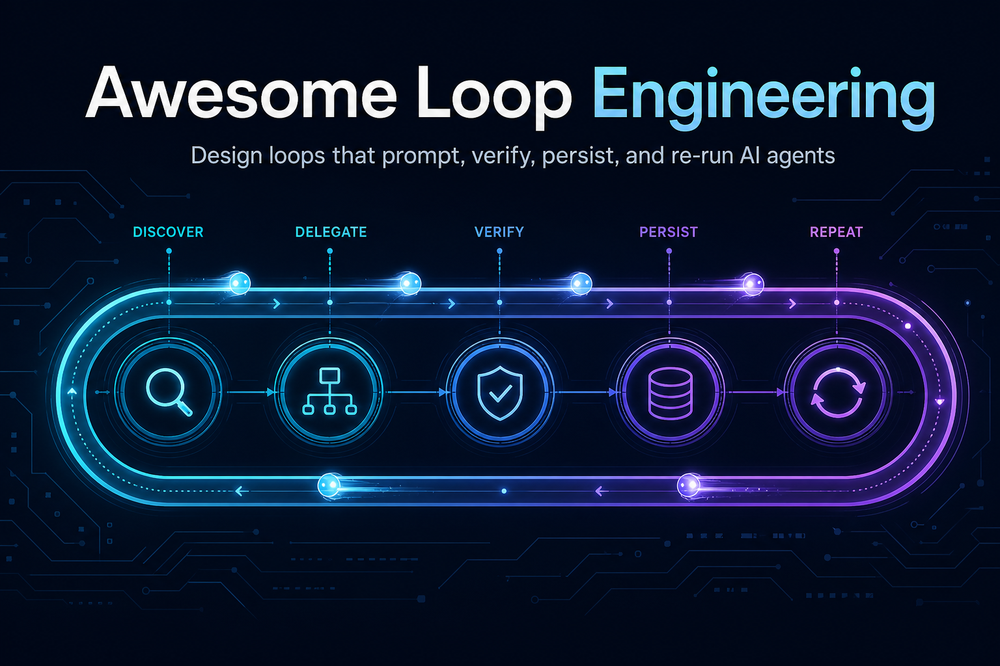
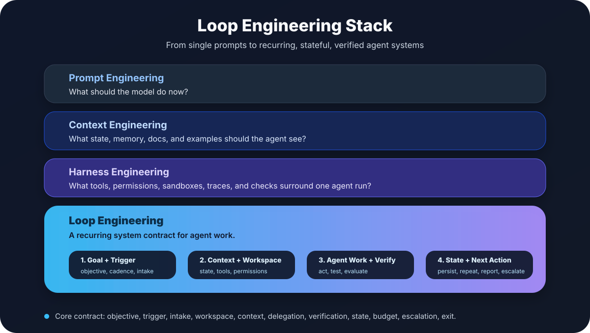

# Awesome Loop Engineering

<p align="center">
  
</p>

<p align="center">
  <a href="https://github.com/sindresorhus/awesome"></a>
  <a href="LICENSE"></a>
  <a href="https://github.com/ChaoYue0307/awesome-loop-engineering/actions/workflows/quality.yml"></a>
  <a href="https://github.com/ChaoYue0307/awesome-loop-engineering/stargazers"></a>
  <a href="https://github.com/ChaoYue0307/awesome-loop-engineering/pulls"></a>
</p>

<p align="center">
  <a href="README.md">English</a> |
  <a href="README.zh-CN.md">中文</a> |
  <a href="TRANSLATIONS.md">Help translate</a>
</p>

> A curated, implementation-oriented list of resources for **Loop Engineering**: the layer above prompt, context, and harness engineering for designing recurring AI-agent systems.

Prompt engineering improves what you ask the model. Context engineering improves what the model can see. Harness engineering improves the tools, permissions, sandboxes, and checks around one agent run. **Loop Engineering sits above all three**: it is the emerging AI and coding-agent practice of moving from manually prompting agents turn by turn to designing loops that do the prompting, supervision, verification, state updates, and re-triggering for you.

A loop discovers work, hands it to one or more agents, checks the result, records state, decides what should happen next, and runs again on a cadence or until a verifiable goal is reached.

This repository is about the new AI-agent meaning of Loop Engineering. It is **not** about software event loops, control theory, growth loops, generic workflow automation, or non-AI feedback systems.

## Why This Repo Exists

Loop Engineering is becoming a distinct craft because the leverage point is moving from better single prompts, richer context, and stronger harnesses to recurring systems that decide when and how agents should run. The best agent workflows now combine goals, state, work isolation, tool permissions, feedback gates, retries, escalation, and receipts. This list exists to make that craft easier to learn, compare, and practice without mixing it with unrelated loop concepts or generic AI-agent hype.

## Mental Model

Prompt engineering asks: **what should I say to the model?**

Context engineering asks: **what state and knowledge should the model see?**

Harness engineering asks: **what tools, permissions, tests, sandboxes, and feedback should surround the agent?**

Loop engineering asks: **what recurring system should discover work, delegate to agents, verify results, persist state, decide next actions, and re-run when the human is no longer in the inner loop?**

Prompt, context, and harness engineering make one agent run better. Loop Engineering makes agent work repeatable, observable, and governable over time.

<p align="center">
  
</p>

Loop shape:

```text
Objective
  -> Trigger / cadence
  -> Discover / intake work
  -> Delegate to agents
  -> Act in an isolated workspace
  -> Verify with tests, evals, traces, or reviewers
       -> if failed: feed back the evidence and retry
       -> if passed: persist state and decide what happens next
  -> Repeat, report, open a PR, or escalate to a human
```

## Contents

- [How To Use This List](#how-to-use-this-list)
- [Canonical Definition](#canonical-definition)
- [Concept Guides](#concept-guides)
- [Best First Reads](#best-first-reads)
- [Resource Type Legend](#resource-type-legend)
- [Start Here](#start-here)
- [Scope Boundary](#scope-boundary)
- [The Loop Contract](#the-loop-contract)
- [Loop Design Checklist](#loop-design-checklist)
- [Loop Maturity Model](#loop-maturity-model)
- [Core Loop Primitives](#core-loop-primitives)
- [Official Runtime Guides](#official-runtime-guides)
- [Research Foundations](#research-foundations)
- [Agent Workflow Patterns](#agent-workflow-patterns)
- [Coding-Agent Loop Systems](#coding-agent-loop-systems)
- [Verification And Feedback Gates](#verification-and-feedback-gates)
- [State, Memory, And Context Persistence](#state-memory-and-context-persistence)
- [Orchestration And Multi-Agent Delegation](#orchestration-and-multi-agent-delegation)
- [Benchmarks And Evaluation](#benchmarks-and-evaluation)
- [Operations Playbooks](#operations-playbooks)
- [Templates And Patterns](#templates-and-patterns)
- [Examples And Schema](#examples-and-schema)
- [Community Gallery](#community-gallery)
- [Pattern Library](#pattern-library)
- [Critiques, Risks, And Limitations](#critiques-risks-and-limitations)
- [Adjacent Awesome Lists](#adjacent-awesome-lists)
- [Contributing](#contributing)

## How To Use This List

- New to the term? Read [Best First Reads](#best-first-reads), then the [Loop Contract](#the-loop-contract).
- Designing a real loop? Start with [Core Loop Primitives](#core-loop-primitives), [Official Runtime Guides](#official-runtime-guides), and [Templates And Patterns](#templates-and-patterns).
- Improving reliability? Focus on [Verification And Feedback Gates](#verification-and-feedback-gates), [State, Memory, And Context Persistence](#state-memory-and-context-persistence), and [Critiques, Risks, And Limitations](#critiques-risks-and-limitations).
- Comparing systems? Use [Coding-Agent Loop Systems](#coding-agent-loop-systems), [Orchestration And Multi-Agent Delegation](#orchestration-and-multi-agent-delegation), and [Benchmarks And Evaluation](#benchmarks-and-evaluation).
- Adding a resource? See [Contributing](#contributing) and prefer primary sources, official docs, papers, and implementation-heavy write-ups.
- Reviewing a PR? Use the [curation standard](CURATION.md) and [maintenance guide](MAINTENANCE.md).

## Canonical Definition

**Loop Engineering** is the AI and coding-agent practice of designing recurring systems that discover work, delegate it to agents, verify results, persist state, decide next actions, and run again on a cadence, event, or until a verifiable goal is reached.

For a quotable definition and scope test, see [`DEFINITION.md`](DEFINITION.md).

## Concept Guides

These repository-native guides define the concept, boundaries, and practical artifacts without relying on vendor-specific terminology.

- 🧾 **Template** [Canonical Definition](DEFINITION.md) - Short definition, positioning, minimal loop test, and citation note.
- 🧾 **Template** [Loop Engineering Manifesto](MANIFESTO.md) - Concise statement of the concept, commitments, non-goals, and success standard.
- 🧾 **Template** [Loop Engineering Taxonomy](TAXONOMY.md) - Classification by trigger, intake, verification, state model, topology, and operating domain.
- ⚠️ **Critique** [Loop Engineering Anti-Patterns](ANTI-PATTERNS.md) - Common failure modes such as prompt loops with no contract, infinite retries, model self-approval, hidden state, and unsafe autonomy.
- 🧾 **Template** [Comparison Guide](COMPARISON.md) - Distinguishes Loop Engineering from prompt engineering, context engineering, harness engineering, workflow automation, agent workflows, and evaluation loops.
- 🧾 **Template** [Sourced Signals And Quotes](QUOTES.md) - Short sourced signals from linked public materials that anchor the emerging concept.
- 🧾 **Template** [Outreach Kit](OUTREACH.md) - Conservative messages for inviting corrections, sources, and real-world loop patterns.

## Best First Reads

Start here if you want the shortest path from concept to practice.

- 📝 **Blog** [Loop Engineering](https://addyosmani.com/blog/loop-engineering/) - Direct framing of Loop Engineering as the layer above manual prompting, with concrete primitives across Codex and Claude Code.
- 📚 **Docs** [Run long horizon tasks with Codex](https://developers.openai.com/blog/run-long-horizon-tasks-with-codex) - Practical runbook for plan-edit-test-observe-repair-document-repeat work.
- 📚 **Docs** [Run prompts on a schedule](https://code.claude.com/docs/en/scheduled-tasks) - Official scheduled loop mechanics for `/loop`, reminders, monitor tools, and recurring prompts.
- 🔁 **Pattern** [Autonomous Loops](https://claudecodeguide.dev/docs/patterns/autonomous-loops) - Concrete Claude Code pattern with task files, stop hooks, hard limits, and a kill switch.
- 📄 **Paper** [ReAct](https://arxiv.org/abs/2210.03629) - Foundational reason-act-observe loop behind many tool-using agents.
- 📄 **Paper** [Reflexion](https://arxiv.org/abs/2303.11366) - Shows how feedback can become memory for future attempts.
- 📚 **Docs** [Building Effective Agents](https://www.anthropic.com/engineering/building-effective-agents) - Canonical workflow patterns, including evaluator-optimizer and orchestrator-workers.
- 🔁 **Pattern** [Stop Babysitting Your Coding Agent. Give It Backpressure.](https://generativeprogrammer.com/p/stop-babysitting-your-coding-agent) - Turns tests, linters, builds, traces, and other signals into practical feedback loops.

## Resource Type Legend

- 📄 **Paper**: academic paper, preprint, or technical report.
- 📝 **Blog**: essay, field note, article, or practitioner write-up.
- 📚 **Docs**: official product, API, SDK, or platform documentation.
- 🧰 **Tool**: repository, framework, SDK, runtime, or implementation.
- 🧪 **Benchmark**: benchmark, eval suite, leaderboard, or evaluation dataset.
- 🔁 **Pattern**: real-world loop pattern, operational playbook, or reusable workflow.
- 🧾 **Template**: template, checklist, schema, repository guide, or contribution artifact.
- 🧭 **List**: adjacent awesome list, ecosystem map, or curated collection.
- ⚠️ **Critique**: risk analysis, limitation, caveat, or skeptical take.

## Start Here

Direct resources about the new AI/coding-agent meaning of Loop Engineering.

- 🔁 **Pattern** [Loop Engineering essentials](#the-loop-contract) - The compact contract this list uses to decide whether a resource belongs here.
- 📝 **Blog** [Loop Engineering](https://addyosmani.com/blog/loop-engineering/) - Addy Osmani's framing of loop engineering as the layer above manually prompting coding agents, with concrete primitives across Codex and Claude Code.
- 📝 **Blog** [Loop Engineering](https://addyo.substack.com/p/loop-engineering) - Substack version of the same essay; useful for the original discussion trail and quotations from Peter Steinberger and Boris Cherny.
- 📝 **Blog** [Loop Engineering](https://cobusgreyling.substack.com/p/loop-engineering) - Concise explanation of the shift from prompting agents to designing loops that discover work, delegate, verify, persist, and continue.
- 📝 **Blog** [Loop Engineering: The Guide for AI Agents](https://lushbinary.com/blog/loop-engineering-ai-coding-agents-guide/) - Practical guide that breaks the pattern into automations, worktrees, skills, connectors, subagents, and state.
- 🔁 **Pattern** [Codex Loops: What Boris Cherny Gets Right About Managing Agent Work](https://www.developersdigest.tech/blog/codex-loops-boris-cherny-agent-routines) - Engineering note on recurring agent loops for PR babysitting, CI repair, deploy verification, and feedback clustering.
- 📝 **Blog** [I Now Just Write Loops To Prompt Claude Code: Claude Code Creator Boris Cherny](https://officechai.com/ai/i-now-just-write-loops-to-prompt-claude-code-claude-code-creator-boris-cherny/) - Coverage of Boris Cherny's "my job is to write loops" workflow.
- 📝 **Blog** [My Lord! AI Programming Undergoes Another Major Shift](https://eu.36kr.com/en/p/3844224911346184) - Broad coverage of the Boris Cherny and Peter Steinberger discussion, including the distinction between cold-start scripts and persistent agent loops.

## Scope Boundary

| In scope | Out of scope |
| --- | --- |
| AI/coding-agent loops that coordinate prompts, context, harnesses, verification, and state over repeated agent runs | Software event loops, UI/game loops, or control theory loops |
| Scheduled, goal-driven, or event-triggered agent work | Generic cron jobs with no agentic reasoning or verification |
| Agent loops with durable state, worktrees, checkpoints, traces, or progress files | One-off prompt examples with no loop, state, or feedback signal |
| Verification loops using tests, CI, evals, reviewers, or deterministic gates | Pure AI news, generic product pages, or marketing copy |
| Multi-agent maker/checker/delegation patterns | Broad agent lists without specific loop-design relevance |

## The Loop Contract

A useful loop has a contract. If one of these is missing, the loop usually becomes either a manual prompt habit or an unsafe background automation. Prompt, context, and harness choices are ingredients; the loop contract is the operating layer that connects them over time.

| Part | Design question | Common artifact |
| --- | --- | --- |
| Objective | What should the loop optimize for? | Goal, issue, PRD, runbook |
| Trigger | When does the loop run? | Schedule, webhook, `/loop`, `/goal`, automation |
| Discover / Intake | How does the loop find work? | GitHub queries, Linear filters, CI failures, feedback stream |
| Workspace | Where can the agent act safely? | Worktree, sandbox, branch, container |
| Context | What durable knowledge should it load? | `AGENTS.md`, `CLAUDE.md`, `SKILL.md`, docs |
| Delegation | Which agent does which job? | Explorer, implementer, reviewer, judge |
| Verification | What says "yes" or "no"? | Tests, typecheck, lint, evals, trace graders |
| State | What survives the next run? | Progress file, database checkpoint, trace, issue comment |
| Budget | When should it stop spending? | Max turns, max retries, token budget, time box |
| Escalation | When does a human take over? | PR, issue, Slack alert, triage inbox |
| Exit | How does the loop know it is done? | Acceptance criteria, passing checks, no work found |

Good loop documentation should make the contract visible. A reader should be able to tell what triggers the loop, what state it reads, what it is allowed to change, how it verifies progress, and when it stops.

## Loop Design Checklist

- **Name one objective.** A loop should optimize for a specific outcome, not "improve the repo".
- **Define the intake.** Decide where work enters: PR comments, CI failures, issues, logs, eval failures, support feedback, or a schedule.
- **Isolate execution.** Use a worktree, sandbox, branch, container, or read-only mode before letting agents edit.
- **Write the feedback signal first.** Tests, typechecks, lint, evals, policy checks, and trace graders should exist before retries begin.
- **Persist state outside the model.** Keep progress in files, issue comments, checkpoints, traces, or a database.
- **Separate maker and checker.** Let one agent act and another verifier, deterministic check, or human reviewer decide whether it is done.
- **Put a budget on autonomy.** Cap runtime, turns, retries, token spend, and concurrent workers.
- **Design escalation.** Decide when the loop should open a PR, file an issue, ask a human, or stop.
- **Keep receipts.** Store commands run, evidence observed, files changed, and why the loop stopped.

## Loop Maturity Model

| Level | Name | Description |
| --- | --- | --- |
| 0 | Manual prompting | A human reads state and writes the next prompt. |
| 1 | Scripted retry | A shell/script loop feeds errors back to an agent. |
| 2 | Scheduled loop | The agent runs on a cadence and reports findings. |
| 3 | Stateful loop | Progress survives across sessions through files, issues, checkpoints, or traces. |
| 4 | Self-verifying loop | Deterministic checks or evaluator agents gate completion. |
| 5 | Multi-agent loop | Specialized agents split discovery, implementation, review, and judgment. |
| 6 | Production-supervised loop | Observability, budgets, approvals, rollback, and human escalation are first-class. |

Most teams should climb this model slowly. A reliable Level 3 loop with clear state and deterministic checks is usually more valuable than a flashy Level 5 loop with vague goals.

## Core Loop Primitives

These are the building blocks that make a loop more than a repeated prompt.

- 📚 **Docs** [Automations - Codex app](https://developers.openai.com/codex/app/automations) - Codex background automations for recurring tasks, triage inboxes, skills, and worktree isolation.
- 📚 **Docs** [Follow a goal - Codex use cases](https://developers.openai.com/codex/use-cases/follow-goals) - Official guidance for durable objectives with stopping conditions, validation commands, checkpoints, and progress logs.
- 📚 **Docs** [Worktrees - Codex app](https://developers.openai.com/codex/app/worktrees) - Codex worktree model for isolated parallel tasks and handoffs between local and background workspaces.
- 📚 **Docs** [Prompting - Codex](https://developers.openai.com/codex/prompting) - Explains the Codex loop, threads, context, and `/goal` mode.
- 📚 **Docs** [Customization - Codex](https://developers.openai.com/codex/concepts/customization) - Maps `AGENTS.md`, memories, skills, MCP, and subagents into a coherent customization stack.
- 📚 **Docs** [Agent Skills - Codex](https://developers.openai.com/codex/skills) - Official skill format for reusable workflows, scripts, MCP dependencies, invocation policy, and plugin packaging.
- 📚 **Docs** [Plugins - Codex](https://developers.openai.com/codex/plugins) - Bundles skills, app integrations, and MCP servers into reusable loop capabilities.
- 📚 **Docs** [Slash commands in Codex CLI](https://developers.openai.com/codex/cli/slash-commands) - CLI commands for switching agent threads, browsing skills, inspecting MCP tools, and using subagent workflows.
- 🔁 **Pattern** [Autonomous Loops](https://claudecodeguide.dev/docs/patterns/autonomous-loops) - Claude Code pattern using task files, stop hooks, restart behavior, hard limits, and a kill switch.
- 📚 **Docs** [Claude Code Glossary](https://code.claude.com/docs/en/glossary.md) - Defines the agentic loop, hooks, subagents, skills, MCP, and related primitives in Claude Code terminology.
- 📚 **Docs** [Keep Claude working toward a goal](https://code.claude.com/docs/en/goal) - `/goal` runs turn after turn until a completion condition is met by a verifier.
- 📚 **Docs** [Run prompts on a schedule](https://code.claude.com/docs/en/scheduled-tasks) - `/loop`, scheduled tasks, reminders, monitor tools, and session-scoped recurring prompts.
- 📚 **Docs** [Run parallel sessions with worktrees](https://code.claude.com/docs/en/worktrees) - Worktree isolation for parallel sessions and subagents so concurrent edits do not collide.
- 📚 **Docs** [Automate actions with hooks](https://code.claude.com/docs/en/hooks-guide) - Claude Code hooks guide for deterministic lifecycle control around model actions.
- 📚 **Docs** [Hooks reference](https://code.claude.com/docs/en/hooks.md) - Event-level reference for session, turn, tool-call, and subagent hooks.
- 📚 **Docs** [Common workflows - Claude Code](https://code.claude.com/docs/en/common-workflows) - Practical workflows for worktrees, subagents, CI, batch processing, planning, and resuming prior work.
- 📚 **Docs** [Manage multiple agents with agent view](https://code.claude.com/docs/en/agent-view.md) - Dashboard for dispatching, monitoring, and attaching to background agent sessions.
- 📚 **Docs** [Run agents in parallel](https://code.claude.com/docs/en/agents.md) - Compares agent view, subagents, agent teams, worktrees, tasks, and workflows for parallel work.
- 📚 **Docs** [Orchestrate subagents at scale with dynamic workflows](https://code.claude.com/docs/en/workflows) - Moves loop state and branching into workflow scripts so large tasks do not overload the conversation context.
- 📚 **Docs** [Create plugins](https://code.claude.com/docs/en/plugins) - Packaging model-invoked skills, agents, hooks, MCP servers, monitors, and settings as shareable loop components.
- 📚 **Docs** [Model Context Protocol](https://modelcontextprotocol.io/) - Standard protocol for exposing tools and data sources to agent loops.

## Official Runtime Guides

Primary-source docs from agent runtime vendors and framework builders.

- 📚 **Docs** [Run long horizon tasks with Codex](https://developers.openai.com/blog/run-long-horizon-tasks-with-codex) - OpenAI's runbook for plan-edit-test-observe-repair-document-repeat work, including specs, plans, status logs, and validation gates.
- 📚 **Docs** [Best practices - Codex](https://developers.openai.com/codex/learn/best-practices) - Official best practices for context, `AGENTS.md`, MCP, skills, subagents, and automations.
- 📚 **Docs** [Agents SDK](https://developers.openai.com/api/docs/guides/agents) - OpenAI guide for agent orchestration, tool execution, approvals, state, guardrails, and observability.
- 📚 **Docs** [Agents - OpenAI Agents SDK](https://openai.github.io/openai-agents-python/agents/) - SDK primitives for agents, tools, handoffs, guardrails, and runner-managed loops.
- 📚 **Docs** [Running agents](https://developers.openai.com/api/docs/guides/agents/running-agents) - OpenAI guide to turns, state, approvals, sessions, and continuation in the SDK runtime loop.
- 📚 **Docs** [Integrations and observability](https://developers.openai.com/api/docs/guides/agents/integrations-observability) - OpenAI guide to MCP wiring and traces as the basis for debugging and evaluation loops.
- 📚 **Docs** [Sandbox Agents](https://developers.openai.com/api/docs/guides/agents/sandboxes) - Splits the harness control plane from the sandbox execution plane for long-running file and command work.
- 📚 **Docs** [Guardrails and human review](https://developers.openai.com/api/docs/guides/agents/guardrails-approvals) - Approval and validation boundaries for sensitive agent actions.
- 📚 **Docs** [Building agents with the Claude Agent SDK](https://code.claude.com/docs/en/agent-sdk/overview.md) - Claude SDK overview for tool-using agents, subagents, state, permissions, and streaming.
- 📚 **Docs** [Extend Claude with skills](https://code.claude.com/docs/en/skills) - Claude Code skill system for reusable loop instructions and assets.
- 📚 **Docs** [Create custom subagents](https://code.claude.com/docs/en/sub-agents) - Claude Code custom subagents with isolated context, model choice, and tool permissions.
- 📚 **Docs** [GitHub Agentic Workflows](https://github.github.com/gh-aw/) - Repository automation that runs coding agents in GitHub Actions on events or schedules with guardrails.
- 📝 **Blog** [GitHub Agentic Workflows technical preview](https://github.blog/changelog/2026-02-13-github-agentic-workflows-are-now-in-technical-preview/) - Changelog announcement for Markdown-defined agentic workflows in GitHub Actions.
- 📚 **Docs** [Writing effective tools for AI agents](https://www.anthropic.com/engineering/writing-tools-for-agents) - Anthropic's guidance on evaluating and improving tool specs using agentic loops and realistic tasks.
- 📚 **Docs** [Introducing advanced tool use on the Claude Developer Platform](https://www.anthropic.com/engineering/advanced-tool-use?e45d281a_page=3) - Tool search, programmatic tool calling, and tool-use examples for scaling large tool libraries without flooding context.

## Research Foundations

Loop Engineering is new as a practice name, but it builds on years of agent-loop, feedback, planning, and self-correction research.

- 📄 **Paper** [ReAct: Synergizing Reasoning and Acting in Language Models](https://arxiv.org/abs/2210.03629) - Foundational reason-act-observe loop for tool-using language agents.
- 📄 **Paper** [Reflexion: Language Agents with Verbal Reinforcement Learning](https://arxiv.org/abs/2303.11366) - Converts environment feedback into written reflections stored in memory for future attempts.
- 📄 **Paper** [Self-Refine: Iterative Refinement with Self-Feedback](https://arxiv.org/abs/2303.17651) - Generate-feedback-refine loop where a model improves outputs over repeated passes.
- 📄 **Paper** [CRITIC: Large Language Models Can Self-Correct with Tool-Interactive Critiquing](https://arxiv.org/abs/2305.11738) - Uses tools to ground critique and correction rather than relying only on introspection.
- 📄 **Paper** [Tree of Thoughts](https://arxiv.org/abs/2305.10601) - Search over multiple reasoning branches; relevant when loop design needs exploration before committing.
- 📄 **Paper** [Graph of Thoughts](https://arxiv.org/abs/2308.09687) - Generalizes thought structures beyond chains and trees, useful for complex loop planning and aggregation.
- 📄 **Paper** [Language Agent Tree Search Unifies Reasoning Acting and Planning in Language Models](https://arxiv.org/abs/2310.04406) - Combines search, action, and environment feedback for language agents.
- 📄 **Paper** [Voyager: An Open-Ended Embodied Agent with Large Language Models](https://arxiv.org/abs/2305.16291) - Demonstrates lifelong skill acquisition through iterative exploration, feedback, and a skill library.
- 📄 **Paper** [Generative Agents: Interactive Simulacra of Human Behavior](https://arxiv.org/abs/2304.03442) - Introduces reflection and memory mechanisms for long-running agent behavior.
- 🧰 **Tool** [Reflexion code](https://github.com/noahshinn/reflexion) - Reference implementation and experiments for verbal reinforcement loops.

## Agent Workflow Patterns

These resources are included when they help design the higher-level loop around agents, not merely because they describe agents in general.

- 📚 **Docs** [Building Effective Agents](https://www.anthropic.com/engineering/building-effective-agents) - Anthropic's canonical guide to workflows and agents, including evaluator-optimizer and orchestrator-workers patterns.
- 📝 **Blog** [How we built our multi-agent research system](https://www.anthropic.com/engineering/multi-agent-research-system) - Detailed orchestrator-worker system with planning, memory, subagents, citation passes, and iterative research loops.
- 📄 **Paper** [Building Effective AI Agents: Architecture Patterns and Implementation Frameworks](https://resources.anthropic.com/hubfs/Building%20Effective%20AI%20Agents-%20Architecture%20Patterns%20and%20Implementation%20Frameworks.pdf) - PDF overview of agent architecture patterns, including generator-evaluator loops.
- 📝 **Blog** [AI Agent Architectures](https://hld.handbook.academy/curriculum/ai-ml-system-design/ai-agent-architectures/) - System-design overview of ReAct, reflection, planning, tool use, memory, and control strategies.
- 📝 **Blog** [What Are Agentic Workflows?](https://weaviate.io/blog/what-are-agentic-workflows) - Accessible taxonomy of planning, tool use, reflection, and memory patterns.
- 📝 **Blog** [Agent Planning & Reflection Patterns](https://learnaivisually.com/tracks/ai-agents/planning-reflection) - Visual explanation of plan-execute, observe, reflect, retry, and stop patterns.
- 📝 **Blog** [Agentic Design Patterns](https://addyosmani.com/agents/04-agentic-design-patterns/) - Practical overview of ReAct, reflection, tool use, planning, and how to combine them in real-world agents.
- 🔁 **Pattern** [12 Factor Agents](https://github.com/humanlayer/12-factor-agents) - Operating principles for production agents, including explicit prompts, state ownership, and pause-resume behavior.
- 🔁 **Pattern** [Durable Execution for Agentic Workflows](https://arizenai.com/durable-execution/) - Explains checkpointing, event-sourced journals, replay, and recovery for long-running agent workflows.

## Coding-Agent Loop Systems

- 🧰 **Tool** [SWE-agent](https://github.com/SWE-agent/SWE-agent) - Agent-computer interface and autonomous software engineering agent for repository tasks.
- 📄 **Paper** [SWE-agent: Agent-Computer Interfaces Enable Automated Software Engineering](https://arxiv.org/abs/2405.15793) - Paper behind SWE-agent and its interface design.
- 🧰 **Tool** [mini-SWE-agent](https://mini-swe-agent.com/latest/) - Minimal coding agent that is useful for understanding the core loop without a large framework.
- 🧰 **Tool** [OpenHands](https://github.com/All-Hands-AI/OpenHands) - Open platform for AI software developers as generalist agents.
- 📄 **Paper** [OpenHands: An Open Platform for AI Software Developers as Generalist Agents](https://arxiv.org/abs/2407.16741) - Paper describing OpenHands, CodeActAgent, benchmarks, and generalist agent evaluation.
- 🧰 **Tool** [Agentless](https://github.com/OpenAutoCoder/Agentless) - Workflow-based approach for software issue resolution using localization, repair, and patch validation.
- 📄 **Paper** [Agentless: Demystifying LLM-based Software Engineering Agents](https://arxiv.org/abs/2407.01489) - Useful contrast case: strong results through structured workflow rather than a fully open-ended agent.
- 🧰 **Tool** [AutoCodeRover](https://github.com/AutoCodeRoverSG/auto-code-rover) - Autonomous program improvement system for issue localization, patch generation, and validation.
- 📄 **Paper** [AutoCodeRover: Autonomous Program Improvement](https://arxiv.org/abs/2404.05427) - Paper on autonomous code repair loops over real repositories.
- 🔁 **Pattern** [Ralph Copilot](https://github.com/giocaizzi/ralph-copilot/tree/e5b2813cc876c73a8c9d3398c0115da0d15f63cf) - Language-agnostic Ralph loop implementation using fresh context, filesystem memory, `PRD.md`, and `PROGRESS.md`.
- 🧰 **Tool** [karl](https://github.com/kayoslab/karl) - Autonomous multi-agent development loop with planner, reviewer, architect, tester, developer, deployment, and retry phases.
- 🔁 **Pattern** [joelclaw agent-loop skill](https://github.com/joelhooks/joelclaw/blob/main/skills/agent-loop/SKILL.md) - Durable Planner-Implementor-Reviewer-Judge coding loops via Inngest events and progress files.
- 🧭 **List** [SWE-bench reading list](https://github.com/SWE-bench/reading-list) - Maintained map of software engineering agent systems and related papers.

## Verification And Feedback Gates

These resources include harness and observability mechanisms that loops compose into exit gates, receipts, and retry signals.

- 📝 **Blog** [Why Agentic Systems Must Produce Deterministic Outputs to Scale](https://streamzero.com/blog/posts/deep-dives-tools-technologies-architectures/agentic-patterns/why-agentic-systems-must-produce-deterministic-outputs-to-scale) - Argues for deterministic boundaries, contracts, and execution gates around probabilistic agent reasoning.
- 🔁 **Pattern** [Stop Babysitting Your Coding Agent. Give It Backpressure.](https://generativeprogrammer.com/p/stop-babysitting-your-coding-agent) - Explains how to turn tests, linters, builds, traces, and other signals into feedback loops for coding agents.
- 🔁 **Pattern** [How to Build a Self-Verification Loop in Claude Code](https://dev.to/shipwithaiio/how-to-build-a-self-verification-loop-in-claude-code-3-layers-20-minutes-m1p) - Uses hooks to enforce syntax, intent, and regression checks before an agent can finish.
- 📝 **Blog** [How to build a better agent harness with traces and evals](https://arize.com/blog/improve-ai-agents-traces-evals-harness/) - Trace-evaluate-debug-refine loop for improving agent behavior from real runs.
- 📝 **Blog** [Better Harness: A Recipe for Harness Hill-Climbing with Evals](https://www.langchain.com/blog/better-harness-a-recipe-for-harness-hill-climbing-with-evals) - LangChain's recipe for using evals as the learning signal for harness improvement.
- 📝 **Blog** [Improving Deep Agents with harness engineering](https://www.langchain.com/blog/improving-deep-agents-with-harness-engineering) - Practical discussion of self-verification, traces, middleware, and loop detection for coding agents.
- 📚 **Docs** [OpenAI agent evals](https://developers.openai.com/api/docs/guides/agent-evals) - Evaluation guidance for moving from traces to repeatable grading of agent workflows.
- 🧰 **Tool** [Promptfoo OpenAI Agents provider](https://www.promptfoo.dev/docs/providers/openai-agents/) - Testing and assertions for multi-turn agent workflows, tools, state, handoffs, sandboxes, and traces.
- 🧰 **Tool** [Inspect AI](https://github.com/UKGovernmentBEIS/inspect_ai) - UK AISI evaluation framework with solvers, scorers, sandboxing, tool use, MCP, and log viewing.
- 📚 **Docs** [OpenTelemetry Semantic Conventions for Generative AI Systems](https://opentelemetry.io/docs/specs/semconv/gen-ai/) - Portable tracing conventions for model calls, tool calls, and agent workflows.
- 🧰 **Tool** [AgentOps](https://github.com/AgentOps-AI/agentops) - Monitoring, replay, cost tracking, benchmarking, and tracing for agent sessions.

## State, Memory, And Context Persistence

This section focuses on durable loop state and cross-run context. For context-window design as its own lower layer, see the adjacent Context Engineering lists.

- 📚 **Docs** [Effective Context Engineering for AI Agents](https://www.anthropic.com/engineering/effective-context-engineering-for-ai-agents) - Anthropic guide to context as managed runtime state rather than a prompt dump.
- 📝 **Blog** [Agent Harnesses: the Infrastructure Layer Your LLM Agent Actually Needs](https://ninadpathak.com/blog/agent-harnesses/) - Covers execution loops, state, checkpointing, observers, and replayability.
- 📝 **Blog** [The Agent Loop Is the New OS](https://www.harness.io/blog/agent-loop-new-os) - Frames the agent loop as an OS-like boundary with context as RAM and tools as I/O.
- 📝 **Blog** [Harness engineering for coding agent users](https://martinfowler.com/articles/harness-engineering.html) - Martin Fowler article on feedforward, feedback, and outer harnesses for coding agents.
- 📝 **Blog** [Context Engineering](https://simonwillison.net/2025/Jun/27/context-engineering/) - Simon Willison's framing of context engineering, useful for distinguishing context state from loop orchestration.
- 📝 **Blog** [Agentic AI State Management with ScyllaDB and LangGraph](https://www.scylladb.com/2026/04/08/agentic-ai-state-management-with-scylladb-and-langgraph/) - Durable agent state with checkpointers, write-ahead logs, and time-travel branching.
- 🧰 **Tool** [Mem0](https://github.com/mem0ai/mem0) - Open-source memory layer for retaining user, session, and agent state across repeated agent sessions.

## Orchestration And Multi-Agent Delegation

- 🧰 **Tool** [AutoGen](https://github.com/microsoft/autogen) - Multi-agent programming framework for conversations, tool use, and orchestration.
- 🧰 **Tool** [LangGraph](https://github.com/langchain-ai/langgraph) - Graph-based framework for controllable agent workflows, persistence, and human-in-the-loop steps.
- 🧰 **Tool** [CrewAI](https://github.com/crewAIInc/crewAI) - Framework for multi-agent workflows organized around roles, tasks, and crews.
- 📚 **Docs** [LlamaIndex Workflows](https://docs.llamaindex.ai/en/stable/module_guides/workflow/) - Event-driven workflow abstraction for agentic applications.
- 📚 **Docs** [OpenAI Agents SDK handoffs](https://openai.github.io/openai-agents-python/handoffs/) - First-class delegation between specialized agents.
- 📚 **Docs** [Claude Code subagents](https://code.claude.com/docs/en/sub-agents) - Specialized assistants with isolated context windows and tool permissions.
- 📚 **Docs** [Claude Code skills](https://code.claude.com/docs/en/skills) - Reusable instruction and asset bundles that loops can invoke instead of repeating large prompts.
- 📚 **Docs** [Agent Protocol](https://agentprotocol.ai/) - API protocol for agent interaction, useful for separating loop managers from agent runtimes.
- 🧰 **Tool** [AgentKit](https://github.com/inngest/agent-kit) - TypeScript toolkit for durable, event-driven agents on workflow infrastructure.
- 🧰 **Tool** [deepagents](https://github.com/langchain-ai/deepagents) - LangChain project for deeper, longer-running agents with middleware and harness patterns.

## Benchmarks And Evaluation

- 🧪 **Benchmark** [SWE-bench](https://www.swebench.com/) - Benchmark for resolving real GitHub issues through code editing and tests.
- 📄 **Paper** [SWE-bench: Can Language Models Resolve Real-World GitHub Issues?](https://arxiv.org/abs/2310.06770) - Original SWE-bench paper.
- 📄 **Paper** [SWE-bench Goes Live](https://arxiv.org/abs/2505.23419) - Dynamic benchmark designed to reduce overfitting to static issue sets.
- 🧪 **Benchmark** [SWE-bench Verified](https://www.swebench.com/) - Human-validated subset widely used for coding-agent comparisons.
- 🧪 **Benchmark** [Terminal-Bench](https://www.tbench.ai/) - Benchmark for agents operating in terminal environments.
- 🧰 **Tool** [Terminal-Bench repository](https://github.com/harbor-framework/terminal-bench) - Open-source benchmark and harness for hard terminal tasks.
- 📄 **Paper** [AgentBench](https://arxiv.org/abs/2308.03688) - Multi-environment benchmark for evaluating LLMs as agents.
- 📄 **Paper** [WebArena](https://arxiv.org/abs/2307.13854) - Realistic web environment for autonomous agents.
- 📄 **Paper** [OSWorld](https://arxiv.org/abs/2404.07972) - Benchmark for multimodal agents operating full computer environments.
- 📄 **Paper** [ToolBench](https://arxiv.org/abs/2307.16789) - Tool-use benchmark and dataset for tool-augmented agents.
- 📄 **Paper** [GAIA](https://arxiv.org/abs/2311.12983) - Benchmark for general AI assistants requiring reasoning, tool use, and multi-step work.
- 📄 **Paper** [Tau-bench](https://arxiv.org/abs/2406.12045) - Benchmark for tool-agent-user interactions in realistic domains.
- 📄 **Paper** [VisualWebArena](https://arxiv.org/abs/2401.13649) - Visually grounded web-agent benchmark extending WebArena.
- 📄 **Paper** [AppWorld](https://arxiv.org/abs/2407.18901) - Benchmark of interactive app tasks with state-based and execution-based evaluation.

## Operations Playbooks

- 🔁 **Pattern** [PR babysitting loops](https://www.developersdigest.tech/blog/codex-loops-boris-cherny-agent-routines) - Pattern for repeatedly checking PR comments, CI, conflicts, and review state.
- 📚 **Docs** [Claude Code hooks for notifications and blockers](https://code.claude.com/docs/en/hooks-guide) - Useful for escalation, approvals, and failure reporting in long-running loops.
- 🔁 **Pattern** [GitHub Agentic Workflows](https://github.github.com/gh-aw/) - Repository automation that runs coding agents in GitHub Actions on events or schedules with guardrails.
- 📚 **Docs** [OpenAI Agents SDK human review](https://developers.openai.com/api/docs/guides/agents/guardrails-approvals) - Approval boundaries for sensitive operations in agent workflows.
- 📝 **Blog** [Agentic Engineering: The Agent Loop](https://junpingyi.com/books/agentic-engineering/agent-loop/) - Minimal mental model for the loop underlying agent operation.
- 📝 **Blog** [The agent loop: ReAct, plan-and-execute, reflection](https://www.kunwar.page/chapter/067-the-agent-loop-react-plan-and-execute-reflection) - Practical walkthrough of the base loop and common variants.

## Templates And Patterns

Reusable patterns that contributors can turn into future examples, templates, or playbooks.

- 🧾 **Template** [Resource entry template](templates/resource-entry.md) - Format for adding a single resource with evidence quality and category fit.
- 🧾 **Template** [Loop pattern template](templates/loop-pattern.md) - Template for documenting an operational loop such as PR babysitting, CI repair, or feedback clustering.
- 🧾 **Template** [Loop contract schema](schemas/loop-contract.schema.json) - Machine-readable schema for portable loop specs.
- 🧾 **Template** [Loop contract preview script](scripts/preview_loop_contract.py) - Dependency-free demo that validates and renders a loop contract JSON file.
- 🧾 **Template** [Translation guide](TRANSLATIONS.md) - How to add or maintain a language translation without drifting from the canonical English list.
- 🧾 **Template** [Pattern library index](patterns/README.md) - Practical loop patterns with triggers, state, verification gates, budgets, and escalation paths.

Additional loop patterns worth documenting:

- **PR babysitter**: watch review comments, CI status, merge conflicts, and stale discussions; open a small patch or escalate.
- **CI repair**: inspect failing checks, reproduce locally, patch, rerun, and summarize evidence.
- **Feedback clusterer**: periodically group Slack, GitHub, Linear, or social feedback into actionable themes.
- **Deploy verifier**: watch rollout signals and logs, compare against release expectations, and stop on anomalies.
- **Docs drift collector**: find mismatches between code and docs, propose patches, and verify examples.

## Examples And Schema

Concrete examples make the loop contract easier to adapt to real repositories.

- 🔁 **Pattern** [Example loop specs](examples/README.md) - Human-readable walkthroughs for PR babysitting, CI repair, and docs drift collection.
- 🧾 **Template** [PR babysitter contract](examples/pr-babysitter-loop.json) - Schema-shaped loop contract for keeping a pull request moving.
- 🧾 **Template** [CI repair contract](examples/ci-repair-loop.json) - Schema-shaped loop contract for turning failing CI into a verified patch or escalation.
- 🧾 **Template** [Docs drift contract](examples/docs-drift-loop.json) - Schema-shaped loop contract for recurring docs/code consistency checks.

Preview an example locally:

```sh
python3 scripts/preview_loop_contract.py examples/pr-babysitter-loop.json
```

## Community Gallery

The gallery is for real-world or realistic loop examples contributed by the community.

- 🧾 **Template** [Loop gallery guide](gallery/README.md) - Quality bar for contributed loop examples with receipts and lessons learned.
- 🧾 **Template** [Loop gallery template](gallery/template.md) - Markdown template for sharing a loop's trigger, intake, state, verification, escalation, and safety notes.

## Pattern Library

Practical loop patterns translate the abstract contract into runnable operating models. Each pattern documents the trigger, discover/intake step, agents, workspace, state, verification gates, retry budget, escalation path, and loop instruction.

- 🔁 **Pattern** [PR babysitter](patterns/pr-babysitter.md) - Repeatedly checks review comments, CI, merge conflicts, stale threads, and readiness to merge.
- 🔁 **Pattern** [CI repair loop](patterns/ci-repair-loop.md) - Reproduces failing checks, patches narrowly, reruns evidence, and escalates when failures are outside scope.
- 🔁 **Pattern** [Docs drift collector](patterns/docs-drift-collector.md) - Finds mismatches between docs and code, proposes small patches, and verifies examples.
- 🔁 **Pattern** [Deploy verifier](patterns/deploy-verifier.md) - Watches rollout signals, compares them with release expectations, and stops on anomalies.
- 🔁 **Pattern** [Feedback clusterer](patterns/feedback-clusterer.md) - Periodically groups GitHub, Linear, Slack, support, or social feedback into actionable themes.

## Critiques, Risks, And Limitations

- ⚠️ **Critique** [Most Developers Do Not Need Agent Loops Yet](https://alphasignalai.substack.com/p/most-developers-do-not-need-agent) - Useful caution against adopting loops before the task, signal, and economics justify them.
- ⚠️ **Critique** [Engineering Agentic Systems for Reliability](https://pruningmypothos.com/systems/engineering-agentic-systems-for-reliability/) - Cautions that agentic systems fail at boundaries when permissions, verification, traceability, and escalation are weak.
- ⚠️ **Critique** [Self-Correcting Agents: Reflexion, CRITIC, and ReAct Loops Compared](https://callsphere.ai/blog/self-correcting-agents-reflexion-critic-react-loops-compared-2026) - Compares self-correction patterns and their cost/failure tradeoffs.
- ⚠️ **Critique** [How to Build an AI Agent Harness: A 2026 Complete Guide](https://atlan.com/know/how-to-build-ai-agent-harness/) - Broad guide with useful warnings on data readiness, permissions, context management, and evaluation.
- ⚠️ **Critique** [Harness Engineering vs Prompt Engineering vs Context Engineering Explained](https://medium.com/@visrow/harness-engineering-vs-prompt-engineering-vs-context-engineering-explained-0423b692c87d) - Adjacent framing that helps avoid confusing loop engineering with the surrounding harness discipline.

## Adjacent Awesome Lists

- 🧭 **List** [Awesome Harness Engineering](https://github.com/ai-boost/awesome-harness-engineering) - Comprehensive list for the agent harness layer that Loop Engineering builds on.
- 🧭 **List** [Awesome Harness Engineering](https://github.com/walkinglabs/awesome-harness-engineering) - High-signal harness list with strong categories for context, guardrails, specs, evals, runtimes, and benchmarks.
- 🧭 **List** [Awesome Agent Harness](https://github.com/AutoJunjie/awesome-agent-harness) - Curated tools and resources for environments, constraints, and feedback around coding agents.
- 🧭 **List** [Awesome Context Engineering](https://github.com/Meirtz/Awesome-Context-Engineering) - Survey-style list for context engineering across LLMs and agents.
- 🧭 **List** [Awesome Prompt Engineering](https://github.com/promptslab/Awesome-Prompt-Engineering) - Classic adjacent list for prompt techniques and prompting resources.
- 🧭 **List** [Awesome LLM Agents](https://github.com/kaushikb11/awesome-llm-agents) - General list of LLM agent papers, frameworks, and applications.
- 🧭 **List** [Awesome AI Agents](https://github.com/e2b-dev/awesome-ai-agents) - Broad AI agent ecosystem map.

## Contributing

Contributions are welcome. Please read [CONTRIBUTING.md](CONTRIBUTING.md) before opening a pull request.

This repository uses a strict [curation standard](CURATION.md) to keep the list focused, verifiable, and useful for builders. Maintainers can use [MAINTENANCE.md](MAINTENANCE.md) for link checks, identity checks, and periodic refreshes.

Fast path for adding a resource:

- Check that it is about AI/coding-agent Loop Engineering or a direct foundation for it.
- Search the README to avoid duplicates.
- Pick the most specific category.
- Add one entry using this format:

```md
- 📄 **Paper** [Title](https://example.com) - One sentence explaining the resource's contribution to Loop Engineering.
```

- Open a pull request and explain the category fit, source type, and why builders should care.

Fast path for contributing a loop pattern:

- Start from the [loop pattern template](templates/loop-pattern.md) or [loop contract schema](schemas/loop-contract.schema.json).
- Include trigger, discover/intake, delegation, workspace, context, verification, durable state, budget, escalation, and exit.
- Open a pattern suggestion issue if you want feedback before writing the full pattern.

Good submissions should answer three questions:

1. Is this about the new AI/coding-agent meaning of Loop Engineering or a direct foundation for it?
2. Does it help someone design, run, verify, evaluate, or critique recurring agent systems that coordinate prompting, context, harnesses, verification, and state?
3. Is the source stable, public, and specific enough to be useful?

## Citation

If this repository is useful in your work, please cite it with:

```bibtex
@misc{chaoyue2026awesome_loop_engineering,
  author       = {He, Chaoyue},
  title        = {Awesome Loop Engineering},
  year         = {2026},
  howpublished = {\url{https://github.com/ChaoYue0307/awesome-loop-engineering}},
  note         = {Curated resources for Loop Engineering}
}
```

## License

The original curation text, annotations, templates, pattern documents, and repository metadata in this repository are released under [CC0-1.0](LICENSE).

Linked third-party papers, blogs, documentation, tools, benchmarks, images, and other external resources remain under their own authors' and publishers' respective licenses and terms. This repository links to them; it does not relicense their content.
